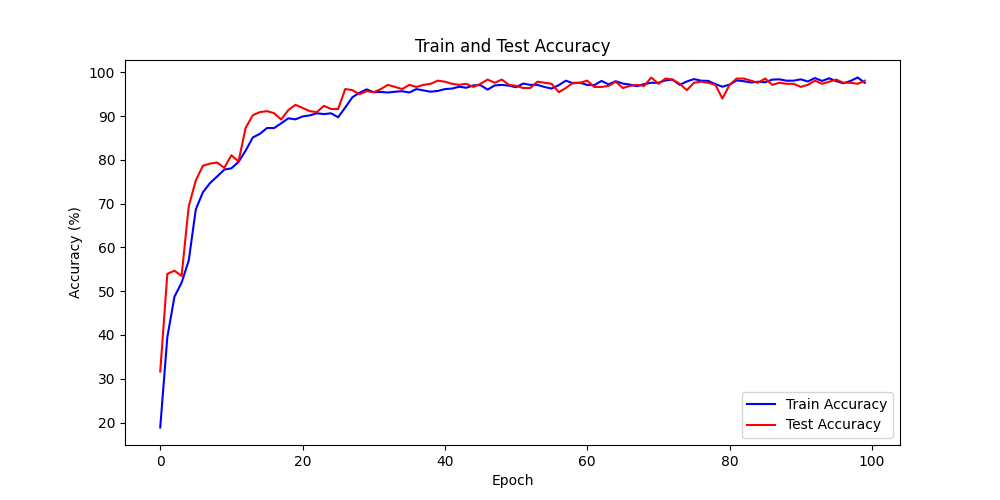

Touch Digit Recognition
=========================

:link_to_translation:`zh_CN:[中文]`

Touch Principle and Data Acquisition
---------------------------------------

Touch Principle
^^^^^^^^^^^^^^^^^^

The `ESP_Touch_Kit_Touchpad <https://dl.espressif.com/dl/schematics/SCH_ESP-Touch-Kit-Touchpad_V1.0_20210406.pdf>`_ is used as the touch pad. This touchpad consists of a 6*7 array of touch channels.

.. figure:: ../../_static/ai/touch_kit_pad.png
    :align: center

    Physical Touch Pad

When a finger moves across the touch pad, it changes the capacitance values of the touch channels, allowing us to detect the finger position by monitoring these capacitance changes.

Detection Algorithm
^^^^^^^^^^^^^^^^^^^^

1. Due to hardware variations, each channel has different maximum and minimum trigger values. Therefore, the capacitance values need to be normalized. This is done by recording the maximum and minimum values as the finger slides across the pad.

2. During finger movement, one channel will show the highest rate of capacitance change. By identifying this channel and its adjacent channel with the next highest change rate, we can locate two neighboring channels.

3. Using a ratio-based calculation between these two channels' values, we can determine the relative coordinate of the finger along that direction (the offset from the center point between the two channels).

.. math::

   x = \frac{Fa - Fb}{Fa + Fb}

4. By applying the above steps, we can obtain relative coordinates in both directions, thus determining the finger's position.

.. note::

    An appropriate trigger threshold needs to be set to determine whether the finger is moving on the touch pad.

5. When finger lift-off is detected, the drawn data can be saved.

Data Collection
^^^^^^^^^^^^^^^^^^^

In real-world scenarios, the digits drawn on a touchpad are often visually different from the handwritten digits in the MNIST dataset. As a result, models trained directly on MNIST perform poorly when applied to actual touch input. Therefore, it is necessary to collect a custom dataset of digits drawn on a touchpad and use it for training.

.. figure:: ../../_static/ai/touch_hw_real_data.png
    :align: center

    Real Dataset Based on Touchpad Drawn Input

.. note:: The size of the handwritten data image after interpolation is 30×25.

Click here to download the dataset used in this example: :download:`touch_dataset.zip <https://dl.espressif.com/AE/esp-iot-solution/touch_dataset.zip>`

Model Training and Deployment
--------------------------------

Model Construction
^^^^^^^^^^^^^^^^^^^^

Based on the PyTorch framework, a neural network model suitable for touch-based handwritten digit recognition is constructed. The architecture is as follows:

.. code-block:: python

    class Net(torch.nn.Module):
        def __init__(self):
            super(Net, self).__init__()
            self.model = torch.nn.Sequential(
                torch.nn.Conv2d(in_channels=1, out_channels=16, kernel_size=3, stride=1, padding=1),
                torch.nn.ReLU(),
                torch.nn.MaxPool2d(kernel_size=2, stride=2),

                torch.nn.Conv2d(in_channels=16, out_channels=32, kernel_size=3, stride=1, padding=1),
                torch.nn.ReLU(),
                torch.nn.MaxPool2d(kernel_size=2, stride=2),

                torch.nn.Conv2d(in_channels=32, out_channels=64, kernel_size=3, stride=1, padding=1),
                torch.nn.ReLU(),

                torch.nn.Flatten(),
                torch.nn.Linear(in_features=7 * 6 * 64, out_features=256),
                torch.nn.ReLU(),
                torch.nn.Dropout(p=0.5),
                torch.nn.Linear(in_features=256, out_features=10),
                torch.nn.Softmax(dim=1)
            )

        def forward(self, x):
            output = self.model(x)
            return output

Model Training
^^^^^^^^^^^^^^^^^^

The training process of the model includes dataset loading and preprocessing, configuration of training parameters, monitoring of the training progress, and saving of the trained model.

Data Loading and Preprocessing
""""""""""""""""""""""""""""""""

The images corresponding to different digits are organized under the ``dataset/extra`` directory, with each digit stored in a separate subfolder named after the digit. Image preprocessing is performed using ``transforms.Compose``, including grayscale conversion, random rotation and translation, and normalization. The entire dataset is then loaded using ``ImageFolder`` and split into training and test sets in an 8:2 ratio. Finally, DataLoader is used to construct batch loaders for subsequent model training and evaluation.

.. code-block:: python

    import matplotlib.pyplot as plt
    import torch
    import torch.nn as nn
    import torch.optim as optim
    from torch.utils.data import DataLoader, random_split
    from torchvision import datasets, transforms

    transform = transforms.Compose([
        transforms.Grayscale(num_output_channels=1),
        transforms.RandomAffine(degrees=10, translate=(0.1, 0.1)),
        transforms.ToTensor(),
        transforms.Normalize((0.5,), (0.5,)),
    ])

    dataset = datasets.ImageFolder(root='./dataset/extra', transform=transform)

    train_size = int(0.8 * len(dataset))
    test_size = len(dataset) - train_size
    train_dataset, test_dataset = random_split(dataset, [train_size, test_size])

    train_loader = DataLoader(dataset=train_dataset, batch_size=32, shuffle=True)
    test_loader = DataLoader(dataset=test_dataset, batch_size=32, shuffle=False)

Model Training Parameter Configuration
""""""""""""""""""""""""""""""""""""""""""

Model training parameters include learning rate, optimizer, loss function, and others. In the actual training process, cross-entropy is used as the loss function, and the Adam optimizer is employed to update the model parameters.

.. code-block:: python

    device = "cuda:0" if torch.cuda.is_available() else "cpu"
    model = Net().to(device)
    criterion = nn.CrossEntropyLoss()
    optimizer = optim.Adam(model.parameters(), lr=0.001)

Model Training and Saving
""""""""""""""""""""""""""""

The number of training epochs is set to 100. During training, the model parameters are updated using the training set, while the test set is used to evaluate the model's performance after each epoch. Once training is complete, the model parameters are saved to the file ``./models/final_model.pth``.

.. code-block:: python

    def train_epoch(model, train_loader, criterion, optimizer, device):
        model.train()
        running_loss = 0.0
        correct = 0
        total = 0

        for inputs, labels in train_loader:
            inputs, labels = inputs.to(device), labels.to(device)

            optimizer.zero_grad()
            outputs = model(inputs)
            loss = criterion(outputs, labels)
            loss.backward()
            optimizer.step()

            running_loss += loss.item()
            _, predicted = torch.max(outputs.data, 1)
            total += labels.size(0)
            correct += (predicted == labels).sum().item()

        epoch_loss = running_loss / len(train_loader)
        epoch_acc = 100 * correct / total
        return epoch_loss, epoch_acc

    def test_epoch(model, test_loader, criterion, device):
        model.eval()
        running_loss = 0.0
        correct = 0
        total = 0

        with torch.no_grad():
            for inputs, labels in test_loader:
                inputs, labels = inputs.to(device), labels.to(device)

                outputs = model(inputs)
                loss = criterion(outputs, labels)

                running_loss += loss.item()
                _, predicted = torch.max(outputs.data, 1)
                total += labels.size(0)
                correct += (predicted == labels).sum().item()

        epoch_loss = running_loss / len(test_loader)
        epoch_acc = 100 * correct / total
        return epoch_loss, epoch_acc

    num_epochs = 100
    train_acc_array = []
    test_acc_array = []
    for epoch in range(num_epochs):
        train_loss, train_acc = train_epoch(model, train_loader, criterion, optimizer, device)
        test_loss, test_acc = test_epoch(model, test_loader, criterion, device)

        print(f'Epoch [{epoch + 1}/{num_epochs}], '
            f'Train Loss: {train_loss:.4f}, Train Acc: {train_acc:.2f}%, '
            f'Test Loss: {test_loss:.4f}, Test Acc: {test_acc:.2f}%')
        train_acc_array.append(train_acc)
        test_acc_array.append(test_acc)

    torch.save(model.state_dict(), './models/final_model.pth')

During the training process, the accuracy curves of the training and test sets evolve as follows:

    Accuracy Curves of the Training and Test Sets

Model Deployment
^^^^^^^^^^^^^^^^^^^

ESP-PPQ Environment Configuration
""""""""""""""""""""""""""""""""""""""

``ESP-PPQ`` is a quantization tool based on ``ppq``. Please use the following command to install ``ESP-PPQ``:

.. code-block:: bash

    pip uninstall ppq
    pip install git+https://github.com/espressif/esp-ppq.git

Model Quantization and Deployment
""""""""""""""""""""""""""""""""""""""

Refer to `How to quantize model <https://github.com/espressif/esp-dl/blob/master/docs/en/tutorials/how_to_quantize_model.rst>`_ for model quantization and export. If you need to export a model for ESP32P4, set ``TARGET`` to ``esp32p4``.

.. code-block:: python

    import torch
    from PIL import Image
    from ppq.api import espdl_quantize_torch
    from torch.utils.data import Dataset
    from torch.utils.data import random_split
    from torchvision import transforms, datasets

    DEVICE = "cpu"

    class FeatureOnlyDataset(Dataset):
        def __init__(self, original_dataset):
            self.features = []
            for item in original_dataset:
                self.features.append(item[0])

        def __len__(self):
            return len(self.features)

        def __getitem__(self, idx):
            return self.features[idx]

    def collate_fn2(batch):
        features = torch.stack(batch)
        return features.to(DEVICE)

    if __name__ == '__main__':
        BATCH_SIZE = 32
        INPUT_SHAPE = [1, 25, 30]
        TARGET = "esp32s3"
        NUM_OF_BITS = 8
        ESPDL_MODEL_PATH = "./s3/touch_recognition.espdl"

        transform = transforms.Compose([
            transforms.Grayscale(num_output_channels=1),
            transforms.ToTensor(),
            transforms.Normalize((0.5,), (0.5,)),
        ])

        dataset = datasets.ImageFolder(root="../dataset/extra", transform=transform)
        train_size = int(0.8 * len(dataset))
        test_size = len(dataset) - train_size
        train_dataset, test_dataset = random_split(dataset, [train_size, test_size])

        image = Image.open("../dataset/extra/9/20250225_140331.png").convert('L')
        input_tensor = transform(image).unsqueeze(0)
        print(input_tensor)

        feature_only_test_data = FeatureOnlyDataset(test_dataset)

        testDataLoader = torch.utils.data.DataLoader(dataset=feature_only_test_data, batch_size=BATCH_SIZE, shuffle=False,
                                                    collate_fn=collate_fn2)

        model = Net().to(DEVICE)
        model.load_state_dict(torch.load("./final_model.pth", map_location=DEVICE))
        model.eval()

        quant_ppq_graph = espdl_quantize_torch(
            model=model,
            espdl_export_file=ESPDL_MODEL_PATH,
            calib_dataloader=testDataLoader,
            calib_steps=8,
            input_shape=[1] + INPUT_SHAPE,
            inputs=[input_tensor],
            target=TARGET,
            num_of_bits=NUM_OF_BITS,
            device=DEVICE,
            error_report=True,
            skip_export=False,
            export_test_values=True,
            verbose=1,
            dispatching_override=None
        )

To facilitate model debugging, ESP-DL provides the functionality to add test data during quantization and view inference results on the PC side. In the above process, ``image`` is loaded into ``espdl_quantize_torch`` for testing. After model conversion is complete, the inference results of the test data will be saved in a file with the ``*.info`` extension:

.. code-block:: bash

    test outputs value:
    %23, shape: [1, 10], exponents: [0],
    value: array([9.85415445e-34, 1.92874989e-22, 7.46892081e-43, 1.60381094e-28,
        3.22134028e-27, 1.05306175e-20, 4.07960022e-41, 1.42516404e-21,
        2.38026637e-26, 1.00000000e+00, 0.00000000e+00, 0.00000000e+00],
        dtype=float32)

.. important:: During model quantization and deployment, please set the ``shuffle`` parameter in ``torch.utils.data.DataLoader`` to ``False``.

On-device Inference
---------------------

Refer to `How to load test profile model <https://github.com/espressif/esp-dl/blob/master/docs/en/tutorials/how_to_load_test_profile_model.rst>`_ and `How to run model <https://github.com/espressif/esp-dl/blob/master/docs/en/tutorials/how_to_run_model.rst>`_ for implementing model loading and inference.

It's important to note that in this example, the Touch driver reports pressed and unpressed states as 1 and 0, while the model input is normalized image data. Therefore, preprocessing of the data reported by the Touch driver is necessary:

.. code-block:: c

    for (size_t i = 0; i < m_feature_size; i++) {
        int8_t value = (input_data[i] == 0 ? -1 : 1);
        quant_buffer[i] = dl::quantize<int8_t>((float)value, m_input_scale);
    }

For the complete project, please refer to: :example:`ai/esp_dl/touchpad_digit_recognition`
