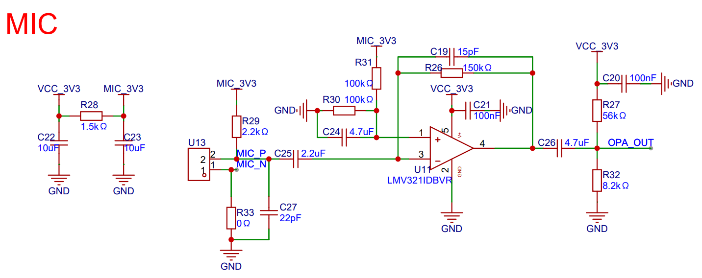

ADC Microphone
===============
:link_to_translation:`zh_CN:[中文]`

Using ADC to capture analog microphone data eliminates the need for an external audio codec chip, making it suitable for applications that do not require high sampling rates and are cost-sensitive. The code structure follows the engineering model of `esp_codec_dev <https://components.espressif.com/components/espressif/esp_codec_dev>`__.

Features
---------

- Supports multi-channel ADC audio sampling.
- Supports up to 12-bit ADC sampling resolution.

.. note:: The maximum resolution for multi-channel sampling is determined by the ADC's maximum sampling rate (83.3K for ESP32-S3) divided by the number of sampling channels.

Reference Circuit
------------------

The external reference circuit is shown below. You can choose between transimpedance amplifier or inverting/non-inverting amplifier circuits to amplify the MIC input signal. In most cases, using a transimpedance amplifier can achieve better signal-to-noise ratio. In this example, R29 is used to add DC bias for the MIC, using the general-purpose op-amp LMV321 as the operational amplifier, with R26 and C19 forming a feedback circuit to make the op-amp work in transimpedance amplification mode, where the resistance and capacitance are adjusted according to the MIC sensitivity. R31 and R30 are used to set the midpoint voltage to avoid crossover distortion, and R27 and R32 are used to provide DC bias to avoid distortion during ADC sampling. For more design reference information about front-end MIC amplifiers, please refer to `Single-Supply, Electret Microphone Pre-Amplifier Reference Design <https://www.ti.com/lit/ug/tidu765/tidu765.pdf>`__.

.. note::
    - Bias: ADC midpoint bias is necessary (such as Vref/2) to avoid ADC sampling distortion. By default, ESP32-C3's Vref is approximately 0.9V.
    - Power supply: It is recommended to use LDO for MIC power supply regulation to avoid power supply fluctuations affecting ADC sampling. If external LDO is not used, please add separate RC filtering on the power supply side (in this example, R28 and C23 are used for filtering). It is recommended that MIC and op-amp have independent power supplies.
    - It is recommended to select MIC with sensitivity greater than -46dB to avoid low signal-to-noise ratio after amplification. Adjust the amplification factor according to the microphone sensitivity.

    ADC mic hardware reference design

External Configuration for ADC Continuous
------------------------------------------

You can initialize the ADC continuous mode externally and pass in an ``adc_continuous_handle_t``.

.. code:: c

    adc_continuous_handle_t handle;
    adc_continuous_handle_cfg_t adc_config = {
        .max_store_buf_size = adc_cfg->max_store_buf_size,
        .conv_frame_size = adc_cfg->conv_frame_size,
        .flags.flush_pool = true,
    };

    adc_continuous_new_handle(&adc_config, &handle);

Using with ADC Oneshot Mode
----------------------------

- If ADC oneshot and ADC continuous use different ADC units, there will be no conflicts.

- If they use the same ADC unit, make sure to call ``esp_codec_dev_close()`` to close ``adc_mic`` before calling ``adc_oneshot_read``.

.. code:: c

    adc_continuous_start(handle);
    adc_continuous_read();
    adc_continuous_stop();
    adc_oneshot_read();

Example Code
-------------

.. code:: c

    audio_codec_adc_cfg_t cfg = DEFAULT_AUDIO_CODEC_ADC_MONO_CFG(ADC_CHANNEL_0, 16000);
    const audio_codec_data_if_t *adc_if = audio_codec_new_adc_data(&cfg);

    esp_codec_dev_cfg_t codec_dev_cfg = {
        .dev_type = ESP_CODEC_DEV_TYPE_IN,
        .data_if = adc_if,
    };
    esp_codec_dev_handle_t dev = esp_codec_dev_new(&codec_dev_cfg);
    esp_codec_dev_sample_info_t fs = {
        .sample_rate = 16000,
        .channel = 1,
        .bits_per_sample = 16,
    };
    esp_codec_dev_open(dev, &fs);
    uint16_t *audio_buffer = malloc(16000 * sizeof(uint16_t));
    assert(audio_buffer);
    while (1) {
        int ret = esp_codec_dev_read(dev, audio_buffer, sizeof(uint16_t) * 16000);
        ESP_LOGI(TAG, "esp_codec_dev_read ret: %d\n", ret);
    }

API Reference
--------------

.. include-build-file:: inc/adc_mic.inc
