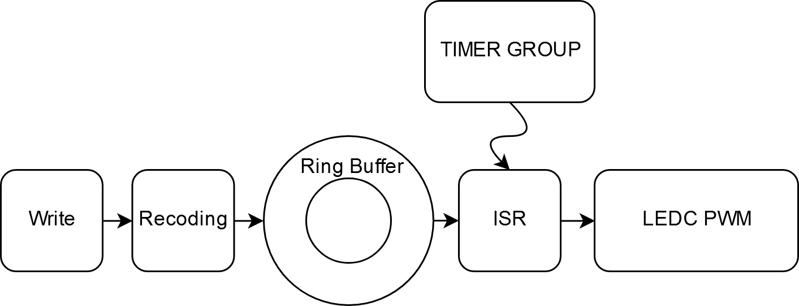

PWM Audio
==============
:link_to_translation:`zh_CN:[中文]`

The PWM audio function uses the internal LEDC peripheral in ESP32 to generate PWM audio, which does not need an external audio Codec chip. This is mainly used for cost-sensitive applications with low audio quality requirements.

Features
----------------

 - Allows any GIPO with output capability as an audio output pin
 - Supports 8-bit ~ 10-bit PWM resolution
 - Supports stereo
 - Supports 8 ～ 48 KHz sampling rate

Structure
---------------

   Structure

1. First, the data is recoded to meet the PWM input requirements, including the shift and offset of the data;
2. Send data to the ISR (Interrupt Service Routines) function of the Timer Group via Ring Buffer;
3. The Timer Group reads data from the Ring Buffer according to the pre-defined sampling rate, and write the data into LEDC.

.. note:: Since the output is a PWM signal, it needs to be low-pass filtered to get the audio waveform.

PWM Frequency
-------------------

The frequency of the output PWM cannot be configured directly, but needs to be calculated by configuring the number of PWM resolution bits, as shown below:

.. math::

    f_{pwm}=\frac{f_{APB\_CLK}}{2^{res\_bits}}-\left (\frac{f_{APB\_CLK}}{2^{res\_bits}} MOD 1000\right ) 

The :math:`f_{APB\_CLK}` here is 80 MHz, and :math:`res\_bits` is the number of PWM resolution bits. When the resolution is :cpp:enumerator:`LEDC_TIMER_10_BIT`, the PWM frequency is 78 KHz. As we all know, a higher PWM frequency and resolution can better reproduce the audio signal. However, this formula shows that increasing PWM frequency means lower resolution and increasing resolution means lower PWM frequency. Thus, please adjust these parameters according to the actual application scenario to achieve a good balance.

Application Example
---------------------------

 .. code::

    pwm_audio_config_t pac;
    pac.duty_resolution    = LEDC_TIMER_10_BIT;
    pac.gpio_num_left      = LEFT_CHANNEL_GPIO;
    pac.ledc_channel_left  = LEDC_CHANNEL_0;
    pac.gpio_num_right     = RIGHT_CHANNEL_GPIO;
    pac.ledc_channel_right = LEDC_CHANNEL_1;
    pac.ledc_timer_sel     = LEDC_TIMER_0;
    pac.tg_num             = TIMER_GROUP_0;
    pac.timer_num          = TIMER_0;
    pac.ringbuf_len        = 1024 * 8;

    pwm_audio_init(&pac));             /**< Initialize pwm audio */
    pwm_audio_set_param(48000, 8, 2);  /**< Set sample rate, bits and channel numner */
    pwm_audio_start();                 /**< Start to run */

    while(1) {

        //< Perpare audio data, such as decode mp3/wav file

        /**< Write data to paly */
        pwm_audio_write(audio_data, length, &written, 1000 / portTICK_PERIOD_MS);
    }

API Reference
-----------------

.. include:: /_build/inc/pwm_audio.inc