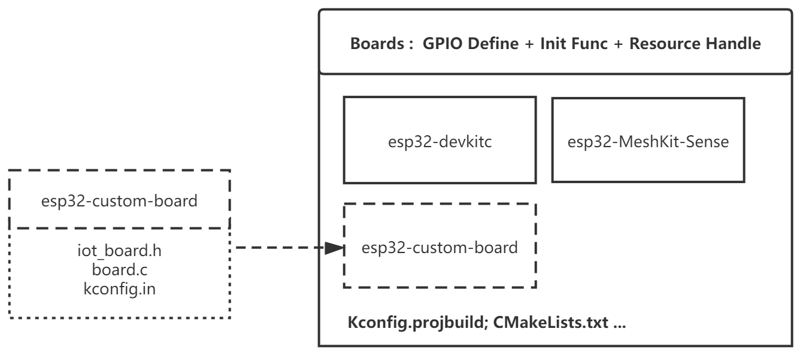
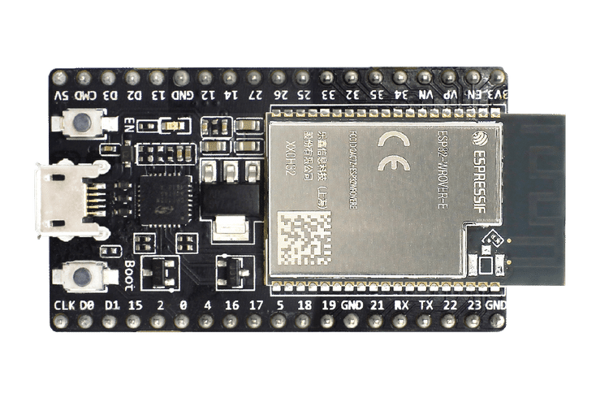
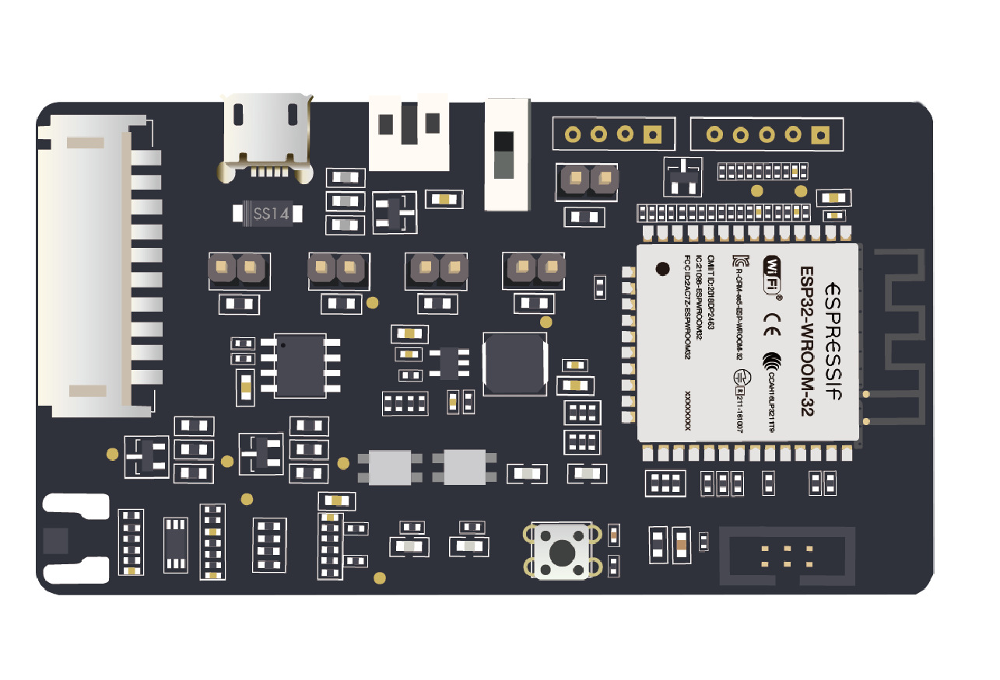
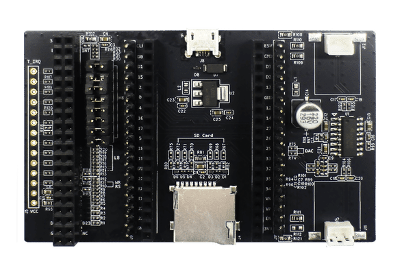
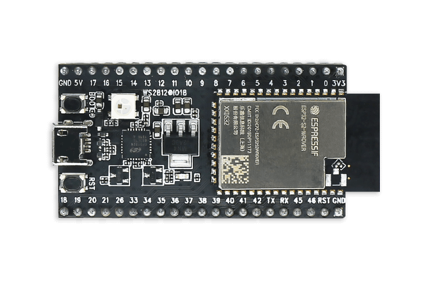

.. _boards_component:

Boards Component
====================

:link_to_translation:`zh_CN:[中文]`

This document mainly introduces the use of a board support component (Boards). As a common component of examples, this component can provide unified pin macro definitions and hardware-independent initialization operations to applications. Applications developed based on this component are compatible with different development boards at the same time with the following features:

1. Provides unified macro definitions for pins
2. Provides default peripheral configuration parameters
3. Provides unified board-level initialization interfaces 
4. Provides hardware control interfaces for development boards
  
The following figure shows the structure of the Boards component:

    Boards Component Diagram

* \The Boards component contains several folders named after the development board's name, as well as its ``CMakeLists.txt`` and ``Kconfig.projbuild`` files, therefore, its configuration option will be included in ``menuconfig``;
* The ``board.h`` and ``board.c`` files must be included in the board file, while ``kconfig.in`` is one of the non-required file, which provides configuration options specific to a board.

.. note::

     The Boards component is provided in ``examples/common_components/boards``.

Instructions
------------------

1. Initialize development board: use ``iot_board_init`` in ``app_main`` to initialize the development board. you can also do some configurations regarding this process using :ref:`board_swith_and_config` in ``menuconfig``;
2. Get the handle of a peripheral: use ``iot_board_get_handle`` and ``board_res_id_t`` to get peripheral resources. ``NULL`` will be returned if this peripheral is not initialized;
3. Operate on peripherals with handles directly.

Example:

.. code:: c

    void app_main(void)
    {
        /*initialize board with default parameters,
        you can use menuconfig to choose a target board*/
        esp_err_t err = iot_board_init();
        if (err != ESP_OK) {
            goto error;
        }

        /*get the i2c0 bus handle with a board_res_id,
        BOARD_I2C0_ID is declared in board_res_id_t in each board.h*/
        bus_handle_t i2c0_bus_handle = (bus_handle_t)iot_board_get_handle(BOARD_I2C0_ID);
        if (i2c0_bus_handle == NULL) {
            goto error;
        }

        /*
        * use initialized peripheral with handles directly,
        * no configurations required anymore.
        */
    }

.. _board_swith_and_config:

The Switch and Configuration of a Development Board
-----------------------------------------------------------------------

For applications developed basing on ``Boards``, the following steps can be used to switch and configure boards:

1. Choose a target board: choose a development board in ``menuconfig->Board Options->Choose Target Board``;
2. Configure the parameter of your board: the configuration options provided by the current development board are included in ``xxxx Board Options``, including whether ``i2c_bus`` should be initialized during the initialization stage of the board, the power status of sensor peripherals when the board is started, etc. The configurable options will be determined by the maintainer of the development board;
3. Use ``idf.py build flash monitor`` to re-build and download code.

.. note::

    The default target of this build system is ``ESP32``, please set the target before building via ``idf.py set-target esp32s2`` if you need to use ``ESP32-S2``.

Supported Development Boards
----------------------------------------

============================   ===========================
       ESP32 Development Boards
----------------------------------------------------------
 |esp32-devkitc|_                |esp32-meshkit-sense|_
----------------------------   ---------------------------
 `esp32-devkitc`_                `esp32-meshkit-sense`_
----------------------------   ---------------------------
 |esp32-lcdkit|_                        
----------------------------   ---------------------------
 `esp32-lcdkit`_       
----------------------------   ---------------------------
       ESP32-S2 Development Boards    
----------------------------------------------------------
 |esp32s2-saola|_          
----------------------------   ---------------------------
 `esp32s2-saola`_          
============================   ===========================

.. _esp32-devkitc: https://docs.espressif.com/projects/esp-idf/en/latest/esp32/hw-reference/modules-and-boards.html#esp32-devkitc-v4

.. _esp32-meshkit-sense: ../hw-reference/ESP32-MeshKit-Sense_guide.html

.. _esp32-lcdkit: ../hw-reference/ESP32-MeshKit-Sense_guide.html

.. _esp32s2-saola: https://docs.espressif.com/projects/esp-idf/en/latest/esp32s2/hw-reference/esp32s2/user-guide-saola-1-v1.2.html

Add a New Development Board
--------------------------------------

A new development board can be added to quickly adapt to applications developed basing on the ``Boards`` component.

The main process is as follows:

1. Prepare the necessary ``board.h`` and ``board.c`` files according to :ref:`component file structure <boards_component>`. You can refer to :ref:`boards_common_api`;
2. Add configuration options specific to this board in ``kconfig.in`` according to your needs;
3. Add the information of this board to ``Kconfig.projbuild`` for users;
4. Add the directory of this board to ``CMakeLists.txt`` so that it can be indexed by the build system. Please also update ``component.mk`` if you need to support the old ``make`` system.

.. note::

    An easy way is to directly copy files of the existing development boards in ``Boards`` and make simple modifications to add your new board.

.. _boards_common_api:

Mandatory APIs
+++++++++++++++++++++++

.. code:: c

    /**
    * @brief Board level init.
    *        Peripherals can be chosen through menuconfig, which will be initialized with default configurations during iot_board_init.
    *        After board init, initialized peripherals can be referenced by handles directly.
    * 
    * @return esp_err_t 
    */
    esp_err_t iot_board_init(void);

    /**
    * @brief Board level deinit.
    *        After board deinit, initialized peripherals will be deinit and related handles will be set to NULL.
    * 
    * @return esp_err_t 
    */
    esp_err_t iot_board_deinit(void);

    /**
    * @brief Check if board is initialized 
    * 
    * @return true if board is initialized
    * @return false if board is not initialized
    */
    bool iot_board_is_init(void);

    /**
    * @brief Using resource's ID declared in board_res_id_t to get board level resource's handle
    * 
    * @param id Resource's ID declared in board_res_id_t
    * @return board_res_handle_t Resource's handle
    * if no related handle,NULL will be returned
    */
    board_res_handle_t iot_board_get_handle(int id);

    /**
    * @brief Get board information
    * 
    * @return String include BOARD_NAME etc. 
    */
    char* iot_board_get_info();

Component Dependencies
---------------------------------

- Common dependencies: the bus component.

Adapted IDF Versions
---------------------------------

- ESP-IDF v4.0 and later versions.

Supported Chips
---------------------

-  ESP32
-  ESP32-S2