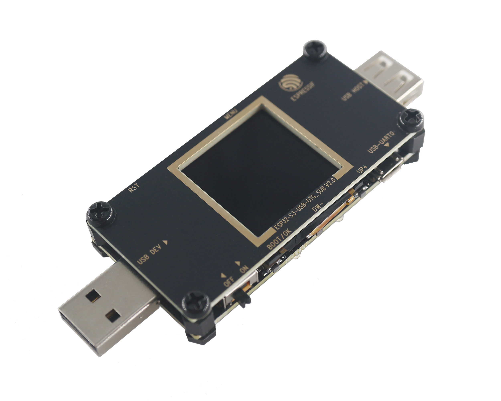

.. _boards_component:

Boards Component
====================

:link_to_translation:`zh_CN:[中文]`

This document mainly introduces the use of a board support component (Boards). As a common component of examples, this component can provide unified pin macro definitions and hardware-independent initialization operations to applications. Applications developed based on this component are compatible with different development boards at the same time with the following features:

1. Provides unified macro definitions for pins
2. Provides default peripheral configuration parameters
3. Provides unified board-level initialization interfaces
4. Provides hardware control interfaces for development boards

The following figure shows the structure of the Boards component:

.. figure:: ../../_static/boards_diagram.png
    :align: center
    :width: 70%

    Boards Component Diagram

* The Boards component contains the following:

    * ``board_common.h``, contains the function declaration of the common API;
    * ``board_common.c``, contains the function implementation of the common API (weak function);
    * ``Kconfig.projbuild``, contains common configuration items;

* The subfolders named after the development board name includes the following:

    * ``iot_board.h`` provides the gpio definition of the development board, and the board's unique custom API function declaration
    * ``board.c`` provides user implementation of common API (Covering default weak function), custom API function implementation
    * ``kconfig.in`` provides custom configuration items unique to the development board.

.. note::

    The Boards component is provided in ``examples/common_components/boards``.

Instructions
------------------

1. Initialize development board: use ``iot_board_init`` in ``app_main`` to initialize the development board. you can also do some configurations regarding this process using :ref:`board_swith_and_config` in ``menuconfig``;
2. Get the handle of a peripheral: use ``iot_board_get_handle`` and ``board_res_id_t`` to get peripheral resources. ``NULL`` will be returned if this peripheral is not initialized;
3. Operate on peripherals with handles directly.

Example:

.. code:: c

    void app_main(void)
    {
        /*initialize board with default parameters,
        you can use menuconfig to choose a target board*/
        esp_err_t err = iot_board_init();
        if (err != ESP_OK) {
            goto error;
        }

        /*get the i2c0 bus handle with a board_res_id,
        BOARD_I2C0_ID is declared in board_res_id_t in each iot_board.h*/
        bus_handle_t i2c0_bus_handle = (bus_handle_t)iot_board_get_handle(BOARD_I2C0_ID);
        if (i2c0_bus_handle == NULL) {
            goto error;
        }

        /*
        * use initialized peripheral with handles directly,
        * no configurations required anymore.
        */
    }

.. _board_swith_and_config:

The Switch and Configuration of a Development Board
-----------------------------------------------------------------------

For applications developed basing on ``Boards``, the following steps can be used to switch and configure boards:

1. Select the target development board: select a development board in ``menuconfig->Board Options->Choose Target Board``;
2. Configure the development board parameters: ``Board Common Options`` contains common configurations, such as if enable i2c0 during the initialization of the development board; ``XXX Board Options`` contains the development board-specific configurations, such as switching the power supply status of the development board, etc.
3. Use ``idf.py build flash monitor`` to recompile and download the code.

.. note::

    The default target of this build system is ``ESP32``, please set the target before building via ``idf.py set-target esp32s2`` if you need to use ``ESP32-S2``.

Supported Development Boards
----------------------------------------

============================   ===========================
       ESP32 Development Boards
----------------------------------------------------------
 |esp32-devkitc|_                |esp32-meshkit-sense|_
----------------------------   ---------------------------
 `esp32-devkitc`_                `esp32-meshkit-sense`_
----------------------------   ---------------------------
 |esp32-lcdkit|_                        
----------------------------   ---------------------------
 `esp32-lcdkit`_       
----------------------------   ---------------------------
       ESP32-S2 Development Boards    
----------------------------------------------------------
 |esp32s2-saola|_          
----------------------------   ---------------------------
 `esp32s2-saola`_          
----------------------------   ---------------------------
       ESP32-S3 Development Boards   
----------------------------------------------------------
 |esp32s3-devkitc-v1|_           |esp32s3_usb_otg_ev|_ 
----------------------------   ---------------------------
 `esp32s3-devkitc-v1`_           |esp32s3_usb_otg_ev|_ 
============================   ===========================

.. |esp32-devkitc| image:: ../../_static/esp32-devkitc-v4-front.png
.. _esp32-devkitc: https://docs.espressif.com/projects/esp-idf/en/latest/esp32/hw-reference/modules-and-boards.html#esp32-devkitc-v4

.. |esp32-meshkit-sense| image:: ../../_static/esp32-meshkit-sense.png
.. _esp32-meshkit-sense: ../hw-reference/ESP32-MeshKit-Sense_guide.html

.. |esp32-lcdkit| image:: ../../_static/esp32-lcdkit.png
.. _esp32-lcdkit: ../hw-reference/ESP32-MeshKit-Sense_guide.html

.. |esp32s2-saola| image:: ../../_static/esp32s2-saola.png
.. _esp32s2-saola: https://docs.espressif.com/projects/esp-idf/en/latest/esp32s2/hw-reference/esp32s2/user-guide-saola-1-v1.2.html

.. |esp32s3-devkitc-v1| image:: ../../_static/esp32-s3-devkitc-1-v1-isometric.png
.. _esp32s3-devkitc-v1: https://docs.espressif.com/projects/esp-idf/en/latest/esp32s3/hw-reference/esp32s3/user-guide-devkitc-1.html

.. _esp32s3_usb_otg_ev: https://docs.espressif.com/projects/esp-dev-kits/en/latest/esp32s3/esp32-s3-usb-otg/index.html

Add a New Development Board
--------------------------------------

A new development board can be added to quickly adapt to applications developed basing on the ``Boards`` component.

The main process is as follows:

1. Prepare the necessary ``iot_board.h`` based on existing example;
2. Add board specific functions or cover the common weak function in ``board_xxx.c`` according to the requirements;
3. Add configuration options specific to this board in ``kconfig.in`` according to your needs;
4. Add the information of this board to ``Kconfig.projbuild`` for users;
5. Add the directory of this board to ``CMakeLists.txt`` so that it can be indexed by the build system. Please also update ``component.mk`` if you need to support the old ``make`` system.

.. note::

    An easy way is to directly copy files of the existing development boards in ``Boards`` and make simple modifications to add your new board.

Component Dependencies
---------------------------------

- Common dependencies: bus, button, led_strip

Adapted IDF Versions
---------------------------------

- ESP-IDF v4.4 and later versions.

Supported Chips
---------------------

-  ESP32
-  ESP32-S2
-  ESP32-S3