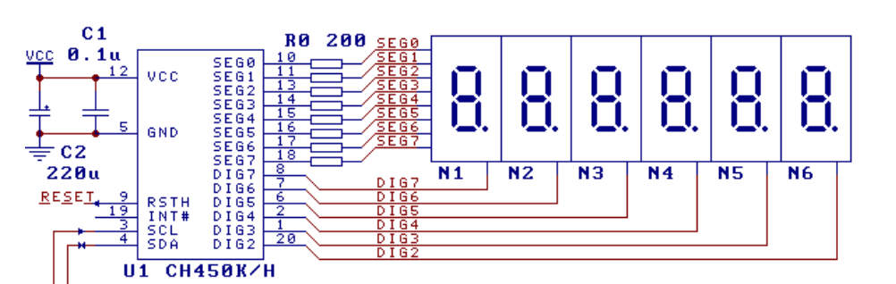
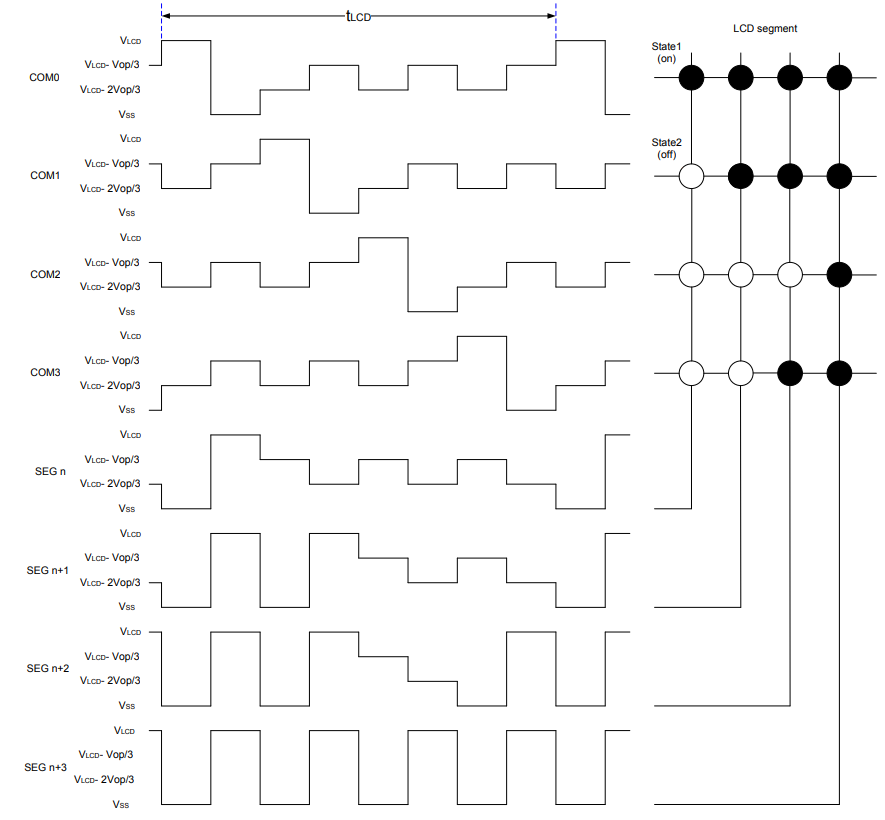
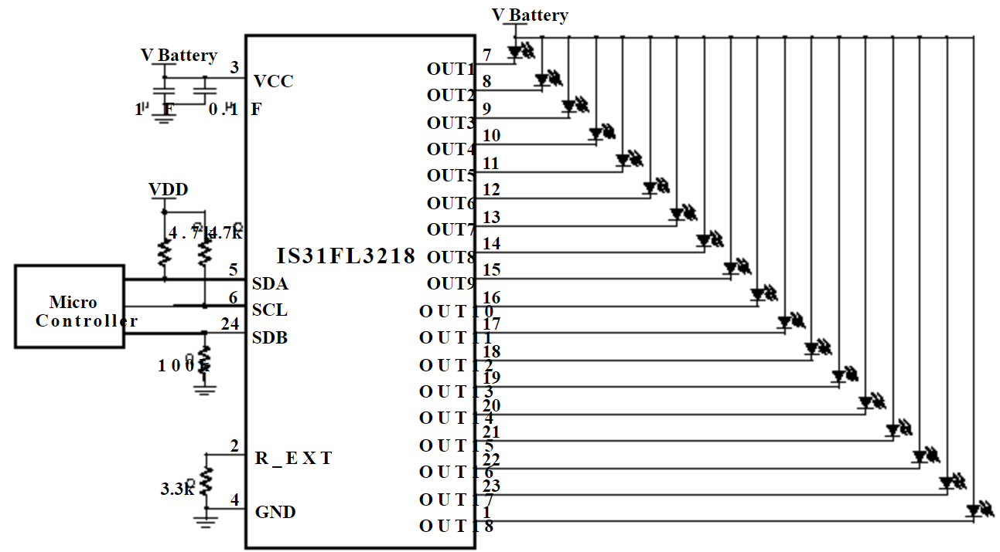

Digital Tube
==============
:link_to_translation:`zh_CN:[中文]`

Digital tube and dot matrix LEDs are common display solutions in embedded systems, which occupy fewer pins and memory resources than LCD displays and are simpler to implement, making them more suitable for application scenarios with single display requirements such as timing, counting, status display and etc.

The digital tube and LED display drivers adapted to ESP-IoT-Solution are shown in the following table:

+------------+----------------------------------------------------------------+-----------+-----------------------------------------------------------+-------------------------------------------------------------------------------------+
| Name       | Features                                                       | Interface | Driver                                                    | Datasheet                                                                           |
+============+================================================================+===========+===========================================================+=====================================================================================+
| CH450      | Digital tube display driving chip, supports 6-bit digital tube | I2C       | :component:`ch450 <display/digital_tube/ch450>`           | `CH450 <https://pdf1.alldatasheet.com/datasheet-pdf/view/1145655/WCH/CH450H.html>`_ |
+------------+----------------------------------------------------------------+-----------+-----------------------------------------------------------+-------------------------------------------------------------------------------------+
| HT16C21    | 20×4/16×8 LCD controller, supports RAM mapping                 | I2C       | :component:`ht16c21 <display/digital_tube/ht16c21>`       | `HT16C21 <https://www.holtek.com.tw/documents/10179/11842/HT16C21v110.pdf>`_        |
+------------+----------------------------------------------------------------+-----------+-----------------------------------------------------------+-------------------------------------------------------------------------------------+
| IS31FL3XXX | Dot matrix LED controller                                      | I2C       | :component:`is31fl3xxx <display/digital_tube/is31fl3xxx>` | `IS31FL3XXX <https://www.alldatasheet.com/view.jsp?Searchword=IS31FL3&sField=2>`_   |
+------------+----------------------------------------------------------------+-----------+-----------------------------------------------------------+-------------------------------------------------------------------------------------+

CH450 Driver
-----------------

CH450 is a digital tube display driving chip that can be used to drive a 6-bit digital tube or a 48-dot LED matrix and can communicate with ESP32 via the ``I2C`` interface.

    CH450 Typical Application Circuit

This driver encapsulates the basic operations of CH450, and users can directly call :c:func:`ch450_write` or :c:func:`ch450_write_num` to display numbers on the digital tube.

Example
^^^^^^^^^^^

.. code:: c

    i2c_bus_handle_t i2c_bus = NULL;
    ch450_handle_t seg = NULL;
    i2c_config_t conf = {    
        .mode = I2C_MODE_MASTER,
        .sda_io_num = I2C_MASTER_SDA_IO,
        .sda_pullup_en = GPIO_PULLUP_ENABLE,
        .scl_io_num = I2C_MASTER_SCL_IO,
        .scl_pullup_en = GPIO_PULLUP_ENABLE,
        .master.clk_speed = I2C_MASTER_FREQ_HZ,
    };
    i2c_bus = i2c_bus_create(I2C_MASTER_NUM, &conf);
    seg = ch450_create(i2c_bus);

    for (size_t i = 0; i < 10; i++) {
        for (size_t index = 0; index < 6; index++) {
            ch450_write_num(seg, index, i);
        }
        vTaskDelay(1000 / portTICK_PERIOD_MS);
    }

    ch450_delete(seg);
    i2c_bus_delete(&i2c_bus);

HT16C21 Driver
----------------

HT16C21 is a LCD control/driver chip which supports RAM mapping and can be used to drive ``20 x 4`` or ``16 x 8`` segmented LCDs. The chip communicates with ESP32 via the ``I2C`` interface.

   HT16C21 Typical Drive Model

This driver encapsulates the basic operations of HT16C21. After creating an example using ``ht16c21_create``, users can configure its parameters via ``ht16c21_param_config`` and then call ``ht16c21_ram_write`` directly to write data.

Example
^^^^^^^^^^^^

.. code:: c

    i2c_bus_handle_t i2c_bus = NULL;
    ht16c21_handle_t seg = NULL;
    uint8_t lcd_data[8] = { 0x10, 0x20, 0x30, 0x50, 0x60, 0x70, 0x80 };

    i2c_config_t conf = {    
        .mode = I2C_MODE_MASTER,
        .sda_io_num = I2C_MASTER_SDA_IO,
        .sda_pullup_en = GPIO_PULLUP_ENABLE,
        .scl_io_num = I2C_MASTER_SCL_IO,
        .scl_pullup_en = GPIO_PULLUP_ENABLE,
        .master.clk_speed = I2C_MASTER_FREQ_HZ,
    };
    i2c_bus = i2c_bus_create(I2C_MASTER_NUM, &conf);
    seg = ht16c21_create(i2c_bus, HT16C21_I2C_ADDRESS_DEFAULT);

    ht16c21_config_t ht16c21_conf = {    
        .duty_bias = HT16C21_4DUTY_3BIAS;
        .oscillator_display = HT16C21_OSCILLATOR_ON_DISPLAY_ON;
        .frame_frequency = HT16C21_FRAME_160HZ;
        .blinking_frequency = HT16C21_BLINKING_OFF;
        .pin_and_voltage = HT16C21_VLCD_PIN_VOL_ADJ_ON;
        .adjustment_voltage = 0;
    };
    ht16c21_param_config(seg, &ht16c21_conf);
    ht16c21_ram_write(seg, 0x00, lcd_data, 8);

    ht16c21_delete(seg);
    i2c_bus_delete(&i2c_bus);

IS31FL3XXX Driver
-----------------------

The IS31FL3XXX series chips can be used to drive dot matrix LED screens with different sizes. The IS31FL3218 supports 18 constant current channels, with each channel controlled by an independent PWM. It has a maximum output current of 38 mA and can directly drive LEDs for display. The IS31FL3736 supports more channels and can compose a maximum size of LED matrix as ``12 x 8``. With each channel driven by an 8-bit PWM driver, the IS31FL3736 can support up to 256 gradients.

   IS31FL3218 Typical Application Circuit

This driver encapsulates the basic operations of IS31FL3XXX. The example is shown in the next section.

IS31FL3218 Example
^^^^^^^^^^^^^^^^^^^^

.. code:: c

    i2c_bus_handle_t i2c_bus = NULL;
    is31fl3218_handle_t fxled = NULL;
    i2c_config_t conf = {
        .mode = I2C_MODE_MASTER,
        .sda_io_num = I2C_MASTER_SDA_IO,
        .sda_pullup_en = GPIO_PULLUP_ENABLE,
        .scl_io_num = I2C_MASTER_SCL_IO,
        .scl_pullup_en = GPIO_PULLUP_ENABLE,
        .master.clk_speed = I2C_MASTER_FREQ_HZ,
    };
    i2c_bus = i2c_bus_create(I2C_MASTER_NUM, &conf);
    fxled = is31fl3218_create(i2c_bus);
    is31fl3218_channel_set(fxled, 0x00ff, 128); // set PWM 1 ~ PWM 8 duty cycle 50%
    is31fl3218_delete(fxled);
    i2c_bus_delete(&i2c_bus);

