LCD Introduction
================

:link_to_translation:`zh_CN:[中文]`

Commonly LCD is a TFT-LCD (Thin Film Transistor Liquid Crystal Display). It is a common digital display technology used for displaying images and text. LCDs employ liquid crystal materials and polarization technology. When the liquid crystal molecules are influenced by an electric field, they change the polarization direction of light, thereby controlling the intensity of light and displaying images or text on the screen.

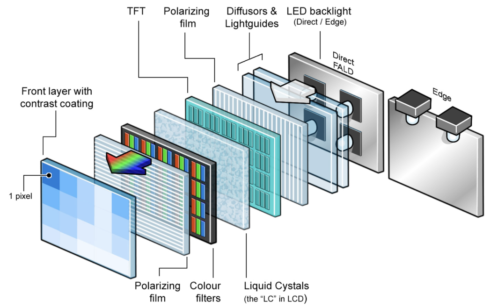

    TFT-LCD Hardware Diagram

LCD has many advantages, such as low power consumption, long lifespan, high reliability, high clarity, compact size, high color reproduction, and strong anti-glare capability. Therefore, it has been widely used in various electronic devices, such as home appliances, portable devices, wearable devices, etc. At the same time, LCD technology continues to advance and improve, including different panel types such as IPS, VA, TN, and new LED backlight technologies, all of which further enhance the performance and user experience of LCD.

This guide contains the following sections:

.. list::

  - `Structure`_: The main structure of the LCD module, primarily composed of a panel, backlight source, driver IC, and FPC.
  - `Shape`_: Common forms of the LCD module, including rectangular screens and circular screens.
  - `Driver Interface`_: The driver interface of the LCD module, including SPI, QSPI, I80, RGB, and MIPI-DSI.
  - `Typical Connection Methods`_: Typical ways to connect the LCD module, including the general pins of the LCD and various types of interface pins.
  - `Frame Rate`_: The frame rate of LCD applications, including rendering frame rate, interface frame rate, and screen refresh rate.

Terminology
-----------

Please refer to the :ref:`LCD Terms Table <LCD_Terms_Table>` 。

Structure
---------------

To ensure the stable operation and convenient development of LCD, manufacturers typically encapsulate the LCD into an **integrated module** for user use. It mainly consists of the following four parts:

- **Panel**: The panel determines the color, viewing angle, and resolution of the LCD module. The price trend of the panel directly affects the module's price, while the quality and technological aspects of the panel are important in shaping the module's overall performance. Common panel types include IPS, VA, TN, etc.
- **Backlight Source**: Since liquid crystal molecules do not emit light on their own, a dedicated backlight source is required to illuminate the LCD screen and allow the liquid crystal molecules to produce different colors through their deflection. The role of the backlight source is to provide light energy, and its brightness can generally be controlled using PWM (Pulse Width Modulation).
- **Driver IC**: The driver IC communicates externally through specific interfaces, controlling the output voltage to twist the liquid crystals and induce changes in color levels and brightness. It typically consists of two parts: the control circuit, responsible for receiving signals from the main control chip and converting/processing image signals, and the driver circuit, responsible for outputting image signals and displaying them on the panel.
- **FPC (Flexible Printed Circuit)**: FPC serves as the external interface for the LCD module, connecting the driver IC, external drive circuit, and main control chip. Due to its outstanding flexibility and reliability, FPC addresses issues related to contact in traditional rigid circuit boards and provides improved resistance to vibration, thereby enhancing the stability and lifespan of the module.

Typically, the selection of an LCD module is primarily based on its **panel** and **driver IC**. For instance, considerations include the type and resolution of the panel, as well as the interface types and color formats supported by the driver IC. The driver IC, with a small footprint, is usually affixed at the connection point between the FPC and the panel, as illustrated.

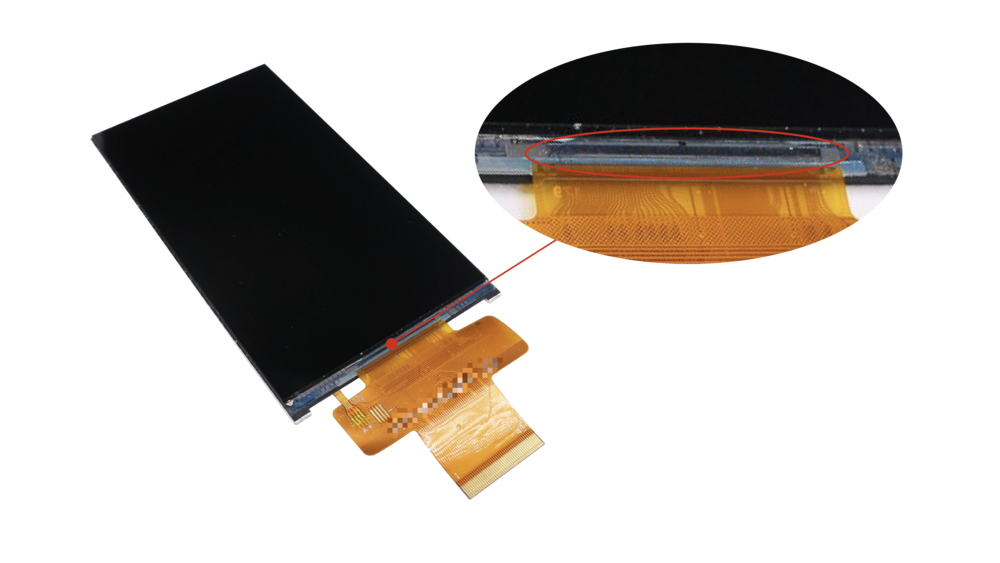

    LCD Module's Driver IC

Shape
---------------

When it comes to the physical shape of LCD panels, most are either rectangular or circular. The most commonly encountered type in daily life is the rectangular screen, while circular screens are often found in smaller-sized displays.

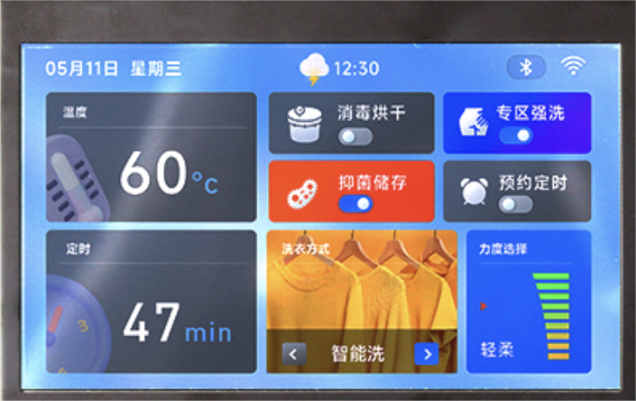

    Rectangular LCD Screen

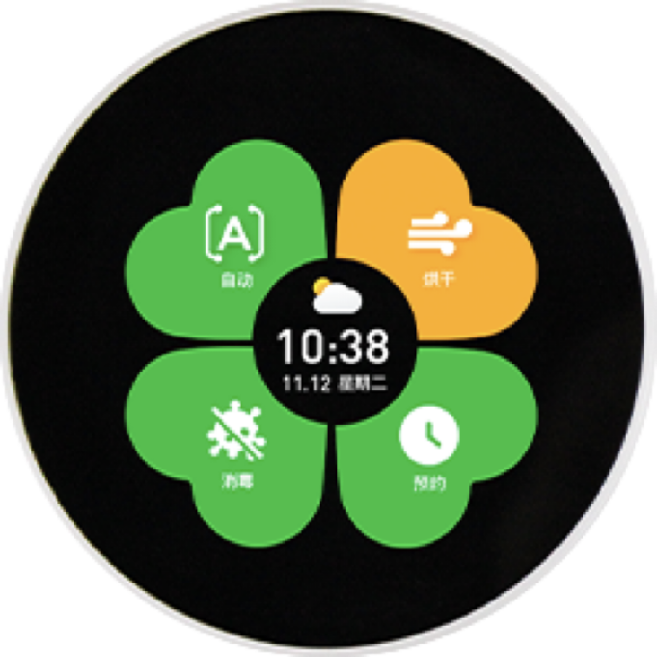

    Circular LCD Screen

Characteristics and application scenarios for these shapes are as follows:

.. list-table::
    :widths: 10 30 30
    :header-rows: 1

    * - Type
      - Characteristics
      - Application Scenarios
    * - Rectangular Screen
      - Large area, excellent display, capable of presenting more information, versatile applications
      - Mobile phones, tablets, control panels
    * - Circular Screen
      - Stylish, lightweight, occupies less space, effectively utilizes device area
      - Smart wearables, electric vehicle dashboards, car display panels, smart home appliances, handheld smart devices

The **size** of an LCD panel is typically measured by the diagonal length, expressed in inches or centimeters, such as the commonly mentioned 1.28-inch and 3.5-inch screens. Besides the physical size, developers often pay more attention to the screen's **resolution**. Resolution refers to the number of pixels the panel can display, representing the image precision: the more pixels it can display, the finer the picture, and the more information can be shown in the same screen area. Higher resolution also imposes greater performance demands on the main control chip, making it a crucial parameter.

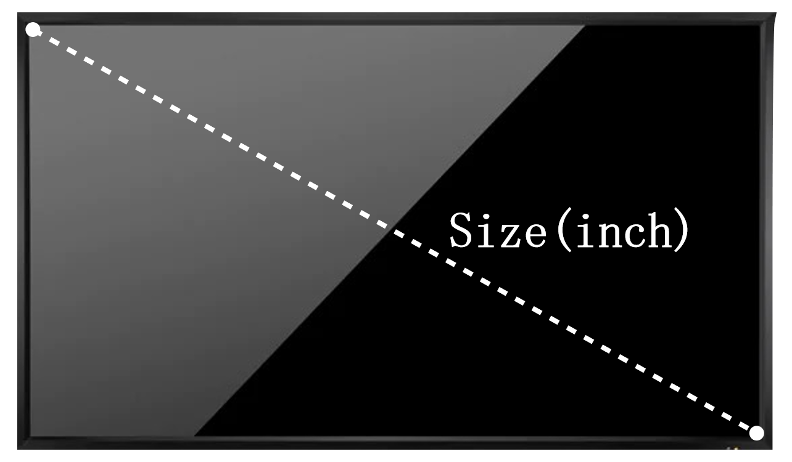

    Screen Size

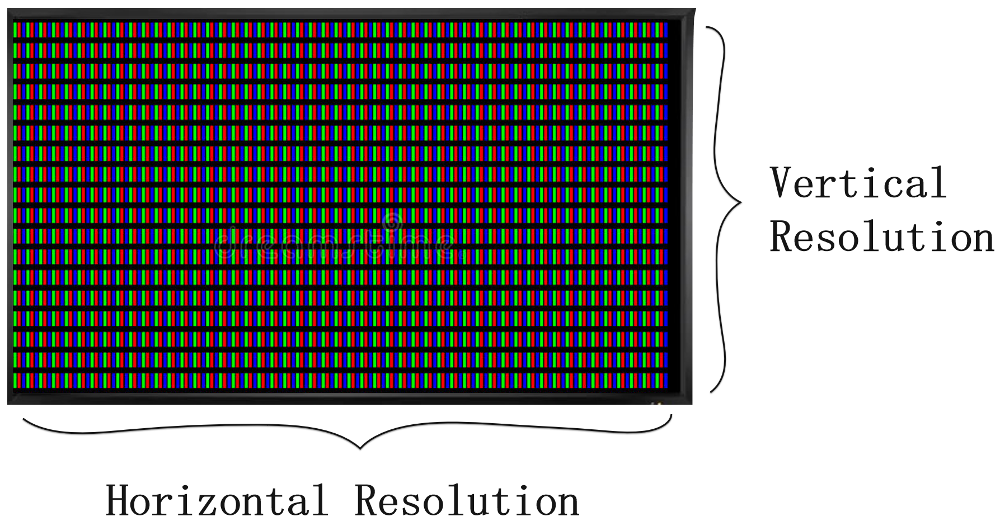

    Screen Resolution

The relationship between size and resolution is not a one-to-one correspondence, but there is a general proportional trend. For example, in most cases, a 2.4-inch or 2.8-inch screen commonly has a resolution of 320x240, while a 3.2-inch or 3.5-inch screen often has a resolution of 320x480. Larger screens may not necessarily have higher resolutions than smaller ones. Therefore, when selecting a screen, it is essential to determine the size and resolution based on the specific application scenarios and requirements.

.. _LCD_Overview_Driver_Interface:

Driver Interface
---------------------

For developers, the focus is often on the LCD's driver interface. Common interface types in the field of IoT include ``SPI``, ``QSPI``, ``I80``, ``RGB``, and ``MIPI-DSI``. A comparison of parameters such as ``IO count``, ``parallel data bits``, ``data transfer bandwidth``, and ``Graphics RAM (GRAM) location`` is presented below:

Parameter Comparison
^^^^^^^^^^^^^^^^^^^^^^^

.. list-table::
    :widths: 10 75 5 5 5 10
    :header-rows: 1

    * - Type
      - Description
      - IO Count
      - Parallel Bits
      - Data Bandwidth
      - GRAM Location
    * - SPI
      - Serial interface based on the SPI bus protocol, typically using 4-wire or 3-wire modes
      - Minimum
      - 1
      - Minimum
      - LCD
    * - QSPI (Quad-SPI)
      - Extension of SPI interface, enables parallel transmission with 4 data lines
      - Fewer
      - 4
      - Smaller
      - LCD or MCU
    * - I80 (MCU, DBI)
      - Parallel interface based on the I80 bus protocol
      - More
      - 8/16
      - Larger
      - LCD
    * - RGB (DPI)
      - Parallel interface, usually paired with a 3-wire SPI interface
      - Maximum
      - 8/16/18/24
      - Larger
      - MCU
    * - MIPI-DSI
      - Serial interface using differential signal transmission, based on the high-speed, low-power, scalable serial interconnect D-PHY physical layer specification of MIPI
      - More
      - 1/2/3/4
      - Maximum
      - LCD or MCU

.. note::

  - For the ``QSPI`` interface, different models of driver ICs may adopt different driving methods. For example, the *SPD2010* has built-in GRAM, and its driving method is similar to the ``SPI/I80`` interface, while the *ST77903* does not have built-in GRAM, and its driving method is similar to the ``RGB`` interface.
  - For the ``MIPI-DSI`` interface, the use of Command mode requires the LCD to have built-in GRAM, while Video mode does not.

Summarizing as follows:

  #. ``SPI`` The data transfer bandwidth of the ``SPI`` interface is small, making it suitable for low-resolution screens.
  #. ``QSPI`` and ``I80`` interfaces have larger data transfer bandwidth, enabling support for higher-resolution screens. However, the ``I80`` interface requires the LCD to have built-in GRAM, leading to higher screen costs and making it challenging to achieve large screens.
  #. The ``RGB`` interface is similar to the ``I80`` interface, but the ``RGB`` interface does not require LCD to have built-in GRAM, making it suitable for higher-resolution screens.
  #. The ``MIPI-DSI`` interface is suitable for high-resolution, high-refresh-rate screens.

Interface Details
^^^^^^^^^^^^^^^^^^^^

The first step in driving an LCD is to determine its interface type. For most common driver ICs, such as *ST7789*, *GC9A01*, *ILI9341*, etc., they generally support multiple interfaces. However, when screen manufacturers package them into modules, they typically expose only one interface externally (RGB LCDs usually also use the SPI interface). Taking *GC9A01* as an example, its hardware block diagram is as follows:

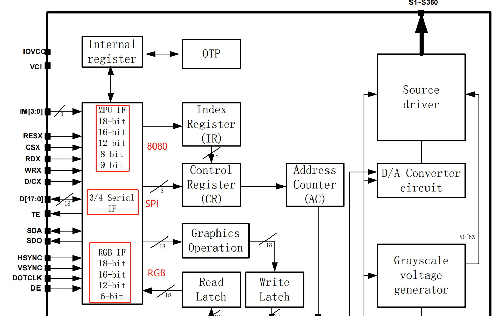

    Hardware Block Diagram of GC9A01

The actual interface type of many LCD driver ICs is determined by the logic levels of their ``IM[3:0]`` pins. While most screens have these pin configurations fixed internally, some screens reserve these pins along with all interface pins, allowing users to configure them. Taking *ST7789* as an example, its interface type configuration is as follows:

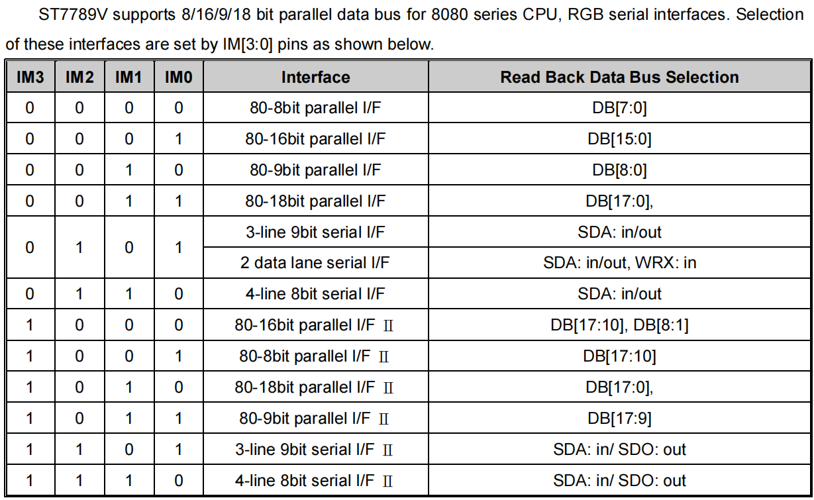

    Interface Configuration of ST7789

Therefore, knowing just the model of the driver IC is not sufficient to determine the interface type of the screen. In such cases, you can consult the screen manufacturer, refer to the screen's datasheet, or use the schematic combined with experience to make an informed judgment. Below is a pin comparison for various interfaces:

.. list-table::
    :widths: 15 85
    :header-rows: 1

    * - Type
      - Pins
    * - General LCD
      - RST (RESET), Backlight (LEDA, LEDK), TE (Tear Effect), Power (VCC, GND)
    * - SPI
      - CS, SCK (SCL), SDA (MOSI), SDO (MISO), DC (RS)
    * - QSPI
      - CS, SCK (SCL), SDA (DATA0), DATA1, DATA2, DATA3
    * - I80
      - CS (CSX), RD (RDX), WR (WRX), DC (D/CX), D[15:0] (D[7:0])
    * - RGB
      - CS, SCK (SCL), SDA (MOSI), HSYNC, VSYNC, PCLK, DE, D[23:0] (D[17:0]/D[7:0])

Detailed descriptions of commonly used interface types for LCDs are as follows:

.. list::

  - :doc:`./spi_lcd`
  - :doc:`./rgb_lcd`
  - I80 LCD Introduction (To be updated)
  - QSPI LCD Introduction (To be updated)

Typical Connection Methods
---------------------------------

For the common LCD pins, the typical connection method is as follows:

- **RST (RESET)**: It is recommended to connect to a GPIO pin and according to the LCD driver IC's datasheet, generate a reset timing sequence during power-on. In general, pull-up/pull-down resistors can also be used connected to the system power.
- **Backlight (LEDA、LEDK)**: It is recommended to connect LEDA(Anode) to the system power supply, and LEDK(Cathode) should be connected to the system power supply using switching devices. Control the on/off state through GPIO or use the LEDC peripheral to output PWM to adjust the backlight brightness.
- **TE (Tear Effect)**: Recommend connecting to GPIO and using GPIO interrupts to obtain the TE signal for achieving frame synchronization.
- **Power(VCC、GND)**: It is recommended to connect all to the corresponding system power sources and avoid leaving any pins floating.

For pins of different interface types, the  MCU needs to adopt different connection methods. Below, we will introduce the typical connection methods for four interfaces: SPI, QSPI, I80, and RGB.

SPI Interface
^^^^^^^^^^^^^^^

The hardware design of the LCD with the ``SPI`` interface can be referred to the development board `ESP32-C3-LCDkit <https://docs.espressif.com/projects/espressif-esp-dev-kits/en/latest/esp32c3/esp32-c3-lcdkit/index.html>`_ and its `LCD sub-board <https://docs.espressif.com/projects/espressif-esp-dev-kits/en/latest/_static/esp32-c3-lcdkit/schematics/SCH_ESP32-C3-LCDkit-DB_V1.0_20230329.pdf>`__, The typical connection diagram is as follows:

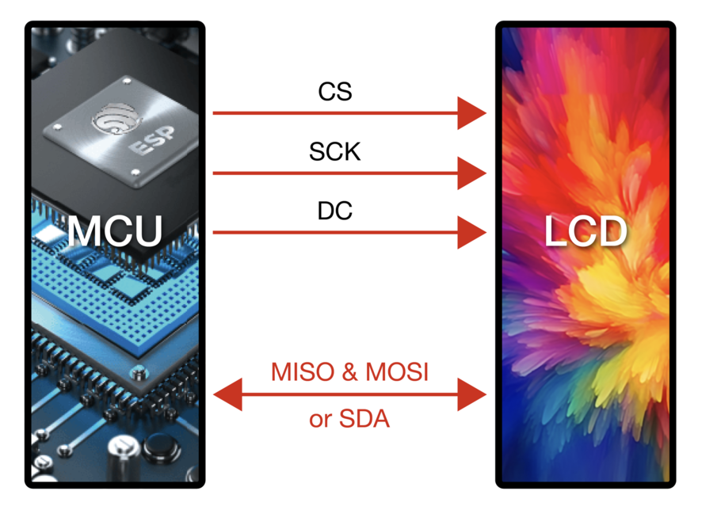

    Typical Connection Diagram for SPI Interface

.. note::

  - ``Interface I Mode`` requires only the ``SDA`` data line, while ``Interface II Mode`` requires both ``MISO & MOSI`` data lines.
  - In most cases, reading data from the LCD is not necessary, so the ``MISO`` connection may be omitted. If needed, please be aware that the maximum clock frequency for reading from SPI LCDs is often much lower than the writing frequency.
  - Due to the ``3-line Mode`` (no D/C signal line), where each unit of data transfer (usually a byte) requires transmitting the D/C signal first (1-bit), and the current ESP's SPI peripheral does not support direct transmission of 9-bit data, the commonly used ``4-line Mode`` shown in the above diagram is preferred.

QSPI Interface
^^^^^^^^^^^^^^^

``QSPI`` interface's typical connection diagram is as follows:

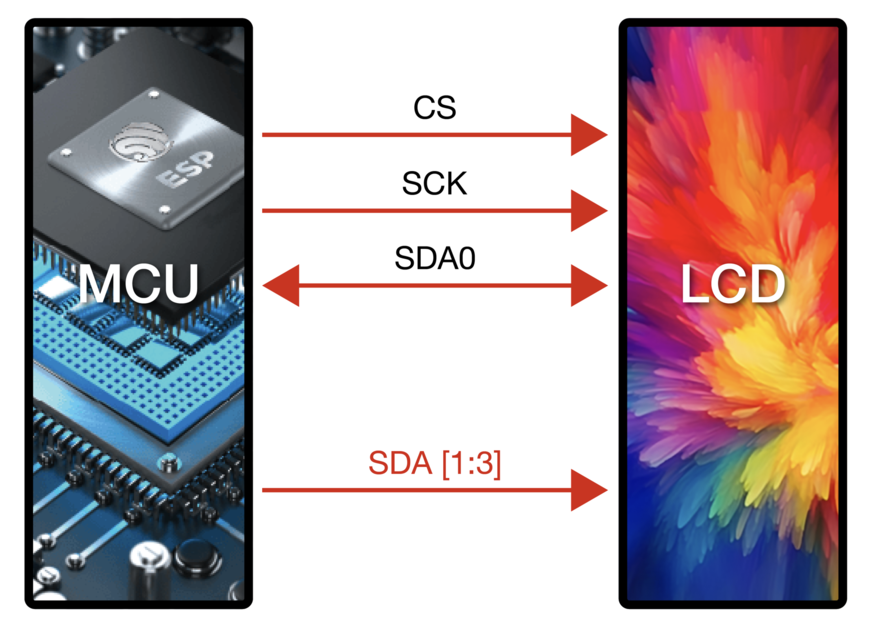

    Typical Connection Diagram for QSPI Interface

.. note::

  - The ``QSPI`` interface connection may vary for different models of driver ICs. The above diagram is provided as an example using *ST77903*.
  - When writing data, use four data lines: ``SDA0`` and ``SDA[1:3]``. When reading data, only ``SDA0`` is used.

I80 Interface
^^^^^^^^^^^^^

For the hardware design of the LCD with the ``I80`` interface, please refer to the development board `ESP32-S3-LCD-EV-Board <https://docs.espressif.com/projects/espressif-esp-dev-kits/en/latest/esp32s3/esp32-s3-lcd-ev-board/index.html>`_ and its `LCD sub-board <https://docs.espressif.com/projects/esp-dev-kits/en/latest/_static/esp32-s3-lcd-ev-board/schematics/SCH_ESP32-S3-LCD-EV-Board-SUB2_V1.2_20230509.pdf>`__ (3.5' LCD_ZJY). The typical connection diagram is as follows:

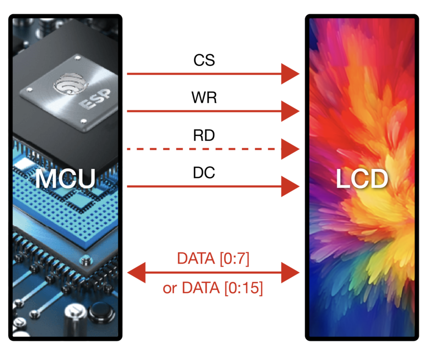

    Typical Connection Diagram for I80 Interface

.. note::

  - Dashed lines in the diagram represent optional pins.
  - The I80 peripheral on ESP does not support using the ``RD`` signal for reading operations, so it needs to be pulled high during actual connections.

RGB Interface
^^^^^^^^^^^^^

For the hardware design of the LCD with the ``RGB`` interface, please refer to the development board `ESP32-S3-LCD-EV-Board <https://docs.espressif.com/projects/espressif-esp-dev-kits/en/latest/esp32s3/esp32-s3-lcd-ev-board/index.html>`_ and its `LCD sub-board <https://docs.espressif.com/projects/esp-dev-kits/en/latest/_static/esp32-s3-lcd-ev-board/schematics/SCH_ESP32-S3-LCD-EV-Board-SUB2_V1.2_20230509.pdf>`__ (3.95' LCD_QMZX). The typical connection diagram is as follows:

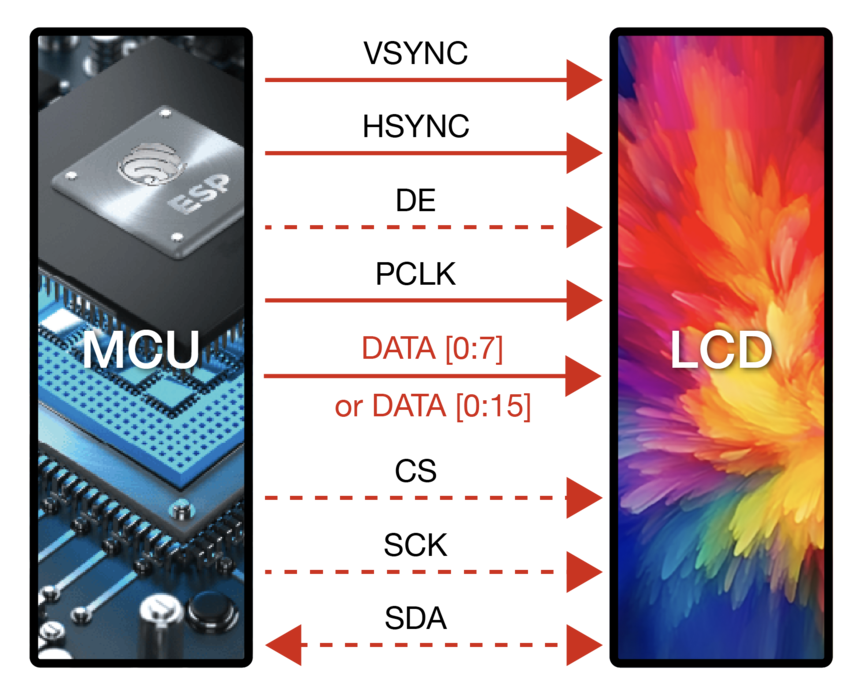

    Typical Connection Diagram for RGB Interface

.. note::

  - Dashed lines in the diagram represent optional pins.
  - ``DE`` is used for DE mode.
  - ``CS``, ``SCK``, and ``SDA`` are 3-wire SPI interface pins used to send commands and parameters to configure the LCD. Some screens may not have these pins, and therefore, initialization configuration may not be necessary. Since the ``3-wire SPI`` interface can be used only for the initialization of the LCD and not for subsequent screen refresh, to save the number of I/O pins, ``SCK`` and ``SDA`` can be reused with any ``RGB`` interface pins.

Frame Rate
---------------

For LCD applications, animations on the screen are achieved by displaying multiple consecutive still images, known as **frames**. The **frame rate** is the speed at which new frames are displayed and is typically expressed as the number of frames that change per second, abbreviated as FPS. A higher frame rate means more frames are displayed per second, resulting in smoother and more realistic animation.

However, the display of a single frame is not completed all at once by the main controller; rather, it goes through multiple steps such as rendering, transmission, and display. Therefore, the frame rate not only depends on the performance of the main controller but also on factors such as the LCD interface type and refresh rate.

Rendering
^^^^^^^^^^^^^^^

Rendering refers to the process by which the main controller calculates and generates image data. The speed of this process can be measured by the **rendering frame rate**.

The rendering frame rate depends on the performance of the main controller and is also influenced by the complexity of the animation. For example, animations with localized changes usually have a higher rendering frame rate than those with full-screen changes, and pure color fills typically have a higher rendering frame rate for layer blending. Therefore, the rendering frame rate is generally not fixed during image changes, as shown in the runtime FPS statistics of LVGL.

.. only:: latex

  See the `GIF for runtime FPS statistics of LVGL <https://dl.espressif.com/AE/esp-iot-solution/lcd_fps_lvgl.gif>`_.

.. only:: html

  .. figure:: https://dl.espressif.com/AE/esp-iot-solution/lcd_fps_lvgl.gif
      :height: 504 px
      :width: 453 px
      :align: center
      :alt: Runtime FPS statistics of LVGL

      Runtime FPS statistics of LVGL

Transmission
^^^^^^^^^^^^^^^

Transmission refers to the process in which the main controller transfers the rendered image data through the peripheral interface to the LCD driver IC. The speed of this process can be measured by the **interface frame rate**.

The interface frame rate depends on the LCD interface type and the data transfer bandwidth of the main controller. It is typically fixed after the initialization of the peripheral interface. It can be calculated using the following formula:

.. math::

    Interface\;Frame\;Rate = \frac{Data\;Transfer\;Bandwidth\;of\;the\;Interface}{Data\;Size\;of\;One\;Frame}

**For SPI/I80 Interfaces**:

.. math::

    Interface\;Frame\;Rate = \frac{Clock\;Frequency \times Number\;of\;Data\;Lines}{Color\;Depth \times Horizontal\;Resolution \times Vertical\;Resolution}

**For RGB Interfaces**:

.. math::

    Interface\;Frame\;Rate = \frac{Clock\;Frequency \times Number\;of\;Data\;Lines}{Color\;Depth \times Horizontal\;Period \times Vertical\;Period}

    Horizontal\;Period = &Horizontal\;Pulse\;Width + Horizontal\;Back\;Porch + \\ &Horizontal\;Resolution + Horizontal\;Front\;Porch

    Vertical\;Period = &Vertical\;Pulse\;Width + Vertical\;Back\;Porch + \\ &Vertical\;Resolution + Vertical\;Front\;Porch

Display
^^^^^^^^^^^^^^^

Display refers to the process in which the LCD driver IC displays the received image data on the screen. The speed of this process can be measured by the **screen refresh rate**.

For LCDs with SPI/I80 interfaces, the screen refresh rate is determined by the LCD driver IC and can typically be set by sending specific commands, such as the *ST7789* command ``FRCTRL2 (C6h)``. For LCDs with RGB interfaces, the screen refresh rate is determined by the main controller and is equivalent to the interface frame rate.

.. note::
  - If development needs to proceed without an LCD, the `esp_lcd_usb_display component <https://components.espressif.com/components/espressif/esp_lcd_usb_display>`_ can be used to simulate the LCD display on a PC monitor via USB UVC, enabling application debugging. The corresponding example is available at `usb_lcd_display <https://github.com/espressif/esp-iot-solution/tree/master/examples/usb/device/usb_lcd_display>`_.