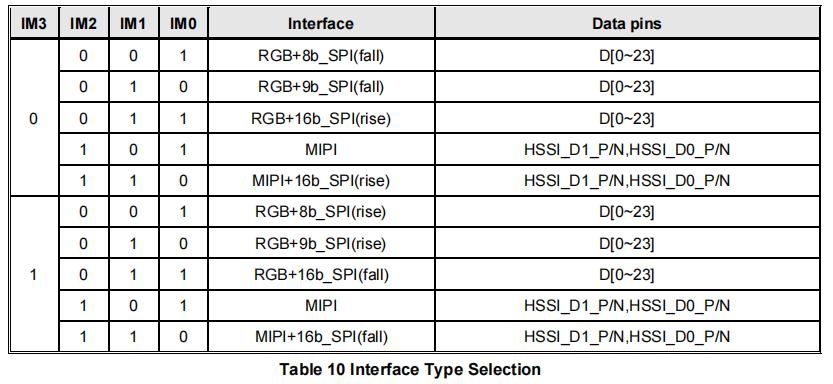
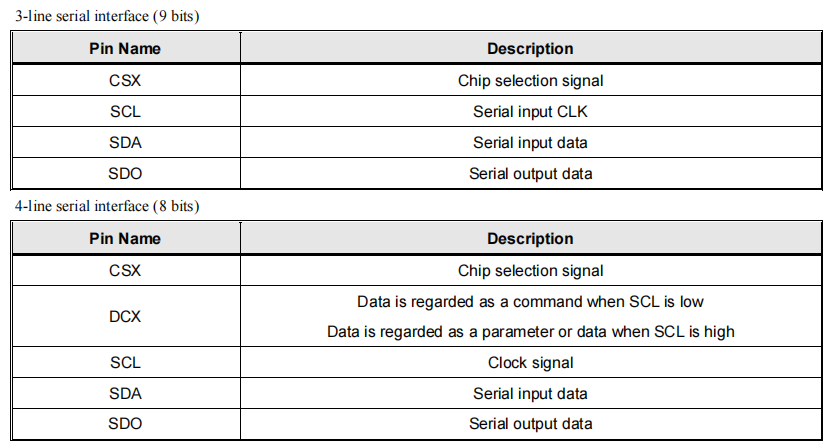
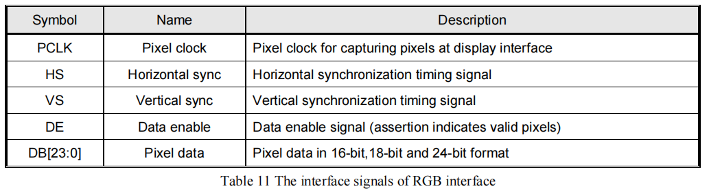
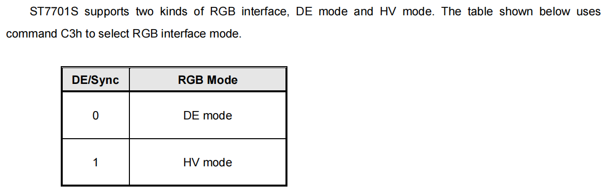
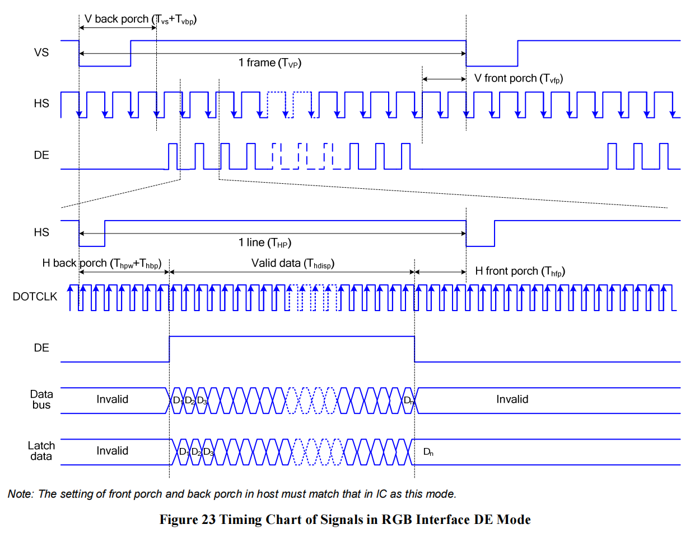
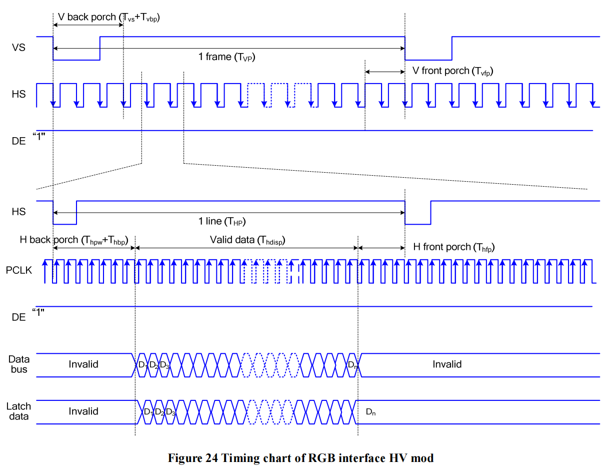
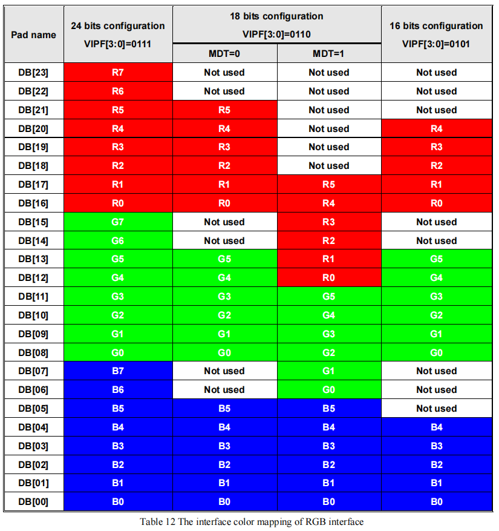
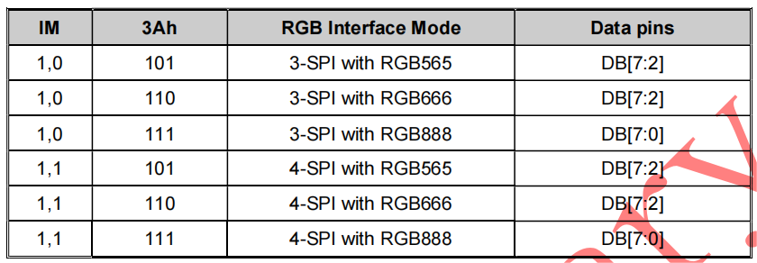
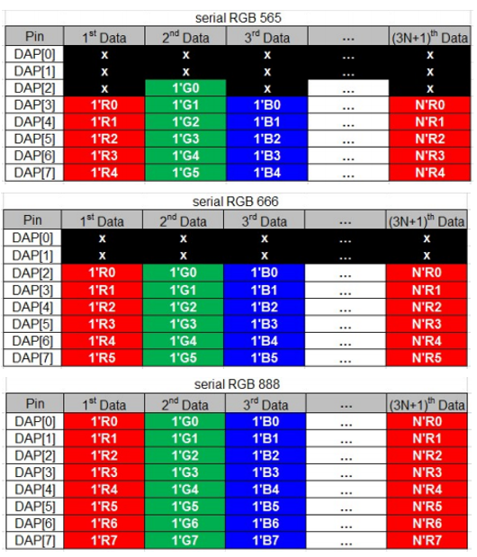

RGB LCD Introduction
====================

:link_to_translation:`zh_CN:[中文]`

.. contents:: Contents
    :local:
    :depth: 2

Terminology
-----------

Please refer to the :ref:`LCD Terms Table <LCD_Terms_Table>` 。

Interface Mode
---------------------

Most RGB LCDs use the "SPI + RGB" interface mode. They require sending commands through the SPI interface to initialize the LCD. After initialization, it's possible to dynamically modify relevant configurations such as vertical/horizontal mirroring for greater flexibility. Some RGB LCDs only use the "RGB" interface, eliminating the need to send commands for LCD initialization. However, they cannot modify any configurations, making the driving method simpler. The following diagram illustrates the interface type selection for the ST7701S.

    Interface Type Selection for ST7701S

From the above figure, it can be observed that *ST7701S* selects the configuration of the ``SPI + RGB`` interface through the ``IM[3:0]`` pins. Typically, LCDs of this type choose the ``3-wire SPI + RGB`` interface, corresponding to the ``RGB+9b_SPI(rise/fall)`` in the figure. Here, ``9b_SPI`` represents the :ref:`3-line mode <spi_3/4-line_mode>` of the SPI interface (generally referred to as ``3-wire``), and ``rise/fall`` indicates the effective edge of the ``SCL`` signal. ``rise`` signifies the rising edge is effective (SPI modes 0/3), while ``fall`` represents the falling edge (SPI modes 1/2)

The following diagram depicts the pin descriptions for the *ST7701S* ``SPI`` and ``RGB`` interfaces:

    Pin Description for ST7701S SPI Interface

    Pin Description for ST7701S RGB Interface

Note: RGB pin names: CS, SCK (SCL), SDA (MOSI), HSYNC, VSYNC, PCLK, DE, D[23:0] (D[17:0]/D[7:0]).

For LCDs using the ``SPI + RGB`` interfaces, you can typically configure the ``RGB`` interface to operate in either ``DE mode`` or ``SYNC mode`` through commands. The following section illustrates these two modes using *ST7701S* as an example.

Mode Selection
^^^^^^^^^^^^^^^^

    Mode Selection for ST7701S RGB Interface

From the diagram, it can be observed that *ST7701S* can configure the mode of RGB using the command ``C3h``. It is important to note that LCD driver ICs of different models may use different commands for configuration, for instance, *GC9503* is configured using the command ``B0h``.

DE Mode
^^^^^^^^^^^^^^^^

    Timing Diagram for ST7701S DE Mode

SYNC Mode
^^^^^^^^^^^^^^^^

    Timing Diagram for ST7701S SYNC Mode

Mode Comparison
^^^^^^^^^^^^^^^^

By comparing the timing diagrams of ``DE Mode`` and ``SYNC Mode``, the main differences lie in whether the DE signal line is used and the configuration requirements for the blanking porch. Summarized in the table below:

.. list-table::
    :widths: 20 30 50 10
    :header-rows: 1

    * - Mode
      - Use of DE Signal Line
      - Configuration of Blanking Porch Register
      - ESP Support
    * - DE Mode
      - Yes
      - No
      - Yes
    * - SYNC Mode
      - No
      - Yes
      - Yes

Color Formats
---------------------

Most RGB LCDs support various color (input data) formats, including ``RGB565``, ``RGB666``, ``RGB888``, etc. Typically, the ``COLMOD (3Ah)`` command can be used to configure the color format. The following diagram illustrates the color format configuration for *ST7701S*:

    Color Format Configuration for ST7701S

From the above diagram, it can be seen that *ST7701S* supports three color formats: ``16-bit RGB565``, ``18-bit RGB666``, and ``24-bit RGB888``. Here, ``N-bit`` indicates the number of data lines in the interface, and the selection is made through the ``COLMOD (3Ah): VIPF[2:0]`` and ``COLCTRL (CDh): MDT`` commands. **Note that command configuration must be consistent with the hardware interface**. For example, if the LCD module provides only 18 data lines, the software must not configure the color format as ``24-bit RGB888``. In such a case, the configuration for ``16-bit RGB565`` is only possible when the data lines are ``D[21:16], D[13:8], D[5:0]``.

**In addition, the bit depth of color formats is not necessarily equal to the effective number of data lines in the interface**. The following diagrams illustrate the interface type selection and color format configuration for *ST77903*:

    Interface Type Selection for ST77903 RGB Interface

    Color Format Configuration for ST77903

From the above diagrams, it can be observed that *ST77903* supports three color formats: ``6-bit RGB565``, ``6-bit RGB666``, and ``8-bit RGB888``, with bit depths of ``16-bit``, ``18-bit``, and ``24-bit``, respectively. While most LCDs' ``RGB`` interfaces can parallelly transmit color data for a single pixel within a single clock cycle, interfaces like ST77903 require multiple clock cycles to transmit color data for a single pixel, earning them the name **Serial RGB Interface (SRGB)**.

.. note::

    Although ESP32-S3 only supports ``16-bit RGB565`` and ``8-bit RGB888`` color formats, it can be configured to drive LCDs with ``18-bit RGB666`` or ``24-bit RGB888`` color formats through special hardware connections. For the connection details, please refer to the development board `ESP32-S3-LCD-EV-Board <https://docs.espressif.com/projects/espressif-esp-dev-kits/en/latest/esp32s3/esp32-s3-lcd-ev-board/index.html>`_ and its `LCD Subboard 2 <https://docs.espressif.com/projects/esp-dev-kits/en/latest/_static/esp32-s3-lcd-ev-board/schematics/SCH_ESP32-S3-LCD-EV-Board-SUB2_V1.2_20230509.pdf>`_ (3.95' LCD_QMZX) and `LCD Subboard 3 <https://docs.espressif.com/projects/esp-dev-kits/en/latest/_static/esp32-s3-lcd-ev-board/schematics/SCH_ESP32-S3-LCD-EV-Board-SUB3_V1.1_20230315.pdf>`_ schematics.

RGB LCD Driver Process
------------------------------

The RGB LCD driver process can be roughly divided into three parts: initializing interface devices, porting driver components, and initializing the LCD device.

.. _rgb_init_interface_device:

Initialization of Interface Devices
----------------------------------------

Here is the code explanation for creating a 3-wire SPI interface device using the  `esp_lcd_panel_io_additions <https://components.espressif.com/components/espressif/esp_lcd_panel_io_additions>`_ component:

.. code-block:: c

    #include "esp_check.h"        // Header file dependency
    #include "esp_lcd_panel_io.h"
    #include "esp_lcd_panel_io_additions.h"

    esp_lcd_panel_io_3wire_spi_config_t io_config = {
        .line_config = {
            .cs_io_type = IO_TYPE_GPIO,                    // Set to `IO_TYPE_EXPANDER` to use IO expander pins; otherwise, use GPIO
            .cs_gpio_num = EXAMPLE_LCD_IO_SPI_CS,          // GPIO number connected to the LCD CS signal
            // .cs_expander_pin = EXAMPLE_LCD_IO_SPI_CS,   // Expander IO chip pin number connected to the LCD CS signal
            .scl_io_type = IO_TYPE_GPIO,                   // Set to `IO_TYPE_EXPANDER` to use IO expander pins; otherwise, use GPIOO
            .scl_gpio_num = EXAMPLE_LCD_IO_SPI_SCK,        // GPIO number connected to the LCD SCK (SCL) signal
            // .scl_expander_pin = EXAMPLE_LCD_IO_SPI_SCK, // Expander IO chip pin number connected to the LCD SCK (SCL) signal
            .sda_io_type = IO_TYPE_GPIO,                   // Set to `IO_TYPE_EXPANDER` to use IO expander pins; otherwise, use GPIO
            .sda_gpio_num = EXAMPLE_LCD_IO_SPI_SDO,        // GPIO number connected to the LCD MOSI (SDO, SDA) signal
            // .sda_expander_pin = EXAMPLE_LCD_IO_SPI_SDO, // Expander IO chip pin number connected to the LCD MOSI (SDO, SDA) signal
            .io_expander = NULL,                           // If using IO expander pins, pass the initialized device handle
        },
        .expect_clk_speed = PANEL_IO_3WIRE_SPI_CLK_MAX,    // Expected SPI clock frequency; due to software simulation, there may be a significant error
                                                           // Default set to `PANEL_IO_3WIRE_SPI_CLK_MAX`
        .spi_mode = 0,                  // SPI mode (0-3); determine based on the LCD driver IC data sheet and hardware configuration (e.g., IM[3:0])
        .lcd_cmd_bytes = 1,             // Number of bytes per LCD command (1-4); usually set to `1`
        .lcd_param_bytes = 1,           // Number of bytes per LCD parameter (1-4); usually set to `1`
        .flags = {
            .use_dc_bit = 1,            // Default set to `1`
            .del_keep_cs_inactive = 1,  // Default set to `1`
        },
    }
    esp_lcd_panel_io_handle_t io_handle = NULL;
    ESP_ERROR_CHECK(esp_lcd_new_panel_io_3wire_spi(&io_config, &io_handle));

**For LCDs that only use the RGB interface**, as they do not support the transmission of commands and parameters, there is no need to initialize an interface device. Please refer directly to :ref:`Initializing the LCD device <rgb_initialize_lcd>`.

**For LCDs using both the 3-wire SPI and RGB interface**, only the creation of the ``3-wire SPI`` interface device is required. Since ESP's SPI peripheral does not directly support the transmission of 9-bit data, and this interface is only used for transmitting commands and parameters with a small data volume, and the bandwidth and timing requirements for data transmission are not high, GPIO or IO expander chip pins (such as `TCA9554 <https://components.espressif.com/components/espressif/esp_io_expander_tca9554>`_) can be used to simulate the SPI protocol through software. 

Creating the interface device provides a handle of data type ``esp_lcd_panel_io_handle_t``. Subsequently, you can use ``esp_lcd_panel_io_tx_param()`` to send **commands** to the LCD driver IC.

.. _rgb_porting_driver_components:

Porting Driver Components
---------------------------

**For LCDs using only the RGB interface**, the `RGB interface driver <https://github.com/espressif/esp-idf/blob/release/v5.1/components/esp_lcd/src/esp_lcd_panel_rgb.c>`_ already implements the functionalities specified in the `esp_lcd_panel_t <https://github.com/espressif/esp-idf/blob/release/v5.1/components/esp_lcd/interface/esp_lcd_panel_interface.h>`_ structure through registered callback functions. Additionally, it provides the function ``esp_lcd_new_rgb_panel()`` to create an LCD device with the data type ``esp_lcd_panel_handle_t``, allowing the application to use the `LCD Generic APIs <https://github.com/espressif/esp-idf/blob/release/v5.1/components/esp_lcd/include/esp_lcd_panel_ops.h>`_ to operate the LCD device. Therefore, no driver component porting is needed for this type of LCD; please refer directly to :ref:`Initializing the LCD device <rgb_initialize_lcd>`.

**For LCDs using both the 3-wire SPI and RGB interface**, in addition to the `RGB interface driver <https://github.com/espressif/esp-idf/blob/release/v5.1/components/esp_lcd/src/esp_lcd_panel_rgb.c>`_, you also need to send commands and parameters through the ``3-wire SPI`` interface. The basic principles for implementing this LCD driver component include the following three points:

  #. Send commands and parameters in the specified format through the interface device with data type ``esp_lcd_panel_io_handle_t``.
  #. Create an LCD device using the function ``esp_lcd_new_rgb_panel()``, then use the registered callback functions to **save and override** **some** functionalities in the device.
  #. Implement a function to provide a handle of data type ``esp_lcd_panel_handle_t`` for the LCD device, allowing the application to use the `LCD Generic APIs <https://github.com/espressif/esp-idf/blob/release/v5.1/components/esp_lcd/include/esp_lcd_panel_ops.h>`_ to operate the LCD device.

Here is the explanation of the functions implemented for ``esp_lcd_panel_handle_t`` and their corresponding relationships with the `RGB interface driver <https://github.com/espressif/esp-idf/blob/release/v5.1/components/esp_lcd/src/esp_lcd_panel_rgb.c>`_ and `LCD general APIs <https://github.com/espressif/esp-idf/blob/release/v5.1/components/esp_lcd/include/esp_lcd_panel_ops.h>`_:

.. list-table::
    :widths: 10 20 20 50
    :header-rows: 1

    * - Function
      - RGB Interface Driver
      - LCD General APIs
      - Implementation Description
    * - reset()
      - rgb_panel_reset()
      - esp_lcd_panel_reset()
      - If the device is connected to a reset pin, perform a hardware reset through that pin; otherwise, perform a software reset using the command ``LCD_CMD_SWRESET (01h)`` and finally reset the ``RGB`` interface using ``rgb_panel_reset()``.
    * - init()
      - rgb_panel_init()
      - esp_lcd_panel_init()
      - If the ``3-wire SPI`` interface is not sharing pins with the ``RGB`` interface, initialize the LCD device by sending a series of commands and parameters; otherwise, initialization should be done during LCD creation, and finally, initialize the ``RGB`` interface using ``rgb_panel_init()``.
    * - del()
      - rgb_panel_del()
      - esp_lcd_panel_del()
      - Release the resources occupied by the driver, including allocated memory and used IO, and use ``rgb_panel_del()`` to delete the ``RGB`` interface.
    * - draw_bitmap()
      - rgb_panel_draw_bitmap()
      - esp_lcd_panel_draw_bitmap()
      - Send image data using ``rgb_panel_draw_bitmap()`` without saving and overwriting.
    * - mirror()
      - rgb_panel_mirror()
      - esp_lcd_panel_mirror()
      - Mirror the X and Y axes either through commands or using ``rgb_panel_mirror()`` based on user configuration.
    * - swap_xy()
      - rgb_panel_swap_xy()
      - esp_lcd_panel_swap_xy()
      - Swap X and Y axes through software using ``rgb_panel_swap_xy()`` without saving and overwriting.
    * - set_gap()
      - rgb_panel_set_gap()
      - esp_lcd_panel_set_gap()
      - Modify the starting and ending coordinates for drawing through software using ``rgb_panel_set_gap()`` without saving and overwriting.
    * - invert_color()
      - rgb_panel_invert_color()
      - esp_lcd_panel_invert_color()
      - Invert pixel color data bitwise through hardware using ``rgb_panel_invert_color()`` without saving and overwriting (0xF0F0 -> 0x0F0F).
    * - disp_on_off()
      - rgb_panel_disp_on_off()
      - esp_lcd_panel_disp_on_off()
      - Implement the on/off control of LCD display based on user configuration. If ``disp_gpio_num`` is not configured, control can be achieved using LCD commands ``LCD_CMD_DISON (29h)`` and ``LCD_CMD_DISOFF (28h)``. Additionally, if ``disp_gpio_num`` is configured, control can be achieved by calling the function ``rgb_panel_disp_on_off()``.

For the majority of RGB LCDs, the commands and parameters of their driver IC are compatible with the implementation details mentioned above. Therefore, the porting process can be completed using the following steps:

#. Choose an RGB LCD driver component in the :ref:`LCD Driver Components <LCD_Driver_Component>` that is similar to the model you are working with.
#. Refer to the datasheet of the target LCD driver IC to confirm whether its commands and parameters used by various functions in the selected component are consistent. If not, modify the relevant code accordingly.
#. Even if the model of the LCD driver IC is the same, screens from different manufacturers often require configuration with their own set of initialization commands. Therefore, modify the commands and parameters sent in the ``init()`` function. These initialization commands are typically stored in a static array in a specific format. Additionally, ensure not to include commands controlled by the driver IC, such as ``LCD_CMD_COLMOD (3Ah)``, in the initialization commands to ensure successful initialization of the LCD device.
#. Use the search and replace function in your editor to replace the LCD driver IC name in the component with the target name. For example, replace ``gc9503`` with ``st7701``.

.. _rgb_initialize_lcd:

Initialize LCD Device
---------------------------

Below is an example code explanation using the `rgb_panel <https://github.com/espressif/esp-idf/tree/release/v5.1/examples/peripherals/lcd/rgb_panel>`_ code from ESP-IDF release/v5.1:

.. code-block:: c

    #include "esp_check.h"        // Dependent header file
    #include "esp_lcd_panel_ops.h"
    #include "esp_lcd_panel_rgb.h"

    esp_lcd_panel_handle_t panel_handle = NULL;
    esp_lcd_rgb_panel_config_t panel_config = {   // Configuration parameters for the RGB interface
        .data_width = EXAMPLE_LCD_DATA_WIDTH,               // Data line width of the RGB interface, e.g., `16-bit RGB565`: 16, `8-bit RGB888`: 8
        .bits_per_pixel = EXAMPLE_LCD_BIT_PER_PIXEL,        // Number of bits for the color format, may not be equal to the data line width of the RGB interface,
                                                            // e.g., `16-bit RGB565`: 16, `8-bit RGB888`: 24
        .psram_trans_align = 64,                            // Set to `64` by default
        .num_fbs = EXAMPLE_LCD_NUM_FB,                      // Number of frame buffers for the RGB interface, set to `1` by default, greater than `1` for multiple buffering to prevent tearing
        .bounce_buffer_size_px = 10 * EXAMPLE_LCD_H_RES,    // Used to increase the data transfer bandwidth of the RGB interface, usually set to `10 * EXAMPLE_LCD_H_RES`
        .clk_src = LCD_CLK_SRC_DEFAULT,                     // Set to `LCD_CLK_SRC_DEFAULT` by default
        .disp_gpio_num = EXAMPLE_PIN_NUM_DISP_EN,           // Pin number connected to the LCD DISP signal, can be set to `-1` to disable
        .pclk_gpio_num = EXAMPLE_PIN_NUM_PCLK,              // Pin number connected to the LCD PCLK signal
        .vsync_gpio_num = EXAMPLE_PIN_NUM_VSYNC,            // Pin number connected to the LCD VSYNC signal
        .hsync_gpio_num = EXAMPLE_PIN_NUM_HSYNC,            // Pin number connected to the LCD HSYNC signal
        .de_gpio_num = EXAMPLE_PIN_NUM_DE,                  // Pin number connected to the LCD DE signal, can be set to `-1` to disable
        .data_gpio_nums = {                                 // Pin numbers connected to the LCD D[15:0] signals, the valid quantity is specified by `data_width`,
                                                            // set to D[7:0] for 8-bit
            EXAMPLE_PIN_NUM_DATA0,
            EXAMPLE_PIN_NUM_DATA1,
            EXAMPLE_PIN_NUM_DATA2,
            EXAMPLE_PIN_NUM_DATA3,
            EXAMPLE_PIN_NUM_DATA4,
            EXAMPLE_PIN_NUM_DATA5,
            EXAMPLE_PIN_NUM_DATA6,
            EXAMPLE_PIN_NUM_DATA7,
            EXAMPLE_PIN_NUM_DATA8,
            EXAMPLE_PIN_NUM_DATA9,
            EXAMPLE_PIN_NUM_DATA10,
            EXAMPLE_PIN_NUM_DATA11,
            EXAMPLE_PIN_NUM_DATA12,
            EXAMPLE_PIN_NUM_DATA13,
            EXAMPLE_PIN_NUM_DATA14,
            EXAMPLE_PIN_NUM_DATA15,
        },
        .timings = {        // The following are parameters related to RGB timing, which need to be determined based on the datasheet of the LCD driver IC and hardware configuration
            .pclk_hz = EXAMPLE_LCD_PIXEL_CLOCK_HZ,
            .h_res = EXAMPLE_LCD_H_RES,
            .v_res = EXAMPLE_LCD_V_RES,
            .hsync_back_porch = 40,         // In DE mode, parameters related to HSYNC and VSYNC can be adjusted according to the desired refresh rate
            .hsync_front_porch = 20,        // In SYNC mode, parameters related to HSYNC and VSYNC need to be consistent with the configuration in the software initialization command
            .hsync_pulse_width = 1,
            .vsync_back_porch = 8,
            .vsync_front_porch = 4,
            .vsync_pulse_width = 1,
            .flgas = {      // Since some LCDs can configure these parameters through hardware pins, make sure they are consistent with the configuration, but usually set to `0`
              .hsync_idle_low = 0,    // Level when the HSYNC signal is idle, 0: high level, 1: low level
              .vsync_idle_low = 0,    // Level when the VSYNC signal is idle, 0: high level, 1: low level
              .de_idle_high = 0,      // Level when the DE signal is idle, 0: high level, 1: low level
              .pclk_active_neg = 0,   // Effective edge of the clock signal, 0: rising edge, 1: falling edge
              .pclk_idle_high = 0,    // Level when the PCLK signal is idle, 0: high level, 1: low level
            },
        },
        .flags.fb_in_psram = 1,       // Set to `1` by default
    };
    ESP_ERROR_CHECK(esp_lcd_new_rgb_panel(&panel_config, &panel_handle));
    ESP_ERROR_CHECK(esp_lcd_panel_reset(panel_handle));
    ESP_ERROR_CHECK(esp_lcd_panel_init(panel_handle));

    /* The following functions can be called as needed */
    // ESP_ERROR_CHECK(esp_lcd_panel_invert_color(panel_handle, true));   // Invert pixel color data bitwise through hardware (0xF0F0 -> 0x0F0F)
    // ESP_ERROR_CHECK(esp_lcd_panel_mirror(panel_handle, true, true));   // Mirror X and Y axes through software
    // ESP_ERROR_CHECK(esp_lcd_panel_swap_xy(panel_handle, true));        // Swap X and Y axes through software
    // ESP_ERROR_CHECK(esp_lcd_panel_set_gap(panel_handle, 0, 0));        // Modify the starting and ending coordinates for drawing through software to achieve drawing offset
    // ESP_ERROR_CHECK(esp_lcd_panel_disp_on_off(panel_handle, true));    // Control the on/off of LCD display through the `disp_gpio_num` pin,
                                                                          // only available when the pin is set and not equal to `-1`, otherwise an error will be reported

**Timing Parameter Correspondence:**

The correspondence between the timing parameters in the above code and the symbols in the `DE Mode` and `SYNC Mode` timing diagrams is as follows:

.. list-table:: Horizontal Timing Parameter Correspondence
    :widths: 30 30 40
    :header-rows: 1

    * - Code Parameter Name
      - Timing Diagram Symbol
      - Description
    * - ``hsync_back_porch``
      - Thbp
      - Horizontal sync back porch
    * - ``hsync_front_porch``
      - Thfp
      - Horizontal sync front porch
    * - ``hsync_pulse_width``
      - Thpw
      - Horizontal sync pulse width

.. list-table:: Vertical Timing Parameter Correspondence
    :widths: 30 30 40
    :header-rows: 1

    * - Code Parameter Name
      - Timing Diagram Symbol
      - Description
    * - ``vsync_back_porch``
      - Tvbp
      - Vertical sync back porch
    * - ``vsync_front_porch``
      - Tvfp
      - Vertical sync front porch
    * - ``vsync_pulse_width``
      - Tvs
      - Vertical sync pulse width

For LCDs using both 3-wire SPI and RGB interfaces, start by creating an LCD device and obtaining a handle of data type ``esp_lcd_panel_handle_t`` using the ``esp_lcd_new_rgb_panel()`` function from the `RGB Interface Driver <https://github.com/espressif/esp-idf/blob/release/v5.1/components/esp_lcd/src/esp_lcd_panel_rgb.c>`_. Then, use the `LCD General APIs <https://github.com/espressif/esp-idf/blob/release/v5.1/components/esp_lcd/include/esp_lcd_panel_ops.h>`_ to initialize the LCD device.

For configuration parameters and explanations of certain functions related to the ``RGB`` interface, please refer to :ref:`RGB Configuration Parameters and Function Descriptions <rgb_parameter_configuration_and_functions>`.

Below is an example code explanation using the `ST7701S <https://components.espressif.com/components/espressif/esp_lcd_st7701>`_ driver component:

.. code-block:: c

    #include "esp_check.h"          // Header file dependency
    #include "esp_lcd_panel_ops.h"
    #include "esp_lcd_panel_rgb.h"
    #include "esp_lcd_panel_vendor.h"
    #include "esp_lcd_st7701.h"     // Header file for the target driver component

    /**
    * Holds initialization commands and parameters for the LCD driver IC
    */
    // static const st7701_lcd_init_cmd_t lcd_init_cmds[] = {
    // //   cmd   data        data_size  delay_ms
    //    {0xFF, (uint8_t []){0x77, 0x01, 0x00, 0x00, 0x13}, 5, 0},
    //    {0xEF, (uint8_t []){0x08}, 1, 0},
    //    {0xFF, (uint8_t []){0x77, 0x01, 0x00, 0x00, 0x10}, 5, 0},
    //    {0xC0, (uint8_t []){0x3B, 0x00}, 2, 0},
    //     ...
    // };

    /* Create LCD device */
    esp_lcd_rgb_panel_config_t rgb_config = {   // Configuration parameters for the RGB interface
        .data_width = EXAMPLE_LCD_DATA_WIDTH,               // Data line width of the RGB interface, e.g., `16-bit RGB565`: 16, `8-bit RGB888`: 8
        .bits_per_pixel = EXAMPLE_LCD_BIT_PER_PIXEL,        // Bit depth of the color format, may differ from the data line width of the RGB interface,
                                                            // e.g., `16-bit RGB565`: 16, `8-bit RGB888`: 24
        .psram_trans_align = 64,                            // Set to `64` by default
        .num_fbs = EXAMPLE_LCD_NUM_FB,                      // Number of frame buffers for the RGB interface, set to `1` by default, greater than `1` for multi-buffering to prevent tearing
        .bounce_buffer_size_px = 10 * EXAMPLE_LCD_H_RES,    // Used to improve data transfer bandwidth of the RGB interface, usually set to `10 * EXAMPLE_LCD_H_RES`
        .clk_src = LCD_CLK_SRC_DEFAULT,                     // Set to `LCD_CLK_SRC_DEFAULT` by default
        .disp_gpio_num = EXAMPLE_PIN_NUM_DISP_EN,           // Pin number for connecting the LCD DISP signal, set to -1 to indicate not using
        .pclk_gpio_num = EXAMPLE_PIN_NUM_PCLK,              // Pin number for connecting the LCD PCLK signal
        .vsync_gpio_num = EXAMPLE_PIN_NUM_VSYNC,            // Pin number for connecting the LCD VSYNC signal
        .hsync_gpio_num = EXAMPLE_PIN_NUM_HSYNC,            // Pin number for connecting the LCD HSYNC signal
        .de_gpio_num = EXAMPLE_PIN_NUM_DE,                  // Pin number for connecting the LCD DE signal, set to -1 to indicate not using
        .data_gpio_nums = {                                 // Pin numbers for connecting LCD D[15:0] signals, the valid quantity is specified by `data_width`,
                                                            // for 8-bit, set D[7:0] is enough
            EXAMPLE_PIN_NUM_DATA0,
            EXAMPLE_PIN_NUM_DATA1,
            EXAMPLE_PIN_NUM_DATA2,
            EXAMPLE_PIN_NUM_DATA3,
            EXAMPLE_PIN_NUM_DATA4,
            EXAMPLE_PIN_NUM_DATA5,
            EXAMPLE_PIN_NUM_DATA6,
            EXAMPLE_PIN_NUM_DATA7,
            EXAMPLE_PIN_NUM_DATA8,
            EXAMPLE_PIN_NUM_DATA9,
            EXAMPLE_PIN_NUM_DATA10,
            EXAMPLE_PIN_NUM_DATA11,
            EXAMPLE_PIN_NUM_DATA12,
            EXAMPLE_PIN_NUM_DATA13,
            EXAMPLE_PIN_NUM_DATA14,
            EXAMPLE_PIN_NUM_DATA15,
        },
        .timings = {        // The following are parameters related to RGB timing, which need to be determined based on the data sheet of the LCD driver IC and the configuration of software and hardware
            .pclk_hz = EXAMPLE_LCD_PIXEL_CLOCK_HZ,
            .h_res = EXAMPLE_LCD_H_RES,
            .v_res = EXAMPLE_LCD_V_RES,
            .hsync_back_porch = 40,         // In DE mode, parameters related to HSYNC and VSYNC can be adjusted according to the desired refresh rate
            .hsync_front_porch = 20,        // In SYNC mode, parameters related to HSYNC and VSYNC need to be consistent with the configuration in the software initialization command
            .hsync_pulse_width = 1,
            .vsync_back_porch = 8,
            .vsync_front_porch = 4,
            .vsync_pulse_width = 1,
            .flgas = {      // Since some LCDs can configure these parameters through hardware pins or software commands, make sure they are consistent with the configuration,
              .hsync_idle_low = 0,    // Level of HSYNC signal when idle, 0: high level, 1: low level
              .vsync_idle_low = 0,    // Level of VSYNC signal when idle, 0 means high level, 1: low level
              .de_idle_high = 0,      // Level of DE signal when idle, 0: high level, 1: low level
              .pclk_active_neg = 0,   // Effective edge of the clock signal, 0: rising edge, 1: falling edge
              .pclk_idle_high = 0,    // Level of PCLK signal when idle, 0: high level, 1: low level
            },
        },
        .flags.fb_in_psram = 1,       // Set to `1` by default
    };
    st7701_vendor_config_t vendor_config = {
        .rgb_config = &rgb_config,    // Configuration parameters for the RGB interface
        // .init_cmds = lcd_init_cmds,    // Used to replace the initialization commands and parameters in the driver component
        // .init_cmds_size = sizeof(lcd_init_cmds) / sizeof(st7701_lcd_init_cmd_t),
        .flags = {          // Configuration parameters for the LCD driver IC
            .mirror_by_cmd = 1,       // If `1`, use LCD command to implement mirroring function (esp_lcd_panel_mirror()), if `0`, implement through software
            .enable_io_multiplex = 0, // If `1`, automatically delete the interface device when deleting the LCD device, all parameters named `*_by_cmd` should be set to `0`,
                                      // if `0`, do not delete. If the pins of the 3-wire SPI interface are multiplexed with the RGB interface, set this parameter to `1`
        },
    };
    const esp_lcd_panel_dev_config_t panel_config = {
        .reset_gpio_num = EXAMPLE_LCD_IO_RST,           // IO number for connecting the LCD reset signal, set to `-1` to indicate not using
        .rgb_ele_order = LCD_RGB_ELEMENT_ORDER_RGB,     // Element order of pixel color (RGB/BGR),
                                                        // generally controlled by command `LCD_CMD_MADCTL(36h)`
        .bits_per_pixel = EXAMPLE_LCD_BIT_PER_PIXEL,    // Bit depth of the color format (RGB565: 16, RGB666: 18, RGB888: 24),
                                                        // generally controlled by command `LCD_CMD_COLMOD(3Ah)`
        .vendor_config = &vendor_config,                // Configuration parameters for the RGB interface and LCD driver IC
    };
    esp_lcd_panel_handle_t panel_handle = NULL;
    ESP_ERROR_CHECK(esp_lcd_new_panel_st7701(io_handle, &panel_config, &panel_handle));

    /* Initialize LCD device */
    ESP_ERROR_CHECK(esp_lcd_new_rgb_panel(&panel_config, &panel_handle));
    ESP_ERROR_CHECK(esp_lcd_panel_reset(panel_handle));
    ESP_ERROR_CHECK(esp_lcd_panel_init(panel_handle));
    // The following functions can be used as needed
    // ESP_ERROR_CHECK(esp_lcd_panel_invert_color(panel_handle, true));
    // ESP_ERROR_CHECK(esp_lcd_panel_mirror(panel_handle, true, true));
    // ESP_ERROR_CHECK(esp_lcd_panel_swap_xy(panel_handle, true));
    // ESP_ERROR_CHECK(esp_lcd_panel_set_gap(panel_handle, 0, 0));
    // ESP_ERROR_CHECK(esp_lcd_panel_disp_on_off(panel_handle, true));

For LCDs using both 3-wire SPI and RGB interfaces, start by creating an LCD device using the ported driver component and obtaining a handle of data type ``esp_lcd_panel_handle_t``. Then, use the `LCD General APIs <https://github.com/espressif/esp-idf/blob/release/v5.1/components/esp_lcd/include/esp_lcd_panel_ops.h>`_ to initialize the LCD device.

.. _rgb_parameter_configuration_and_functions:

For more detailed information on the configuration parameters for the ``RGB`` interface, please refer to the `ESP-IDF Programming Guide <https://docs.espressif.com/projects/esp-idf/en/latest/esp32s3/api-reference/peripherals/lcd.html#rgb-interfaced-lcd>`_. Below are some instructions on using the ``esp_lcd_panel_draw_bitmap()`` function to refresh RGB LCD images:

- This function refreshes the image data in the frame buffer through memory copy. In other words, after calling this function, the image data in the frame buffer is already updated. The ``RGB`` interface itself refreshes the LCD by obtaining image data from the frame buffer through DMA, and these two processes are asynchronous.
- The function checks whether the value of the passed parameter ``color_data`` is the internal frame buffer address of the ``RGB`` interface. If it is, the memory copy operation mentioned above will not be performed. Instead, the DMA transfer address of the ``RGB`` interface is directly set to this buffer address, achieving the switching function in the case of multiple frame buffers.

In addition to the `LCD common APIs <https://github.com/espressif/esp-idf/blob/release/v5.1/components/esp_lcd/include/esp_lcd_panel_ops.h>`_, the `RGB interface driver <https://github.com/espressif/esp-idf/blob/release/v5.1/components/esp_lcd/src/esp_lcd_panel_rgb.c>`_ also provides some functions for special features. Here are usage instructions for some commonly used functions:

- ``esp_lcd_rgb_panel_set_pclk()``: Dynamically modifies the clock frequency, can be used after LCD initialization.
- ``esp_lcd_rgb_panel_restart()``: Resets data transfer, used to restore normal operation when the screen is offset.
- ``esp_lcd_rgb_panel_get_frame_buffer()``: Gets the address of the frame buffer. The available quantity is determined by the configuration parameter ``num_fbs`` and is used for multi-buffering to prevent tearing.
- ``esp_lcd_rgb_panel_register_event_callbacks()``: Registers callback functions for various events. Example code and explanations are as follows:

    .. code-block:: c

        static bool example_on_vsync_event(esp_lcd_panel_handle_t panel, const esp_lcd_rgb_panel_event_data_t *edata, void *user_ctx)
        {
            /* Perform some operations here */

            return false;
        }

        static bool example_on_bounce_event(esp_lcd_panel_handle_t panel, const esp_lcd_rgb_panel_event_data_t *edata, void *user_ctx)
        {
            /* Perform some operations here */

            return false;
        }

        esp_lcd_rgb_panel_event_callbacks_t cbs = {
            .on_vsync = example_on_vsync_event,                 // Callback function when a frame of image is refreshed
            .on_bounce_frame_finish = example_on_bounce_event,  // Callback function when a frame of image is transferred through the Bounce Buffer mechanism
                                                        // Note that the RGB interface has not completed the transmission of this frame at this time
        };
        ESP_ERROR_CHECK(esp_lcd_rgb_panel_register_event_callbacks(panel_handle, &cbs, &example_user_ctx));

Related Documentation
---------------------

- `ST7701S Datasheet <https://dl.espressif.com/AE/esp-iot-solution/ST7701S_SPEC_%20V1.4.pdf>`_
- `ST77903 Datasheet <https://dl.espressif.com/AE/esp-iot-solution/ST77903_SPEC_P0.5.pdf>`_
- `GC9503 Datasheet <https://github.com/espressif/esp-dev-kits/blob/master/docs/_static/esp32-s3-lcd-ev-board/datasheets/3.95_480x480_SmartDisplay/GC9503NP_DataSheet_V1.7.pdf>`_
