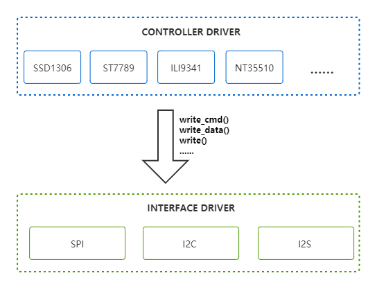
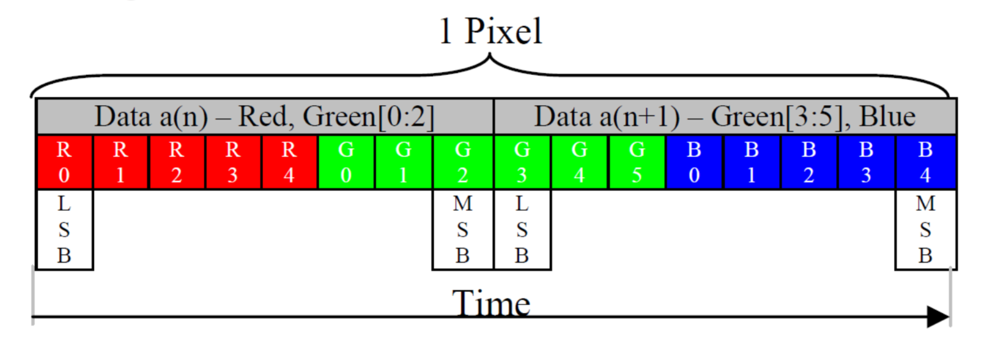
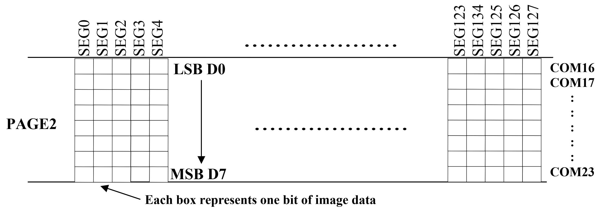
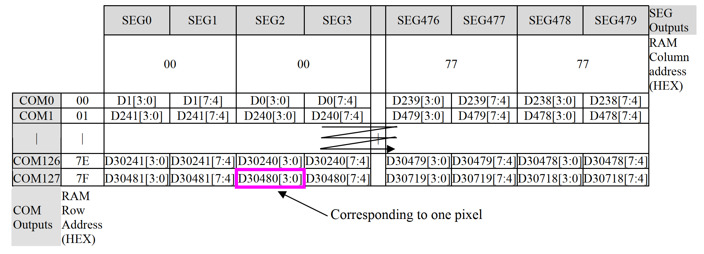
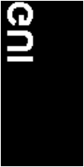
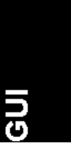
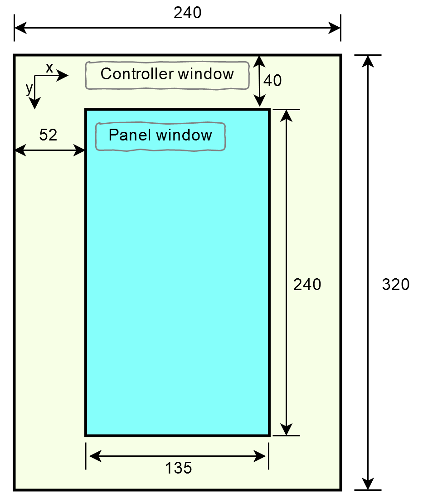
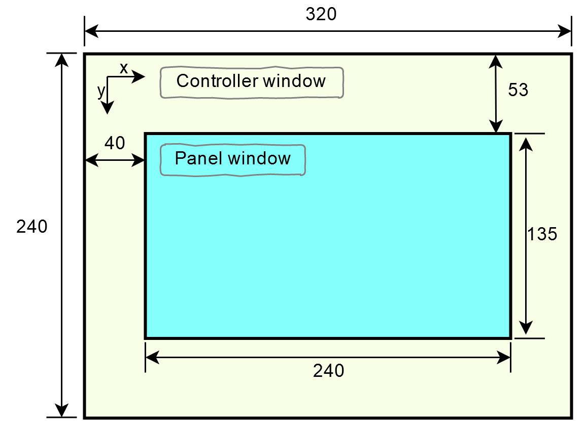

Screen
===========
:link_to_translation:`zh_CN:[中文]`

Screen is a very important display device as many information from various applications needs to be displayed to users. Both ESP32 and ESP32-S2 chips support screens driven by I2C interface, 8080 parallel interface, SPI interface and etc. The supported types of screen controllers are listed in the following table:

+------------+----------------+------------+
| Controller | Max Resolution |    Type    |
+============+================+============+
|  NT35510   |     480 x 865  |   Color    |
+------------+----------------+------------+
|  ILI9806   |     480 x 865  |   Color    |
+------------+----------------+------------+
|  RM68120   |     480 x 865  |   Color    |
+------------+----------------+------------+
|  ILI9486   |     320 x 480  |   Color    |
+------------+----------------+------------+
|  ILI9341   |     240 x 320  |   Color    |
+------------+----------------+------------+
|  ST7789    |     240 x 320  |   Color    |
+------------+----------------+------------+
|  ST7796    |     320 x 480  |   Color    |
+------------+----------------+------------+
|  SSD1351   |     128 x 128  |   Color    |
+------------+----------------+------------+
|  SSD1306   |     128 x 64   |   Mono     |
+------------+----------------+------------+
|  SSD1307   |     128 x 39   |   Mono     |
+------------+----------------+------------+
|  SSD1322   |     480 x 128  |   Gray     |
+------------+----------------+------------+

.. note:: The 8080 parallel interface is implemented via the LCD mode in the I2S of ESP32, so sometimes it is called ``I2S interface`` in this document.

Screen Driver Structure
----------------------------------

   Screen Driver Structure Diagram

In order to be more in line with the actual situation where a screen controller has multiple interfaces, the screen driver is divided into two parts: the ``interface driver`` and the ``controller driver``.

- The interface driver: conduct basic reads and writes of commands and data
- The controller driver: display information on screen via interfaces

A controller driver can be designed to switch between different interfaces in hardware level by calling corresponding interface drivers.

Screen Types
-------------------

A discussion about screen types will help us to have a clear understanding of drivers. Here, we use colors that can be displayed on the screen to classify screens, rather than the panel material of them such as OLED, LCD and etc. In general, the colors displayed on screen determines the BPP (Bits Per Pixel), and the differences in BPP lead to differences in how the program handles it. Here, we list some ways in which GRAM is mapped to pixel points in below:

   BPP = 16 GRAM Structure

   BPP = 1 GRAM Structure

   BPP = 4 GRAM Structure

From above figures, we can see that there are mainly two types of mapping:

- When BPP >= 8, it is usually a color screen that supports RGB888, RGB666, RGB565 and other codings.
- When BPP < 8, it is usually a mono screen that may either be black-and-white or gray.

When BPP < 8, a byte is mapped to multiple pixels, so a single pixel cannot be controlled directly. In this case, :c:func:`draw_pixel` is not supported in the driver, and the parameters of :c:func:`set_window` are also limited. When BPP >= 8, each single pixel can be accessed easily.

.. attention:: For color screens, the driver only supports RGB565 color coding.

Interface Driver
-----------------------

A screen controller usually has multiple interfaces. On ESP32, three kinds of interfaces as ``8080 parallel interface``, ``SPI`` and ``I2C`` are typically used to connect to the screen. You can choose one of them as the interface when creating interface drivers via :c:func:`scr_interface_create`.

.. note:: Please remember to select corresponding parameter types when creating different interfaces using :c:func:`scr_interface_create`, e.g., select :cpp:type:`i2s_lcd_config_t` for I2S interface; select :cpp:type:`scr_interface_spi_config_t` for SPI interface.

To facilitate the use of these interfaces in the driver, all interfaces are defined in :component_file:`display/screen/screen_utility/interface_drv_def.h`, which can be called easily by less parameters.

.. note:: Most screens use big-endian order to store data, while ESP32 uses small-endian mode. You can switch between them in the interface driver you used, based on ``swap_data`` configurations. **Please note:** when using the SPI interface, the received data **must** be stored in RAM because the IDF's SPI driver itself does not support this swapping function and an additional program in the interface driver will do the work, which require the data to be writable.

Controller Driver
----------------------

Some common functions of the screen are abstracted using :cpp:type:`scr_driver_t` in this section according to display and other functions of different screen controllers, in order to port these common functions to different GUI libraries easily. For some non-generic functions of the screen, you need to call its specific functions.

Not all screens have implemented these common functions, since different screen controller has their own functions. For example, for screens with BPP < 8, the function :c:func:`draw_pixel` is not supported. And calling an unsupported function will return :cpp:enumerator:`ESP_ERR_NOT_SUPPORTED`.

Display Direction
^^^^^^^^^^^^^^^^^^^^^^^^^^

The screen display direction set here is implemented entirely by the screen hardware, and this feature varies from one screen controller to another. There are 8 possible display directions. A display can be rotated by 0°, 90°, 180° or 270° and can also be viewed from the top or bottom, with 0° and top view as its default direction. These 8 (4 × 2) directions can also be represented as a combination of 3 binary switches: X-mirroring, Y-mirroring and X/Y swapping.

The total 8 combinations of display directions are listed in the following table. If the direction of your display is not correct, please check the configuration switches below to make it work properly.

==================  ======================  ====================  ===========================
|original|           0                      |mirror_y|             SCR_MIRROR_Y             
                     [SCR_DIR_LRTB]                                [SCR_DIR_LRBT]
------------------  ----------------------  --------------------  ---------------------------
|mirror_x|           SCR_MIRROR_X           |mirror_xy|            SCR_MIRROR_X|             
                     [SCR_DIR_RLTB]                                SCR_MIRROR_Y 
                                                                   [SCR_DIR_RLBT]
------------------  ----------------------  --------------------  ---------------------------
|swap_xy|            SCR_SWAP_XY            |swap_xy_mirror_y|     SCR_SWAP_XY|
                     [SCR_DIR_TBLR]                                SCR_MIRROR_Y  
                                                                   [SCR_DIR_BTLR]
------------------  ----------------------  --------------------  ---------------------------
|swap_xy_mirror_x|   SCR_SWAP_XY|           |swap_xy_mirror_xy|    SCR_SWAP_XY|
                     SCR_MIRROR_X                                  SCR_MIRROR_X|
                     [SCR_DIR_TBRL]                                SCR_MIRROR_Y  
                                                                   [SCR_DIR_BTRL]
==================  ======================  ====================  ===========================

The implementations of display directions are not exactly the same for different screen controllers, and are usually divided into the following cases:

    - For color screens, 8 directions are supported.
    - For mono screens, e.g., SSD1306, only the first 4 directions defined in :cpp:type:`scr_dir_t` are supported, which means they do not support X/Y swapping.

.. note:: 
    The display direction is also related to the screen panel you used, and you may encounter two types of abnormal cases：

    - The display direction is set to :cpp:enumerator:`SCR_DIR_LRTB`, but the screen does not show as what listed in the above table. This may be because the alignment on the screen panel is mirrored in the X/Y direction, in which case you need to adjust the rotation to get the desired direction.
    - After rotated, the screen does not show anything any more. This may be because the resolution of the screen panel is smaller than that of the screen controller, making the display area not falling completely on the screen panel, in which case you need to set a proper offset for the display area.

Offset of the Display Area
^^^^^^^^^^^^^^^^^^^^^^^^^^^^^^^^^^^^

In some small screens, the resolution of the display area is usually smaller than that of the controller window. Please refer to the following figure:

In this figure, ``Controller window`` is the window for screen controller, with its resolution as 240 × 320; ``Panel window`` is the window for screen panel, with its resolution as 135 × 240, which is the display area. From this figure, we can see that the display area is shifted by 52 pixels horizontally and by 40 pixels vertically.

When the screen is rotated 90° anticlockwise, the display area is shifted by 40 pixels horizontally and by 53 pixels vertically, as shown in the figure below:

The screen controller driver will help you to change the offset value automatically according to the rotation of the screen to maintain a proper display. All you need to do is to properly configure the screen offset and the screen panel size in :cpp:type:`scr_controller_config_t` when it is in ``SCR_DIR_LRTB`` direction.

.. note:: 

    - This only supports screens with BPP >= 8.
    - When the resolution of your screen controller is configurable and you find something wrong with the offset, it may be because the selected resolution does not match the actual one, and you should make modifications accordingly, for example, set the ``ILI9806_RESOLUTION_VER`` in ``ili9806.c`` as the actual resolution for ILI9806.

Application Example
--------------------------

Initialize the Screen
^^^^^^^^^^^^^^^^^^^^^^^^^^^^^

.. code:: c

    scr_driver_t g_lcd; // A screen driver
    esp_err_t ret = ESP_OK;

    /** Initialize 16bit 8080 interface */
    i2s_lcd_config_t i2s_lcd_cfg = {
        .data_width  = 16,
        .pin_data_num = {
            1, 2, 3, 4, 5, 6, 7, 8, 9, 10, 11, 12, 13, 14, 15, 16
        },
        .pin_num_cs = 45,
        .pin_num_wr = 34,
        .pin_num_rs = 33,
        .clk_freq = 20000000,
        .i2s_port = I2S_NUM_0,
        .buffer_size = 32000,
        .swap_data = false,
    };
    scr_interface_driver_t *iface_drv;
    scr_interface_create(SCREEN_IFACE_8080, &i2s_lcd_cfg, &iface_drv);

    /** Find screen driver for ILI9806 */
    ret = scr_find_driver(SCREEN_CONTROLLER_ILI9806, &g_lcd);
    if (ESP_OK != ret) {
        return;
        ESP_LOGE(TAG, "screen find failed");
    }

    /** Configure screen controller */
    scr_controller_config_t lcd_cfg = {
        .interface_drv = iface_drv,
        .pin_num_rst = -1,      // The reset pin is not connected
        .pin_num_bckl = -1,     // The backlight pin is not connected
        .rst_active_level = 0,
        .bckl_active_level = 1,
        .offset_hor = 0,
        .offset_ver = 0,
        .width = 480,
        .height = 854,
        .rotate = SCR_DIR_LRBT,
    };

    /** Initialize ILI9806 screen */
    g_lcd.init(&lcd_cfg);

.. note::

    By default, only the driver of ILI9341 screen is enabled. If you need to use other drivers, please go to ``menuconfig -> Component config -> LCD Drivers -> Select Screen Controller`` to enable the corresponding screen drivers.

Display Images
^^^^^^^^^^^^^^^^^^^^

.. code:: c

    /** Draw a red point at position (10, 20) */
    lcd.draw_pixel(10, 20, COLOR_RED);

    /** Draw a bitmap */
    lcd.draw_bitmap(0, 0, width_of_pic, height_of_pic, pic_data);

Obtain Screen Information
^^^^^^^^^^^^^^^^^^^^^^^^^^^^^^^^^^

.. code:: c

    scr_info_t lcd_info;
    lcd.get_info(&lcd_info);
    ESP_LOGI(TAG, "Screen name:%s | width:%d | height:%d", lcd_info.name, lcd_info.width, lcd_info.height);

API Reference
-----------------

.. include:: /_build/inc/screen_driver.inc

.. include:: /_build/inc/scr_interface_driver.inc
