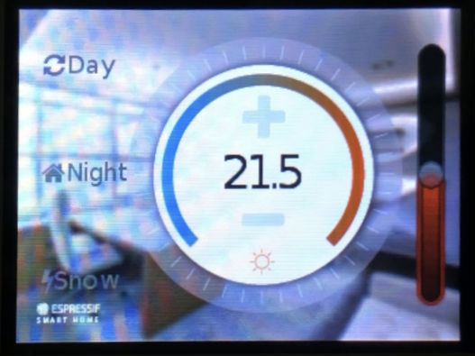
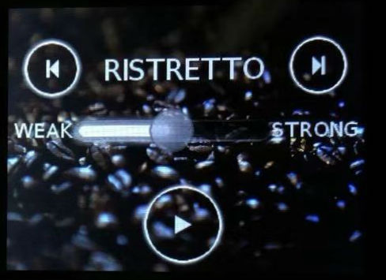
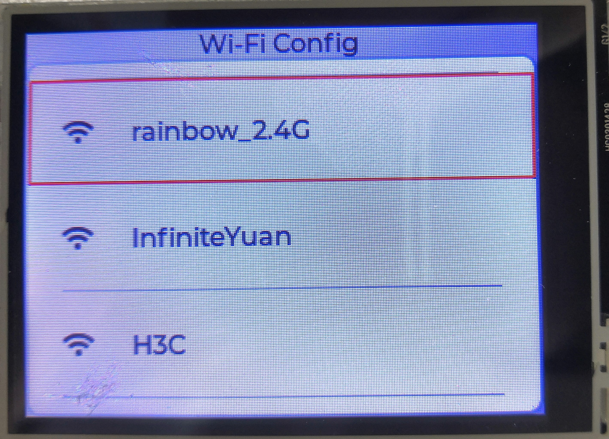
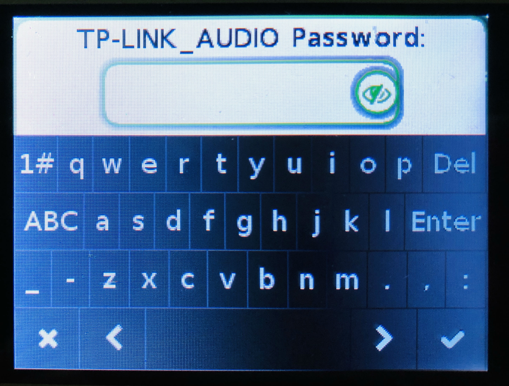

LVGL Graphics Library
========================

:link_to_translation:`zh_CN:[中文]`

`LVGL <https://lvgl.io/>`_ is an open-source free graphics library in C language providing everything you need to create embedded GUI with easy-to-use graphical elements, beautiful visual effects and low memory footprint.

Features
-------------

LVGL has the following features:

- More than 30 powerful, fully customizable widgets, e.g., button, slider, text area, keyboard and so on
- Supports various screens with any resolution
- Simple interface and low memory usage
- Supports multiple input device for the same screen
- Provides various drawing features, e.g., anti-aliasing, polygon, shadow, etc.
- Supports UTF-8 coding, multi language and multi font text
- Supports various image formats, can read images from flash or SD card
- provides online image converter
- Supports Micropython

Requirements
-----------------

The minimum requirements for running LVGL are listed as follows:

- 16, 32 or 64 bit micro-controller or processor
- Clock frequency: > 16 MHz
- Flash/ROM: > 64 kB (180 kB is recommended)
- RAM: 8 kB (24 kB is recommended)
- 1 frame buffer
- Graphics buffer: > "horizontal resolution" pixels
- C99 or newer compiler

Online Tools
---------------

LVGL provides online `Font Converter <https://lvgl.io/tools/fontconverter/>`_ and `Image Converter <https://lvgl.io/tools/imageconverter>`_.

Demo Examples
-----------------

Official Demo
*****************

LVGL provides a demo project of using LVGL on ESP32 in `LVGL project for ESP32 <https://github.com/lvgl/lv_port_esp32/>`_.

On top of that, ESP-IoT-Solution also provides some application examples of using LVGL:

Thermostat
************

A thermostat control interface designed using LVGL:

Please find details of this example in :example:`hmi/lvgl_thermostat`.

Coffee 
************

An interactive interface of a coffee machine designed using LVGL:

Please find details of this example in :example:`hmi/lvgl_coffee`.

Wificonfig
************

When connecting Wi-Fi with ESP32, a Wi-Fi connection interface designed using LVGL can show information of the neighboring Wi-Fi, and you can type in Wi-Fi password on this interface.

Please find details of this example in :example:`hmi/lvgl_wificonfig`.

