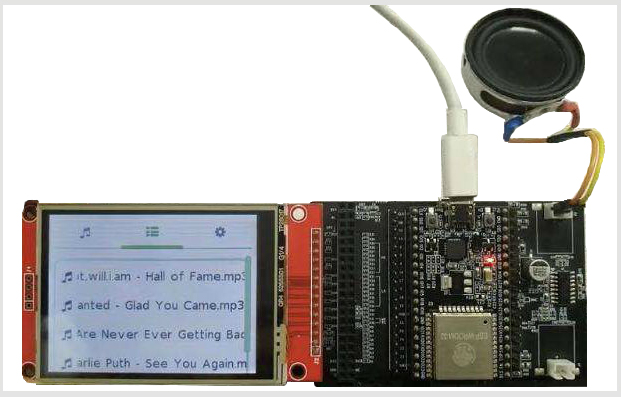

LVGL Graphics Library
======================

:link_to_translation:`zh_CN:[中文]`

`LVGL <https://lvgl.io/>`__ is an open-source graphics library providing everything you need to create embedded GUI with easy-to-use graphical elements, beautiful visual effects and low memory footprint.

Features
-------------

LVGL has following features：

- More than 30 powerful, fully customizable widgets, like Button, Slider, Text area, Keyboard and so on
- Any resolution: from small monochrome displays to Full HD monitors
- Simple interface and low memory usage
- Multiple input device for the same screen
- Various drawing features, like Anti-aliasing, Polygon, Shadow and so on
- UTF-8 support, multi language support, multi font support
- Varius color formats, images can in flash or files (e.g. SD card). Online and offline image converter
- Micropython support

Requirements
-----------------

- 16, 32 or 64 bit microcontroller or processor
- Clock sprrd: > 16 MHz
- Flash/ROM: > 64 kB (180 kB is recommended)
- RAM: 8 kB (24 kB is recommended)
- 1 Frame buffer
- Graphics buffer: > “Horizontal resolution” pixels (1/10 “Screen size” is recommended)
- C99 or newer compiler

Online Tools
---------------

LVGL provides `Online Font Converter <https://lvgl.io/tools/fontconverter/>`__ and `Online Image Converter <https://lvgl.io/tools/imageconverter>`__。

Examples
---------

Official examples
*******************

LVGL provides an ESP32 demo project: `LVGL ESP32 demo <https://github.com/lvgl/lv_port_esp32/>`__

And there are some LVGL examples in ESP-IoT-Solution:

Thermostat
************

An interface of thermostat designed by LVGL:

.. figure:: ../../_static/hmi_solution/littlevgl/thermostat.jpg
   :align: center
   :width: 500

Coffee 
************

An interface of coffee machine:

.. figure:: ../../_static/hmi_solution/littlevgl/lvgl_coffee.jpg
   :align: center
   :width: 500

Wificonfig
************

Use the interface designed by LVGL to connect Wi-fi, you can see the nearby Wi-fi information, input Wi-fi password in screen. 

.. figure:: ../../_static/hmi_solution/littlevgl/lvgl_wificonfig2.jpg
   :align: center
   :width: 500

.. figure:: ../../_static/hmi_solution/littlevgl/lvgl_wificonfig0.jpg
   :align: center
   :width: 500

.. figure:: ../../_static/hmi_solution/littlevgl/lvgl_wificonfig1.jpg
   :align: center
   :width: 500

MP3 Player
**************

Play music by ESP32, LVGL in used in music player interface.

.. figure:: ../../_static/hmi_solution/littlevgl/lvgl_mp3.jpg
   :align: center
   :width: 500

