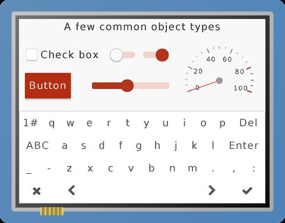

:orphan:

HMI WorkFlow
============

:link_to_translation:`zh_CN:[中文]`

Overview
--------

This document provides a step-by-step guide on how to develop a human
machine interface (HMI) with the ESP32 hardware and software resources.

ESP32 HMI-related Resources
---------------------------

-  Hardware

   -  LCD interface: SPI, I2S
   -  Cache memory: a hardware component that functions as external
      memory

-  Software

   -  μGFX: GUI (Graphical User Interface) library
   -  LittlevGL: GUI (Graphical User Interface) library

ESP32 GUI Library Features
--------------------------

-  Multi-language support
-  Easy-to-be-ported peripheral driver architecture
-  Rich GUI examples
-  UI drawing tools (for μGFX only)
-  PC simulator (for LittlevGL only)

μGFX at a Glance
----------------

-  2D rendering library

   -  Great variety of drawing APIs
   -  bmp/jpeg/png/gif image support
   -  Alpha blending

-  Font-related features

   -  Custom font support
   -  Multi-language support
   -  Anti-aliasing

-  Support for embedded operating systems
-  Recognizable driver interface allows to quickly and easily port the
   LCD driver
-  Provides easy-to-complex examples

   -  Quick-start setup
   -  Helpful in application development

-  Various GUI widgets

   -  Support for custom GUI widgets

μGFX Architecture
~~~~~~~~~~~~~~~~~
.. figure:: ../../_static/hmi_solution/ugfx/500px-Architecture2.png
    :align: center


μGFX Development Steps
~~~~~~~~~~~~~~~~~~~~~~

1. Prepare graphics and font-related files.

2. If you use files outside of
   `esp-iot-solution <https:404>`__,
   you need to convert them to code or to store them in external memory.

3. Design a UI prototype with such software as PS or
   `μGFX-Studio <https://community.ugfx.io/files/file/23-ugfx-studio-beta/>`__.

4. Select the project-specific ESP32 module.

5. Port the `ESP32
   μGFX <https:404/tree/master/components/hmi/ugfx_gui>`__
   library to your project, or port your project-related resources to
   `esp-iot-solution <https:404>`__
   if you choose to use it, and develop related drivers.

6. Develop applications with μGFX-Studio (optional).

7. Develop application code.

8. Debug and run the project.

File preparation
~~~~~~~~~~~~~~~~

1. Graphics

   Convert ``png`` files to ``.h`` files with the command
   ``./file2c -dcs romfs_img_ugfx.png romfs_img_ugfx.h``.

2. Font

   Convert ``*.ttf`` fonts to ``.c`` files with the `online font
   converter <https://ugfx.io/font-converter>`__.

Application development with μGFX-Studio
~~~~~~~~~~~~~~~~~~~~~~~~~~~~~~~~~~~~~~~~

μGFX-Studio has the following features:
-  Compatible with Microsoft Windows
-  Drag'n'drop UI design
-  Allows to create multiple display pages
-  Import your fonts with FontManager
-  Import your images with ImageManager
-  Custom drawing methods

.. figure:: ../../_static/hmi_solution/ugfx/ugfx_studio.jpg
    :align: center


LittlevGL at a Glance
---------------------

-  Fancy built-in themes
-  Outstanding performance

   -  Low memory footprint
   -  Easy implementation of animation effects

-  Anti-aliasing, opacity, and smooth scrolling
-  Recognizable driver interface allows to quickly and easily port the
   LCD driver
-  Various GUI widgets

   -  Support for custom GUI widgets



.. figure:: ../../_static/hmi_solution/littlevgl/lv_theme_intro.png
    :align: center


LittlevGL Architecture
~~~~~~~~~~~~~~~~~~~~~~
.. figure:: ../../_static/hmi_solution/littlevgl/sys.jpg
    :align: center

LittlevGL Development Steps
~~~~~~~~~~~~~~~~~~~~~~~~~~~

1. Prepare graphics and font related files.

2. If you use the files outside of
   `esp-iot-solution <https:404>`__,
   you need to convert them to code or to store them in external memory.

3. Design a UI prototype with such software as PS.

4. Select the project-specific ESP32 module.

5. Port the `ESP32
   LittlevGL <https:404/tree/master/components/hmi/lvgl_gui>`__
   library to your project, or port your project-related resources to
   `esp-iot-solution <https:404>`__
   if you choose to use it, and develop related drivers.

6. Develop applications with the PC simulator (optional).

7. Develop application code.

8. Debug and run the project.

File preparation
~~~~~~~~~~~~~~~~

1. Graphics

   Convert graphics to ``.c`` files with the `online image
   converter <https://littlevgl.com/image-to-c-array>`__.

2. Font

   Convert ``*.ttf`` fonts to ``.c`` files with the `online font
   converter <https://littlevgl.com/ttf-font-to-c-array>`__.

Application development with the LittlevGL simulator
~~~~~~~~~~~~~~~~~~~~~~~~~~~~~~~~~~~~~~~~~~~~~~~~~~~~

The simulator has the following features:

-  Independent hardware abstraction layer (HAL) allows for easy porting
   of the project-related resources to another platform.
-  Compatible with Linux, Windows, and MacOS.
-  Supports the development of the simulator with Eclipse.


Detailed Development Steps
--------------------------

This section uses a mp3 example  to
describe the HMI development steps in more
details（\ `ESP-ADF <https://github.com/espressif/esp-adf>`__ will not
be introduced here).

1. Prepare files.

   There is no need to prepare your own font and graphics files because
   this example uses a default font and built-in symbols.

   -  **Default font**: DejaVu (20 px)
   -  **Built-in symbol**: SYMBOL\_AUDIO, SYMBOL\_LIST, SYMBOL\_SETTINGS,
      SYMBOL\_PREV, SYMBOL\_PLAY, SYMBOL\_NEXT, SYMBOL\_PAUSE

2. Convert the files to code.

   This step can be skipped since no files outside of
   `esp-iot-solution <https:404>`__ are
   used in this example.

3. Design a UI prototype.

   Below is the basic framework for the mp3 example.

   ::

        +---------+---------+---------+     +---------+---------+---------+     +---------+---------+---------+
        |         |         |         |     |         |         |         |     |         |         |         |
        |         |         |         |     |         |         |         |     |         |         |         |
        +---------+---------+---------+     +---------+---------+---------+     +---------+---------+---------+
        |                             |     |                             |     |                             |
        |       +-------------+       |     | +-------------------------+ |     |            +--------+       |
        |       |             |       |     | +-------------------------+ |     | +-------+                   |
        |       +-------------+       |     |                             |     | |       |  +--------+       |
        |                             |     | +-------------------------+ |     | +-------+                   |
        |    +--+    +---+    +--+    |     | +-------------------------+ |     |            +--------+       |
        |    |  |    |   |    |  |    |     |                             |     |                             |
        |    +--+    +---+    +--+    |     | +-------------------------+ |     |                             |
        |                             |     | |-------------------------| |     |                             |
        +-----------------------------+     +-----------------------------+     +-----------------------------+

        +--------Song-playing Interface-----------+     +-----------Song-selecting Interface--------+     +-----------Setting Interface-----------+ 

   As shown above, the UI prototype consists of three interfaces. You can
   switch between them by tapping on the corresponding buttons at the top.

   - **Song-playing interface**: displays the name of the currently selected mp3 file; the bottom row has three buttons - the previous song, play/pause, next song.

      - **Song-selecting interface**: shows the list of all mp3 files on the inserted SD-Card with a music symbol in front of each file.

      - **Setting interface**: displays the available settings; only the *theme* setting is supported currently.

4. Select the project-specific ESP32 module.

   As the LittlevGL GUI library requires minimum memory, you can select the
   `ESP-WROOM32 <https://docs.espressif.com/projects/esp-idf/en/stable/hw-reference/modules-and-boards.html#esp32-wroom-32>`__
   module and mount it on the `ESP32
   DevKitC <https://docs.espressif.com/projects/esp-idf/en/stable/hw-reference/modules-and-boards.html#esp32-devkitc-v4>`__
   development board.

5. Port the `ESP32
   LittlevGL <https:404/tree/master/components/hmi/lvgl_gui>`__
   library to your project, or port your project-related resources to
   `esp-iot-solution <https:404>`__
   if you choose to use it, and develop related drivers.

   The mp3 example is built with
   `esp-iot-solution <https:404>`__ to
   which LittlevGL GUI has already been ported. Similarly, there is no need
   to port screen drivers, as
   `esp-iot-solution <https:404>`__
   already includes the drivers for the external screens used in this
   example:

-  ILI9341 display screen (2.8 inches, 240x320 pixels)
-  XPT2046 touchscreen

In case you use other displays, you have to develop your own drivers
accordingly.

6. Develop applications with a PC simulator (optional).

   The LittlevGL PC simulator is not used in this example. If you want to
   use it, please refer to `PC Simulator <https://docs.littlevgl.com/#PC-simulator>`__.

7. Develop application code.

   .. note::
       This section focuses on the HMI-related development. Other
       related peripherals, such as DAC-Audio, SD-Card, are not covered
       here.

   -  A :doc:`tableview <littlevgl_guide>` is perfect for switching between the three interfaces by clicking on the corresponding buttons. For this, add three tabs in tabview and assign a symbol to each tab. 
      ::

          /* Initialize LittlevGL GUI along with the related display and touchscreens */
          lvgl_init();


          /* Set the current theme */
          lv_theme_t *th = lv_theme_zen_init(100, NULL);
          lv_theme_set_current(th);

          /* Create a tabview */ 
          v_obj_t *tabview = lv_tabview_create(lv_scr_act(), NULL);

          /* Add tabs and assign symbols to them */ 
          lv_obj_t *tab1 = lv_tabview_add_tab(tabview, SYMBOL_AUDIO); 
          lv_obj_t *tab2 = lv_tabview_add_tab(tabview, SYMBOL_LIST); 
          lv_obj_t *tab3 = lv_tabview_add_tab(tabview, SYMBOL_SETTINGS);

   -  Song-playing interface： Labels and buttons can be used here;
      they can be managed by a A :doc:`container <littlevgl_guide>`：
      ::

          /* Create a container */
          lv_obj_t *cont = lv_cont_create(tab1, NULL);

          /* Set the container size */
          lv_obj_set_size(cont, LV_HOR_RES - 20, LV_VER_RES - 85);
          lv_cont_set_fit(cont, false, false);

      -  A :doc:`label <littlevgl_guide>` can be used to display the name of the currently played song. Set the label to update the name when a new song starts to play.

         ::

            /* Create a label */
            lv_obj_t *current_music = lv_label_create(cont, NULL);
             /* Set label long mode */
             lv_label_set_long_mode(current_music, LV_LABEL_LONG_ROLL);

             /* Set the label position, size and alignment  */
             lv_obj_set_pos(current_music, 50, 20);
             lv_obj_set_width(current_music, 200);
             lv_obj_align(current_music, cont, LV_ALIGN_IN_TOP_MID, 0, 20); /* Align to LV_ALIGN_IN_TOP_MID */

             /* Set the text to be displayed by the label */
             lv_label_set_text(current_music, "mp3 file name");
             ```

      -  Related buttons:

         ::

             /* Symbols */
             void *img_src[] = {SYMBOL_PREV, SYMBOL_PLAY, SYMBOL_NEXT, SYMBOL_PAUSE};

             /* Create 3 buttons */
             for (uint8_t i = 0; i < 3; i++) {
               button[i] = lv_btn_create(cont, NULL);

             /* Set the button size*/
             lv_obj_set_size(button[i], 50, 50);

             /* Create the button-related images */
             img[i] = lv_img_create(button[i], NULL);

             /* Set the symbols to be displayed */
             lv_img_set_src(img[i], img_src[i]);

             }

             /* Set the button position and alignment */
             lv_obj_align(button[0], cont, LV_ALIGN_IN_LEFT_MID, 35, 20);
             for (uint8_t i = 1; i < 3; i++) {
               lv_obj_align(button[i], button[i - 1], LV_ALIGN_OUT_RIGHT_MID, 40, 0);
             }

             /*  Assign actions to the buttons */
             lv_btn_set_action(button[0], LV_BTN_ACTION_CLICK, audio_next_prev);
             lv_btn_set_action(button[1], LV_BTN_ACTION_CLICK, audio_control);
             lv_btn_set_action(button[2], LV_BTN_ACTION_CLICK, audio_next_prev);

   -  Song-selecting interface：Use a
      `list <littlevgl/littlevgl_guide_en.md#list-lv_list>`__ to display
      the names of MP3 files.
      ::

          /* Create a list and set its size */
             lv_obj_t *list = lv_list_create(tab2, NULL);
          lv_obj_set_size(list, LV_HOR_RES - 20, LV_VER_RES - 85);

          /* Add list items and assign symbols and actions to them */
          for (uint8_t i = 0; i < filecount; i++) {
            list_music[i] = lv_list_add(list, SYMBOL_AUDIO, "MP3 文件名称", play_list);
          }

   -  Setting interface**: use a label to display the setting-related
      text and a
      `roller <littlevgl/littlevgl_guide_en.md#roller-lv_roller>`__ to
      display all the setting options.
      
      ::

          /* Create a label and set the text to be displayed */
          lv_obj_t *theme_label = lv_label_create(tab3, NULL);
          lv_label_set_text(theme_label, "Theme:");

          /* Create a roller and set its alignment */
          lv_obj_t *theme_roller = lv_roller_create(tab3, NULL);
          lv_obj_align(theme_roller, theme_label, LV_ALIGN_OUT_RIGHT_MID, 20, 0);

          /* Add options, set the number of visible options, and assign actions */
          lv_roller_set_options(theme_roller, "Night theme\nAlien theme\nMaterial theme\nZen theme\nMono theme\nNemo theme");
          lv_roller_set_selected(theme_roller, 1, false);
          lv_roller_set_visible_row_count(theme_roller, 3);
          lv_ddlist_set_action(theme_roller, theme_change_action);

    -  Related actions：

      ::

       /* Play/pause action */
       static lv_res_t audio_control(lv_obj_t *obj)
        {
            /* Change the related images */
            play ? lv_img_set_src(img[1], img_src[1]) : lv_img_set_src(img[1], img_src[3]);
            play = !play;
            return LV_RES_OK;
        }

        /* Previous/next action */
        static lv_res_t audio_next_prev(lv_obj_t *obj)
        {
            if (obj == button[0]) {
                // prev song

                /* Change the related images */
                lv_img_set_src(img[1], img_src[3]);

                /* Set the text to be displayed by the label  */
                lv_label_set_text(current_music, "mp3 file name");
                play = true;
            } else if (obj == button[1]) {
            } else if (obj == button[2]) {
                // next song

                /* Change the related images */
                lv_img_set_src(img[1], img_src[3]);

                /* Set the text to be displayed by the label  */
                lv_label_set_text(current_music, "mp3 file name");
                play = true;
            }
            return LV_RES_OK;
        }

        /* Song-selecting action */
        static lv_res_t play_list(lv_obj_t *obj)
        {
            for (uint8_t i = 0; i < MAX_PLAY_FILE_NUM; i++) {
                if (obj == list_music[i]) {

                    /* Change the related images */
                    lv_img_set_src(img[1], img_src[3]);

                    /* Set the text to be displayed by the label  */
                    lv_label_set_text(current_music, "mp3 file name");
                    play = true;
                    break;
                }
            }
            return LV_RES_OK;
        }

        /* Theme-selecting action */
        static lv_res_t theme_change_action(lv_obj_t *roller)
        {
            lv_theme_t *th;
            /* Switch theme */
            switch (lv_ddlist_get_selected(roller)) {
            case 0:
                th = lv_theme_night_init(100, NULL);
                break;

            case 1:
                th = lv_theme_alien_init(100, NULL);
                break;

            case 2:
                th = lv_theme_material_init(100, NULL);
                break;

            case 3:
                th = lv_theme_zen_init(100, NULL);
                break;

            case 4:
                th = lv_theme_mono_init(100, NULL);
                break;

            case 5:
                th = lv_theme_nemo_init(100, NULL);
                break;

            default:
                th = lv_theme_default_init(100, NULL);
                break;
            }
            lv_theme_set_current(th);
            return LV_RES_OK;
        }

8. Debug and run the project

   Build the project, and download it to your device. After that, run the project on your device and document any possible issues as a reference to modify the code and debug the project.

Summary
-------

-  ESP32 offers the following features for UI development:

   -  Powerful CPU and a great variety of peripheral interfaces
   -  Two GUI libraries for developers: μGFX and LittlevGL

-  The areas in which the ESP32 UI design solution can be widely used
   include, but are not limited to:

   -  Portable or wearable electronic products
   -  Smart buildings and industrial controllers
   -  Smart home appliances
   -  Personal and public medical care devices
   -  In-car electronics


