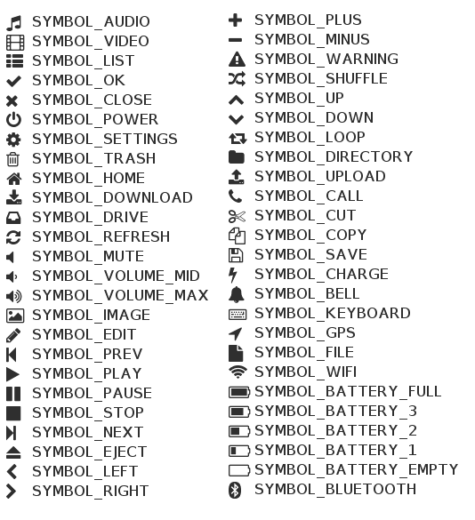
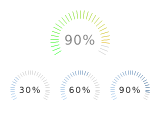
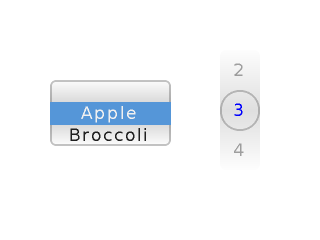

:orphan:

LittlevGL Guide
===============

:link_to_translation:`zh_CN:[中文]`

Overview
--------

`LittlevGL <https://littlevgl.com/>`__ is a free and open-source
graphics library, providing everything you need to create embedded GUI
with easy-to-use graphical elements, beautiful visual effects, and low
memory footprint. It is also a complete graphics framework, which
exempts you from drawing your own primitive shapes. Graphical user
interfaces can be built from easy-to-use blocks instead, such as
buttons, charts, images, lists, sliders, switches, keyboard and so on.

LittlevGL has the following features:

-  Powerful building blocks: buttons, charts, lists, sliders, images,
   etc.
-  Advanced graphical effects: animations, anti-aliasing, opacity,
   smooth scrolling, etc.
-  Supports various input devices: touchpad, mouse, keyboard, encoder,
   etc.
-  Multi-language support: UTF-8 encoding
-  Fully customizable graphical elements
-  Supports all kinds of microcontrollers and displays (hardware
   independent)
-  Highly Scalable: can operate with the minimum memory (80 KB Flash，10
   KB RAM)
-  Supports OS, External memory and GPU (optional)
-  Single frame buffer operation with the same advanced graphical
   effects
-  Written in C for maximum compatibility (C++ compatible)
-  Simulator: supports embedded GUI design on PC without embedded
   hardware

Using with an operating system
----------------------------------

LittlevGL is not thread-safe. Despite it, it's quite simple to use
LittlevGL inside an operating system.

The simple scenario is to don't use the operating system's tasks but use
``lv_tasks``. An ``_lv_task_`` is a function called periodically in
``lv_task_handler``. In the ``_lv_task_`` you can get the state of the
sensors, buffers etc and call LittlevGL functions to refresh the GUI. To
create an ``_lv_task_`` use:
``lv_task_create(my_func, period_ms, LV_TASK_PRIO_LOWEST/LOW/MID/HIGH/HIGHEST, custom_ptr)``

If you need to use other task or threads you need one mutex which should
be taken before calling ``lv_task_handler`` and released after it. In
addition, you have to use to that mutex in other tasks and threads
around every LittlevGL (``lv_...``) related code. This way you can use
LittlevGL in a real multitasking environment. Just use a mutex to avoid
concurrent calling of LittlevGL functions.

Contents
--------

-  `Graphical Objects <#graphical-objects>`__

   -  Object Attributes
   -  Object's Working Mechanisms
   -  Create/delete Objects
   -  Layers

-  `Styles <#styles>`__

   -  Style Properties
   -  Using Styles
   -  Built-in Styles
   -  Style Animations
   -  Style Example
   -  Themes

-  `Colors <#colors>`__
-  `Fonts <#fonts>`__

   -  Built-in Fonts
   -  Unicode Support
   -  Symbol Fonts
   -  Add New Font

-  `Animations <#animations>`__
-  `Input devices <#input-devices>`__
-  `Object group <#object-group>`__
-  `Drawing and rendering <#drawing-and-rendering>`__

   -  Buffered and Unbuffered Drawing
   -  Anti-aliasing

Graphical Objects
~~~~~~~~~~~~~~~~~

In the Littlev Graphics Library, the basic building blocks of a user
interface are objects. For example:

-  Button
-  Label
-  Image
-  List
-  Chart
-  Text area

`Click to check all the existing object types. <https://lvgl.io/demos>`__

Object Attributes
^^^^^^^^^^^^^^^^^

1. Basic attributes

   The objects have the following basic attributes which are independent of
   object types: - Position - Size - Parent - Drag enable - Click enable,
   etc.

2. Specific attributes

   Each object type has its specific attributes.

   For example a slider has the following attributes: - Min. and max.
   values - Current value - Callback function for new value set - Styles

Object's Working Mechanisms
^^^^^^^^^^^^^^^^^^^^^^^^^^^

-  Parent-child structure

   A parent can be thought of as a container for its children. Each object
   has only one parent object (except screens), but a parent object can
   have an unlimited number of children.

-  Screen

   A screen is a special object which does not have a parent object. By
   default, LittlevGL creates and loads one screen. To get the currently
   active screen, use the function ``lv_scr_act()``. A screen can be
   created with any object type.

-  Moving together

   If the position of a parent is changed, its children will move with the
   parent. Therefore, all positions are relative to a parent. So the (0,0)
   coordinates mean that the objects will remain in the top left-hand
   corner of a parent, regardless of the position of a parent.

.. figure:: ../../_static/hmi_solution/littlevgl/par_child1.jpg
    :align: center
    :alt: Figure 1. Moving together

-  Visibility only on a parent

   If a child is partially or totally out of its parent borders, its
   outside parts will not be visible.

.. figure:: ../../_static/hmi_solution/littlevgl/par_child3.jpg
    :align: center
    :alt: Figure 2. Visibility only on a parent

Create/delete Objects
^^^^^^^^^^^^^^^^^^^^^

In LittlevGL, objects can be created and deleted dynamically during its
run-time. It means that only the currently existing objects consume RAM.
For example, if you need a chart you can create it at the moment when it
is required and delete the chart after it is used.

Every object type has its own *Create* function with a unified
prototype.

Parameters:

-  Pointer to the parent object
-  Pointer to another object with the same type (optional)

If the optional parameter is not NULL, then the object to which it
points will be copied to the new object.

To create a screen, set the pointer to the parent as NULL. The return
value of the *Create* function is a pointer to the created object.
Regardless of the object type, a common variable type ``lv_obj_t`` is
used. This returned pointer can be used later to set or get the
attributes of the object.

The *Create* function looks as follows:
``lv_obj_t * lv_type_create(lv_obj_t * parent, lv_obj_t * copy);``

There is a common *Delete* function for all object types:

-  To delete the object and its children, use the function
   ``void lv_obj_del(lv_obj_t * obj);``
-  To delete only the children of an object, but leave the object itself
   'alive', use the function ``void lv_obj_clean(lv_obj_t * obj);``

Layers
^^^^^^

The first created object (and its children) will be drawn first. The
last created object, belonging to the same parent, will be drawn over
its siblings. This is how the order for the objects - 'siblings' - on
the same level is calculated.

For example, layers can be added by creating two objects (which can be
transparent): 'A' and then 'B'. Object 'A' and any other objects on it
will be covered by 'B' and its children.

.. figure:: ../../_static/hmi_solution/littlevgl/par_child4.jpg
    :align: center
    :alt: Figure 3. Layers

Styles
~~~~~~

Styles can be used to set the appearance of an object. A style is a
structure variable with such attributes as colors, paddings and
visibility.

There is a common style type: ``lv_style_t``. By setting the fields of
the ``lv_style_t`` structure, you can change the appearance of the
objects which use that style.

Style Properties
^^^^^^^^^^^^^^^^

A style has five main parts:

-  common
-  body
-  text
-  image
-  line

An object uses fields related to its type. For example, lines do not use
``letter_space``.

To see which fields are used by an object type, please refer to the
`documentation <https://lvgl.io/demos>`__.

The fields of a style structure are as follows:

-  Common properties

   -  **glass 1**: Do not inherit this style. Using this property for a
      transparent style allows children to use any other styles except
      for the transparent style

-  Body style properties, used by rectangle-like objects:

   -  **body.empty**: Do not fill the rectangle (just draw boarder
      and/or shadow)
   -  **body.main\_color**: Main color
   -  **body.grad\_color**: Gradient color
   -  **body.radius**: Corner radius
   -  **body.opa**: Opacity
   -  **body.border.color**: Border color
   -  **body.border.width**: Border width
   -  **body.border.part**: The border is to be
      added(\ ``LV_BORDER_LEFT/RIGHT/TOP/BOTTOM/FULL``)
   -  **body.border.opa**: Border opacity
   -  **body.shadow.color**: Shadow color
   -  **body.shadow.width**: Shadow width
   -  **body.shadow.type**: Shadow type
   -  **body.padding.hor**: Horizontal padding
   -  **body.padding.ver**: Vertical padding
   -  **body.padding.inner**: Inner padding

-  Text style properties, used by objects which show text:

   -  **text.color**: Text color
   -  **text.font**: Text font
   -  **text.opa**: Text opacity
   -  **text.letter\_space**: Letter space
   -  **text.line\_space**: Line space

-  Image style properties, used by image objects or icons on objects:

   -  **image.color**: Color for image re-coloring based on the pixel
      brightness
   -  **image.intense**: Re-color intensity
   -  **image.opa**: Image opacity

-  Line style properties, used by the objects containing lines or
   link-like elements:

   -  **line.color**: Line color
   -  **line.width**: Line width
   -  **line.opa**: Line opacity

Using Styles
^^^^^^^^^^^^

Every object type has a unique function for setting its styles. The
styles and the style properties used by an object type are described in
the `documentation <https://lvgl.io/demos>`__.

If an object has only one state, such as a label, the function
``lv_label_set_style(label1, &style)`` can be used to set a style.

If an object has more than one state, such as a button which has 5
states with one style for each state, the function
``lv_btn_set_style(obj，LV_BTN_STYLE _...，＆rel_style)`` can be used to
set a new style.

If the style of an object is NULL, then its style will be inherited from
the style of its parent.

If you modify a style which is used by one or more objects, the objects
have to be notified of the style change. You have two options to do
that:

::

    void lv_obj_refresh_style(lv_obj_t * obj);      /*Notify an object of the style modification*/
    void lv_obj_report_style_mod(void * style);     /*Notify all object of the style modification. Use NULL to notify all objects*/

Built-in Styles
^^^^^^^^^^^^^^^

There are several built-in styles in the LittlevGL library:

.. figure:: ../../_static/hmi_solution/littlevgl/style-built-in.jpg
    :align: center
    :alt: Figure 4. Built-in styles

As the figure above shows, there are various styles for screens and
buttons:

-  Plain style
-  Pretty style
-  Transparent style

The styles ``lv_style_transp``, ``lv_style_transp_fit``, and
``lv_style_transp_tight`` differ only in paddings: for
``lv_style_transp_tight``, all paddings are zero, for
``lv_style_transp_fit``, only ``hor`` and ``ver`` paddings are zero.

The built-in styles are global ``lv_style_t`` variables, so you can use
them as follows:
``lv_btn_set_style(obj，LV_BTN_STYLE_REL，＆lv_style_btn_rel)``.

You can modify the built-in styles or create new styles. When creating
new styles, it is recommended to base them on the built-in styles to
ensure that all fields are initialized with a proper value. The function
``lv_style_copy(＆dest_style，＆src_style)`` can be used to copy styles.

Animations Style
^^^^^^^^^^^^^^^^

You can animate styles using the function
``lv_style_anim_create(＆anim)``.

Before calling this function, you have to initialize the variable
``lv_style_anim_t``. There will be an animated transition from
``style_1`` to ``style_2``.

Style Example
^^^^^^^^^^^^^

The example below demonstrates the style usage.

.. figure:: ../../_static/hmi_solution/littlevgl/style-example.jpg
    :align: center
    :alt: Figure 5.Style example

::

    /*Create a style*/
    static lv_style_t style1;
    lv_style_copy(&style1, &lv_style_plain);    /*Copy a built-in style to initialize a new style*/
    style1.body.main_color = LV_COLOR_WHITE;
    style1.body.grad_color = LV_COLOR_BLUE;
    style1.body.radius = 10;
    style1.body.border.color = LV_COLOR_GRAY;
    style1.body.border.width = 2;
    style1.body.border.opa = LV_OPA_50;
    style1.body.padding.hor = 5;            /*Horizontal padding, used by the bar indicator below*/
    style1.body.padding.ver = 5;            /*Vertical padding, used by the bar indicator below*/
    style1.text.color = LV_COLOR_RED;

    /*Create a simple object*/
    lv_obj_t *obj1 = lv_obj_create(lv_scr_act(), NULL);
    lv_obj_set_style(obj1, &style1);                        /*Apply the created style*/
    lv_obj_set_pos(obj1, 20, 20);                           /*Set the position*/

    /*Create a label on the object. The label's style is NULL by default*/
    lv_obj_t *label = lv_label_create(obj1, NULL);
    lv_obj_align(label, NULL, LV_ALIGN_CENTER, 0, 0);       /*Align the label to the middle*/

    /*Create a bar*/
    lv_obj_t *bar1 = lv_bar_create(lv_scr_act(), NULL);
    lv_bar_set_style(bar1, LV_BAR_STYLE_INDIC, &style1);    /*Modify the indicator's style*/
    lv_bar_set_value(bar1, 70);                             /*Set the bar's value*/

Themes
^^^^^^

A theme is a style collection which contains the required styles for
every object type. For example, 5 styles for buttons to describe their 5
possible states. Check the `available themes <https://littlevgl.com/themes>`__.

In technical terms, a theme is a structure variable which contains
multiple ``lv_style_t *`` fields.

For example, the style collection for buttons is as follows:

::

    theme.btn.rel       /*Released button style*/
    theme.btn.pr        /*Pressed button style*/
    theme.btn.tgl_rel   /*Toggled released button style*/
    theme.btn.tgl_pr    /*Toggled pressed button style*/
    theme.btn.ina       /*Inactive button style*/

A theme can be initialized by ``lv_theme_xxx_init(hue，font)``, where

-  ``xxx``: Name of the theme
-  ``hue``: Hue value from ``HSV`` color space (0..360)
-  ``font``: Theme font (use ``NULL`` for the default
   ``LV_FONT_DEFAULT`` font)

Colors
~~~~~~

The color module handles all color related functions, such as changing
color depths, creating colors from hex code, converting between
different color depths, mixing colors, etc.

The following variable types are defined by the color module:

-  ``lv_color1_t``: Stores monochrome color. For compatibility, it also
   has R, G, B fields, but they are always the same (1 byte).
-  ``lv_color8_t``: A structure to store R (3 bit), G (3 bit), B (2 bit)
   components for 8 bit colors (1 byte).
-  ``lv_color16_t``: A structure to store R (5 bit), G (6 bit), B (5
   bit) components for 16 bit colors (2 bytes).
-  ``lv_color24_t``: A structure to store R (8 bit), G (8 bit), B (8
   bit) components for 24 bit colors (4 bytes).
-  ``lv_color_t``: Equal to color ``color1/8/16/24_t``, according to the
   color depth settings.
-  ``lv_color_int_t``: ``uint8_t``, ``uint16_t`` or ``uint32_t``
   according to the color depth setting. Used to build color arrays from
   plain numbers.
-  ``lv_opa_t``: A simple ``uint8_t`` type is used to describe opacity.

The ``lv_color_t``, ``lv_color1_t``, ``lv_color8_t``, ``lv_color16_t``
and ``lv_color24_t`` types have four fields:

-  ``red``: Red channel
-  ``green``: Green channel
-  ``blue``: Blue channel
-  ``red + green + blue``

You can set the current color depth in ``lv_conf.h`` by setting the
``LV_COLOR_DEPTH`` definition to 1 (monochrome), 8, 16 or 24.

To describe opacity, the ``lv_opa_t`` type is created as a wrapper for
``uint8_t``:

-  ``LV_OPA_TRANSP``: Value 0, means the color is fully transparent
-  ``LV_OPA_10``: Value 25, means the color is slightly translucent
-  ``LV_OPA_20~OPA_80``: means the color is translucent
-  ``LV_OPA_90``: Value 229, means the color is almost opaque
-  ``LV_OPA_COVER``: Value 255, means the color is opaque

Fonts
~~~~~

In LittlevGL, fonts are bitmaps and other descriptors to store the
images of the letters (glyph) and other font-related information. A font
is stored in the variable ``lv_font_t`` and can be set in the style
field ``text.font``.

Fonts have the bpp (Bit-Per-Pixel) property, which shows how many bits
are used for a pixel in a font. This property also stores an opacity
value for a pixel. Due to this, letters can be displayed smoothly and
evenly, especially on the edges. The possible bpp values are 1, 2, 4 and
8 (higher value gives better quality). The bpp property also affects the
required font storage memory. For example, bpp=4 requires four times as
much storage memory as compared to bpp=1.

Built-in Fonts
^^^^^^^^^^^^^^

There are several built-in fonts, which can be enabled by
``USE_LV_FONT _...`` defined in ``lv_conf.h``. These built-in fonts come
in different sizes:

-  10 px
-  20 px
-  30 px
-  40 px

You can enable the fonts with the bbp values of 1, 2, 4 or 8 (e.g.
``USE_LV_FONT_DEJAVU_20 4``).

The built-in fonts have multiple character sets in each size:

-  ASCII (Unicode 32..126)
-  Latin supplement (Unicode 160..255)
-  Cyrillic (Unicode 1024..1279)

The built-in character sets use the *Dejavu* font. These character sets
are global variables with the following names:

-  ``lv_font_dejavu_20``: 20 px, ASCII font
-  ``lv_font_dejavu_20_latin_sup``: 20 px, Latin supplement font
-  ``lv_font_dejavu_20_cyrillic``: 20 px, Cyrillic font

Unicode Support
^^^^^^^^^^^^^^^

LittlevGL supports ``Unicode`` letters from ``UTF-8`` coded characters.
Configure the editor that you use to save your code/text as ``UTF-8``,
and enable ``LV_TXT_UTF8`` in ``lv_conf.h``. Otherwise, only ``ASCII``
fonts and symbols can be used (see the symbols below).

You can assign more fonts to create a larger character-set. To do this,
please choose a base font (typically an ASCII font) and add the
extensions to it: ``lv_font_add(child, parent)``. The built-in fonts are
already added to the same sized ASCII font.

For example, if ``USE_LV_FONT_DEJAVU_20`` and
``USE_LV_FONT_DEJAVU_20_LATIN_SUP`` are enabled in ``lv_conf.h``, the
"abcÁÖÜ" text can be rendered when using ``lv_font_dejavu_20``.

Symbol Fonts
^^^^^^^^^^^^

The symbol fonts are special fonts which contain symbols instead of
letters. There are built-in symbol fonts as well and they are also
assigned to the ``ASCII`` font with the same size. In a text, a symbol
can be referenced as ``SYMBOL_LEFT``, ``SYMBOL_RIGHT``, etc. You can mix
these symbol names with strings, such as
``lv_label_set_text(label1，“Right”SYMBOL_RIGHT);``. A symbol can be
used without ``UTF-8`` support as well.

The list below shows the available symbols:

Add New Font
^^^^^^^^^^^^

If you want to add a new font to the library, you can use the `online
font converter tool <https://littlevgl.com/ttf-font-to-c-array>`__. It
can create a C array from a TTF file, which then can be copied to your
project. You can specify the height, the range of characters and the bpp
property. Optionally you can enumerate the characters to include them
only into the final font. To use the generated font, please declare it
with the function ``LV_FONT_DECLAER(my_font_name)``.

Animations
~~~~~~~~~~

You can periodically change the animation value for a variable using an
animator function with the prototype
``void func(void * var, int32_t value)``. The animation can be created
by repeatedly calling the animator function with the corresponding
parameters.

For this, you need to initialize the variable ``lv_anim_t`` (there is a
template in ``lv_anim.h``).

You can determine the path of animation. In most simple cases, the
current value is changed back and forth within a set range linearly.

At present, there are two built-in paths:

-  ``lv_anim_path_linear``: linear animation
-  ``lv_anim_path_step``: change at the final step

By default, you can set the animation time. The function
``lv_anim_speed_to_time(speed, start, end)`` can be used to calculate
the required time in milliseconds to reach the end value from a start
value with the given speed. For example,
``anim_speed_to_time(20, 0, 100)`` will result in 5,000 milliseconds.

You can simultaneously apply different animations to the same variable.
But only one animation can exist with a given variable and a function
pair (one for changing the animation-related variable, the other is for
applying the changes).

To delete an animated variable and its animator function please use the
function ``lv_anim_del(var, func)``.

Input Devices
~~~~~~~~~~~~~

In order to interact with objects, input devices, such as a touchpad,
mouse, keyboard, or encoder, are required. When you register an input
device driver, LittlevGL appends more detailed information about the
state of the input device.

When an input device is used, e.g., a button click occurs, an action
(callback) function is triggered. You can gain access to that input
device with the function ``lv_indev_t * indev = lv_indev_get_act()``.

Object Group
~~~~~~~~~~~~

If there is no touchpad or mouse available, grouping provides a solution
for easier control and navigation among objects by using keyboards,
keypads, hardware buttons or the encoder.

For this, use the following functions:

-  ``lv_groupt_t *group = lv_group_create()``: create an object group
-  ``lv_group_add_obj(group, obj)``: add objects to the group

In a group, there is always a focused (active) object, which will be
notified of all the current actions.

To navigate among the objects in a group, in other words to change
focused objects, and interact with them, a ``LV_INDEV_TYPE_KEYPAD`` type
input device is required. The device's read function notifies LittlevGL
of actions, such as pressing or releasing a key. Also, you have to
assign the group to the input device with the function
``lv_indev_set_group(indev, group)``.

There are some special control characters which can be used in the
*Read* function:

-  ``LV_GROUP_KEY_NEXT``: Focus on the next object
-  ``LV_GROUP_KEY_PREV``: Focus on the previous object
-  ``LV_GROUP_KEY_UP``: Increment the value, move up (select an upper
   list element) or click the focused object
-  ``LV_GROUP_KEY_DOWN``: Decrement the value, move down on the focused
   object (select a lower list element)
-  ``LV_GROUP_KEY_RIGHT``: Increment the value of the focused object or
   click the focused object
-  ``LV_GROUP_KEY_LEFT``: Decrement the value of the focused object
-  ``LV_GROUP_KEY_ENTER``: Click the focused object or a selected
   element (e.g. list element)
-  ``LV_GROUP_KEY_ESC``: Close the focused object (e.g. drop down list)

The style of the focused object is modified by a function. By default,
it highlights the focused object in orange, but you can specify your own
style update function in each group with the function
``void lv_group_set_style_mod_cb(group, style_mod_cb)``. The
``style_mod_cb`` needs the parameter ``lv_style_t *`` which is a copy of
the focused object's style. In the callback, you can mix other colors
with the current ones and modify parameters, but you are not allowed to
set attributes modifying the size, such as letter\_space, padding, etc.

Drawing and Rendering
~~~~~~~~~~~~~~~~~~~~~

In LittlevGL, you can fully focus on graphical objects and not bother
with how drawing happens. You can set the size, position, any attribute
of an object, LittlevGL will redraw it accordingly. However, you need to
get familiar with the basic drawing methods to find out which of the
following methods is most suitable for you.

Buffered and Unbuffered Drawing
^^^^^^^^^^^^^^^^^^^^^^^^^^^^^^^

1. Unbuffered drawing

   The unbuffered drawing method puts the pixels directly on the display
   (frame buffer). Therefore, during the drawing process, some flickering
   might be visible, as the background is drawn before the objects on it.
   For this reason, this method is not suitable when scrolling, dragging,
   or when animation is used.

   However, the obvious advantage is that it has the smallest memory
   footprint, since no extra graphic buffer is required. To use the
   unbuffered drawing, set ``LV_VDB_SIZE`` to 0 in ``lv_conf.h`` and
   register the functions ``disp_map`` and ``disp_fill``.

2. Buffered drawing

   The buffered drawing method is similar to double buffering. However,
   LittlevGL's buffered drawing algorithm uses only one frame buffer
   (display) and a small graphical buffer, called Virtual Display Buffer
   (VDB). For the VDB size, 1/10 of the screen size is typically enough.
   For a 320 × 240 screen with 16-bit colors, it only requires additional
   15 KB of RAM.

   With buffered drawing there is no flickering, as the image gets rendered
   in the memory (VDB) before being displayed. As a result, this method is
   perfect for scrolling, dragging and applying animation. In addition,
   buffer drawing enables the use of other graphical effects, such as
   anti-aliasing, transparency (opacity) and shadows. To use buffered
   drawing, set ``LV_VDB_SIZE`` > ``LV_HOR_RES`` in ``lv_conf.h`` and
   register the function ``disp_flush``.

   In buffered mode you can use *double VDB* to execute rendering in one
   VDB in parallel with copying pixels to your frame buffer. In order to
   reduce CPU usage, use DMA or other hardware acceleration for copying, so
   that it can operate in the background. To enable this feature, please
   set ``LV_VDB_DOUBLE`` in ``lv_conf.h`` to 1.

3. Buffered vs. Unbuffered drawing

   Keep in mind that unbuffered drawing is not necessarily faster. During
   the rendering process, pixels can be overwritten multiple times (e.g. it
   may take several iterations of rendering while objects are being
   overlaid). For the unbuffered mode, the library needs to access external
   memory or a display controller several times, which is slower than
   writing/reading the internal RAM.

   The following table summarizes the differences between the two drawing
   methods:

+-----------------+----------------------+--------------------+
|                 | Unbuffered Drawing   | Buffered Drawing   |
+=================+======================+====================+
| Memory Usage    | No extra             | >1/10 screen       |
+-----------------+----------------------+--------------------+
| Quality         | Flickering           | Flawless           |
+-----------------+----------------------+--------------------+
| Anti-aliasing   | Not supported        | Supported          |
+-----------------+----------------------+--------------------+
| Transparency    | Not supported        | Supported          |
+-----------------+----------------------+--------------------+
| Shadows         | Not supported        | Supported          |
+-----------------+----------------------+--------------------+

Anti-aliasing
^^^^^^^^^^^^^

Anti-aliasing is supported only in buffered mode
``(LV_VDB_SIZE>LV_HOR_RES)`` and can be enabled with ``LV_ANTIALIAS`` in
``lv_conf.h``. The anti-aliasing algorithm adds translucent or opaque
pixels to make lines, curves, and corners look smooth and even.

As described in the section on fonts, the fonts can be anti-aliased by
using a different font with higher bpp (Bit-Per-Pixel), which supports
translucent pixels. The supported bpp's are 1, 2, 4 and 8. Keep in mind
that a font with higher bpp requires more ROM.

Introduction to Little Widget
~~~~~~~~~~~~~~~~~~~~~~~~~~~~~

Base Object (lv\_obj)
^^^^^^^^^^^^^^^^^^^^^

Base Object contains the most basic attributes of objects:

-  Coordinates
-  Parent object
-  Children
-  Style
-  Attributes (Click enable, Drag enable, etc.)

You can set coordinates, object sizes, alignment types, parent objects,
etc. The alignment types are shown below.

.. figure:: ../../_static/hmi_solution/littlevgl/align.jpg
    :align: center
    :alt: Figure 7. Alignment tyoes

Use the function ``lv_obj_create(NULL，NULL)`` to create a screen and
load it with ``lv_scr_load(screen1)``. The function ``lv_scr_act()``
returns a pointer to the current screen.

There are two automatically generated layers:

-  Top layer
-  System layer

These layers are independent of screens, so objects created on the
layers will be shown on every screen. The top layer is above objects on
the screen. The system layer is above the top layer. You can add pop-up
windows to the top layer. However, the system layer is restricted to
system level items (e.g. mouse cursor). The functions ``lv_layer_top()``
and ``lv_layer_sys()`` return a pointer to the top and system layers
respectively.

Label (lv\_label)
^^^^^^^^^^^^^^^^^

Labels are the basic objects to display text of any size. You can use
the function ``lv_label_set_text()`` to modify text. The size of the
label object can be automatically expanded to the text size, or the text
can be manipulated according to the following long mode policies:

-  ``LV_LABEL_LONG_EXPAND``: Expand the object size to the text size
-  ``LV_LABEL_LONG_BREAK``: Keep the object width and expand the object
   height
-  ``LV_LABEL_LONG_DOTS``: Keep the object size, wrap the text and write
   dots in the last line
-  ``LV_LABEL_LONG_SCROLL``: Expand the object size and scroll the text
   on the parent (move the label object)
-  ``LV_LABEL_LONG_ROLL``: Keep the size and scroll only the text (not
   the object)

Image (lv\_img)
^^^^^^^^^^^^^^^

Images are the basic objects to display images. To provide maximum
flexibility, the source of the image can be:

-  Variable in the code (a C array with the pixels)
-  Externally stored file (SD card or USB drive)
-  Text with symbols

To generate a pixel array from a PNG, JPG or BMP image, please use the
`online image converter tool <https://littlevgl.com/image-to-c-array>`__
and set the converted image with its pointer:
``lv_img_set_src(img1，＆converted_img_var);``.

To use external image files, you also need to convert them with the
`online image converter
tool <https://littlevgl.com/image-to-c-array>`__, but now you have to
select the binary output format. For details on how to handle external
image files from LittlevGL, please refer to the
`Tutorial <https://github.com/littlevgl/lv_examples/tree/master/lv_tutorial/6_images>`__.

You can also use a symbol defined in ``lv_symbol_def.h``. In this case,
the image is rendered as text according to the font specified in the
style. It enables to use light-weight mono-color 'letters' instead of
real images. You can set a symbol using the following format:
``lv_img_set_src(img1，SYMBOL_OK);``.

Line (lv\_line)
^^^^^^^^^^^^^^^

The line objects are capable of drawing straight lines between a set of
points. The points have to be stored in a ``lv_point_t`` array, and
passed to the object with the function
``lv_line_set_points(lines，point_array，point_num)``.

The size of a line object can be set to adjust automatically, according
to its points. The object width and height will be changed according to
the max. x and max. y coordinates among the points. You can enable it
with the function ``lv_line_set_auto_size(line，true)``. The auto size
is enabled by default.

Container (lv\_cont)
^^^^^^^^^^^^^^^^^^^^

Containers are rectangle-like objects with specific features. You can
use a container layout to automatically manipulate its children. The
layout spacing comes from the properties
``style.body.padding.hor/ver/inner``.

The available layout options are:

-  ``LV_CONT_LAYOUT_OFF``: Do not automatically apply the layout to
   children
-  ``LV_CONT_LAYOUT_CENTER``: Align children to the center in a column
   and keep ``pad.inner`` space between them
-  ``LV_CONT_LAYOUT_COL_L``: Align children in a left justified column.
   The following gaps are applied:

   -  ``pad.hor``: Left of a child
   -  ``pad.ver``: Above a child
   -  ``pad.inner``: Between children

-  ``LV_CONT_LAYOUT_COL_M``: Align children in a center column. The
   following gaps are applied:

   -  ``pad.ver``: Above a child
   -  ``pad.inner``: Between children

-  ``LV_CONT_LAYOUT_COL_R``: Align children in a right justified column.
   The following gaps are applied:

   -  ``pad.hor``: Left of a child
   -  ``pad.ver``: Above a child
   -  ``pad.inner``: Between children

-  ``LV_CONT_LAYOUT_ROW_T``: Align children in a top justified row. The
   following gaps are applied:

   -  ``pad.hor``: Left of a child
   -  ``pad.ver``: Above a child
   -  ``pad.inner``: Between children

-  ``LV_CONT_LAYOUT_ROW_M``: Align children in a centered row. The
   following gaps are applied:

   -  ``pad.hor``: Left of a child
   -  ``pad.inner``: Between children

-  ``LV_CONT_LAYOUT_ROW_B``: Align children in a bottom justified row.
   The following gaps are applied:

   -  ``pad.hor``: Left of a child
   -  ``pad.ver``: Above a child
   -  ``pad.inner``: Between children

-  ``LV_CONT_LAYOUT_PRETTY``: Put as many objects in one row as
   possible. Divide the space in each line equally between the children.
   Keep ``pad.ver`` space above and ``pad.inner`` space between lines
-  ``LV_CONT_LAYOUT_GRID``: Similar to the *PRETTY* layout, but do not
   equally divide the space in each line, and instead keep ``pad.hor``
   space between the children

You can enable the auto fit feature which automatically sets the
container size to include all children. It will keep ``pad.hor`` space
on the left and right, and ``pad.ver`` above and below. The auto fit can
be enabled horizontally, vertically or in both directions with the
function ``lv_cont_set_fit(cont，true，true)``. The second parameter is
for horizontal auto fit and the third parameter is for vertical auto
fit.

Page (lv\_page)
^^^^^^^^^^^^^^^

A page consists of two containers: the bottom one is the background, the
top one is scrollable. If you create a child on a page, it will be
automatically moved to the scrollable container. If the scrollable
container becomes larger, the background can be scrolled by dragging.
Since its vertical auto fit attribute is enabled by default, the height
can be automatically increased to include all its children. The width of
the scrollable container is automatically adjusted to the background
width minus the background horizontal padding.

Scrollbars can be shown according to the following four policies:

-  ``LV_SB_MODE_OFF``: Never show scrollbars
-  ``LV_SB_MODE_ON``: Always show scrollbars
-  ``LV_SB_MODE_DRAG``: Show scrollbars when page is being dragged
-  ``LV_SB_MODE_AUTO``: Show scrollbars only when the scrollable
   container does not fit all the inside content

You can glue a child to a page with the function
``lv_page_glue_obj(child, true)``. In this case, you can scroll the page
by dragging the child object. You can focus an object on a page with
``lv_page_focus(page, child, anim_time)``. It will move the scrollable
container to show a child.

The release and press actions can be assigned to the page with
``lv_page_set_rel_action(page, my_rel_action)`` and
``lv_page_set_pr_action(page, my_pr_action)`` respectively. The actions
can also be triggered by the background and the scrollable object.

Window (lv\_win)
^^^^^^^^^^^^^^^^

Window is one of the most complex container-like objects. It consists of
two parts: A header container at the top and a page container below the
header.

The header container has a title which can be modified by
``lv_win_set_title(win，“New title”)``. The title always inherits the
style of the header container.

You can add control buttons to the right side of the header with
``lv_win_add_btn(win，“U：/ close”，my_close_action)``. The second
parameter is an image file path, and the third parameter is the function
to call when the buttons are released. You can use symbols as images as
well, for example:
``lv_win_add_btn(win，SYMBOL_CLOSE，my_close_action)``.

Tab view (lv\_tabview)
^^^^^^^^^^^^^^^^^^^^^^

The tab view object can be used to organize the content in tabs. You can
add a new tab with the function
``lv_tabview_add_tab(tabview, "Tab name")``. It returns a pointer to a
page object where you can add content to the tab.

To select a tab, do the following:

-  Click on its header part
-  Slide horizontally
-  Use the function ``lv_tabview_set_tab_act(tabview，id，anim_en)``

Manual sliding can be disabled with the function
``lv_tabview_set_sliding(tabview，false)``.

The animation time can be adjusted with the function
``lv_tabview_set_anim_time(tabview，anim_time)``.

A callback function can be assigned to a tab load event with the
function ``lv_tabview_set_tab_load_action(tabview，action)``.

Bar (lv\_bar)
^^^^^^^^^^^^^

The Bar object has two parts: A background which is the object itself,
and an indicator with its shape similar to the background but having
adjustable width/height. The orientation of the bar can be vertical or
horizontal according to the width/height ratio.

A new value can be set by ``lv_bar_set_value(bar，new_value)``.

The value is interpreted in range (minimum and maximum values), which
can be modified with ``lv_bar_set_range(bar，min，max)``.

The default range is: 1~100. To set the animation time from the current
value to the desired value, use the function
``lv_bar_set_value_anim(bar，new_value，anim_time)``.

Line Meter (lv\_lmeter)
^^^^^^^^^^^^^^^^^^^^^^^

The line meter object includes some radial lines which draw a scale.
When setting a new value with
``lv_lmeter_set_value(lmeter，new_value)``, the proportional part of the
scale will be recolored.

The function ``lv_lmeter_set_range(lmeter，min，max)`` sets the range
for the line meter.

You can set the angle of the scale and the number of the lines with the
function ``lv_lmeter_set_scale(lmeter，angle，line_num)``. The default
angle is 240 and the default line number is 31.

Gauge (lv\_gauge)
^^^^^^^^^^^^^^^^^

Gauge is a meter with scale labels and needles. You can use the function
``lv_gauge_set_scale(gauge，angle，line_num，label_cnt)`` to adjust the
scale angle and the number of scale lines and labels. The default
settings are: 220 degree angle, 6 scale table and 21 lines.

The gauge can have more than one needle. Use the function
``lv_gauge_set_needle_count(gauge，needle_num，color_array)`` to set the
number of needles and an array with colors for each needle (The array
must be a static or global variable).

To set a critical value use
``lv_gauge_set_critical_value(gauge，value)``. After the critical value
(default: 80), the scale color will change to ``line.color``. The range
of the gauge can be specified by
``lv_gauge_set_range(gauge, min, max)``.

Chart (lv\_chart)
^^^^^^^^^^^^^^^^^

Charts have a rectangle-like background with horizontal and vertical
division lines. You can add any number of series to the charts with the
function ``lv_chart_add_series(chart, color)``. The series are defined
as a ``lv_chart_series_t`` structure which contains the chosen color and
a data array.

You have several options to set the data for series:

-  Set the values manually in the array like ``ser1->points[3] = 7``,
   and refresh the chart with ``lv_chart_refresh(chart)``.
-  Use the function ``lv_chart_set_next(chart, ser, value)`` to shift
   all data to the left and set a new data on the rightmost position.
-  Initialize all points to a given value with
   ``lv_chart_init_points(chart, ser, value)``.
-  Set all points from an array with
   ``lv_chart_set_points(chart, ser, value_array)``.

There are four data display types:

-  ``LV_CHART_TYPE_NONE``: do not display the points. It can be used if
   you want to add your own drawing method
-  ``LV_CHART_TYPE_LINE``: draw lines between points
-  ``LV_CHART_TYPE_COL``: draw columns
-  ``LV_CHART_TYPE_POINT``: draw points

You can specify the display type with the function
``lv_chart_set_type(chart, TYPE)``.
``LV_CHART_TYPE_LINE | LV_CHART_TYPE_POINT`` type can also be used to
draw lines and points.

LED (lv\_led)
^^^^^^^^^^^^^

The LEDs are rectangle-like (or circle) objects. You can set their
brightness with ``lv_led_set_bright(led, bright)``. The brightness
should be between 0 (darkest) and 255 (brightest).

Use ``lv_led_on(led)`` and ``lv_led_off(led)`` to set the brightness to
a predefined ON or OFF value. ``lv_led_toggle(led)`` is used to toggle
between the ON and OFF states.

Message Box (lv\_mbox)
^^^^^^^^^^^^^^^^^^^^^^

The message boxes are used as pop-ups. They consist of a background,
text, and buttons. The background is a container object with enabled
vertical auto fit to ensure that the text and the buttons are always
visible.

To see the message box, use the function
``lv_mbox_set_text(mbox, "My text")``.

To add buttons, use the function
``lv_mbox_add_btns(mbox, btn_str, action)``. In this function, you can
specify the button text and add a callback which is called when a button
is released.

With ``lv_mbox_start_auto_close(mbox, delay)`` the message box can be
closed automatically, after the ``delay`` time given in milliseconds
expires.

The function ``lv_mbox_stop_auto_close(mbox)`` stops the auto close.

The animation time can be adjusted by
``lv_mbox_set_anim_time(mbox，anim_time)``.

Text Area (lv\_ta)
^^^^^^^^^^^^^^^^^^

The text area is a page with a label and a cursor on it. You can insert
text or characters at the current cursor position with the functions:

-  ``lv_ta_add_char(ta，'c');``
-  ``lv_ta_add_text(ta，“insert this text”);``

To change the whole text use the function
``lv_ta_set_text(ta, "New text")``, and to delete a character on the
left of the current cursor position use the function ``lv_ta_del()``.

The cursor position can be modified directly by
``lv_ta_set_cursor_pos(ta, 10)``, or it can be modified in separate
steps with the following functions:

-  ``lv_ta_cursor_right(ta)``
-  ``lv_ta_cursor_left(ta)``
-  ``lv_ta_cursor_up(ta)``
-  ``lv_ta_cursor_down(ta)``

You can set the following cursor types with the function
``lv_ta_set_cursor_type(ta, LV_CURSOR_...)``:

-  ``LV_CURSOR_NONE``
-  ``LV_CURSOR_LINE``
-  ``LV_CURSOR_BLOCK``
-  ``LV_CURSOR_OUTLINE``
-  ``LV_CURSOR_UNDERLINE``

You can use ``LV_CURSOR_HIDDEN`` to hide the cursor.

The text area can be configured to run in one line with the function
``lv_ta_set_one_line(ta，true)``.

The text area supports password mode, which can be enabled with the
function ``lv_ta_set_pwd_mode(ta，true)``.

Button (lv\_btn)
^^^^^^^^^^^^^^^^

Buttons can react to user actions, such as release or long press, via
callback functions. You can set the callback functions with
``lv_btn_set_action(btn, ACTION_TYPE, callback_func)``.

The possible action types are:

-  ``LV_BTN_ACTION_CLICK``: button is released after being pressed
   (clicked)
-  ``LV_BTN_ACTION_PR``: button is pressed
-  ``LV_BTN_ACTION_LONG_PR``: button is long pressed
-  ``LV_BTN_ACTION_LONG_PR_REPEAT``: button is long pressed and this
   action is triggered periodically

Buttons can be in any of the five possible states:

-  ``LV_BTN_STATE_REL``: released state
-  ``LV_BTN_STATE_PR``: pressed state
-  ``LV_BTN_STATE_TGL_REL``\ ：toggled released state
-  ``LV_BTN_STATE_TGL_PR``: toggled pressed state
-  ``LV_BTN_STATE_INA``: inactive state

Buttons can be configured as toggle buttons with
``lv_btn_set_toggle(btn, true)``. In this case, the button goes to the
toggled released state upon release. You can set the button's state
manually by ``lv_btn_set_state(btn，LV_BTN_STATE_TGL_REL)``.

A button can go to an inactive state only manually by
``lv_btn_set_state()``. In this state, no actions will be called.

Similar to containers, buttons also have layouts and auto fit features:

-  ``lv_btn_set_layout(btn，LV_LAYOUT _...)``: Can be used to set a
   layout. The default is ``LV_LAYOUT_CENTER``. If you add a label, it
   gets automatically aligned to the middle.
-  ``lv_btn_set_fit(btn，hor_en，ver_en)``: use it to set the button
   width and/or height automatically according to the children.

Button Matrix (lv\_btnm)
^^^^^^^^^^^^^^^^^^^^^^^^

The button matrix object can display multiple buttons according to a
descriptor string array which is called *map*. You can specify the map
with ``lv_btnm_set_map(btnm，my_map)``.

Declaration of a map looks like
``const char * map [] = {“btn1”，“btn2”，“btn3”，“”}``. Note that the
last element must be an empty string!

The first character of a string can be a control character to specify
some attributes:

-  bit 7..6: always 0b10 to differentiate the control byte from text
   characters
-  bit 5: Inactive button
-  bit 4: Hidden button
-  bit 3: No long press for the button
-  bit 2..0: relative width compared to the buttons in the same row.
   [1..7]

Use “” in the map to insert a line break:
``{“btn1”，“btn2”，“\ n”，“btn3”，“”}``. The width of buttons is
recalculated in every line.

The function ``lv_btnm_set_action(btnm，btnm_action)`` specifies which
action to call when a button is released.

Keyboard (lv\_kb)
^^^^^^^^^^^^^^^^^

As its name suggests, the keyboard object provides a keyboard to input
text. You can assign a text area to the keyboard where the clicked
characters will be placed. For this, use the function
``lv_kb_set_ta(kb, ta)``.

Keyboard contains the *OK* and *Hide* buttons to which the callback
actions can be assigned with ``lv_kb_set_ok_action(kb, action)`` and
``lv_kb_set_hide_action(kb, action)`` repectively.

The cursor in the assigned text area can be moved around with the
keyboard. When the keyboard is assigned, the cursor of the previous text
area is hidden, and a new cursor appears. Clicking *OK* or *Hide* will
also remove the cursor. The cursor manager feature is enabled by
``lv_kb_set_cursor_manage(kb, true)``. By default, it is not managed by
the keyboard.

The keyboards have two modes: - LV\_KB\_MODE\_TEXT: display letters,
numbers and special characters (default) - LV\_KB\_MODE\_NUM: display
numbers, +/- signs and dots

To set the mode, use the function ``lv_kb_set_mode(kb, mode)``.

You can specify a new map (layout) for the keyboard with
``lv_kb_set_map(kb，map)``. It works like the button matrix, so control
characters can be added to the layout to set button properties. Keep in
mind using the following keyboards will have the same effect as with the
original map: ``SYMBOL_OK``, ``SYMBOL_CLOSE``, ``SYMBOL_LEFT``,
``SYMBOL_RIGHT``, ``ABC``, ``abc``, ``Enter``, ``Del``, ``＃1``,
``+/-``.

List (lv\_list)
^^^^^^^^^^^^^^^

List consists of a background page and buttons. Buttons can have a label
and an optional icon-like image, which can also be a symbol. When a list
length exceeds the given space, a list becomes scrollable. The width of
the buttons is set to maximum according to the object width. The height
of the buttons are automatically adjusted according to the content.

You can add new list elements with
``lv_list_add(list, "U:/img", "Text", rel_action)`` or add the list
elements with symbol icons using
``lv_list_add(list, SYMBOL_EDIT, "Edit text")``. The function returns a
pointer to the created buttons for further configuration.

You can use ``lv_list_get_btn_label(list_btn)`` and
``lv_list_get_btn_img(list_btn)`` to get the table and image of a list
button.

On the release action of a button, you can get the button's text with
``lv_list_get_btn_label(list_btn)``. To delete a list element use
``lv_obj_del()`` on the return value from ``lv_list_add()``. You can
navigate the list manually with ``lv_list_up(list)`` and
``lv_list_down(list)``.

You can focus on a button directly using
``lv_list_focus(btn, anim_en)``. The animation time of up/down/focus
movements can be set with ``lv_list_set_anim_time(list，anim_time)``.

Drop Down List (lv\_ddlist)
^^^^^^^^^^^^^^^^^^^^^^^^^^^

Drop down lists allow you to select one option from a list given
options. It is closed by default and only displays the currently
selected text. If you click on it, a list drops down and display all its
options.

The options are passed to the drop down list as a string with the
function ``lv_ddlist_set_options(ddlist，options)``. The options should
be separated by ``\n``, for example, "First".

You can select an option manually with
``lv_ddlist_set_selected(ddlist，id)``, where id is the index of an
option. A callback function can be specified with
``lv_ddlist_set_action(ddlist，my_action)``.

By default, the list height is automatically adjusted to show all
options. The function ``lv_ddlist_set_fix_height(ddlist，h)`` sets a
fixed height for the opened list.

The width is also adjusted automatically. To disable this feature use
the function ``lv_ddlist_set_hor_fit(ddlist，false)`` and manually set
the width with ``lv_obj_set_width(ddlist，width)``.

Similar to the page with fixed height, the drop down list supports
various scrollbar display modes. It can be set with
``lv_ddlist_set_sb_mode(ddlist，LV_SB_MODE _...)``.

The open/close animation time for the drop down list can be adjusted by
``lv_ddlist_set_anim_time(ddlist，anim_time)``.

Roller (lv\_roller)
^^^^^^^^^^^^^^^^^^^

Roller allows you to select one option by rotating the wheel to the
desired option. This object is similar to the drop down list.

The options are passed to the roller as a string with
``lv_roller_set_options(roller, options)``. The options should be
separated by ``\n``. For example, "First". You can select an option
manually with ``lv_roller_set_selected(roller，id)``, where id is the
index of an option. A callback functions can be specified with
``lv_roller_set_action(roller，my_action)``. The roller's height can be
adjusted with ``lv_roller_set_visible_row_count(roller，row_cnt)`` to
set the number of visible options.

Roller width is adjusted automatically. To disable this feature use the
function ``lv_roller_set_hor_fit(roller，false)`` and set the width
manually with ``lv_obj_set_width(roller, width)``. Roller open/close
animation time can be adjusted by
``lv_roller_set_anim_time(roller，anim_time)``.

Check Box (lv\_cb)
^^^^^^^^^^^^^^^^^^

The check box element consists of a button background with a button
bullet and a label to create a classical check box.

The text can be modified with the function
``lv_cb_set_text(cb，“New text”)``. An action can be assigned by
``lv_cb_set_action(cb, action)``. You can manually check or uncheck the
check box with ``lv_cb_set_checked(cb, state)``.

Slider (lv\_slider)
^^^^^^^^^^^^^^^^^^^

The slider object looks like a bar with a knob, which can be dragged to
set a desired value. The slider can be either vertical or horizontal.

To set an initial value use the function
``lv_slider_set_value(slider，new_value)``. You can also use
``lv_slider_set_value_anim(slider，new_value，anim_time)`` to set the
value with an animation.

To specify the range (min, max values), use the function
``lv_slider_set_range(slider，min，max)``.

When users set a new value, a callback function can be specified with
``lv_slider_set_action(slider，my_action)``.

The knob can be placed in two ways:

-  Inside the background on min/max values
-  On the edges on min/max values

To switch between these two ways use the function
``lv_slider_set_knob_in(slider，true/false)`` (the default value is
``knob_in == false``).

Switch (lv\_sw)
^^^^^^^^^^^^^^^

Switch can be used to turn an object on or off. The switch state can be
changed by:

-  Clicking
-  Sliding
-  The functions ``lv_sw_on(sw)`` and ``lv_sw_off(sw)`` for *on* and
   *off* positions respectively

A callback function for this switch can be specified with
``lv_sw_set_action(sw，my_action)``.

Getting Started With LittlevGL
------------------------------

The iot-solution, developed by Espressif, offers drivers adapted to
LittlevGL. They can be found here: ``components/hmi/gdrivers``.

Below is a step-by-step guide on how to use LittlevGL for the projects
based on iot-solution:

1. Build the iot-solution environment:
   `Preparation <https:404#preparation>`__.
2. Add the header file ``#include "iot_lvgl.h"`` to the project source
   code.
3. Enable LittlevGL GUI with ``menuconfig``
   (``IoT Solution settings > IoT Components Management > HMI components > GUI Library Select > LittlevGL GUI Enable``).
4. `Configure <#configure-littlevgl>`__ LittlevGL GUI with
   ``menuconfig``
   (``IoT Solution settings > IoT Components Management > HMI components > LittlevGL Settings``).
5. Initialize LittlevGL according to the example project
   ``lvgl_example``.
6. Develop GUI according to your actual requirements.

Configure LittlevGL
~~~~~~~~~~~~~~~~~~~

There are two ways to configure LittlevGL in iot-solution:

1. Configure LittlevGL with ``menuconfig``

   To simplify the configuration process, you can add the frequently
   used configurations to ``menuconfig``, such as a driver
   configuration, touchscreen enabling, screen resolution and
   orientation. The path to the LittlevGL configuration menu is
   ``IoT Solution settings > IoT Components Management > HMI components > LittlevGL Settings``.

2. Configure LittlevGL by modifying the file ``lv_conf.h``

   All project-specific options for LittlevGL are defined in the file
   ``lv_conf.h``, which can be found at the path
   ``esp-iot-solution/components/hmi/lvgl_gui/lv_conf.h``. You can
   modify the file according to your requirements.

The figure below shows the LittlevGL configuration options in
``menuconfig``.

.. figure:: ../../_static/hmi_solution/littlevgl/lvgl_menuconfig.jpg
    :align: center
    :alt: Figure 10. LittleVGL menuconfig

1. Configure drivers

   In the LittlevGL Settings menu, you can configure the drivers for
   displays and touchscreens, as well as configure the related hardware
   interfaces. For this, please go to
   ``Config Driver->Choose Touch Screen Driver`` and
   ``Config Driver->Choose Screen Driver``.

2. Configure screen refreshing

   The LittlevGL Settings menu offers two methods for screen refreshing:
   Buffered and Unbuffered. To configure this, please go to:
   ``Display Driver Mode``. You can also go to
   ``LittlevGL Driver Auto Flush Interval(ms)`` to set automatic refresh
   intervals.

3. Enable touchscreens

   The LittlevGL Settings menu allows you to enable or disable the
   touchscreen. To do this, please go to
   ``LittlevGL Touch Screen Enable``.

4. Configure screen resolution

   To configure the screen resolution in the LittlevGL Settings menu,
   please go to ``Config Driver->LittlevGL Screen Width (pixels)`` and
   ``Config Driver->LittlevGL Screen Height (pixels)``.

5. Configure screen orientation

   To configure the screen orientation in the LittlevGL Settings menu,
   please go to ``Choose Screen Rotate``.

6. Customize drivers

   The LittlevGL Settings menu allows you to add the customized driver
   components to the LittlevGL build path:
   ``Use Custom Driver Defined By Users``. If added, only the customized
   drivers will be built, and all the driver components provided by
   iot-solution will not be built at that point.

FAQs
----

1. ``.dram0.bss`` will not fit in :literal:`region dram0\_0\_seg` or :literal:`region dram0_0_seg` overflowed by 10072 bytes

   Due to the LittlevGL update, the amount of ``.bss`` code has been
   added. If this problem occurs during compilation, you can disable
   unused themes, fonts, and objects in the ``lv_conf.h`` file. For
   example, if only the default theme is used in the program, then we
   can disable other themes:

   .. code:: c

       /*================
       *  THEME USAGE
       *================*/
       #define LV_THEME_LIVE_UPDATE    0       /*1: Allow theme switching at run time. Uses 8..10 kB of RAM*/

       #define USE_LV_THEME_TEMPL      0       /*Just for test*/
       #define USE_LV_THEME_DEFAULT    1       /*Built mainly from the built-in styles. Consumes very few RAM*/
       #define USE_LV_THEME_ALIEN      0       /*Dark futuristic theme*/
       #define USE_LV_THEME_NIGHT      0       /*Dark elegant theme*/
       #define USE_LV_THEME_MONO       0       /*Mono color theme for monochrome displays*/
       #define USE_LV_THEME_MATERIAL   0       /*Flat theme with bold colors and light shadows*/
       #define USE_LV_THEME_ZEN        0       /*Peaceful, mainly light theme */
       #define USE_LV_THEME_NEMO       0       /*Water-like theme based on the movie "Finding Nemo"*/

   Similarly, we can disable other unused features.

