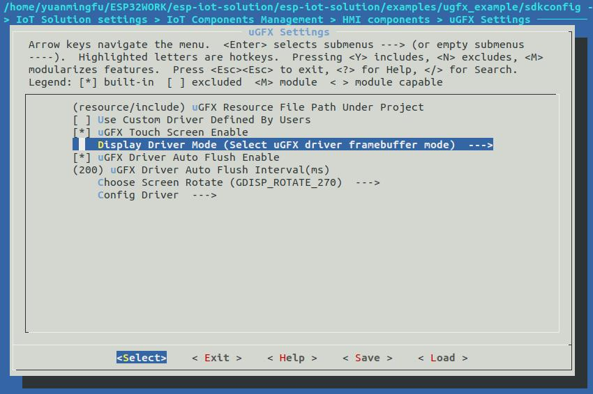

:orphan:

µGFX Guide
==========

:link_to_translation:`zh_CN:[中文]`

Introduction
------------

1. What is µGFX?

   `μGFX <https://ugfx.io/>`__ is a lightweight embedded library for
   displays and touchscreens, providing everything required to build a
   fully featured embedded GUI. The library is very small and fast,
   because every unused feature is disabled and not linked into the
   finished binary.

   µGFX features at a glance

   -  Lightweight
   -  Modular
   -  Portable
   -  Open-source 100%
   -  Actively Developed

2. µGFX is a complete solution.

   The µGFX library has been designed to be the smallest, fastest and
   most advanced embedded library for display and touchscreen solutions.

   µGFX features

   -  Small and lightweight
   -  Fully customizable and extendable
   -  Highly portable
   -  Support for all display types: Monochrome, grayscale, and full
      color displays
   -  Support for hardware acceleration
   -  Over 50 ready-to-use drivers
   -  Written in C and can be used with C++
   -  Free for non-commercial uses
   -  Fully Transparent: The entire source-code is open
   -  Works on low RAM systems. A frame buffer is not required for most
      displays
   -  Fully multi-threading re-entrant. Drawing can occur from any
      thread, at any time!

3. Desktop GUI Designer

   The μGFX-Studio is a desktop application that provides a drag'n'drop
   interface to quickly assemble a graphical user interface. It runs on
   Windows, Linux and Mac OS X. The μGFX-Studio is not fully accessible
   at the moment.

µGFX modules
~~~~~~~~~~~~

The µGFX library has the following modules:

-  `GWIN <#gwin>`__

   -  The GWIN module uses all the other modules and combines them into
      a complete GUI toolkit. It provides everything from buttons,
      checkboxes, lists to graph widgets and much more.

-  GAUDIO

   -  The GAUDIO module provides high level API for handling audio input
      and output. The module features built-in decoders but also allows
      to use external codecs.

-  GFILE

   -  The GFILE module provides an operating-system-independent way of
      reading and writing files, no matter whether they are stored in
      RAM, FLASH, an SD Card or a native file system in host operating
      systems.

-  GOS

   -  GOS is the module which builds the abstraction layer between µGFX
      and the underlying system. The underlying system can be an RTOS,
      such as ChibiOS or FreeRTOS, or just a bare metal system.

-  `GDISP <#gdisp>`__

   -  The GDISP module provides a simple interface for graphic displays
      and a feature-rich set of APIs to draw primitive shapes such as
      lines, circles and rectangles, as well as font rendering, clipping
      and other advanced features.

-  GINPUT

   -  GINPUT is a powerful module which provides an easy way to
      interface different hardware peripherals, such as touchscreens, to
      the rest of the library. It provides calibration routines for the
      touchscreens.

-  GTRANS

   -  The GTRANS module allows you to manage language translations. The
      language of an application can be changed dynamically during
      run-time using the GTRANS module.

-  GEVENT

   -  The GEVENT module is a very powerful event system. It provides a
      way to create a many-to-many relationships between sources and
      listeners.

-  GTIMER

   -  The GTIMER module provides high-level, simple and hardware
      independent timers.

-  GQUEUE

   -  The GQUEUE module provides implementations of different queues and
      buffers.

GWIN
^^^^

The GWIN module contains:

-  `Windows <#windows>`__
-  Console
-  Graph window
-  `Widgets <#widgets>`__
-  Label
-  PushButton
-  RadioButton
-  CheckBox
-  List
-  Slider
-  Progressbar
-  ImageBox
-  TextEdit
-  Keyboard
-  `Containers <#containers>`__
-  Container
-  Tabset
-  Frame

GDISP
^^^^^

The GDISP module contains: - Drawing - Font rendering - Images

License
~~~~~~~

Espressif has been granted the µGFX license, so all the Espressif chip
users may use the drivers and services provided by µGFX free of charge.
About µGFX License, please refer to
`License <https://ugfx.io/license.html>`__.

Get started with µGFX
---------------------

The Espressif's iot-solution offers drivers adapted to µGFX. You can
find them by going to
`esp-iot-solution <https:404>`__.
The drivers are stored at the following path:
``components/hmi/gdrivers``.

Below is a step-by-step guide on how to use µGFX for the projects based
on iot-solution:

1. Build the iot-solution environment:
   `Preparation <https:404#preparation>`__.
2. Add the header file ``#include "iot_ugfx.h"`` to the project source
   code.
3. Enable µGFX GUI with ``menuconfig``
   (``IoT Solution settings > IoT Components Management > HMI components > uGFX GUI Enable``).
4. `Configure <#configure-µgfx>`__ µGFX GUI with ``menuconfig``
   (``IoT Solution settings > IoT Components Management > HMI components > uGFX Settings``).
5. Initialize µGFX according to the example project ``ugfx_example``.
6. Develop GUI according to your actual requirements.

µGFX related `API Reference <https://api.ugfx.io/>`__

Configure µGFX
~~~~~~~~~~~~~~

There are two ways to configure µGFX in iot-solution:

1. Configure µGFX with ``menuconfig``

   To simplify the configuration process, you can add the frequently
   used configurations, such as a driver configuration, touchscreen
   enabling, screen resolution and orientation, to ``menuconfig``. The
   path to the µGFX configuration menu is
   ``IoT Solution settings > IoT Components Management > HMI components > uGFX Settings``.

2. Configure µGFX by modifying the file ``gfxconf.h``

   All project-specific options for µGFX are defined in the file
   ``gfxconf.h``, which can be found at the path
   ``esp-iot-solution/components/hmi/gdrivers/include/gfxconf.h``. You
   can modify the file according to your requirements. Within each
   section, the very first option enables or disables the entire module.
   All the following sub-options only take effect when the module is
   enabled. For the detailed information about the file ``gfxconf.h``,
   please refer to
   `Configuration <https://wiki.ugfx.io/index.php/Configuration>`__.

The figure below shows the µGFX configuration options in ``menuconfig``.

1. Configure drivers

   In the µGFX Settings menu, you can configure the drivers for displays
   and touchscreens. To do this, please go to
   ``Config Driver->Choose Touch Screen Driver`` and ``Config Driver->Choose Screen Driver``.

2. Enable touchscreens

   The µGFX Settings menu allows you to enable or disable the
   touchscreen. To do this, please go to ``uGFX Touch Screen Enable``.

3. Configure screen resolution

   To configure the screen resolution in the µGFX Settings menu, please
   go to ``Config Driver->uGFX Screen Width (pixels)`` and
   ``Config Driver->uGFX Screen Height (pixels)``.

4. Configure screen orientation

   To configure the screen orientation in the µGFX Settings menu, please
   go to ``Choose Screen Rotate``.

Display driver model
~~~~~~~~~~~~~~~~~~~~

A µGFX display driver supports three models. Unlike desktop graphics
processors, embedded LCDs often have a very different access model,
which means the traditional graphics libraries do not support them
efficiently, if at all. Some graphics controllers may require different
models in different situations.

1. Framebuffer model

   This is the model that most graphics libraries support and is most
   suitable for advanced graphics processors. It requires that the
   graphics hardware supplies a framebuffer which is a block of RAM that
   is pixel addressable as normal memory from the CPU side. The graphics
   hardware then updates the display in the background by seeing the
   changes that the CPU makes to the framebuffer. It is also the
   simplest type of new hardware to support in µGFX.

   Many other graphics libraries try to support other types of hardware
   by allocating system RAM to a virtual framebuffer and then providing
   a sync call to flush the framebuffer to the real display. This has a
   number of issues, such as:

   -  It allocates large amounts of system RAM which is often a precious
      resource in an embedded environment.
   -  The sync call is usually very inefficient as either the entire
      display must be updated or a difference comparison must be made.

   There may be other reasons that a sync is needed (e.g. to allow
   updating of the display only during vertical refresh), so µGFX still
   supports a sync call. It is strongly recommended not to use this
   model, unless your graphics hardware supports a native framebuffer.

   Required functions:

   -  ``board_init()``: Initialize the framebuffer and return its
      address and the display properties

   Optional functions:

   -  ``board_flush()``: Flush (sync) the framebuffer to the display
   -  ``board_backlight()``: Adjust the display backlight
   -  ``board_contrast()``: Adjust the display contrast
   -  ``board_power()``: Enter/Exit sleep modes

2. Window model

   Most embedded LCDs use this model of controller. Unfortunately most
   graphics libraries do not support these controllers efficiently.

   In this model, the hardware provides a programmable window area. This
   window area is written to by sequentially sending pixels to the
   graphics controller. When the pixels reach the end of a line in the
   window, the controller wraps to the start of the next line in the
   window. When it reaches the bottom of the window, it may (or may not)
   wrap back to the beginning of the window.

   Reading from the display is often not supported, and if it is, this
   is done with the same windowed method.

   As the display surface is not RAM addressable and the physical
   connections are often via a slow bus (at least compared to RAM
   addressing) such as SPI, I2C or byte parallel, the reading and
   writing speed can be slow. This means that efficiency of the drawing
   operations is very important and completely different methods of
   drawing need to be used compared to a framebuffer. µGFX automatically
   handles all of these differences.

   Screen rotation only for software is not possible with these
   controllers (unlike a framebuffer). Some hardware support is
   required. However, there are two possible ways to achieve this: (1)
   by rotating the way the cursor is moved within the drawing window, or
   (2) by rotating the display itself relative to the internal
   framebuffer. By policy, the priority is that the first method be
   implemented if the controller supports both. This preference allows
   retention of existing display contents with the rotation only
   affecting new drawing operations (more flexible for the end-user
   application).

   Required functions:

   -  ``gdisp_lld_init()``: Initialize the controller and display
   -  ``gdisp_lld_write_start()``: Start a windowed write operation
   -  ``gdisp_lld_write_color()``: Send one pixel to the current window
      at the current position
   -  ``gdisp_lld_write_stop()``: Stop a windowed write operation

   Optional functions:

   -  ``gdisp_lld_write_pos()``: Set the current position within the
      write window (increases drawing efficiency)
   -  ``gdisp_lld_read_start()``: Start a windowed read operation
   -  ``gdisp_lld_read_color()``: Read one pixel from the current window
      at the current position
   -  ``gdisp_lld_read_stop()``: Stop a windowed read operation
   -  ``gdisp_lld_set_clip()``: Set a hardware clipping region. All
      writes are clipped to this area (regardless of the current window)
   -  ``gdisp_lld_control()``: Handle backlight, contrast, screen
      orientation and any driver specific control commands
   -  ``gdisp_lld_query()``: Query some driver specific values
   -  Any Point and Block model functions as described below

3. Point and Block model

   In this model, the controller provides basic drawing operations such
   as set-point, fill-block, fill-block-from-image. Many of the window
   model principles apply here. Reading from the display is often not
   supported.

   Drivers may mix the functions from this model into the window model
   above. If a specific set-point, fill-block or fill-block-from-image
   function is provided in a window model driver, it will have a higher
   priority over the general window model calls above. When calls are
   mixed like this, the driver is still considered to be a window model
   driver. For example, a controller may have a more efficient set-point
   command that can be prioritized over a windowed single pixel write.

   Required functions:

   -  ``gdisp_lld_init()``: Initialize the controller and display
   -  ``gdisp_lld_draw_pixel()``: Set a single pixel

   Optional functions:

   -  ``gdisp_lld_fill_area()``: Fill a block with a color
   -  ``gdisp_lld_blit_area()``: Fill a block from an array of pixels
   -  ``gdisp_lld_vertical_scroll()``: Scroll up or down a windowed area
      of the display
   -  ``gdisp_lld_get_pixel_color()``: Get the color of a single pixel
   -  ``gdisp_lld_set_clip()``: Set a hardware clipping region. All
      writes are clipped to this area.
   -  ``gdisp_lld_control()``: Handle backlight, contrast, screen
      orientation, and any driver specific control commands
   -  ``gdisp_lld_query()``: Query some driver specific values

Set fonts
~~~~~~~~~

1. Usage

   To make a font available, open it by calling the function
   ``gdispOpenFont()``.

   For example: ``font_t font = gdispOpenFont("DejaVuSans32_aa");``

   If the specified font name cannot be found, the last enabled font in
   the configuration file will be used. To open the first enabled font
   please use ``gdispOpenFont("*");``.

   After a font is opened, its variable can be passed to any API with a
   font parameter. You can start by reading through the basic GDISP text
   drawing functions before you take a look at the different GWIN
   system.

   If a font is no longer needed, call the function ``gdispCloseFont(font)`` to release the allocated resources.

2. Set default fonts

   Call the function ``gwinSetDefaultFont(font_t font)`` to set the
   default fonts for all GUI elements.

   For example:

   ::

       #include "iot_ugfx.h"

       static font_t font;

       int main(void) {
       // Initialize uGFX and the underlying system
       gfxInit();
       // Set the widget defaults
       font = gdispOpenFont("DejaVuSans16");
       gwinSetDefaultFont(font);
       }

3. Set the font for a GUI element

   To set a font for a GUI element, call the function
   ``gwinSetFont(GHandle gh, font_t font)``.

4. µGFX available fonts

   Every font that is available in a .ttf or .bdf format can be
   displayed through µGFX. However, µGFX comes with a bunch of fonts in
   different sizes and versions which should cover most use cases. Use
   the font name (see the table below) as the parameter of the function
   ``gdispOpenFont()``.

   Note that each of these fonts has to be enabled in your configuration
   file. The UI fonts are default fonts created by µGFX developers.

+------------------------------------+------------------------+
| **Font**                           | **Font name**          |
+====================================+========================+
| DejaVu Sans 10                     | DejaVuSans10           |
+------------------------------------+------------------------+
| DejaVu Sans 12                     | DejaVuSans12           |
+------------------------------------+------------------------+
| DejaVu Sans 12 Bold                | DejaVuSansBold12       |
+------------------------------------+------------------------+
| DejaVu Sans 12 Anti-Aliased        | DejaVuSans12\_aa       |
+------------------------------------+------------------------+
| DejaVu Sans 12 Anti-Aliased Bold   | DejaVuSansBold12\_aa   |
+------------------------------------+------------------------+
| DejaVu Sans 16                     | DejaVuSans16           |
+------------------------------------+------------------------+
| DejaVu Sans 16 Anti-Aliased        | DejaVuSans16\_aa       |
+------------------------------------+------------------------+
| DejaVu Sans 20                     | DejaVuSans20           |
+------------------------------------+------------------------+
| DejaVu Sans 20 Anti-Aliased        | DejaVuSans20\_aa       |
+------------------------------------+------------------------+
| DejaVu Sans 24                     | DejaVuSans24           |
+------------------------------------+------------------------+
| DejaVu Sans 24 Anti-Aliased        | DejaVuSans24\_aa       |
+------------------------------------+------------------------+
| DejaVu Sans 32                     | DejaVuSans32           |
+------------------------------------+------------------------+
| DejaVu Sans 32 Anti-Aliased        | DejaVuSans32\_aa       |
+------------------------------------+------------------------+
| Fixed 10x20                        | fixed\_10x20           |
+------------------------------------+------------------------+
| Fixed 7x14                         | fixed\_7x14            |
+------------------------------------+------------------------+
| Fixed 5x8                          | fixed\_5x8             |
+------------------------------------+------------------------+
| UI1                                | UI1                    |
+------------------------------------+------------------------+
| UI1 Double                         | UI1 Double             |
+------------------------------------+------------------------+
| UI1 Narrow                         | UI1 Narrow             |
+------------------------------------+------------------------+
| UI2                                | UI2                    |
+------------------------------------+------------------------+
| UI2 Double                         | UI2 Double             |
+------------------------------------+------------------------+
| UI2 Narrow                         | UI2 Narrow             |
+------------------------------------+------------------------+
| Large numbers                      | LargeNumbers           |
+------------------------------------+------------------------+

Display images
~~~~~~~~~~~~~~

RAM usage
^^^^^^^^^

The GDISP module comes with a built-in image decoder to open and display
images in various formats. As the GFILE module is used internally,
images can be read from any location, be it the internal flash or
external memory (e.g. SD card).

Image decoders use RAM to decode and display images. Although, image
handlers are written from scratch to use as little RAM as possible, the
image formats used with small microcontrollers should be chosen
carefully, because of limited RAM. Image handlers, as most of other
image decoders, do not allocate RAM to store a full decompressed bitmap,
instead the image is decoded again if it needs to be displayed.

RAM is only allocated for the following purposes:

-  **Storing information about an opened image.** The memory size is
   typically 200 to 300 bytes and may vary slightly for some images and
   image formats (e.g. with palettes). This RAM remains occupied while
   the image is open.
-  **Decoding an image.** This RAM gets released as soon as the decoding
   is finished. Decoding GIF images requires around 12 KB of RAM.
   Decoding BMP and NATIVE images does not require any extra RAM.
-  **Caching a chosen image.** In this case, RAM is required for the
   full decoded image. This is not an option for low-memory
   microprocessors. For example, caching a 320x240 image on a 2 bytes
   per pixel display takes 150 KB of RAM, plus the RAM for decoding.
-  **Stack space.** If you get exceptions when trying to decode images,
   consider increasing the available stack space. Some image formats
   require a few hundred bytes of stack space to decode an image.

µGFX image decoders have been written from scratch to keep the image
decoders as lean and mean as possible. These decoders use significantly
less RAM than other decoding libraries available.

Caching
^^^^^^^

You can choose to cache a decoded image into your RAM by calling the
function ``gdispImageCache()``. If an image is not cached, opening it
repeatedly will require re-reading from flash, re-decoding, and only
then displaying. However, a cached image, only needs to be loaded from
RAM and displayed.

If an image is cached, you just need to load it from RAM and display it.
Caching helps display images much faster, especially the formats with
complicated decoding algorithms, such as PNG, JPG, or GIF. Although,
caching large-sized images or multiframe GIF images requires a lot of
RAM.

If you cache an image, it still needs to be opened before displaying.
When you close an image, all the memory used by the decoder, including
any cached images, will be released.

Calling the caching function does not guarantee that the image will be
cached, for example, if there is not enough RAM. Since caching is fully
optional, the image will still be drawn if you call the drawing
function. It will simply be re-read from flash and re-decoded again.

Image files in ROMFS
^^^^^^^^^^^^^^^^^^^^

ROMFS is the file system to store files in the code itself (usually in
ROM/FLASH).

To convert an image file into a header file, use the file2c tool. It can
be found here:
``esp-iot-solution/components/hmi/ugfx_gui/ugfx/tools/file2c/src``.

Navigate to the directory where the file2c tool is stored, run the make
command, and then run ``./file2c -dcs image_flie header_flie``. Remember
to replace ``image_flie`` and ``header_flie`` with real file names.

To use the image, just include the header file into the
``romfs_files.h`` file of your project.

Image formats
^^^^^^^^^^^^^

μGFX currently comes with the following image decoders:

+--------------+-------------------------------------------------------------------------+
| **Format**   | **Description**                                                         |
+==============+=========================================================================+
| BMP          | Including BMP1, BMP4, BMP4\_RLE, BMP8, BMP8\_RLE, BMP16, BMP24, BMP32   |
+--------------+-------------------------------------------------------------------------+
| GIF          | Including transparency and multi-frame support (animations)             |
+--------------+-------------------------------------------------------------------------+
| PNG          | Including transparency and alpha support                                |
+--------------+-------------------------------------------------------------------------+
| NATIVE       | Uses the display drivers native format                                  |
+--------------+-------------------------------------------------------------------------+

For example:

::

    #include "iot_ugfx.h"

    /**
     * The image file must be stored on a GFILE file-system.
     * Use either GFILE_NEED_NATIVEFS or GFILE_NEED_ROMFS (or both).
     *
     * The ROMFS uses the file "romfs_files.h" to describe the set of files in the ROMFS.
     */

    static gdispImage myImage;

    int main(void) {
      coord_t   swidth, sheight;

      // Initialize uGFX and the underlying system
      gfxInit();

      // Get the display dimensions
      swidth = gdispGetWidth();
      sheight = gdispGetHeight();

      // Set up IO for our image
      gdispImageOpenFile(&myImage, "myImage.bmp");
      gdispImageDraw(&myImage, 0, 0, swidth, sheight, 0, 0);
      gdispImageClose(&myImage);

      while(1) {
        gfxSleepMilliseconds(1000);
      }
      return 0;
    }

For detailed introduction, please refer to
`Images <https://wiki.ugfx.io/index.php/Images>`__.

Default widget
~~~~~~~~~~~~~~

All the default widgets for µGFX GUI can be found in the above-mentioned
`GWIN <#gwin>`__ module which also includes windows and containers.

Windows
^^^^^^^

A window is the most basic GWIN element. All other elements, such as
widgets and containers, are based on this one.

A window has the following attributes:

-  Position
-  Size
-  Foreground color
-  Background color
-  Font

Thus, a window is a completely passive element which does not accept any
kind of input.

Here are the current available windows:

1. Console

   Console is a rectangular window with a foreground and a background
   color. It currently does not accept any input and can only output
   text using ``gwinPrintf()``. Consoles can handle line breaks to wrap
   the text reaching the window's right border. The widget can also
   handle text scrolling which appears if text lines reach the window's
   bottom border.

   Console example:
   ``/esp-iot-solution/components/hmi/ugfx_gui/ugfx/demos/modules/gwin/console``

2. Graph

   The graph window helps to easily draw curves and other sets of data
   with different colors and shapes in a rectangular window. Graph
   windows are not capable of taking any user input.

   Graph example:
   ``/esp-iot-solution/components/hmi/ugfx_gui/ugfx/demos/modules/gwin/graph``

Widgets
^^^^^^^

Widgets are based on windows. In addition to the window functionalities,
a widget has the following features:

-  Supporting text attributes
-  Capable of redrawing
-  Accepting user input, e.g., from a touchscreen
-  Drawing functions can be overwritten, if there is a requirement for
   fancier and more sleek-looking objects. For example, along with the
   normal button drawing functions, there are predefined drawing
   functions for round buttons, image buttons, arrow buttons etc.
-  Supporting styles. By changing a style, you can change the color
   scheme used for drawing the widget, similar to the color schemes in
   Windows or Linux.

Here are the current available widgets：

1.  Label

    Label is a simple rectangular widget which takes no input. The label
    automatically redraws itself if the text is changed. If the label is
    smaller than the text it displays, the text gets clipped. To set the
    label text, use the function ``gwinSetText()``.

2.  PushButton

    PushButton is a stand-alone widget with a static size and the text
    centered inside the button area. PushButtons have two states:
    *pressed* and *unpressed*.

3.  RadioButton

    RadioButton is a widget that only works in a group of two or more
    RadioButtons. A group of RadioButtons can have only one button
    checked at a time. If you click on another RaidoButton, it gets
    checked, unchecking the previous one.

4.  CheckBox

    Checkbox is a small stand-alone GUI element which has two states:
    *checked* and *unchecked*. By default, the text attribute of a
    checkbox is displayed on its left side. The width of the widget is
    supposed to be larger in order to contain text.

5.  List

    List is a rectangular widget which contains multiple list entries,
    also known as items. An item is a simple string linked to a per-list
    unique ID. Through different inputs, such as a touchscreen, an item
    can be selected by directly touching it. Furthermore, the list
    widget automatically displays an Up- and a Down-Arrow on the right
    side for scrolling, if there are more items than can be displayed.
    If an empty section (below the last entry) of the list is touched,
    all selections are reset. A list can either be single- or
    multi-select. Also, it is possible to add small images to the left
    of the item string. Two images can be used - one for the selected
    state, the other for the unselected state.

    The following image shows the default drawing routine of the list
    widget. Pease note that at this point you can replace the routines
    with your preferred custom rendering routine. The first list on the
    left is a normal single-selection list which shows the scrollbar.
    The second list in the middle is a multi-selection list, also with a
    scrollbar. The third image on the right shows a list with images
    drawn in front of the item text. It is a multi selection list
    without a scrollbar since all the list items fit the visible space.

   .. figure:: ../../_static/hmi_solution/ugfx/ugfx_gwin_list.jpg
    :align: center

   You can ensure that an item is visible in the list by using ``gwinListViewItem()``.

6.  Slider

    Slider is a bar shaped GUI element with a handle that can be moved
    from the lowest (0) to the highest (100) value. The text attribute
    of the slider is displayed in the center of the slider bar.

7.  Progressbar

    Progressbar is a rectangular box to visualize the progress of an
    operation. The progressbar widget can either be controlled manually
    or automatically. In both cases, the range of the progressbar can be
    changed through the function ``gwinProgressbarSetRange()``. The
    default values are 0 to 100. Furthermore, the resolution can be
    modified through the function ``gwinProgressbarSetResolution()``.
    This changes the size of the steps in which the progressbar will be
    incremented or decremented. The default resolution is 1.

8.  ImageBox

    ImageBox uses the GDISP image decoder features and wraps them around
    a GWIN widget.

    ImageBox example:
    ``/esp-iot-solution/components/hmi/ugfx_gui/ugfx/demos/modules/gwin/imagebox``

9.  TextEdit

    TextEdit allows the user of a GUI to input text. The text input
    source can either be a physical keyboard (or keypad) interfaced
    through the GINPUT module or the virtual on-screen keyboard widget.

    TextEdit example:
    ``/esp-iot-solution/components/hmi/ugfx_gui/ugfx/demos/modules/gwin/textedit``

10. Keyboard

    The keyboard widget provides a virtual on-screen keyboard. Keyboard
    can have a dynamically-changed layout. The widget comes with a set
    of built-in layouts such as QWERTY and NumPad. Although, you can
    also define custom layouts.

    Keyboard example:
    ``/esp-iot-solution/components/hmi/ugfx_gui/ugfx/demos/modules/gwin/keyboard``

    TextEdit and Keyboard example:
    ``/esp-iot-solution/components/hmi/ugfx_gui/ugfx/demos/modules/gwin/textedit_virtual_keyboard``

Widgets example:
``/esp-iot-solution/components/hmi/ugfx_gui/ugfx/demos/modules/gwin/widgets``

Containers
^^^^^^^^^^

Containers are based on widgets. The main feature of a container is the
ability to contain child windows that inherit the properties of their
parent window.

Here are the current available containers:

1. Container

   A basic container is a simple blank rectangle which can be used as a
   parent window to group widgets and contain them as children.

   To add a child widget to a container, add the container's GHandle to
   the child widget init structure:

   Container example:
   ``/esp-iot-solution/components/hmi/ugfx_gui/ugfx/demos/modules/gwin/container``

2. Frame

   Frame is based on the container. It acts like a regular computer
   window. It has borders, a window title and an optional button to
   close it.

   Frame example:
   ``/esp-iot-solution/components/hmi/ugfx_gui/ugfx/demos/modules/gwin/frame``

3. Tabset

   Tabset is a special container that manages different tabs, similar to
   web-browser tabs. You can create as many pages as you like and add
   widgets to each individual page. Please note that only the widgets on
   the active page will be visible to the user.

   This container is often used to create simple tab based menus. For
   this, a tabset is placed at the screen origin (``x = 0``, ``y = 0``)
   and covers the entire display size (``width = gdispGetWidth()``,
   ``height = gdispGetHeight()``). In order to avoid a border being
   drawn at the edge of the display, the value of the first parameter in
   the ``gwinTabsetCreate()`` function needs to be set to ``0``.

   Tabset example:
   ``/esp-iot-solution/components/hmi/ugfx_gui/ugfx/demos/modules/gwin/tabset``

FAQs
----

To track any possible program related issues, please check the return
value of every single function.

Images are not displayed
~~~~~~~~~~~~~~~~~~~~~~~~

Issue: The program seems to be compiled successfully and no error
messages pop up when the program is running. Although, the image cannot
be displayed.

Please check the following:

-  Make sure that the display driver works properly and presents the
   basic widgets as usual. If not, make sure the correct IO and drivers
   are selected.
-  Check if the corresponding decoder is enabled in the configuration
   file.
-  Ensure that the image can be opened.
-  Make sure that the image decoder allocates enough memory.
-  Check if the limit for the number of opened files has been reached.
   If yes, the file from which you are loading the image cannot be
   opened. Please add ``GFILE_MAX_GFILES`` in the configuration file or
   close the opened files that are not in use.

