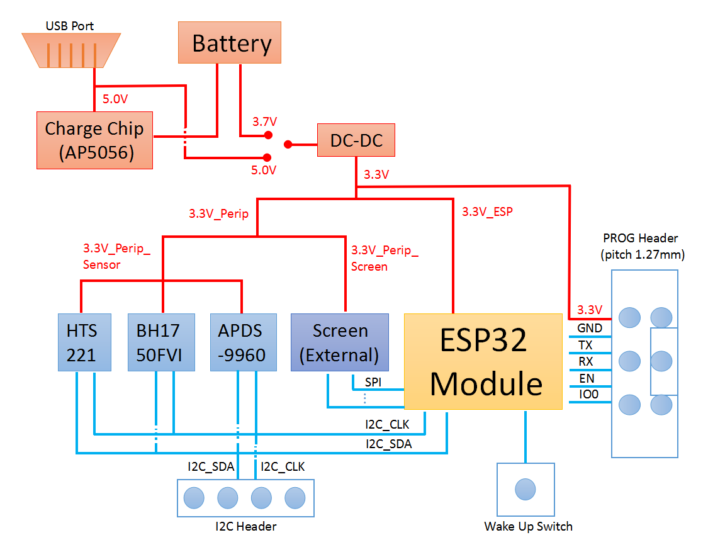
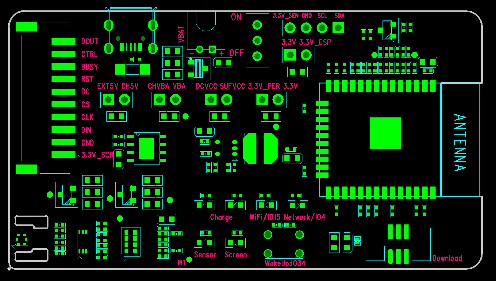
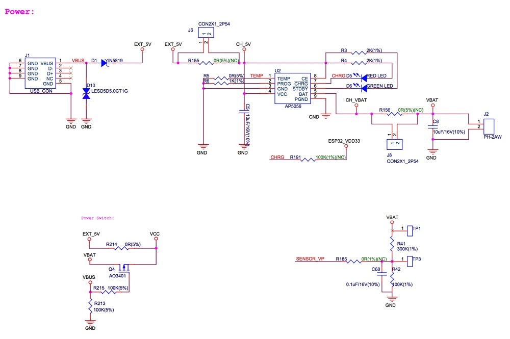
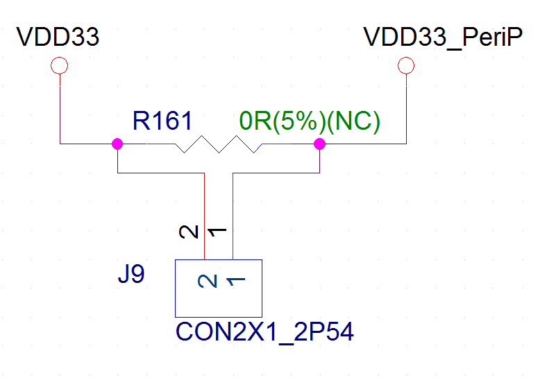
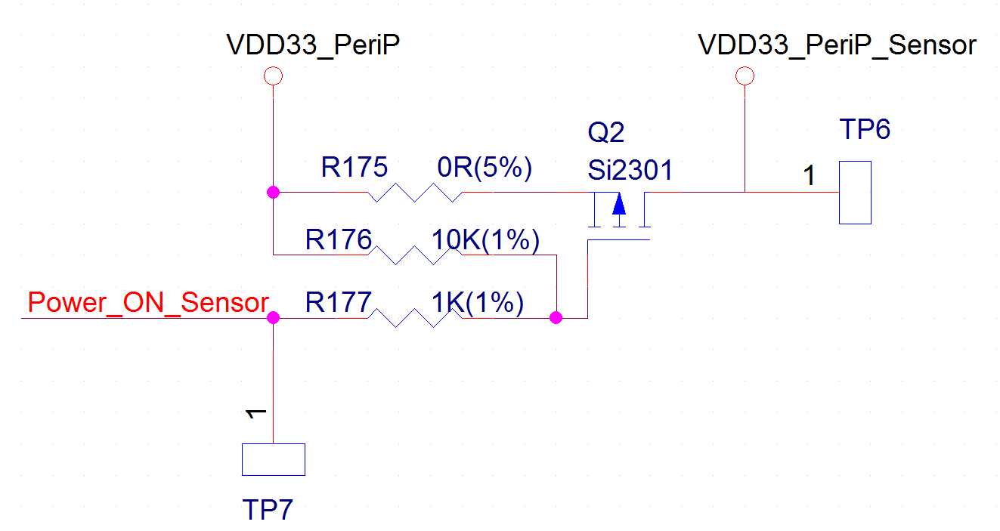
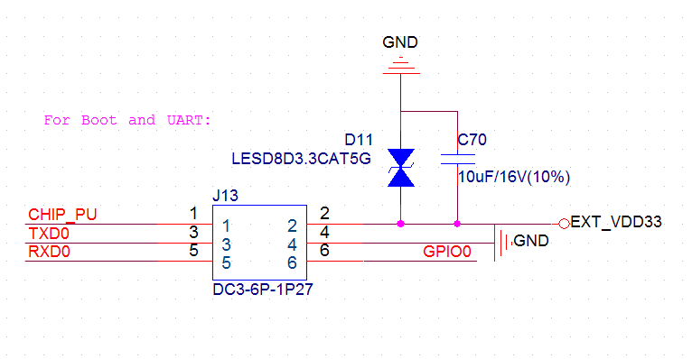
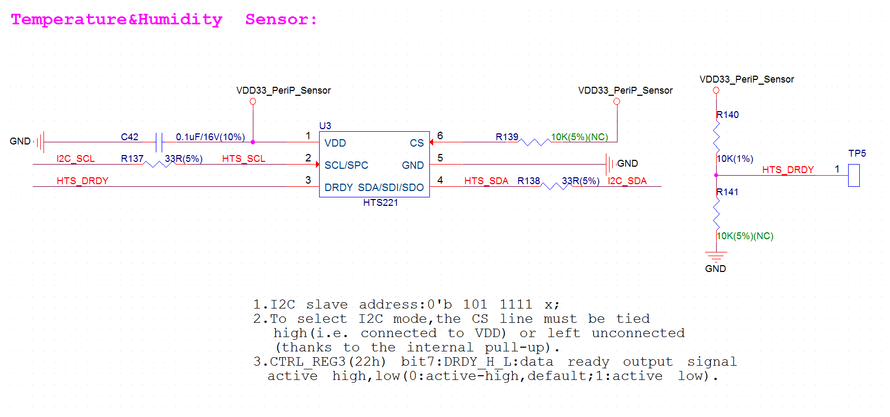
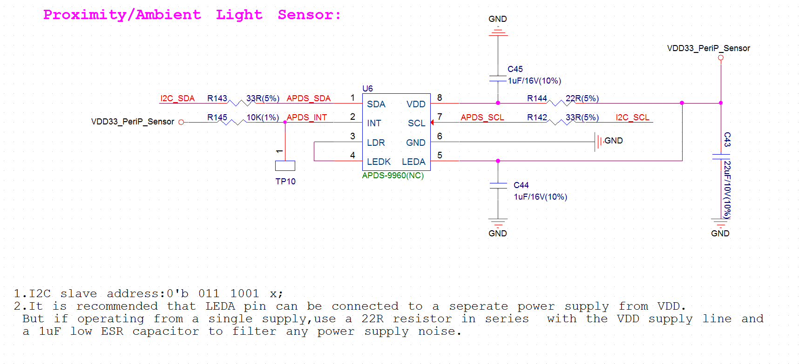

:orphan:

ESP32-MeshKit-Sense Hardware Design Guidelines
==============================================

:link_to_translation:`zh_CN:[中文]`

1. Overview
-------------------

ESP32-MeshKit-Sense is a development board with an ESP32 module at its
core. It features peripherals, such as a temperature and humidity
sensor, an ambient light sensor, etc. The board can be interfaced with
screens. The board is mainly used to detect the current consumption of
ESP32 modules in a normal operation state or in sleep mode, when
connected to different peripherals.

For more information on ESP32, please refer to `ESP32 Datasheet <https://www.espressif.com/sites/default/files/documentation/esp32_datasheet_en.pdf>`__.

2. Block Diagram and PCB Layout
--------------------------------------

2.1 Block Diagram
~~~~~~~~~~~~~~~~~~~~~~~~~~

The figure below shows the block diagram of ESP32.

2.2 PCB Layout
~~~~~~~~~~~~~~~~~~~~~~~~~~

The figure below shows the layout of ESP32-MeshKit-Sense PCB.

.. figure:: ../../_static/hw-reference/lowpower_evb/ESP32_BATTERY_EB.png
   :align: center

+-----------------+----------------------------------------------------------------------------------------------------------------------------------------------------------------------------+
| PCB Elements    | Description                                                                                                                                                                |
+=================+============================================================================================================================================================================+
| EXT5V           | 5V input from USB                                                                                                                                                          |
+-----------------+----------------------------------------------------------------------------------------------------------------------------------------------------------------------------+
| CH5V            | input from the electrical charging chip                                                                                                                                    |
+-----------------+----------------------------------------------------------------------------------------------------------------------------------------------------------------------------+
| CHVBA           | output from the electrical charging chip                                                                                                                                   |
+-----------------+----------------------------------------------------------------------------------------------------------------------------------------------------------------------------+
| VBA             | Connects to the positive electrode of the battery                                                                                                                          |
+-----------------+----------------------------------------------------------------------------------------------------------------------------------------------------------------------------+
| SUFVCC          | When the switch is toggled to the ”ON” position, it is connected to the power input. When the switch is toggled to the ”OFF” position, the power supply is disconnected.   |
+-----------------+----------------------------------------------------------------------------------------------------------------------------------------------------------------------------+
| DCVCC           | Input from power management chip DC-DC                                                                                                                                     |
+-----------------+----------------------------------------------------------------------------------------------------------------------------------------------------------------------------+
| 3.3V            | 3.3V power output from power supply management chip                                                                                                                        |
+-----------------+----------------------------------------------------------------------------------------------------------------------------------------------------------------------------+
| 3.3V\_PER       | 3.3V power supply for all peripherals                                                                                                                                      |
+-----------------+----------------------------------------------------------------------------------------------------------------------------------------------------------------------------+
| 3.3V\_ESP       | 3.3V power supply for all ESP32 modules                                                                                                                                    |
+-----------------+----------------------------------------------------------------------------------------------------------------------------------------------------------------------------+
| 3.3V\_SEN       | 3.3V power supply for the three on-board sensors                                                                                                                           |
+-----------------+----------------------------------------------------------------------------------------------------------------------------------------------------------------------------+
| 3.3V\_SCR       | 3.3V power supply for the off-board screen                                                                                                                                 |
+-----------------+----------------------------------------------------------------------------------------------------------------------------------------------------------------------------+
| Charge          | Battery charging indicator, D5 is a red light, indicating that charging is undergoing; D6 is a green light, indicating that charging is complete.                          |
+-----------------+----------------------------------------------------------------------------------------------------------------------------------------------------------------------------+
| Sensor          | Power indicator, indicating that 3.3V\_Perip\_Sensor is enabled                                                                                                            |
+-----------------+----------------------------------------------------------------------------------------------------------------------------------------------------------------------------+
| Screen          | Power indicator, indicates that 3.3V\_Perip\_Screen is enabled                                                                                                             |
+-----------------+----------------------------------------------------------------------------------------------------------------------------------------------------------------------------+
| WiFi / IO15     | Signal indicator, indicating that Wi-Fi connection is working properly                                                                                                     |
+-----------------+----------------------------------------------------------------------------------------------------------------------------------------------------------------------------+
| Network / IO4   | Signal indicator, indicating the board is properly connected to the server                                                                                                 |
+-----------------+----------------------------------------------------------------------------------------------------------------------------------------------------------------------------+

3. Functional Modules
--------------------------------

This chapter mainly introduces each functional module (interface) and
the hardware schematics for them.

3.1 Power Supply Management Module
~~~~~~~~~~~~~~~~~~~~~~~~~~~~~~~~~~~~~~~~~~~~

3.1.1 Power Supply Management Module
##########################################
:orphan:

The development board can be powered by battery and the AP5056 power
supply management chip can be used to charge the battery. The AP5056 is
a complete constant current constant voltage linear charger for single
cell lithium-ion batteries. It has 4.2V of preset charge voltage and 1A
of programmable charge current.

When both the USB power supply and the battery power supply are
available, the system selection of power supply will be: VBUS is high,
Q4 is in cut-off state, VBAT (battery power) is automatically cut off
from the system power supply, and the USB supplies power for the system.

The figure below shows the schematics for USB/BAT power supply
management.

3.1.2 Power Supply Management for Peripherals
#################################################

First of all, the input from the USB or BAT is converted by the power
management chip into a 3.3V voltage to power the circuit. The power
management chip on the board is ETA3425, which has an output voltage of
3.3V and a maximum output current of 600 mA.

The figure below shows the schematics for peripheral power supply.

.. figure:: ../../_static/hw-reference/lowpower_evb/peripheral.png
   :align: center

The main VDD33 circuit has two branches: One is ESP32\_VDD33, which is
used to power the ESP32 module module. The other VDD33\_PeriP, which is
used to power all peripherals. The connection between them can be
controlled via the pin header and jumper cap.

The figure below shows the schematics for ESP32\_VDD33.

The VDD33\_PeriP branch circuit also has two sub-branches: One is
VDD33\_PeriP\_Screen, dedicated power supply for the external screen;
and another is VDD33\_PeriP\_Sensor, power supply for the three sensors.
The connection of the two can be controlled by the module GPIO+MOS.

The figure below shows the schematics for VDD33\_PeriP.

3.2 Boot & UART
~~~~~~~~~~~~~~~~~~~~~~~~~~

The development board is integrated with a PROG Header, which can be
connected to a ESP-PROG development board via a cable. Users can then
connect the Micro USB of the ESP-PROG development board to a PC for
ESP32-MeshKit-Sense firmware download and debugging.

The figure below shows the schematics for Boot & UART Circuit.

3.3 Module for Wakeup from Sleep
~~~~~~~~~~~~~~~~~~~~~~~~~~~~~~~~~~~~~

The board has a button connected to the pin IO34, which is a pin in the
RTC domain. When the chip is in sleep, pressing the button will wake up
ESP32.

The figure below shows the schematics for wakeup-from-sleep module.

.. figure:: ../../_static/hw-reference/lowpower_evb/wakeup.png
   :align: center

3.4 External Screens
~~~~~~~~~~~~~~~~~~~~~~~~~~

The development board is integrated with a screen connector that can
connect different external screens to the board via cables.

The figure below shows the schematics for external screens.

.. figure:: ../../_static/hw-reference/lowpower_evb/screen.png
   :align: center

3.5 Sensors
~~~~~~~~~~~~~~~~~~~~~~~~~~

3.5.1 Temperature and Humidity Sensor
#################################################

The HTS221 is an ultra-compact sensor for relative humidity and
temperature. A 3.3V power supply and I2C interface on the board are
dedicated to HTS221.

The figure below shows the schematics for the temperature and humidity
sensor.

3.5.2 Ambient Light Sensor
#################################################

The BH1750FVI is a digital ambient light sensor. A 3.3V power supply and
I2C interface on the board are dedicated to HTS221.

The figure below shows the schematics for the ambient light sensor.

.. figure:: ../../_static/hw-reference/lowpower_evb/ambientlightsensor.png
   :align: center

3.5.3 Ambient Brightness Sensor
#################################################

The APDS-9960 is a ambient brightness sensor featuring advanced gesture
detection, proximity detection, digital Ambient Light Sense (ALS) and
Color Sense (RGBC). It also incorporates an IR LED driver. The
development board uses 3.3V power supply and I2C interface. It should be
noted that this device is not surface-mounted by default.

The figure below shows the schematics for the ambient brightness sensor.

