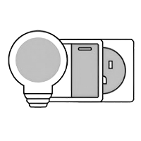

ESP-IoT-Solution  Programming Guide
====================================

:link_to_translation:`zh_CN:[中文]`

This is the documentation for `ESP-IoT-Solution <https://github.com/espressif/esp-iot-solution>`_ Development Framework.

ESP-IoT-Solution contains device drivers and code frameworks for the development of IoT system, which works as extra components of `ESP-IDF <https://github.com/espressif/esp-idf>`_ and much easier to start.

===============================  ===============================  ===============================
 |Get Started|_                   |Display|_                       |USB Host&Device|_
-------------------------------  -------------------------------  -------------------------------
 `Get Started`_                   `Display`_                       `USB Host&Device`_
-------------------------------  -------------------------------  -------------------------------
 |GUI|_                           |Input|_                         |Sensors|_
-------------------------------  -------------------------------  -------------------------------
 `GUI`_                           `Input`_                         `Sensors`_
-------------------------------  -------------------------------  -------------------------------
 |Audio|_                          |Security&Encryption|_           |Contribute|_
-------------------------------  -------------------------------  -------------------------------
 `Audio`_                          `Security&Encryption`_           `Contribute`_
===============================  ===============================  ===============================

.. |Get Started| image:: ../_static/get-started.png
.. _Get Started: gettingstarted.html

.. |Light Sleep| image:: ../_static/DFS_and_light_sleep.png
.. _Light Sleep: DFS_and_light_sleep/index.html

.. |Low Power| image:: ../_static/low_power_solution.png
.. _Low Power: low_power_solution/index.html

.. |Sensors| image:: ../_static/sensors.png
.. _Sensors: sensors/index.html

.. |Display| image:: ../_static/display.png
.. _Display: display/index.html

.. |GUI| image:: ../_static/gui.png
.. _GUI: display/lcd/gui_solution.html

.. |USB Host&Device| image:: ../_static/usb.png
.. _USB Host&Device: usb/index.html

.. |Input| image:: ../_static/input_device.png
.. _Input: input_device/index.html

.. |Audio| image:: ../_static/audio.png
.. _Audio: audio/index.html

.. _Electrical&Lighting Solution: Electrical_Lighting_solution/index.html

.. |Security&Encryption| image:: ../_static/security_solution.png
.. _Security&Encryption: security_solution/index.html

.. |Contribute| image:: ../_static/contribute.png
.. _Contribute: contribute/index.html

.. toctree::
   :hidden:

   Get Started <gettingstarted>
   Basic Component <basic/index>
   Bluetooth <bluetooth/index>
   Display <display/index>
   USB Host&Device <usb/index>
   Audio <audio/index>
   Multimedia <multimedia/index>
   AI <ai/index>
   Input Device <input_device/index>
   IR <ir/index>
   Low Power Solution <low_power_solution/index>
   Sensors <sensors/index>
   Touch <touch/index>
   Storage <storage/index>
   Motor <motor/index>
   Solution <solution/index>
   Security&Encryption <security_solution/index>
   Electrical&Lighting <electrical_lighting_solution/index>
   Other Resources <others/index>
   Contribute <contribute/index>
