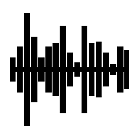
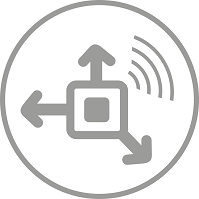

ESP-IoT-Solution  Programming Guide
====================================

:link_to_translation:`zh_CN:[中文]`

This is the documentation for `ESP-IoT-Solution <https://github.com/espressif/esp-iot-solution>`_ Development Framework.

ESP-IoT-Solution contains device drivers and code frameworks for the development of IoT system, which works as extra components of `ESP-IDF <https://github.com/espressif/esp-idf>`_ and much easier to start.

===============================  ===============================  ===============================
 |Get Started|_                   |Display|_                       |Audio|_
-------------------------------  -------------------------------  -------------------------------
 `Get Started`_                   `Display`_                       `Audio`_
-------------------------------  -------------------------------  -------------------------------
 |GUI|_                           |Input|_                         |Sensors|_
-------------------------------  -------------------------------  -------------------------------
 `GUI`_                           `Input`_                         `Sensors`_
-------------------------------  -------------------------------  -------------------------------
 |Security&Encryption|_           |Contribute|_
-------------------------------  -------------------------------  -------------------------------
 `Security&Encryption`_           `Contribute`_
===============================  ===============================  ===============================

.. |Get Started| image:: ../_static/get-started.png
.. _Get Started: gettingstarted.html

.. _Light Sleep: DFS_and_light_sleep/index.html

.. _Low Power: low_power_solution/index.html

.. _Sensors: sensors/index.html

.. |Display| image:: ../_static/display.png
.. _Display: display/index.html

.. _Input: input_device/index.html

.. _GUI: gui/index.html

.. _Audio: audio/index.html

.. _HMI Solution: hmi_solution/index.html

.. _Security&Encryption: security_solution/index.html

.. |Contribute| image:: ../_static/contribute.png
.. _Contribute: contribute/index.html

.. toctree::
   :hidden:

   Get Started <gettingstarted>
   Basic Component <basic/index>
   Display<display/index>
   Audio <audio/index>
   GUI <gui/index>
   Input Device <input_device/index>
   Sensors <sensors/index>
   Storage <storage/index>
   Motor <motor/index>
   Security&Encryption <security_solution/index>
   Other Resources <others/index>
   Contribute <contribute/index>
