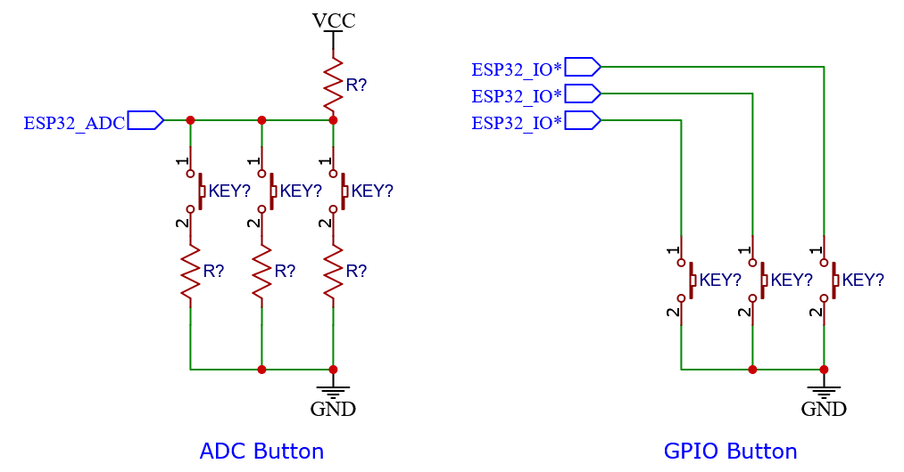

**Button**
===========

:link_to_translation:`zh_CN:[中文]`

The button component supports GPIO and ADC mode, and it allows the creation of two different kinds of the button at the same time. The following figure shows the hardware design of the button:

- GPIO button: The advantage of the GPIO button is that each button occupies an independent IO and therefore does not affect each other, and has high stability however when the number of buttons increases, it may take too many IO resources.
- ADC button: The advantage of using the ADC button is that one ADC channel can share multiple buttons and occupy fewer IO resources. The disadvantages include that you cannot press multiple buttons at the same time, and instability increases due to increase in the closing resistance of the button due to oxidation and other factors.

.. note::

    - The GPIO button needs to pay attention to the problem of pull-up and pull-down resistor inside the chip, which will be enabled by default. But there is no such resistor inside the IO that only supports input, **external connection requires**.
    - The voltage of the ADC button should not exceed the ADC range.

Button event
------------

Triggering conditions for each button event are enlisted in the table below:

+--------------------------+---------------------------------------------------------------+
|          Event           |                       Trigger Condition                       |
+==========================+===============================================================+
| BUTTON_PRESS_DOWN        | Pressed                                                       |
+--------------------------+---------------------------------------------------------------+
| BUTTON_PRESS_UP          | Released                                                      |
+--------------------------+---------------------------------------------------------------+
| BUTTON_PRESS_REPEAT      | Pressed and released >= 2 times                               |
+--------------------------+---------------------------------------------------------------+
| BUTTON_PRESS_REPEAT_DONE | Repeated press completed                                      |
+--------------------------+---------------------------------------------------------------+
| BUTTON_SINGLE_CLICK      | Pressed and released once                                     |
+--------------------------+---------------------------------------------------------------+
| BUTTON_DOUBLE_CLICK      | Pressed and released twice                                    |
+--------------------------+---------------------------------------------------------------+
| BUTTON_MULTIPLE_CLICK    | Pressed and released N times                                  |
|                          | specified, triggers when achieved                             |
+--------------------------+---------------------------------------------------------------+
| BUTTON_LONG_PRESS_START  | Instant when held for a threshold                             |
|                          | duration of time                                              |
+--------------------------+---------------------------------------------------------------+
| BUTTON_LONG_PRESS_HOLD   | Triggered continuously during                                 |
|                          | long press                                                    |
+--------------------------+---------------------------------------------------------------+
| BUTTON_LONG_PRESS_UP     | Released after a long press                                   |
+--------------------------+---------------------------------------------------------------+
| BUTTON_PRESS_REPEAT_DONE | Repeated press and release ended                              |
+--------------------------+---------------------------------------------------------------+
| BUTTON_PRESS_END         | Indicate that the button has completed its current detection. |
+--------------------------+---------------------------------------------------------------+

Each button supports **call-back** and **pooling** mode.

- Call-back: Each event of a button can register a call-back function for it, and the call-back function will be called when an event is generated. This method has high efficiency and real-time performance, and no events will be lost.
- Polling: Periodically call :c:func:`iot_button_get_event` in the program to query the current event of the button. This method is easy to use and is suitable for occasions with simple tasks. Not all key press events are captured in time, leading to a risk of missing events.

.. note:: you can also combine the above two methods.

.. attention:: No blocking operations such as **TaskDelay** are allowed in the call-back function

.. image:: https://dl.espressif.com/AE/esp-iot-solution/button_3.3.1.svg
    :alt: Button

Configuration
-------------

- BUTTON_PERIOD_TIME_MS : scan cycle

- BUTTON_DEBOUNCE_TICKS : debounce time

- BUTTON_SHORT_PRESS_TIME_MS : short press down effective time

- BUTTON_LONG_PRESS_TIME_MS : long press down effective time

- ADC_BUTTON_MAX_CHANNEL : maximum number of channel for ADC

- ADC_BUTTON_MAX_BUTTON_PER_CHANNEL : maximum number of ADC buttons per channel

- ADC_BUTTON_SAMPLE_TIMES: The number of samples per ADC scan.

- BUTTON_LONG_PRESS_HOLD_SERIAL_TIME_MS: The interval time for triggering the callback during a long press.

Demonstration
--------------

Create a button
^^^^^^^^^^^^^^^^
.. code:: c

    // create gpio button
    const button_config_t btn_cfg = {0};
    const button_gpio_config_t btn_gpio_cfg = {
        .gpio_num = 0,
        .active_level = 0,
    };
    button_handle_t gpio_btn = NULL;
    esp_err_t ret = iot_button_new_gpio_device(&btn_cfg, &btn_gpio_cfg, &gpio_btn);
    if(NULL == gpio_btn) {
        ESP_LOGE(TAG, "Button create failed");
    }

    // create adc button
    const button_config_t btn_cfg = {0};
    button_adc_config_t btn_adc_cfg = {
        .unit_id = ADC_UNIT_1,
        .adc_channel = 0,
        .button_index = 0,
        .min = 100,
        .max = 400,
    };

    button_handle_t adc_btn = NULL;
    esp_err_t ret = iot_button_new_adc_device(&btn_cfg, &btn_adc_cfg, &adc_btn);
    if(NULL == adc_btn) {
        ESP_LOGE(TAG, "Button create failed");
    }

    // create matrix keypad button
    const button_config_t btn_cfg = {0};
    const button_matrix_config_t matrix_cfg = {
        .row_gpios = (int32_t[]){4, 5, 6, 7},
        .col_gpios = (int32_t[]){3, 8, 16, 15},
        .row_gpio_num = 4,
        .col_gpio_num = 4,
    };
    button_handle_t matrix_button = NULL;
    esp_err_t ret = iot_button_new_matrix_device(&btn_cfg, &matrix_cfg, btns, &matrix_button);
    if(NULL == matrix_button) {
        ESP_LOGE(TAG, "Button create failed");
    }

.. Note::
    When using ADC1 for ADC buttons and ADC1 is also used elsewhere in the project, please pass in adc_handle and adc_channel to configure the ADC button.

    .. code::C
        adc_oneshot_unit_handle_t adc1_handle;
        adc_oneshot_unit_init_cfg_t init_config1 = {
            .unit_id = ADC_UNIT_1,
        };
        //-------------ADC1 Init---------------//
        adc_oneshot_new_unit(&init_config1, &adc1_handle);

        const button_config_t btn_cfg = {0};
        button_adc_config_t btn_adc_cfg = {
            .adc_handle = &adc1_handle,
            .unit_id = ADC_UNIT_1,
            .adc_channel = 0,
            .button_index = 0,
            .min = 100,
            .max = 400,
        };

        button_handle_t adc_btn = NULL;
        esp_err_t ret = iot_button_new_adc_device(&btn_cfg, &btn_adc_cfg, &adc_btn);
        if(NULL == adc_btn) {
            ESP_LOGE(TAG, "Button create failed");
        }

Register callback function
^^^^^^^^^^^^^^^^^^^^^^^^^^^^

The Button component supports registering callback functions for multiple events, with each event capable of having its own callback function. When an event occurs, the callback function will be invoked.

In this context:

- The :cpp:enumerator:`BUTTON_LONG_PRESS_START` and :cpp:enumerator:`BUTTON_LONG_PRESS_UP` enumerations support setting specific long press times.
- The :cpp:enumerator:`BUTTON_MULTIPLE_CLICK` enumeration supports setting the number of consecutive button presses.

- Here's a simple example:

    .. code:: c

        static void button_single_click_cb(void *arg,void *usr_data)
        {
            ESP_LOGI(TAG, "BUTTON_SINGLE_CLICK");
        }

        iot_button_register_cb(gpio_btn, BUTTON_SINGLE_CLICK, NULL, button_single_click_cb,NULL);

- And here's an example involving multiple callback functions:

    .. code:: C

        static void button_long_press_1_cb(void *arg,void *usr_data)
        {
            ESP_LOGI(TAG, "BUTTON_LONG_PRESS_START_1");
        }

        static void button_long_press_2_cb(void *arg,void *usr_data)
        {
            ESP_LOGI(TAG, "BUTTON_LONG_PRESS_START_2");
        }

        button_event_args_t args = {
            .long_press.press_time = 2000,
        };

        iot_button_register_cb(gpio_btn, BUTTON_LONG_PRESS_START, &args, button_auto_check_cb_1, NULL);

        args.long_press.press_time = 5000;
        iot_button_register_cb(gpio_btn, BUTTON_LONG_PRESS_START, &args, button_long_press_2_cb, NULL);

Dynamically Modifying Default Button Values
^^^^^^^^^^^^^^^^^^^^^^^^^^^^^^^^^^^^^^^^^^^^

.. code:: c

    iot_button_set_param(btn, BUTTON_LONG_PRESS_TIME_MS, 5000);

Find an event
^^^^^^^^^^^^^^

.. code:: c

    button_event_t event;
    event = iot_button_get_event(button_handle);

Low power
^^^^^^^^^^^

In light_sleep mode, the `esp_timer` triggers periodically, resulting in sustained high overall CPU power consumption. To address this issue, the button component offers a low-power mode.

Configuration Required:

- Ensure all created buttons type are GPIO type and have `enable_power_save` activated. The presence of other buttons may render the low-power mode ineffective.

.. Note:: This feature ensures that the Button component only wakes up the CPU when in use, but does not guarantee the CPU will always enter low-power mode.

Power Consumption Comparison:

- Without enabling low-power mode, pressing the button once:

    .. figure:: ../../_static/input_device/button/button_one_press.png
        :align: center
        :width: 70%
        :alt: Without enabling low-power mode, a single press

- With low-power mode enabled, pressing the button once:

    .. figure:: ../../_static/input_device/button/button_power_save_one_press.png
        :align: center
        :width: 70%
        :alt: With low-power mode enabled, a single press

Because GPIO wakes up the CPU, supporting only level triggering, the CPU is awakened only when the button is at its operating level. Therefore, in low-power mode, the average current during a single press is higher than when low-power mode is not enabled, depending on the duration of the button press. However, over larger operational periods, it saves more power than when low-power mode is not enabled.

- Without enabling low-power mode, pressing the button three times within 4 seconds:

    .. figure:: ../../_static/input_device/button/button_three_press_4s.png
        :align: center
        :width: 70%

- With low-power mode enabled, pressing the button three times within 4 seconds:

    .. figure:: ../../_static/input_device/button/button_power_save_three_press_4s.png
        :align: center
        :width: 70%

As shown, low-power mode results in more power savings.

.. code:: c

    button_config_t btn_cfg = {0};
    button_gpio_config_t gpio_cfg = {
        .gpio_num = button_num,
        .active_level = BUTTON_ACTIVE_LEVEL,
        .enable_power_save = true,
    };

    button_handle_t btn;
    iot_button_new_gpio_device(&btn_cfg, &gpio_cfg, &btn);

When to Enter Light Sleep

- Using Auto Light Sleep: The device will enter Light Sleep automatically after the button closes the esp_timer.

- User-Controlled Light Sleep: The device can enter Light Sleep when ``enter_power_save_cb`` is called.

.. code:: c

    void btn_enter_power_save(void *usr_data)
    {
        ESP_LOGI(TAG, "Can enter power save now");
    }

    button_power_save_config_t config = {
        .enter_power_save_cb = btn_enter_power_save,
    };

    iot_button_register_power_save_cb(&config);

**How to Use Buttons Normally After Enabling the CONFIG_PM_POWER_DOWN_PERIPHERAL_IN_LIGHT_SLEEP Option?**

- When this macro is enabled, the GPIO module will be powered down. To use the button functionality, you must use RTC/LP GPIO and change the wake-up source to EXT 1.

.. list-table::
    :widths: 40 40 40
    :header-rows: 1

    * - GPIO Type
      - CONFIG_PM_POWER_DOWN_PERIPHERAL_IN_LIGHT_SLEEP Enabled?
      - Wake-Up Source
    * - **Digital Pin**
      - N
      - GPIO Level Trigger
    * - **Digital Pin**
      - Y
      - None
    * - **RTC/LP Pin**
      - N
      - GPIO Level Trigger / EXT 1
    * - **RTC/LP Pin**
      - Y
      - EXT 1

.. note:: The LP GPIOs of ESP32-C5 and ESP32-C6 support both GPIO level wake-up and EXT 1 wake-up, and you also need to enable ``gpio_hold_en``.

Stop and resume
^^^^^^^^^^^^^^^^^

The component supports being turned on and off at any given moment.

.. code:: c

    // stop button
    iot_button_stop();
    // resume button
    iot_button_resume();

API Reference
-----------------

.. include-build-file:: inc/iot_button.inc
