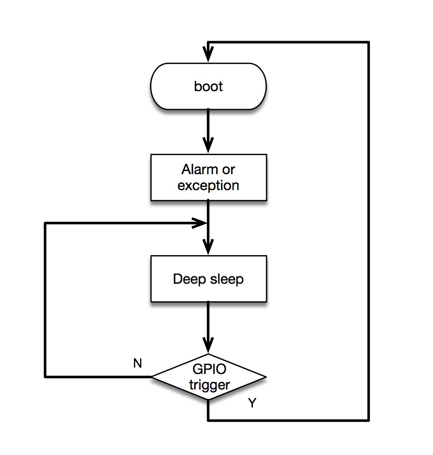
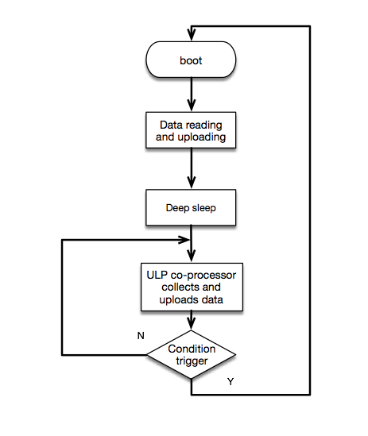

:orphan:

ESP32 Low-Power Management 
===================================

:link_to_translation:`zh_CN:[中文]`

-  Supported by its integrated Deep-sleep mode, ULP co-processor and RTC peripherals, ESP32 can be widely applied to a variety of
   power-sensitive applications. In Deep-sleep mode, all of the peripherals driven by APB\_CLK, CPU and RAM are powered down;
   RTC\_CLK is still running; and the RTC controller, RTC peripherals, ULP co-processor, RTC fast memory and RTC slow memory could be
   powered down or not, based on the specific setting of wake-up source in the application.
-  Resource involved:

   -  RTC peripherals – include on-chip temperature sensors, ADCs, RTC GPIOs and touchpads;
   -  ULP co-processor – can be used for simple data acquisition in Deep-sleep mode, or as a wake-up source to wake up the chip from
      Deep-sleep mode. ULP co-processor can access the RTC slow memory and the RTC registers;
   -  RTC fast memory – ESP32, coming out of deep sleep, runs
      immediately the wake stubs code for ESP-IDF, which is the ``esp\_wake\_deep\_sleep()`` function stored in RTC fast memory,
      before bootloader;
   -  RTC slow memory – stores data for the ULP co-processor and wake stubs code (i.e. esp\_wake\_deep\_sleep()).

-  ESP32 supported wake-up sources in Deep-sleep mode include:

   -  timers
   -  touchpads
   -  Ext(0): wakes up the chip when a specified GPIO pad meets certain
      requirement regarding electrical level
   -  Ext(1): wakes up the chip when a set of specified GPIO pads all
      meet certain requirements regarding electrical level
   -  ULP co-processor

Timed data acquisition and reporting (e.g., instrument status monitors)
~~~~~~~~~~~~~~~~~~~~~~~~~~~~~~~~~~~~~~~~~~~~~~~~~~~~~~~~~~~~~~~~~~~~~~~~~~~~

-  In this scenario, ESP32 is used to periodically collect sensor data
   and upload them. Timers can be used as the wake-up source in this
   case. To be more specific, ESP32 will collect and upload sensor data,
   set timers as the wake-up source, enter Deep-sleep mode, and collect
   and upload sensor data again when coming out of deep sleep...
-  Logical flow diagram：

.. figure:: ../../_static/low_power/low_power_flow_chart1.png
   :align: center

-  Logical flow：

   1. ESP32 collects and uploads sensor data after booting;
   2. Call function ``esp\_deep\_sleep\_enable\_timer\_wakeup(sleep\_time\_us)`` to set the sleep time in Deep-sleep mode;
   3. Call function ``esp\_deep\_sleep\_start()`` to enter Deep-sleep mode.

-  Due to the periodical wakeups, ESP32 can not achieve minimal power consumption in this scenario, but can still be used to collect and
   upload sensor data in some complex situations.
   
GPIO triggeredexception collection (e.g., smoke alarms)
~~~~~~~~~~~~~~~~~~~~~~~~~~~~~~~~~~~~~~~~~~~~~~~~~~~~~~~~~~~~

-  In this scenario, ESP32 will not collect and upload sensor data
   periodically. Instead, the sensor will automatically trigger specific
   GPIO(s), when detecting any abnormal data, to report exceptions. In
   this scenario, the RTC IO can be enabled as the wake-up source for
   ESP32:
-  when no exception is reported, ESP32 will stay in Deep-sleep mode;
-  only when the sensor collects abnormal data and the specified GPIO(s)
   is set to the specified electrical level(s), ESP32 will wake up from
   the Deep-sleep mode, and trigger an alarm or upload data.
-  Logical flow chart:

-  Logical flow

   1. ESP32 will read the abnormal data collected by the sensors, and
      trigger an alarm or upload data accordingly;
   2. Call function rtc\_gpio\_pulldown\_en(MY\_RTC\_WAKEUP\_IO) or
      rtc\_gpio\_pullup\_en(MY\_RTC\_WAKEUP\_IO) and complete the
      pull-up or pull-down settings for the RTC GPIO;
   3. Call function
      esp\_deep\_sleep\_enable\_ext0\_wakeup(MY\_RTC\_WAKEUP\_IO,
      WAKEUP\_IO\_LEVEL) or
      esp\_deep\_sleep\_enable\_ext1\_wakeup(WAKEUP\_PIN\_MASK,
      WAKEUP\_TYPE) and set the specific RTC GPIO, which functions as
      the wake-up source of ESP32 during deep sleep, to be high-level
      triggered or low-level triggered;
   4. Call function esp\_deep\_sleep\_start() to enter Deep-sleep mode.

-  In this scenario, ESP32 can achieve minimal power consumption, but
   will impose a higher requirement on sensors, i.e., the sensors must
   support GPIO trigger function. 
   
Data acquisition or abnormal detection (GPIO trigger is not supported and frequent data uploading is not needed)
~~~~~~~~~~~~~~~~~~~~~~~~~~~~~~~~~~~~~~~~~~~~~~~~~~~~~~~~~~~~~~~~~~~~~~~~~~~~~~~~~~~~~~~~~~~~~~~~~~~~~~~~~~~~~~~~~~~~

  
-  In this scenario, the data acquisition or anomaly detection will be
   initiated by the CPU or the on-chip peripherals, instead of the
   sensor, because GPIO trigger is not supported by the sensor in this
   case. The ULP co-processor, integrated in ESP32, can perform some
   simple data acquisition, and wake ESP32 up for further processing if
   specific conditions are met. The data collected during this process
   can be stored in the RTC slow memory for future reading when ESP32 is
   awake.
-  Logical flow diagram:

-  Users can write tailored assembly codes that will be executed by the
   ULP co-processor during ESP32's deep sleep, according to the
   instruction set for ULP co-processor. The process is as follows:

   1. ESP32 will read the data collected by the ULP co-processor during
      deep sleep from the RTC slow memory after booting, and upload
      these data;
   2. Call function ``ulp\_process\_macros\_and\_load()`` to copy the
      assembly codes into the RTC slow memory;
   3. Call function ``ulp\_run(ADDRESS)`` to start the ULP co-processor and
      execute the assembly codes stored in the RTC slow memory;
   4. Call function ``esp\_deep\_sleep\_start()`` to enter Deep-sleep mode.

-  ULP co-processor enables more convenient data acquisition and data
   storage. In this IoT Solution, we have specifically added a
   ulp\_monitor module, with which the user can easily start the ULP
   co-processor by directly calling a .c function:  [1]_

   1. ESP32 will read the data collected by the ULP co-processor during
      deep sleep from the RTC slow memory after booting, and upload
      them;
   2. Call function ``iot\_ulp\_monitor\_init(ULP\_PROGRAM\_ADDR,
      ULP\_DATA\_ADDR)`` to set the addresses for ULP co-processor's
      program execution and data storage;
   3. Call function ``iot\_ulp\_add\_adc\_monitor`` or
      ``iot\_ulp\_add\_temprature\_monitor`` to set the type of the data
      collected by the ULP co-processor and the wake-up conditions
      (these settings can be added at the same time);
   4. Call function ``iot\_ulp\_monitor\_start()`` to set the sampling
      frequency and start the ULP co-processor;
   5. Call function ``esp\_deep\_sleep\_start()`` to enter Deep-sleep mode.
      Currently, the ULP co-processor can only support data acquisition
      enabled by on-chip temperature sensor and ADC.

-  In this scenario, ESP32 can collect data frequently with limited
   power consumption, thus reducing the requirement on sensors.

User interaction scenario supported by touchpad trigger and GPIO trigger (e.g., control panels)
~~~~~~~~~~~~~~~~~~~~~~~~~~~~~~~~~~~~~~~~~~~~~~~~~~~~~~~~~~~~~~~~~~~~~~~~~~~~~~~~~~~~~~~~~~~~~~~~~~~~

-  In this scenario, ESP32 is mostly used for some user interaction
   devices, such as control panels. When there is no user operations
   (such as Touchpad trigger/ GPIO trigger) for a long time, ESP32 will
   enter Deep-sleep mode and enable the touchpad/GPIO as the wake-up
   source. In Deep-sleep mode, the average current consumption of the
   chip is about 30 uA, with the touchpad enabled as the wake-up source.
-  Logical flow diagram:

.. figure:: ../../_static/low_power/touchpad_deepsleep_process.png
   :align: center

-  Logical flow:

   1. ESP32 executes the user interaction and control programs after
      booting;
   2. Configure the specified touchpad enabled as the wake-up
      source; [2]_
   3. Call function esp\_deep\_sleep\_enable\_touchpad\_wakeup() to
      enable the touchpad as the wake-up source, and then call function
      esp\_deep\_sleep\_start() to enter Deep-sleep mode.

Power consumption of ESP32 in Deep-sleep mode with different wake-up sources enabled
--------------------------------------------------------------------------------------

-  In Active mode, the average current of ESP32, working as a Station,
   is about 115 mA:

   .. figure:: ../../_static/low_power/esp32_station_current.png

-  In Deep-sleep mode, the average current of ESP32, with the timer
   enabled as the wake-up source, is about 6 uA:

   .. figure:: ../../_static/low_power/esp32_deepsleep_timer_current.png

-  In Deep-sleep mode, the average current of ESP32, with the RTC IO
   enabled as the wake-up source, is about 6 uA: [3]_

   .. figure:: ../../_static/low_power/esp32_deepsleep_rtcio_current.png

-  In Deep-sleep mode, the ULP co-processor will perform data
   acquisition periodically (the sampling frequency is 10 times per
   minute in this example and the spikes in the chart below reflect the
   instantaneous current when the ULP co-processor is working):

   .. figure:: ../../_static/low_power/esp32_deepsleep_ulp_current.png

-  In Deep-sleep mode, the average current of ESP32, with the touchpad
   enabled as the wake-up source, is about 36 uA:
   
   .. figure:: ../../_static/low_power/touchpad.png
 

.. [1] For details on how to use the ulp\_monitor module, please see the related README.md and ulp\_monitor\_test.c files.

.. [2] Such as the initialization and threshold settings. For details, please see the Touchpad chapter in this IoT Solution.

.. [3] Function esp\_deep\_sleep\_enable\_ext1\_wakeup() is used in the test.
