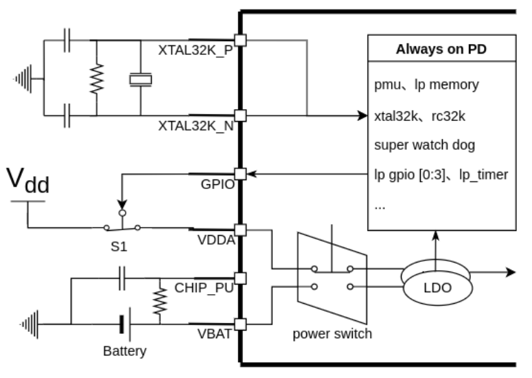
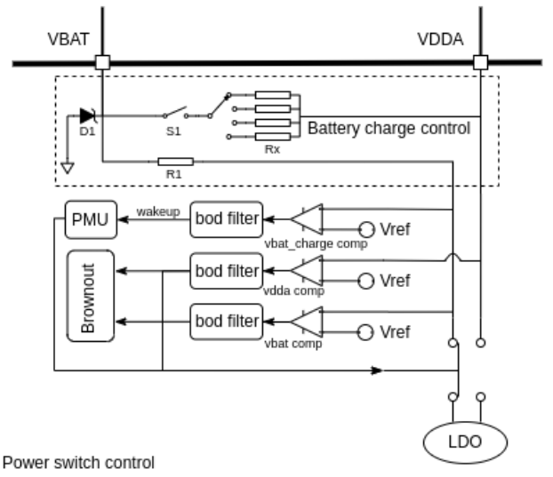

ESP32-P4 Battery Backup Solution
==================================

:link_to_translation:`zh_CN:[中文]`

The ESP32-P4 integrates RTC (Real-Time Clock) functionality, which includes a battery backup (VBAT), an external 32.768kHz crystal oscillator input, and power switching control, allowing it to maintain accurate time even when the main power is disconnected.

.. warning:: ESP-IDF does not fully support the VBAT scheme yet, and the current scheme is for testing purposes only. Please follow the process below to modify the ESP-IDF driver on the master branch.

**Supports the following features**:

- Supports timekeeping functionality during main power loss, with backup power supplied by the battery backup (VBAT) after power failure.
- Supports automatic power source switching by the PMU (Power Management Unit) during sleep/wake states.
- Supports battery backup voltage detection with threshold alarms.
- Supports charging of the battery backup; when VDDA is present, the battery backup (VBAT) can be charged through an internal resistor.

    ESP32-P4 Backup Battery Connection Diagram

Battery Connection and Circuit Protection
---------------------------------------------

The connection of the ESP32-P4 backup battery is very simple. The VBAT pin has an integrated charging protection circuit, so no external resistors or diodes are required, effectively reducing the harmful risks associated with adding components in the backup battery path.

    ESP32-P4 Battery Switch Control Block Diagram

Selection of Battery Backup
^^^^^^^^^^^^^^^^^^^^^^^^^^^^^^

- Low Self-Discharge Rate: The battery should have excellent leakage resistance.
- Charge and Discharge Performance: Batteries with a higher charge/discharge cycle count can extend the product's lifespan.
- Discharge Current: The VBAT supply consumes very little power (a few microamperes), so most batteries' discharge capabilities will be sufficient.
- Charging Current: VDDA supports charging the backup battery on VBAT. The charging current limit resistor can be configured by software, ranging from 1kΩ to 9kΩ.

.. warning:: It is strictly prohibited to connect a 3.6V rechargeable battery, as the voltage of a fully charged 3.6V battery can reach around 4V. Since the input voltage range for the VBAT pin is 2.3V ~ 3.6V, this could potentially damage the VBAT pin.

Decoupling Capacitor on the Battery
^^^^^^^^^^^^^^^^^^^^^^^^^^^^^^^^^^^^^^^

In circuit design, users typically add a decoupling capacitor for each power supply pin. However, when VBAT is used as a backup power input, leakage on the capacitor will significantly shorten the battery life. Moreover, since the battery itself has good capacitive characteristics, no external decoupling capacitor is needed.

.. note:: D1 and R1 are ESD protection components, and Rx is the charging protection resistor, limiting the charging current to below 1 mA. The protection circuit meets UL certification testing requirements.

Power Switching
-----------------

The power selection between VBAT and VDDA is automatically controlled by the PMU during sleep and wake states, or can be manually selected. Users need to configure the registers in advance. When the chip is in sleep mode, VDDA or VBAT can be configured as the power input.

- PMU_HP_SLEEP_VDDBAT_MODE: Selects the power supply during the HP_SLEEP state. 0: VDDA power supply, 1: VBAT power supply, 2: Auto selection.
- PMU_VDDBAT_SW_UPDATE: Set to 1 to make the configuration in the ``PMU_VDDBAT_CFG_REG`` register effective.
- PMU_LP_ANA_WAIT_TARGET: Sets the delay time during the wake-up process. The duration should be longer than the power-up stabilization time of the external VDDA power supply.

.. note:: Currently, ESP-IDF does not fully support the PMU driver. If you need to test the VBAT functionality, please follow the testing procedure below to add the necessary code in ESP-IDF.

The testing procedure is as follows:

1. Add the necessary header files in ``components/esp_hw_support/port/esp32p4/pmu_sleep.c``

.. code:: c

    #include "soc/pmu_reg.h"
    #include "soc/lp_analog_peri_reg.h"
    #include "soc/lp_gpio_struct.h"
    #include "esp_private/regi2c_ctrl.h"
    #include "soc/lp_analog_peri_reg.h"
    #include "soc/lp_analog_peri_struct.h"
    #include "esp_private/regi2c_ctrl.h"
    #include "soc/regi2c_bias.h"

2. Add the following code above ``pmu_ll_hp_set_sleep_enable(PMU_instance()->hal->dev);`` in the ``pmu_sleep_start`` function in ``components/esp_hw_support/port/esp32p4/pmu_sleep.c``:

Method 1: Automatic Switching Between VDDA and VBAT:

.. code:: c

    #define VBAT_MODE_VDDA 0
    #define VBAT_MODE_VBAT 1
    #define VBAT_MODE_AUTO 2

    REG_SET_FIELD(PMU_HP_SLEEP_LP_DIG_POWER_REG, PMU_HP_SLEEP_VDDBAT_MODE, VBAT_MODE_AUTO);
    REG_SET_BIT(PMU_VDDBAT_CFG_REG, PMU_VDDBAT_SW_UPDATE);
    while(VBAT_MODE_AUTO != REG_GET_FIELD(PMU_VDDBAT_CFG_REG, PMU_ANA_VDDBAT_MODE));

Method 2: Manual Configuration of VDDA and VBAT:

.. code:: c

    #define VBAT_MODE_VDDA 0
    #define VBAT_MODE_VBAT 1
    #define VBAT_MODE_AUTO 2

    REG_SET_FIELD(PMU_HP_SLEEP_LP_DIG_POWER_REG, PMU_HP_SLEEP_VDDBAT_MODE, VBAT_MODE_VDDA);
    REG_SET_BIT(PMU_VDDBAT_CFG_REG, PMU_VDDBAT_SW_UPDATE);
    while(VBAT_MODE_VDDA != REG_GET_FIELD(PMU_VDDBAT_CFG_REG, PMU_ANA_VDDBAT_MODE));
    REG_SET_FIELD(PMU_LP_SLEEP_LP_DIG_POWER_REG, PMU_LP_SLEEP_VDDBAT_MODE, VBAT_MODE_VBAT);
    REG_SET_FIELD(PMU_SLP_WAKEUP_CNTL5_REG, PMU_LP_ANA_WAIT_TARGET, 0xFF);

.. note:: After testing, the average VBAT current in deep sleep is 7 µA, and the average VBAT current in light sleep is 21 µA.

Backup Battery Runtime
^^^^^^^^^^^^^^^^^^^^^^^^

Taking the CR2032 battery (225 mAh) as an example, the theoretical standby time in deep sleep is 3.669 years.

Brown-out Detector & BOD filter
-----------------------------------

The Brown-out Detector of the ESP32-P4 supports monitoring the voltage of VDDA and VBAT. It triggers a signal when the voltage rapidly drops below a preset threshold and performs the corresponding actions.

Threshold Configuration and Voltage Relationship:

+-------------------------+---------+
| Threshold Configuration | Voltage |
+=========================+=========+
| 0                       | 2.52v   |
+-------------------------+---------+
| 1                       | 2.57v   |
+-------------------------+---------+
| 2                       | 2.63v   |
+-------------------------+---------+
| 3                       | 2.68v   |
+-------------------------+---------+
| 4                       | 2.74v   |
+-------------------------+---------+
| 5                       | 2.78v   |
+-------------------------+---------+
| 6                       | 2.83v   |
+-------------------------+---------+
| 7                       | 2.89v   |
+-------------------------+---------+

Create a new test project and add the following code to check the undervoltage flag:

.. code:: c

    REGI2C_WRITE_MASK(I2C_BIAS, I2C_BIAS_OR_DREFL_VDDA, 6);                                                                         
    REGI2C_WRITE_MASK(I2C_BIAS, I2C_BIAS_OR_DREFH_VDDA, 7);                                                                        // Vdda comparator voltage threshold set to 2.83 - 2.89
    REGI2C_WRITE_MASK(I2C_BIAS, I2C_BIAS_OR_DREFL_VBAT, 6);                                                                        
    REGI2C_WRITE_MASK(I2C_BIAS, I2C_BIAS_OR_DREFH_VBAT, 7);                                                                        // Vbat comparator voltage threshold set to 2.83 - 2.89

    REG_SET_FIELD(LP_ANALOG_PERI_VDDBAT_CHARGE_CNTL_REG, LP_ANALOG_PERI_VDDBAT_CHARGE_UNDERVOLTAGE_TARGET, 20);                    
    REG_SET_FIELD(LP_ANALOG_PERI_VDDBAT_CHARGE_CNTL_REG, LP_ANALOG_PERI_VDDBAT_CHARGE_UPVOLTAGE_TARGET, 10);                       // Set the time threshold for the BOD filter, in 20 MHz cycles.
    REG_SET_BIT(LP_ANALOG_PERI_VDDBAT_CHARGE_CNTL_REG, LP_ANALOG_PERI_VDDBAT_CHARGE_CNT_CLR);
    esp_rom_delay_us(30);
    REG_CLR_BIT(LP_ANALOG_PERI_VDDBAT_CHARGE_CNTL_REG, LP_ANALOG_PERI_VDDBAT_CHARGE_CNT_CLR);

    while (1)
    {
        printf("value:%lx\n", REG_READ(LP_ANALOG_PERI_VDD_SOURCE_CNTL_REG));
        REG_WRITE(LP_ANALOG_PERI_VDD_SOURCE_CNTL_REG, 0X30020000);                                                                 // clear VBAT flag
        REG_WRITE(LP_ANALOG_PERI_VDD_SOURCE_CNTL_REG, 0X30040000);                                                                 // clear VDDA flag
        vTaskDelay(500 / portTICK_PERIOD_MS);
    }

Battery Charging Circuit
-------------------------------

When a rechargeable battery is selected as the VBAT power input, the chip supports detecting the battery voltage and, when it falls below the set threshold, it charges the VBAT-side battery through VDDA in reverse.

Threshold Configuration and Voltage Relationship:

+-------------------------+---------+
| Threshold Configuration | Voltage |
+=========================+=========+
| 0                       | 2.52v   |
+-------------------------+---------+
| 1                       | 2.57v   |
+-------------------------+---------+
| 2                       | 2.63v   |
+-------------------------+---------+
| 3                       | 2.68v   |
+-------------------------+---------+
| 4                       | 2.74v   |
+-------------------------+---------+
| 5                       | 2.78v   |
+-------------------------+---------+
| 6                       | 2.83v   |
+-------------------------+---------+
| 7                       | 2.89v   |
+-------------------------+---------+

Create a new test project and add the following code to check the undervoltage flag:

.. code:: c

    REGI2C_WRITE_MASK(I2C_BIAS, I2C_BIAS_OR_DREFL_VDDA, 6);                                                                        
    REGI2C_WRITE_MASK(I2C_BIAS, I2C_BIAS_OR_DREFH_VDDA, 7);                                                                        // Vdda comparator voltage threshold set to 2.83 - 2.89
    REGI2C_WRITE_MASK(I2C_BIAS, I2C_BIAS_OR_DREFL_VBAT, 6);                                                                        
    REGI2C_WRITE_MASK(I2C_BIAS, I2C_BIAS_OR_DREFH_VBAT, 7);                                                                        // Vbat comparator voltage threshold set to 2.83 - 2.89

    REGI2C_WRITE_MASK(I2C_BIAS, I2C_BIAS_OR_DREFL_VBAT_CHARGER, 6);                                                                
    REGI2C_WRITE_MASK(I2C_BIAS, I2C_BIAS_OR_DREFH_VBAT_CHARGER, 7);                                                                // Charging detection comparator threshold setting.
    REGI2C_WRITE_MASK(I2C_BIAS, I2C_BIAS_OR_FORCE_PU_VBAT_CHARGER, 1);                                                             // Force power-on of the vbat_charger comparator.

    REG_SET_FIELD(LP_ANALOG_PERI_VDDBAT_CHARGE_CNTL_REG, LP_ANALOG_PERI_VDDBAT_CHARGE_UNDERVOLTAGE_TARGET, 20);                    
    REG_SET_FIELD(LP_ANALOG_PERI_VDDBAT_CHARGE_CNTL_REG, LP_ANALOG_PERI_VDDBAT_CHARGE_UPVOLTAGE_TARGET,    10);                    // Set the time threshold for the BOD filter, in 20 MHz cycles.
    REG_SET_BIT(LP_ANALOG_PERI_VDDBAT_CHARGE_CNTL_REG, LP_ANALOG_PERI_VDDBAT_CHARGE_CNT_CLR);
    esp_rom_delay_us(30);
    REG_CLR_BIT(LP_ANALOG_PERI_VDDBAT_CHARGE_CNTL_REG, LP_ANALOG_PERI_VDDBAT_CHARGE_CNT_CLR);

    while(1)
    {
        printf("value:%lx\n", REG_GET_BIT(LP_ANALOG_PERI_VDDBAT_CHARGE_CNTL_REG, LP_ANALOG_PERI_VDDBAT_CHARGE_UNDERVOLTAGE_FLAG)); // Get VBAT pin charge flag
        vTaskDelay(500 / portTICK_PERIOD_MS);
    }

Peripheral Support in VBAT Power Supply Scenario
---------------------------------------------------

RTC TIMER
^^^^^^^^^^^^

After switching to VBAT power supply when entering sleep mode, the RTC TIMER continues to count normally after VDDA is powered off. After restarting, the time display is normal. The test code is as follows:

.. code:: c

    time_t now;
    char strftime_buf[64];
    struct tm timeinfo;
    time(&now);
    localtime_r(&now, &timeinfo);
    strftime(strftime_buf, sizeof(strftime_buf), "%c", &timeinfo);
    printf( "The current date/time is: %s\n", strftime_buf);

    const gpio_config_t config = {
        .pin_bit_mask = BIT(GPIO_NUM_0),
        .mode = GPIO_MODE_INPUT,
    };

    ESP_ERROR_CHECK(gpio_config(&config));
    esp_deep_sleep_enable_gpio_wakeup(BIT(GPIO_NUM_0), 0);

    esp_deep_sleep_start();

.. note:: You need to add the power switching code in ESP-IDF according to the above 'Power Switching' section. Meanwhile, the test process involved waiting for a period after VDDA power-off, then powering it back on, and using GPIO0 to wake up the ESP32-P4, comparing the time difference before and after sleep.

LP GPIO/ADC/UART Peripheral
^^^^^^^^^^^^^^^^^^^^^^^^^^^^^

Please refer to the test driver in ``examples/system/ulp/lp_core`` in ESP-IDF for testing. The current GPIO/ADC/UART test already support ESP32-P4.
