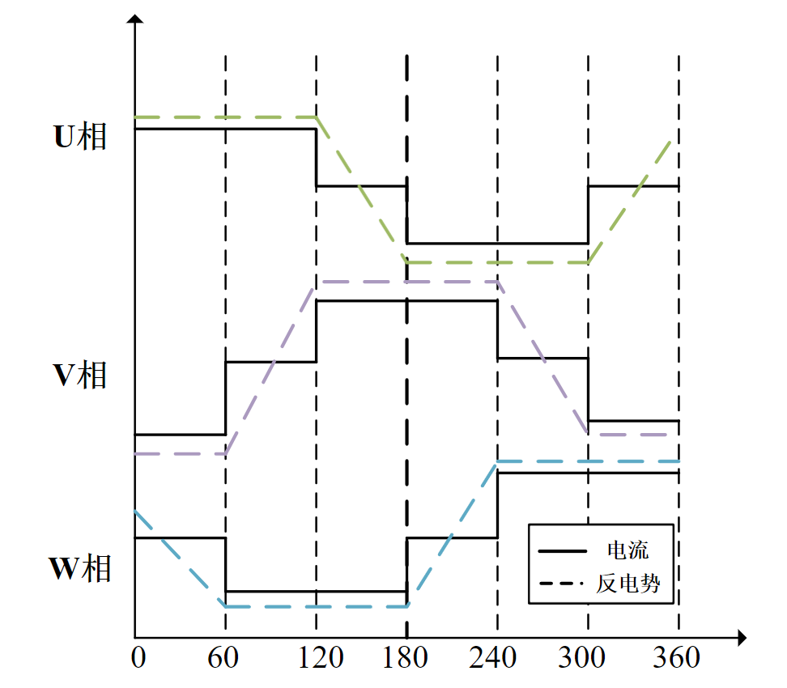
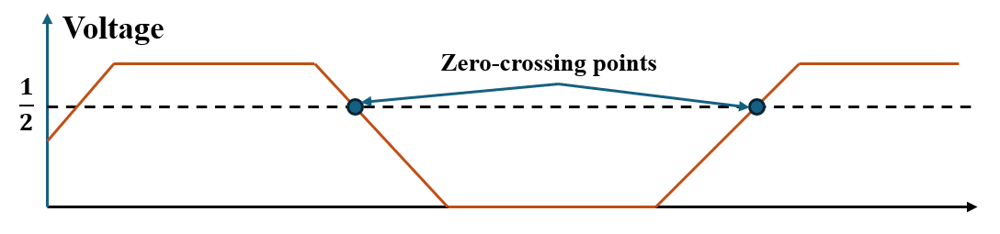
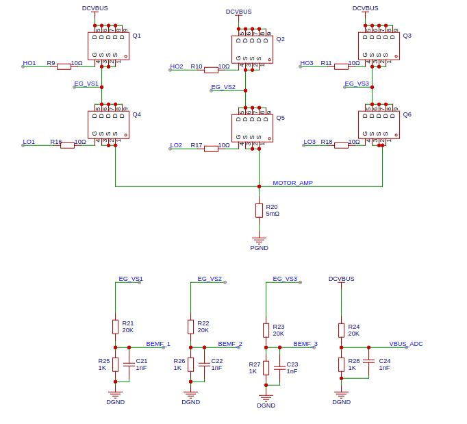

Sensorless Square Wave Motor Control Based on ADC Sampling
============================================================

:link_to_translation:`zh_CN:[中文]`

This guide includes the following content:

.. contents:: Table of Contents
    :local:
    :depth: 2

Initial Position Detection
--------------------------

From the balanced voltage equation of one phase of a BLDC motor :math:`u_{a}=Ri_{a}+L_{a}\frac{di_{a}}{dt}+e_{a}`, we know that when the motor is stationary, the back EMF is zero, so the armature current is:

.. math::
    i=\frac{U}{R}\left(1-\frac{1}{e^{\tau}}\right)

By analyzing the above formula, we can accurately determine the position range of the rotor by applying a high-frequency voltage to generate the corresponding pulse current and comparing the magnitude of the pulse current.

To obtain the initial position of the rotor, the `esp_sensorless_bldc_control` component sequentially applies voltage pulses at startup, obtains the current pulses on the sampling resistor, and compares the magnitudes of the 6 vectors to determine the interval of the maximum vector.

.. table:: Pulse Injection Sequence
   :align: center

   +----------+-----+-----+-----+
   | Order    | U   | V   | W   |
   +==========+=====+=====+=====+
   | 1        | Udc | Udc | GND |
   +----------+-----+-----+-----+
   | 2        | GND | GND | Udc |
   +----------+-----+-----+-----+
   | 3        | Udc | GND | Udc |
   +----------+-----+-----+-----+
   | 4        | GND | Udc | GND |
   +----------+-----+-----+-----+
   | 5        | GND | Udc | Udc |
   +----------+-----+-----+-----+
   | 6        | Udc | GND | GND |
   +----------+-----+-----+-----+

.. note::
    1. In the stationary state, specific voltage vectors are injected into the BLDC motor, each vector for a fixed time :math:`T_{s}`, to ensure the magnitude of the injected current.
    2. The bus current is sampled at the end of the voltage vector injection.
    3. Sequentially inject the remaining voltage vectors, compare the current values under each voltage vector, determine the maximum current identifier, and obtain the initial position of the rotor.

Sensorless Control of BLDC Based on ADC Scheme
----------------------------------------------

Back EMF Definition
^^^^^^^^^^^^^^^^^^^

When the BLDC motor rotates, each winding generates a back EMF voltage. According to Lenz's law, the polarity of the back EMF is opposite to the main voltage. The back EMF calculation formula is:

.. math::
    BEMF = NlrB\omega

where N is the number of turns of the winding, l is the length of the rotor, r is the inner radius of the rotor, B is the magnetic field of the rotor, and :math:`\omega` is the angular velocity.

When the motor is fixed, the parameters of the motor winding and rotor are fixed. The back EMF of the motor is only proportional to the angular velocity.

The following figure shows the current and back EMF waveforms during one electrical cycle of the motor.

    Current and Back EMF Waveforms

Zero-crossing Sampling Principle of ADC Scheme
^^^^^^^^^^^^^^^^^^^^^^^^^^^^^^^^^^^^^^^^^^^^^^

When the BLDC motor rotates, the zero-crossing point of the back EMF occurs in the floating phase. By detecting the phase-to-ground voltage of each phase and comparing it with the DC bus voltage, the zero-crossing event occurs when the terminal voltage equals half of the DC bus voltage. In the ADC-based zero-crossing detection scheme, the terminal voltage and the DC bus voltage are measured simultaneously and compared to obtain the zero-crossing signal.

    Implementation of ADC Zero-crossing Detection

Zero-crossing Sampling Hardware of ADC Scheme
^^^^^^^^^^^^^^^^^^^^^^^^^^^^^^^^^^^^^^^^^^^^^

    ADC Zero-crossing Detection Hardware

To simplify the calculation process, the same voltage divider ratio is used for both the terminal voltage and the DC bus voltage. In the 12V motor control scheme, a voltage divider ratio of :math:`1/21` is used to keep the DC bus voltage and terminal voltage within the :math:`V_{ref}` range of the ESP32 series chips.

.. note::
    Note that the voltage needs to be converted to a range that the ESP32 ADC can collect. Please refer to: `ESP32 ADC <https://docs.espressif.com/projects/esp-idf/en/latest/esp32/api-reference/peripherals/adc_oneshot.html>`__
