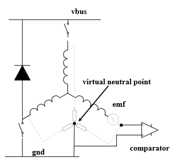
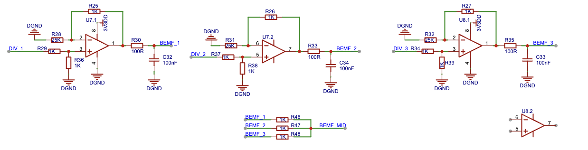

Sensorless Square Wave Motor Control Based on Comparator Detection
===================================================================

:link_to_translation:`zh_CN:[中文]`

This guide includes the following content:

.. contents:: Table of Contents
    :local:
    :depth: 2

Sensorless Control of BLDC Based on Comparator Scheme
-----------------------------------------------------

Back EMF Definition
^^^^^^^^^^^^^^^^^^^
When the BLDC motor rotates, each winding generates a back EMF voltage. According to Lenz's law, the polarity of the back EMF is opposite to the main voltage. The back EMF calculation formula is:

.. math::
    BEMF = NlrB\omega

where N is the number of turns of the winding, l is the length of the rotor, r is the inner radius of the rotor, B is the magnetic field of the rotor, and :math:`\omega` is the angular velocity.

When the motor is fixed, the parameters of the motor winding and rotor are fixed. The back EMF of the motor is only proportional to the angular velocity.

The following figure shows the current and back EMF waveforms during one electrical cycle of the motor.

.. figure:: ../../../_static/motor/bldc/bldc_electrical_degrees.png
    :align: center
    :width: 60%

    Current and Back EMF Waveforms

Zero-crossing Sampling Principle of Comparator Scheme
^^^^^^^^^^^^^^^^^^^^^^^^^^^^^^^^^^^^^^^^^^^^^^^^^^^^^
When the BLDC motor rotates, the zero-crossing point of the back EMF occurs in the floating phase. By detecting the phase-to-ground voltage of each phase and comparing it with the neutral point voltage, the zero-crossing event occurs when the terminal voltage changes from greater than to less than the neutral point voltage or from less than to greater than the neutral point voltage. However, generally, the neutral point is not accessible in BLDC motors, making direct measurement of the neutral point voltage impossible. In the comparator-based zero-crossing detection scheme, the three-phase windings are connected to a common point through resistors of equal value to reconstruct the neutral point, and the zero-crossing signal is obtained by comparing the neutral point with the terminal voltage using a comparator.

    Comparator Zero-crossing Principle

Zero-crossing Sampling Hardware of Comparator Scheme
^^^^^^^^^^^^^^^^^^^^^^^^^^^^^^^^^^^^^^^^^^^^^^^^^^^^

    Comparator Zero-crossing Hardware

Using resistors of equal value to connect each phase to construct a virtual neutral point. Taking the U phase as an example, the U phase back EMF and the neutral point are compared using a comparator to output the zero-crossing signal.

Each phase back EMF has situations where it changes from positive to negative and from negative to positive, resulting in six zero-crossing states for the three phases. For ease of program processing, `esp_sensorless_bldc_control` maps the detected six states to the next commutation action:

.. list-table:: Forward Mapping Table
   :widths: 10 10 10 10 15 15 15
   :header-rows: 1
   :align: center

   * - Order
     - ZERO U
     - ZERO U
     - ZERO U
     - U Phase State
     - V Phase State
     - W Phase State
   * - ↑
     - 0
     - 0
     - 1
     - Upper Open Lower Close
     - Upper Close Lower Open
     - Upper Close Lower Close
   * - ↑
     - 0
     - 1
     - 1
     - Upper Open Lower Close
     - Upper Close Lower Close
     - Upper Close Lower Open
   * - ↑
     - 0
     - 1
     - 0
     - Upper Close Lower Close
     - Upper Open Lower Close
     - Upper Close Lower Open
   * - ↑
     - 1
     - 1
     - 0
     - Upper Close Lower Open
     - Upper Open Lower Close
     - Upper Close Lower Close
   * - ↑
     - 1
     - 0
     - 0
     - Upper Close Lower Open
     - Upper Close Lower Close
     - Upper Open Lower Close
   * - ↑
     - 1
     - 0
     - 1
     - Upper Close Lower Close
     - Upper Close Lower Open
     - Upper Open Lower Close

.. list-table:: Reverse Mapping Table
   :widths: 10 10 10 10 15 15 15
   :header-rows: 1
   :align: center

   * - Order
     - ZERO U
     - ZERO U
     - ZERO U
     - U Phase State
     - V Phase State
     - W Phase State
   * - ↓
     - 0
     - 1
     - 0
     - Upper Close Lower Open
     - Upper Open Lower Close
     - Upper Close Lower Close
   * - ↓
     - 1
     - 1
     - 0
     - Upper Close Lower Open
     - Upper Close Lower Close
     - Upper Open Lower Close
   * - ↓
     - 1
     - 0
     - 0
     - Upper Close Lower Close
     - Upper Close Lower Open
     - Upper Open Lower Close
   * - ↓
     - 1
     - 0
     - 1
     - Upper Open Lower Close
     - Upper Close Lower Open
     - Upper Close Lower Close
   * - ↓
     - 0
     - 0
     - 1
     - Upper Open Lower Close
     - Upper Close Lower Close
     - Upper Close Lower Open
   * - ↓
     - 0
     - 1
     - 1
     - Upper Close Lower Close
     - Upper Open Lower Close
     - Upper Close Lower Open
