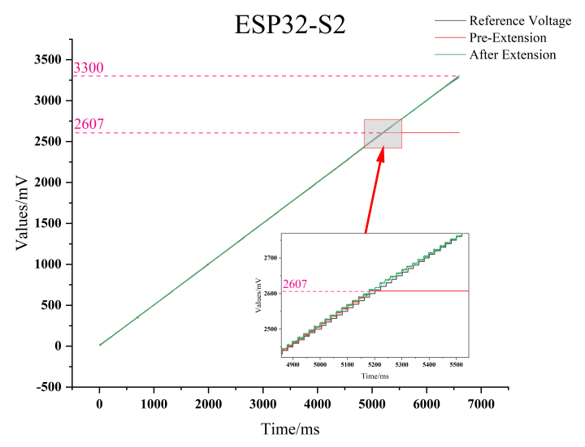
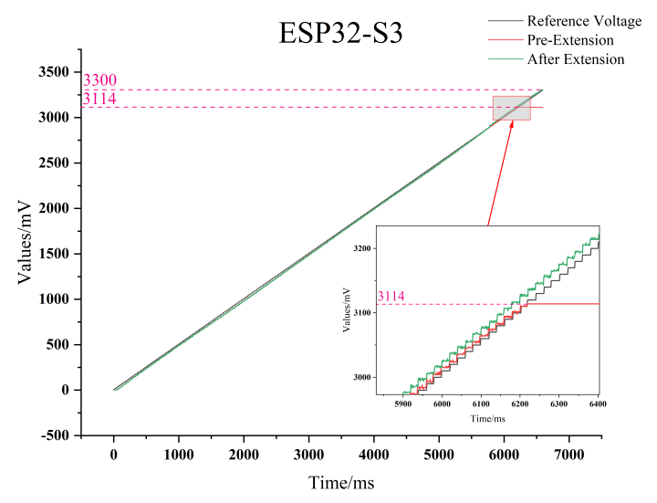

ADC Range Extension Solution
================================
:link_to_translation:`zh_CN:[中文]`

.. important:: The current ADC extended range solution is only applicable to ESP32-S2 and ESP32-S3 chips.

The ESP32-S2/S3 ADC, within its default range, can handle most ADC functionalities such as key input and battery voltage detection through an external voltage divider circuit. However, for applications like NTC measurements, full-scale measurement (0 ~ 3300 mV) may be required. By configuring the registers to adjust the ADC's offset voltage and applying a nonlinear compensation method for the high-voltage region, we can extend the range of the ESP32-S2/S3 ADC.

The process is as follows:

1. Measure the first voltage value using the default offset
2. If the measured voltage is less than the ``set voltage``, directly output the measured voltage as the result
3. If the measured voltage is greater than the ``set voltage``, increase the offset voltage, perform a second measurement, apply nonlinear correction, and output the corrected value as the result
4. Restore the offset value once measurement is completed

Overall, during each ADC measurement, there will be 1-2 times ADC reading. For most application scenarios, the measurement delay introduced by this scheme is negligible.

.. note:: For the ESP32-S2, the ``set voltage`` is 2600 mV; for the ESP32-S3, the ``set voltage`` is 2900 mV.

Patch Use Guide
-------------------

.. important:: This patch is developed based on ESP-IDF ``v4.4.8`` and ``v5.3.1``. If you need to use this solution with other versions of ESP-IDF, please refer to the patch content and modify ESP-IDF accordingly.

How to Apply a Patch Based on ESP-IDF ``v4.4.8``
^^^^^^^^^^^^^^^^^^^^^^^^^^^^^^^^^^^^^^^^^^^^^^^^^^^^

* ESP32-S2 ADC Extension Patch Download：:download:`esp32s2_adc_range_to_3300.patch <../../_static/esp32s2_adc_range_to_3300.patch>`
* ESP32-S3 ADC Extension Patch Download：:download:`esp32s3_adc_range_to_3300.patch <../../_static/esp32s3_adc_range_to_3300.patch>`

Using the ESP32-S3 as an example, please load the patch as follows:

1. Please make sure ESP-IDF has been ``checked out`` to the ``v4.4.8``
2. Using command ``git am --signoff < esp32s3_adc_range_to_3300.patch`` to apply the patch to ESP-IDF
3. Please note that this solution is only effective for the ``esp_adc_cal_get_voltage`` interface. Users can directly call this interface to obtain the extended readings.

How to Apply a Patch Based on ESP-IDF ``v5.3.1``
^^^^^^^^^^^^^^^^^^^^^^^^^^^^^^^^^^^^^^^^^^^^^^^^^^^^

* ESP32-S2 ADC Extension Patch Download：:download:`esp32s2_adc_range_to_3300_v531.patch <../../_static/esp32s2_adc_range_to_3300_v531.patch>`
* ESP32-S3 ADC Extension Patch Download：:download:`esp32s3_adc_range_to_3300_v531.patch <../../_static/esp32s3_adc_range_to_3300_v531.patch>`

Using the ESP32-S3 as an example, please load the patch as follows:

1. Please make sure ESP-IDF has been ``checked out`` to the ``v5.3.1``
2. Using command ``git am --signoff < esp32s3_adc_range_to_3300_v531.patch`` to apply the patch to ESP-IDF
3. Please note that this solution is only effective for the ``adc_oneshot_get_calibrated_result`` interface. Users can directly call this interface to obtain the extended readings.

API Guide
-------------

The method to obtain the voltage value after ADC range extension varies for different versions of ESP-IDF:

- ESP-IDF ``v4.4.8``

  1. To get the range expansion result, users must directly use ``esp_adc_cal_get_voltage`` to get the voltage of ``ADC1`` or ``ADC2``.
  2. Other APIs of ESP-IDF ``v4.4.8`` ADC are not affected, and the read results are consistent with the default results

- ESP-IDF ``v5.3.1``

  1. To get the range expansion result, users must directly use ``adc_oneshot_get_calibrated_result`` to get the voltage of ``ADC1`` or ``ADC2``.
  2. Other APIs of ESP-IDF ``v5.3.1`` ADC are not affected, and the read results are consistent with the default results

The patch enables ADC range extension by default and uses the ``float`` data type for correction. If you need to disable ADC extension or change the data type used during the correction process, please refer to the following procedure:

*  For ESP-IDF ``v4.4.8``: Please use ``menuconfig`` to modify the settings under ``Component config → Driver configurations → ADC configuration → ADC User Code Offset``
*  For ESP-IDF ``v5.3.1``: Please use ``menuconfig`` to modify the settings under ``Component config → ADC and ADC Calibration → ADC User Code Offset``

Comparison of ADC Range Extension Effects
--------------------------------------------

ESP32-S2 ADC Range Extension Effects Comparison:
^^^^^^^^^^^^^^^^^^^^^^^^^^^^^^^^^^^^^^^^^^^^^^^^^^

ESP32-S3 ADC Range Extension Effects Comparison:
^^^^^^^^^^^^^^^^^^^^^^^^^^^^^^^^^^^^^^^^^^^^^^^^^^

