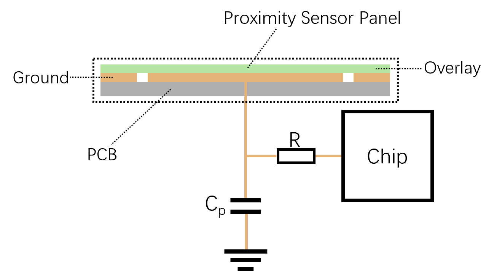

Touch Proximity Sensor
===========================

:link_to_translation:`zh_CN:[中文]`

The ``touch_proximity_sensor`` component is developed based on the built-in touch sensors of ESP32-S3. Using this component makes it easy to implement touch proximity sensing functionality.

.. note::
   - ESP32/ESP32-S2/ESP32-S3 touch-related components are intended for testing or demo purposes only. Due to the poor anti-interference capability of the touch functionality, it may not pass EMS testing, and therefore, it is not recommended for mass production products.
   - This component is currently only applicable to the ESP32-S3 and requires an IDF version greater than or equal to v5.0.

Principle of Operation
----------------------------

The touch proximity sensor is implemented based on the proximity sensing feature of the ESP32-S3 touch sensor. The hardware schematic of the sensor principle is as follows:

When a target object approaches the sensor, its equivalent capacitance changes. The target object can be a human finger, hand, or any conductive object.
When the touch sensor is configured in proximity sensing mode, the sensor output is an accumulated value. As the target object approaches the sensor panel, the cumulative value output by the sensor increases.
Based on this characteristic, this solution defines the raw data output by the touch sensor (accumulated value) as `raw_value` , and derives two data variables, `baseline` and `smooth_value`, from it. Combined with a reasonable threshold detection algorithm, proximity sensing functionality is achieved.

The specific software implementation involves the following three steps:

1. Determine the validity of new data.
2. Update `smooth_value` and `baseline` based on the update logic of `smooth_value` and `baseline` using `raw_value` as the source data.
3. Determine whether `smooth_value - baseline` is greater than 0. If it is greater than 0, then determine whether it is greater than the **trigger threshold** .
   If it is greater, it is deemed as a valid sensing trigger action; if `smooth_value - baseline` is less than 0, first determine whether it is in a triggered state.
   If it is in a triggered state, then determine whether its absolute value is greater than the **release trigger threshold** . If it is greater, it is deemed as a valid trigger release action.

Hardware Reference for Testing
-------------------------------------

- Development board

   - Validation testing can be performed using the `ESP-S2S3-Touch-DevKit-1 <https://docs.espressif.com/projects/espressif-esp-dev-kits/zh_CN/latest/esp32s2/esp32-s2-touch-devkit-1/user_guide.html>`__ development kit. The mainboard is ``MainBoard v1.1``, and the proximity sensing subboard is ``Proximity Board V1.0``.

Configuration Reference
-----------------------------

Create Proximity Sensing Sensor
^^^^^^^^^^^^^^^^^^^^^^^^^^^^^^^^^^^^^^

Using the ``touch_proximity_sensor`` component, the proximity sensing sensor can be configured via the :cpp:type:`touch_proxi_config_t` structure.

.. code:: c

    typedef struct {
        uint32_t channel_num;                           /*!< Number of touch proximity sensor channels */
        uint32_t *channel_list;                         /*!< Touch channel list */
        float *channel_threshold;                       /*!< Threshold for touch detection for each channel */
        uint32_t debounce_times;                        /*!< Number of consecutive readings needed to confirm state change */
        uint32_t *channel_gold_value;                   /*!< Reference values for touch channels */
        bool skip_lowlevel_init;                        /*!< Skip low level initialization when working with existing touch driver */
    } touch_proxi_config_t;

The main parameters are:

+--------------------+---------------------------------------------------------------+
|     Parameter      |                          Description                          |
+====================+===============================================================+
| channel_num        | Number of touch proximity sensor channels, up to 3            |
+--------------------+---------------------------------------------------------------+
| channel_list       | Array of touch channel numbers to be used                     |
+--------------------+---------------------------------------------------------------+
| channel_threshold  | Array of threshold values for each channel                    |
+--------------------+---------------------------------------------------------------+
| debounce_times     | Number of consecutive readings needed to confirm state change |
+--------------------+---------------------------------------------------------------+
| channel_gold_value | Optional reference values for touch channels                  |
+--------------------+---------------------------------------------------------------+
| skip_lowlevel_init | Skip low level init when working with existing touch driver   |
+--------------------+---------------------------------------------------------------+

After configuring the parameters, create the proximity sensor using :cpp:func:`touch_proximity_sensor_create`:

.. code:: c

    touch_proxi_config_t config = {
        .channel_num = 1,
        .channel_list = channel_list,
        .channel_threshold = channel_threshold,
        .debounce_times = 2,
    };
    
    esp_err_t ret = touch_proximity_sensor_create(&config, &sensor_handle, callback_func, NULL);

Event Handling
^^^^^^^^^^^^^^^^^^^^^

The proximity sensor requires periodic event handling to update states and trigger callbacks. This can be done in a task:

.. code:: c

    void proximity_task(void *arg)
    {
        while (1) {
            touch_proximity_sensor_handle_events(sensor_handle);
            vTaskDelay(pdMS_TO_TICKS(20));
        }
    }

    // Create task
    xTaskCreate(proximity_task, "proximity_task", 2048, NULL, 5, NULL);

Delete the Proximity Sensing Sensor
^^^^^^^^^^^^^^^^^^^^^^^^^^^^^^^^^^^^^^^^^^^
Use :cpp:func:`touch_proximity_sensor_delete` to delete the proximity sensing sensor object and release resources:

.. code:: c

    // Delete the touch proximity sensor
    touch_proximity_sensor_delete(sensor_handle);

Parameter Adjustment Reference
-----------------------------------

* The maximum value for `channel_num` is 3.
* The `channel_list` array must be assigned values from the `touch_pad_t` enumeration variable.
* `meas_count` has a default value of 20. Increasing `meas_count` slows down the update rate of new data from the touch sensor.
* `smooth_coef` has a default value of 0.7. It is the coefficient used for data smoothing. The smoothed value `smooth` equals `smooth * (1.0 - smooth_coef) + raw * smooth_coef` . A larger `smooth_coef` gives more weight to `raw` , resulting in poorer smoothing of the waveform, faster response to `raw` , and weaker resistance to interference. Conversely, a smaller `smooth_coef` gives less weight to `raw`, resulting in better smoothing of the waveform, slower response to `raw`, and stronger resistance to interference.
* `baseline_coef` has a default value of 0.05. It is the coefficient for baseline updating. The new baseline value equals `baseline * (1.0 - baseline_coef) + smooth * baseline_coef` . A larger value for `baseline_coef` causes the baseline to follow `smooth` more quickly, resulting in slower response time and stronger resistance to interference.
* `max_p` has a default value of 0.5. When the difference between `raw` and `baseline` exceeds `baseline * max_p` , the `raw` value is considered an outlier and ignored.
* `min_n` has a default value of 0.05. When the difference between `baseline` and `raw` exceeds `baseline * min_n` , the `raw` value is considered an outlier and ignored.
* Increasing `threshold_p` and `threshold_n` values reduces the sensing distance for proximity sensing, but improves resistance to interference.
* `noise_p` has a default value of 0.1, and `noise_n` has a default value of 0.2. Larger values for `noise_p` and `noise_n` make it easier for the baseline to follow `smooth` , resulting in a smaller sensing distance for proximity sensing and better resistance to interference.
* `debounce_p` and `debounce_n` values need to be adjusted based on the value of `meas_count` . Smaller `meas_count` values require larger `debounce_p` and `debounce_n` values to increase resistance to interference.
* `reset_p` has a default value of 0, used for baseline reset positive debounce. Setting to 0 disables this feature.
* `reset_n` has a default value of 50, used for baseline reset negative debounce.

Parameter Adjustment Comparison
^^^^^^^^^^^^^^^^^^^^^^^^^^^^^^^^^^^^^
The default configuration parameters for the touch proximity sensor are as follows:

+---------------+----------------+
|   Parameter   | Default Value  |
+===============+================+
| channel_num   | 1              |
+---------------+----------------+
| channel_list  | TOUCH_PAD_NUM8 |
+---------------+----------------+
| meas_count    | 20             |
+---------------+----------------+
| smooth_coef   | 0.7            |
+---------------+----------------+
| baseline_coef | 0.05           |
+---------------+----------------+
| max_p         | 0.5            |
+---------------+----------------+
| min_n         | 0.05           |
+---------------+----------------+
| noise_p       | 0.1            |
+---------------+----------------+
| noise_n       | 0.2            |
+---------------+----------------+
| debounce_p    | 2              |
+---------------+----------------+
| debounce_n    | 50             |
+---------------+----------------+
| reset_p       | 0              |
+---------------+----------------+
| reset_n       | 50             |
+---------------+----------------+

The following parameter adjustment comparisons will be made based on modifying **only one parameter** from the above parameters:

1. Modifying the value of `meas_count` changes the update rate of sensor data, with smaller values resulting in a wider waveform during sensing.
   The waveform comparison under different `meas_count` is shown below:

    .. figure:: ../../_static//touch/touch_proximity_sensor/meas_count.png
        :align: center
        :width: 75%
        :alt: Waveform comparison under different meas_count

2. Modifying the value of `smooth_coef` changes the smoothing effect of the `smooth` waveform. The smaller the `smooth_coef`, the better the smoothing effect, stronger resistance to interference, slower response to `raw` , and vice versa.
   The waveform comparison under different `smooth_coef` is shown below:

    .. figure:: ../../_static/touch/touch_proximity_sensor/smooth_coef.png
        :align: center
        :width: 75%
        :alt: Waveform comparison under different smooth_coef

3. Modifying the value of `baseline_coef` changes the updating effect of the `baseline` . Smaller values of `baseline_coef` result in slower response time and longer trigger duration. 
   The waveform comparison under different `baseline_coef` is shown below:

    .. figure:: ../../_static/touch/touch_proximity_sensor/baseline_coef.png
        :align: center
        :width: 75%
        :alt: Waveform comparison under different baseline_coef

4. Modifying the values of `max_p` and `min_n` will change the update logic of `smooth` and `baseline` . A too small value of `max_p` can cause the `smooth` to be "locked" when the hand approaches the sensing panel, potentially leading to failure to trigger; a too small value of `min_n` can cause both `smooth` and `baseline` to be "locked" when the hand leaves the sensing panel, resulting in failure to release the trigger.
   The waveform diagram for too small `max_p` and `min_n` values is as follows:

    .. figure:: ../../_static/touch/touch_proximity_sensor/max_p_and_min_n.png
        :align: center
        :width: 75%
        :alt: Waveform comparison under different max_p and min_n

5. Modifying the value of `threshold_p` will change the proximity sensing distance. A smaller value allows for a longer sensing distance but decreases resistance to interference, making false triggers more likely.
   The waveform comparison under different `threshold_p` values is shown below:

    .. figure:: ../../_static/touch/touch_proximity_sensor/threshold.png
        :align: center
        :width: 75%
        :alt: Waveform comparison under different threshold_p

6. Modifying the value of `hysteresis_p` will change the timing of triggering and releasing the trigger, i.e., the hysteresis. A smaller `hysteresis_p` value leads to faster trigger response, and vice versa.
   The waveform comparison under different `hysteresis_p` values is shown below:

    .. figure:: ../../_static/touch/touch_proximity_sensor/hysteresis_p.png
        :align: center
        :width: 75%
        :alt: Waveform comparison under different hysteresis_p

7. Modifying the values of `noise_p` and `noise_n` will change the updating effect of `baseline` . A smaller value of `noise_p` causes `baseline` to follow `smooth` more slowly, resulting in slower trigger response and longer trigger duration, and vice versa.
   The waveform comparison under different `noise_p` and `noise_n` values is shown below:

    .. figure:: ../../_static/touch/touch_proximity_sensor/noise.png
        :align: center
        :width: 75%
        :alt: Waveform comparison under different noise_p and noise_n

8. Modifying the values of `debounce_p` and `debounce_n` will change the timing of triggering and releasing the trigger and the resistance to interference.
   A larger `debounce_p` value leads to slower trigger response and stronger resistance to interference, and vice versa; a larger `debounce_n` value leads to slower release of the trigger response and stronger resistance to interference, and vice versa.
   The values of `debounce_p` and `debounce_n` need to be adjusted in conjunction with `meas_count` ; as `meas_count` decreases, `debounce_p` and `debounce_n` should be appropriately increased.
   The waveform comparison under different `debounce_p` and `debounce_n` values is shown below:

    .. figure:: ../../_static/touch/touch_proximity_sensor/debounce.png
        :align: center
        :width: 75%
        :alt: Waveform comparison under different debounce_p and debounce_n

.. Note:: Achieving the ideal proximity sensing effect requires comprehensive adjustment of multiple parameters, rather than just tweaking one or two parameters.

Examples
------------

- :example:`touch/touch_proximity`

API Reference
-----------------

.. include-build-file:: inc/touch_proximity_sensor.inc
