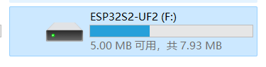

ESP TinyUF2
============

:link_to_translation:`zh_CN:[中文]`

``esp_tinyuf2`` is an enhanced version of `TinyUF2 <https://github.com/adafruit/tinyuf2>`__ for ESP chips with USB support. Which features:

- support over-the-air (OTA) updates through the virtual USB drive
- support dumping NVS key-value pairs to ini file in the virtual USB drive
- support modify ini file and write back to NVS

UF2 is a file format developed by Microsoft for `PXT <https://github.com/Microsoft/pxt>`__, that is particularly suitable for flashing microcontrollers over MSC (Mass Storage Class). For a more friendly explanation, check out `the blog post <https://makecode.com/blog/one-chip-to-flash-them-all>`__.

Support UF2 OTA/NVS in Your Project
-----------------------------------

1. Add the component to your project using ``idf.py add_dependency`` command.

   .. code:: sh

      idf.py add-dependency "esp_tinyuf2"

2. Customer your partition table. Like other OTA solutions, you need to reserve at least two OTA app partitions. Please refer to `Partition Tables <https://docs.espressif.com/projects/esp-idf/en/latest/esp32/api-guides/partition-tables.html>`__ and `usb_uf2_ota <https://github.com/espressif/esp-iot-solution/tree/master/examples/usb/device/usb_uf2_ota>`__ example for details.

   ::

      # Partition Table Example
      # Name,   Type, SubType, Offset,  Size, Flags
      nvs,      data, nvs,     ,        0x4000,
      otadata,  data, ota,     ,        0x2000,
      phy_init, data, phy,     ,        0x1000,
      ota_0,    app,  ota_0,   ,        1500K,
      ota_1,    app,  ota_1,   ,        1500K,

3. Using ``idf.py menuconfig`` to config the component’s behavior in ``(Top) → Component config → TinyUF2 Config``

-  ``USB Virtual Disk size(MB)``: The size of the virtual U-disk shows in File Explorer, 8MB by default
-  ``Max APP size(MB)``: Maximum APP size, 4MB by default
-  ``Flash cache size(KB)``: Cache size used for writing Flash efficiently, 32KB by default
-  ``USB Device VID``: Espressif VID (0x303A) by default
-  ``USB Device PID``: Espressif test PID (0x8000) by default, refer `esp-usb-pid <https://github.com/espressif/usb-pids>`__ to apply new.
-  ``USB Disk Name``: The name of the virtual U-disk shows in File Explorer, ``ESP32Sx-UF2`` by default
-  ``USB Device Manufacture``: ``Espressif`` by default
-  ``Product Name``: ``ESP TinyUF2`` by default
-  ``Product ID``: ``12345678`` by default
-  ``Product URL``: A ``index`` file will be added to the U-disk, users can click to goto the webpage, ``https://products.espressif.com/`` by default
-  ``UF2 NVS ini file size``: The ``ini`` file size prepares for NVS function

4. Install tinyuf2 function like below, for more details, please refer example `usb_uf2_nvs <https://github.com/espressif/esp-iot-solution/tree/master/examples/usb/device/usb_uf2_nvs>`__ and `usb_uf2_ota <https://github.com/espressif/esp-iot-solution/tree/master/examples/usb/device/usb_uf2_ota>`__

   .. code:: c

      /* install UF2 OTA */
      tinyuf2_ota_config_t ota_config = DEFAULT_TINYUF2_OTA_CONFIG();
      ota_config.complete_cb = uf2_update_complete_cb;
      /* disable auto restart, if false manual restart later */
      ota_config.if_restart = false;
      /* install UF2 NVS */
      tinyuf2_nvs_config_t nvs_config = DEFAULT_TINYUF2_NVS_CONFIG();
      nvs_config.part_name = "nvs";
      nvs_config.namespace_name = "myuf2";
      nvs_config.modified_cb = uf2_nvs_modified_cb;
      esp_tinyuf2_install(&ota_config, &nvs_config);

5. Run ``idf.py build flash`` for the initial download, later ``idf.py uf2-ota`` can be used to generate new ``uf2`` app bin

6. Drag and drop UF2 format file to the disk, to upgrade to new ``uf2`` app bin

UF2 NVS Hidden
-----------------------

By enabling **UF2_INI_NVS_VALUE_HIDDEN** via menuconfig (`(Top) → Component config → TinyUF2 Config → Enable UF2 ini file hide NVS value`), the values in NVS will be encrypted and replaced with `****`.

.. code:: C

   esp_tinyuf2_add_key_hidden("password")

Enable UF2 USB Console
-------------------------

Through menuconfig ``(Top) → Component config → TinyUF2 Config → Enable USB Console For log``, the log will be output to the USB Serial port (Output to UART by default).

Build APP to UF2 format
--------------------------

The new command ``idf.py uf2-ota`` is added by this component, which can be used to build the APP to UF2 format. After the build is complete, the UF2 file (``${PROJECT_NAME}.uf2``) will be generated in the current ``project`` directory.

.. code:: sh

   idf.py uf2-ota

Convert Existing APP to UF2 Format
------------------------------------

To convert your existing APP binary to UF2 format, simply use the `uf2conv.py <https://github.com/espressif/esp-iot-solution/blob/master/components/usb/esp_tinyuf2/utils/uf2conv.py>`__ on a ``.bin`` file, specifying the family id as ``ESP32S2``, ``ESP32S3`` or their magic number as follows. And you must specify the address of 0x00 with the ``-b`` switch, the tinyuf2 will use it as offset to write to the OTA partition.

1. convert as follows

   using:

   .. code:: sh

      uf2conv.py your_firmware.bin -c -b 0x00 -f ESP32S3

   or:

   .. code:: sh

      uf2conv.py your_firmware.bin -c -b 0x00 -f 0xc47e5767

Note
----

-  To use the UF2 OTA function continuously, the TinyUF2 function must be enabled in the updated APP.

Using UF2 in Bootloader
--------------------------

By embedding a specific APP bin with UF2 functionality into the Bootloader, the following features can be achieved:
1. Automatically enter UF2 download mode when the ``factory/test/ota`` partitions do not contain firmware.
2. Manually enter UF2 download mode by pulling the ``BOOT_UF2`` pin low.
3. Manually enter UF2 download mode by calling `esp_restart_from_tinyuf2()` function in user app.

Example
^^^^^^^^^^^^

:example:`usb/device/bootloader_uf2`

Instructions:

1. By default, only ``nvs/phy_init/factory`` partitions are supported. To support ``test/ota/spiffs`` partitions, modify the partition table manually and recompile.
2. Drag-and-drop upgrades default to the ``factory`` partition. Ensure the ``factory`` partition exists or modify the code manually.
3. The default ``CONFIG_PARTITION_TABLE_OFFSET`` is set to 0x60000. If the firmware is too large, modify this value.
4. The default ``nvs`` partition name is ``CONFIG_BOOTLOADER_UF2_NVS_PART_NAME`` ("nvs"), and the default NVS namespace is ``CONFIG_BOOTLOADER_UF2_NVS_NAMESPACE_NAME`` ("uf2_nvs"). Ensure the user firmware uses the same NVS partition name and namespace as the bootloader for proper functionality.
5. A working indicator LED is supported by default. The default LED GPIO is ``CONFIG_BOOTLOADER_UF2_LED_INDICATOR_GPIO_NUM`` (2). Ensure this matches the hardware connection.

Flash Partition Reference:
^^^^^^^^^^^^^^^^^^^^^^^^^^^^^^^^^^^^

Notes
^^^^^^^^^^^^

- The ``Bootloader UF2`` bin must be flashed at an address aligned to a multiple of ``CONFIG_MMU_PAGE_SIZE``; otherwise, it will not work.

Note: The ``CONFIG_MMU_PAGE_SIZE`` for ESP32-S2/ESP32-S3/ESP32-P4 defaults to 64KB (0x10000), so flashing must align to a 64KB (0x10000) boundary.

- Configure ``CONFIG_PARTITION_TABLE_OFFSET`` to accommodate the combined size of ``bootloader.bin + bootloader_uf2.bin``; otherwise, ``bootloader_uf2.bin`` cannot be flashed.

- Enable the ``CONFIG_ENABLE_BOOTLOADER_UF2`` macro.

- Enable the ``CONFIG_SPI_FLASH_DANGEROUS_WRITE_ALLOWED`` macro: Since the position for bootloader_uf2.bin is not explicitly shown in the partition table, the checks must be disabled.

- Flash the Bin files to the firmware according to the following addresses:

   1. CONFIG_BOOTLOADER_OFFSET_IN_FLASH(The starting addresses vary for different chips.) - bootloader.bin
   2. 0x10000 - bootloader_uf2.bin
   3. CONFIG_PARTITION_TABLE_OFFSET (0x6000) - partition-table.bin

   Add the following snippet to your project's `CMakeLists.txt` to automatically generate a merged Bin file after compilation:

.. code:: cmake

   add_custom_command(
      TARGET app
      POST_BUILD
      COMMAND ${CMAKE_COMMAND} -E echo "Flash merged bin merge_uf2.bin to address ${CONFIG_BOOTLOADER_OFFSET_IN_FLASH}"
      COMMAND ${ESPTOOLPY} --chip ${IDF_TARGET} merge_bin -o merge_uf2.bin ${CONFIG_BOOTLOADER_OFFSET_IN_FLASH} ${BUILD_DIR}/bootloader/bootloader.bin 0x10000 ${BUILD_DIR}/${PROJECT_BIN} ${CONFIG_PARTITION_TABLE_OFFSET} ${BUILD_DIR}/partition_table/partition-table.bin
   )

API Reference
---------------

.. include-build-file:: inc/esp_tinyuf2.inc
