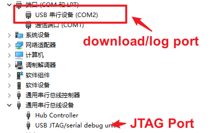
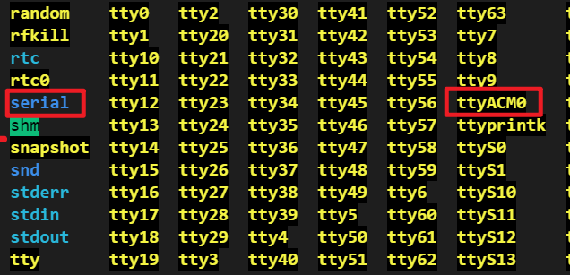

USB-Serial-JTAG Peripheral Introduction
-----------------------------------------

:link_to_translation:`zh_CN:[中文]`

ESP32 series chips with integrated USB-Serial-JTAG peripheral (such as ESP32-S3, ESP32-C3, ESP32-P4) feature both USB-to-serial and USB-to-JTAG functionality. This peripheral provides direct USB connectivity to a host PC, supporting firmware download, JTAG-based debugging, and system console output. For detailed information on the USB-Serial-JTAG peripheral architecture, please refer to the `ESP32-C3 Technical Reference Manual - USB Serial/JTAG Controller <https://www.espressif.com/sites/default/files/documentation/esp32-c3_technical_reference_manual_en.pdf>`_\ .

USB-Serial-JTAG  peripheral driver
^^^^^^^^^^^^^^^^^^^^^^^^^^^^^^^^^^^^^^^^^

* For Linux and MacOS systems, No need to manually install drivers.
* For Windows 10 and above, drivers will be automatically installed when connected to the internet.
* For Windows 7/8 systems, manual driver installation is necessary. The driver can be downloaded from: \ `esp32-usb-jtag-2021-07-15 <https://dl.espressif.com/dl/idf-driver/idf-driver-esp32-usb-jtag-2021-07-15.zip>`_\ . Alternatively, users can use the `ESP-IDF Windows Installer <https://dl.espressif.com/dl/esp-idf/>`_\ , selecting the USB-Serial-JTAG driver during installation.

.. Note::
    If the above driver installation fails, you can use the `Zadig <https://zadig.akeo.ie/>`_ tool to install the driver. When using Zadig, please select drivers as follows:

    * For ``USB JTAG/serial debug unit (Interface 0)``, select ``usbser`` or ``USB Serial (CDC)`` driver
    * For ``USB JTAG/serial debug unit (Interface 2)``, select ``WinUSB`` driver

USB-Serial-JTAG peripheral built-in functionality
^^^^^^^^^^^^^^^^^^^^^^^^^^^^^^^^^^^^^^^^^^^^^^^^^^^

Upon connecting the USB-Serial-JTAG peripheral to a PC, the Device Manager will show the addition of two devices:

For Windows as shown in the following figure:

For Linux as shown in the following figure:

.. Note::
    If the devices are not displayed correctly, please refer to the driver installation section above.

Use USB-Serial-JTAG to download firmware
^^^^^^^^^^^^^^^^^^^^^^^^^^^^^^^^^^^^^^^^^

* By default, the USB-Serial-JTAG download function is enabled. You can directly connect it to the PC using a USB cable and then use the esptool tool (or directly use idf.py flash) to configure the serial port corresponding to the USB-Serial-JTAG device (COM* for Windows, /dev/ttyACM* for Linux, /dev/cu* for MacOS) for firmware download. During the download process, esptool automatically resets the device and switches it to download mode through the USB control protocol.
* If the USB pins corresponding to USB-Serial-JTAG are used for other functions in the application, such as being used as a regular GPIO or other peripheral IO, USB-Serial-JTAG will be unable to establish a connection with the USB host. Therefore, it cannot switch the device to download mode via USB. In such cases, users must manually switch the device to download mode using the Boot control pin and then use esptool for firmware download.
* To avoid using the USB pins corresponding to USB-Serial-JTAG for other functions in the application, which would prevent automatic entry into download mode via USB, users need to expose the Boot control pin in hardware design.
* By default, when downloading different chips through the USB interface, the COM number will increment, which may cause inconvenience for mass production. Users can refer to :doc:`Prevent Windows from incrementing COM numbers based on USB device serial number <./usb_device_const_COM>` for a solution.

Debugging code using USB-Serial-JTAG
^^^^^^^^^^^^^^^^^^^^^^^^^^^^^^^^^^^^^

The ``USB-Serial-JTAG`` supports debugging code through the ``JTAG`` interface. Users only need to connect it to the PC using a USB cable and then use the ``OpenOCD`` tool for code debugging. Please refer to the configuration guide for setting up the built-in JTAG interface on ESP32-C3 at: `Configure Built-in JTAG Interface on ESP32-C3 <https://docs.espressif.com/projects/esp-idf/en/latest/esp32c3/api-guides/jtag-debugging/configure-builtin-jtag.html>`_\.

Print system LOG using USB-Serial-JTAG
^^^^^^^^^^^^^^^^^^^^^^^^^^^^^^^^^^^^^^^^^

* Users can enable the USB-Serial-JTAG LOG feature by configuring the state in ``menuconfig-> Component config → ESP System Settings → Channel for console secondary output``.
* Once the LOG feature is enabled, you can connect the device directly to the PC using a USB cable and then use ``idf.py monitor`` or other serial port tools to open the serial port corresponding to the USB-Serial-JTAG device (``COM*`` for Windows, ``/dev/ttyACM*`` for Linux, ``/dev/cu*`` for MacOS) to print system logs.
* The ``USB-Serial-JTAG`` will only print logs after the host is connected. If the host is not connected, ``USB-Serial-JTAG`` will not be initialized, and logs will not be printed.
* The LOG feature of ``USB-Serial-JTAG`` cannot be used in sleep modes (including deep sleep and light sleep modes). If it is necessary to print logs in sleep mode, the ``UART`` interface can be used.

Using USB-Serial-JTAG pins as normal GPIO
^^^^^^^^^^^^^^^^^^^^^^^^^^^^^^^^^^^^^^^^^^

If users need to use the USB pins corresponding to USB-Serial-JTAG for other functions in the application, such as using them as regular GPIO, it is important to note that the USB D+ interface has a default pull-up resistor, which keeps the USB D+ pin at a high level. Therefore, it is necessary to disable this pull-up resistor when using it as a GPIO.

* Starting from ESP-IDF v4.4, the GPIO driver defaults to disabling the USB D+ pull-up resistor. Users do not need additional configuration when using the GPIO driver.
* Users can also modify the register value ``USB_SERIAL_JTAG.conf0.dp_pullup = 0;`` to disable the USB D+ pull-up resistor.

It is important to note that the pull-up resistor on the USB D+ pin is present at power-up. Before software disables the pull-up resistor, the USB D+ pin has already been pulled high, causing it to be in a high-level state during the initial phase when used as a GPIO. If users need the USB D+ pin to be immediately low after power-up, it is necessary to design the hardware to pull down the USB D+ pin through an external circuit.

If users wish to again use the USB-Serial-JTAG function, please refer to the following code:

.. code:: C

    #include "soc/soc_caps.h"
    #include "soc/usb_serial_jtag_reg.h"
    #include "hal/usb_serial_jtag_ll.h"

        SET_PERI_REG_MASK(USB_SERIAL_JTAG_CONF0_REG, USB_SERIAL_JTAG_PAD_PULL_OVERRIDE);
        CLEAR_PERI_REG_MASK(USB_SERIAL_JTAG_CONF0_REG, USB_SERIAL_JTAG_DP_PULLUP);
        SET_PERI_REG_MASK(USB_SERIAL_JTAG_CONF0_REG, USB_SERIAL_JTAG_DP_PULLDOWN);
        vTaskDelay(pdMS_TO_TICKS(10));
    #if USB_SERIAL_JTAG_LL_EXT_PHY_SUPPORTED
        usb_serial_jtag_ll_phy_enable_external(false);  // Use internal PHY
        usb_serial_jtag_ll_phy_enable_pad(true);        // Enable USB PHY pads
    #else // USB_SERIAL_JTAG_LL_EXT_PHY_SUPPORTED
        usb_serial_jtag_ll_phy_set_defaults();          // External PHY not supported. Set default values.
    #endif // USB_WRAP_LL_EXT_PHY_SUPPORTED
        CLEAR_PERI_REG_MASK(USB_SERIAL_JTAG_CONF0_REG, USB_SERIAL_JTAG_DP_PULLDOWN);
        SET_PERI_REG_MASK(USB_SERIAL_JTAG_CONF0_REG, USB_SERIAL_JTAG_DP_PULLUP);
        CLEAR_PERI_REG_MASK(USB_SERIAL_JTAG_CONF0_REG, USB_SERIAL_JTAG_PAD_PULL_OVERRIDE);

