USB Signal Quality Test
=========================

:link_to_translation:`zh_CN:[中文]`

Signal quality testing of the USB 2.0 interface is a critical step to ensure that USB 2.0 devices comply with the specification and qualify for the official USB 2.0 certification logo. The scope of signal quality testing primarily includes: eye diagram measurement, signaling rate, End-of-Packet (EOP) bit width, signal crossover voltage range, JK jitter, KJ jitter, consecutive jitter, as well as rise and fall times. Among these, the eye diagram test is one of the most fundamental and essential measurements in serial data applications.

Eye Diagram Test
------------------

For USB 2.0 High-Speed signaling, the measured eye diagram must meet the compliance template requirements specified by the USB-IF.

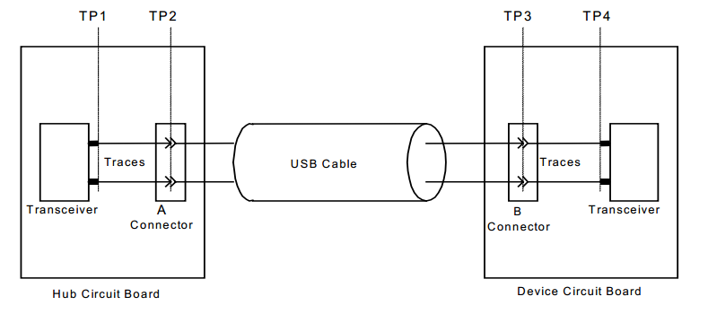
    
    USB 2.0 High-Speed Signal Measurement Plane

The eye diagram test results of USB 2.0 High-Speed signals shall comply with the eye diagram template specified in the USB 2.0 specification.

.. figure:: ../../../_static/usb/usb20_signal_quality_tp2_tp3_no_captive_cable.png
    :align: center
    :width: 90%
    
    The transmit waveform requirements for hubs measured at TP2 and for devices without captive cables measured at TP3

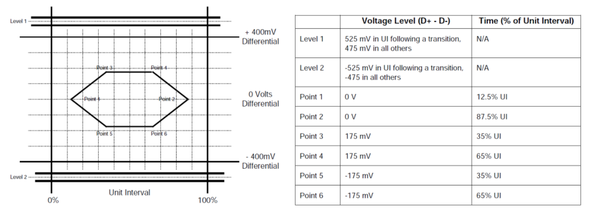
    
    The transmit waveform requirements for devices with captive cables measured at TP2

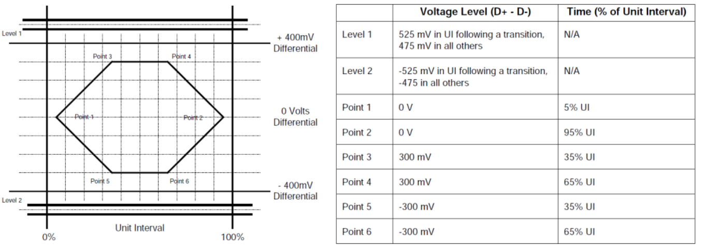
    
    The transmit waveform requirements for hub transceivers measured at TP1 and for device transceivers measured at TP4

Required Materials
~~~~~~~~~~~~~~~~~~~~~~~

- Windows PC
- USB XHSETT: `USB-IF Compliance Tools <https://www.usb.org/compliancetools>`_, used to control USB 2.0 devices and hosts, as well as USB 3.1 hosts and hubs, and to place them into compliance test modes
- USB Test Fixtures: Provided by instrument vendors or purchased from USB-IF recommended test labs
- Oscilloscope (> 2 GHz), compliance test software, probes, etc

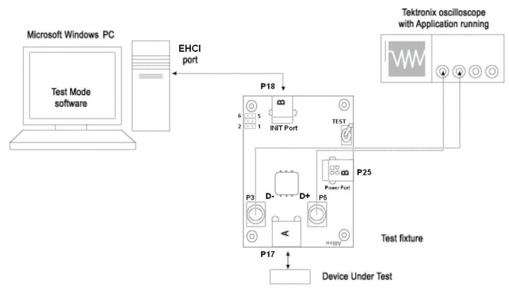

    USB 2.0 Signal Quality Test System

Test Procedure
~~~~~~~~~~~~~~~~~~~~~~~

1. ESP32-S2/S3/P4 USB Test Firmware
^^^^^^^^^^^^^^^^^^^^^^^^^^^^^^^^^^^^^

Download the ESP32-S2/S3/P4 USB test firmware from the `Launchpad <https://espressif.github.io/esp-launchpad/?flashConfigURL=https://dl.espressif.com/AE/esp-iot-solution/usb_eye_diagram/config.toml>`_ platform. ESP32-P4 is used for High-Speed testing, and ESP32-S2/S3 is used for Full-Speed testing.

2. Hardware Connection
^^^^^^^^^^^^^^^^^^^^^^^

Connect the PC, oscilloscope, and USB test fixtures. Note that the High-Speed test fixtures differ from those used for Full/Low-Speed testing. Please refer to the connection diagrams provided in the oscilloscope compliance test software.

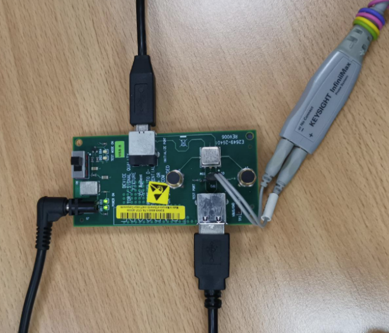

    High-Speed Device Signal Quality Test Connection Diagram

3. XHSETT Installation and Configuration
^^^^^^^^^^^^^^^^^^^^^^^^^^^^^^^^^^^^^^^^^^^

Check the USB port information in the PC Device Manager:

- If the PC has a USB 3.x host controller, use the XHSETT version. The xHCI host controller supports USB 1.x/2.0/3.x.
- If the PC has a USB 2.0 host controller, use the HSETT version. HSETT supports USB 1.x/2.0.

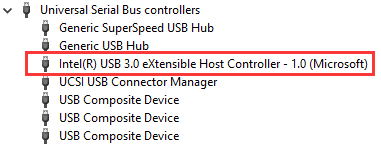

    USB 3.x Host Controller

.. note:: After the HSETT/XHSETT software is installed and launched, it will take control of all USB ports on the PC, causing them to become temporarily unavailable. Therefore, before running the HSETT/XHSETT software and restarting the test host, make sure to connect a PS/2 keyboard and mouse in advance to avoid interruption of operation. If a PS/2 mouse is not available, consider using remote desktop or other remote control tools as an alternative.

After completing the installation of the HSETT/XHSETT software, configure the settings as follows:

Launch the XHSETT software and select Device mode:

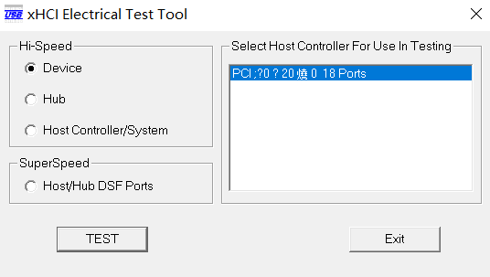

    XHSETT Mode Selection

Click the Enumerate Bus button to scan. After the device is detected, select the device under test and choose Device Command:

- For High-Speed devices, select TEST_PACKET under Device Command
- For Full-Speed devices, select (LOOP) DEVICE DESCRIPTOR under Device Command

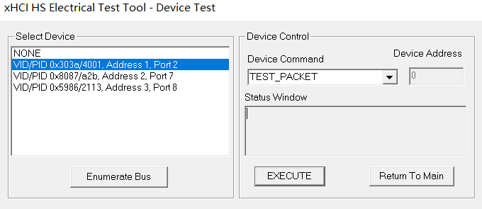

    XHSETT Device Selection

4. Oscilloscope Eye Diagram Test
^^^^^^^^^^^^^^^^^^^^^^^^^^^^^^^^^^^^^

The USB 2.0 compliance analysis software generates an eye diagram by analyzing the standard test signals issued through XHSETT/HSETT. The operation of compliance test software may vary depending on the oscilloscope vendor; please refer to the oscilloscope vendor’s user documentation for detailed instructions on performing the eye diagram test.

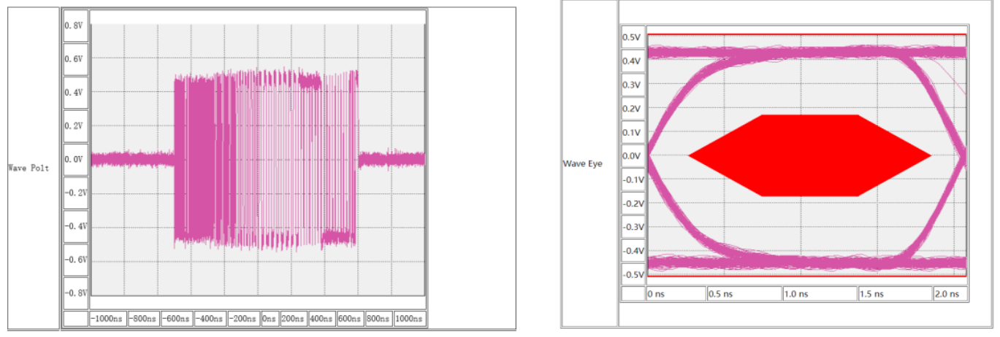

    Oscilloscope Eye Diagram Test

In USB 2.0 eye diagram testing, a more open eye indicates better signal quality. The test results must remain entirely within the compliance region of the eye diagram template. Any trace touching or crossing the template boundary is considered a signal quality failure.

4.1 USB 2.0 High-Speed
""""""""""""""""""""""""""

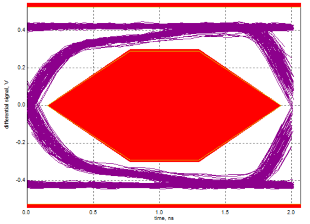

    Passing Eye Diagram

For eye diagrams that fail compliance testing, analysis can be performed from the following aspects:

- Verify that the oscilloscope probes are properly calibrated
- Ensure that standardized USB test fixtures are used
- Replace cables/connectors to rule out poor-quality accessories
- Check whether the PCB design complies with USB 2.0 specifications. For example, if ESD protection devices with high parasitic capacitance are used on the USB High-Speed D+/D- lines, the eye diagram may fail the test. It is recommended to select ESD diodes with parasitic capacitance lower than 1 pF

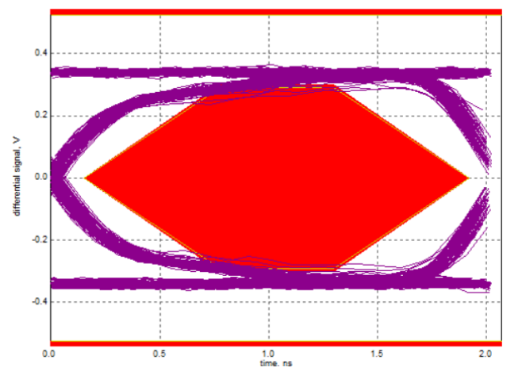

    Failing Eye Diagram

4.2 USB 2.0 Full-Speed
""""""""""""""""""""""""""

For Full-Speed devices, please refer to the USB compliance test software provided by the oscilloscope vendor to perform the eye diagram test:

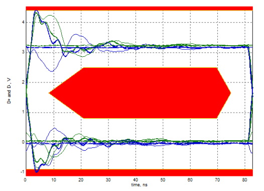
    
    Eye diagram that failed the test (overshoot)

For the above Full-Speed eye diagram test failures, series resistors should be added on D+/D- to mitigate overshoot. Test results show that using 22 Ω, 33 Ω, or 44 Ω resistors can all improve overshoot, with 33 Ω providing the best effect.
