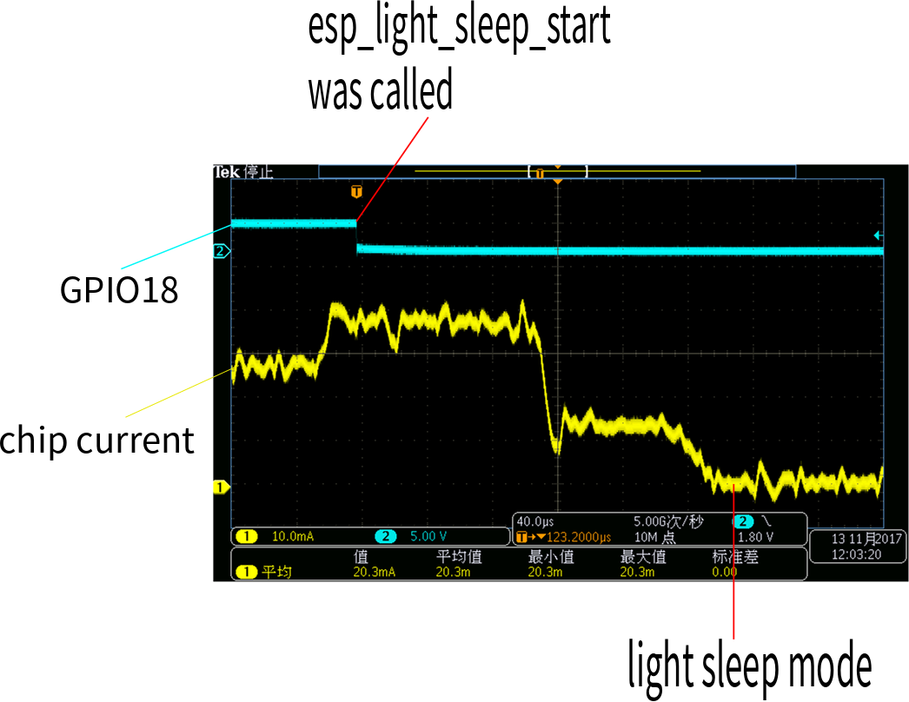
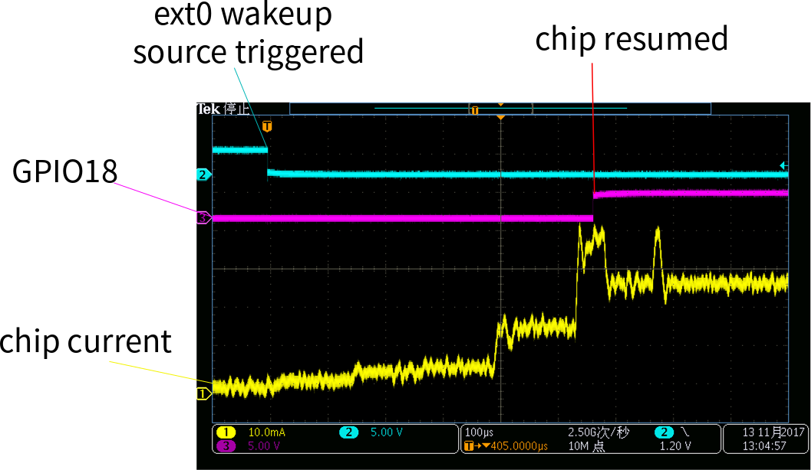

:orphan:

Force-light-sleep mode
===========================

Light-sleep is another power saving mode. In Light-sleep mode, CPUs, digital peripherals and most of the RAM are clock-gated, and supply voltage is reduced. Upon exit from Light-sleep, peripherals and CPUs resume operation, their internal state is preserved. By calling ``esp_err_t esp_light_sleep_start()``, application can enter light sleep mode.

This document gives a brief introduction of the ESP32's current consumption during Light-sleep mode and the results are as follows.

Sleep time
--------------

First we have a test about the time to enter sleep. We set a GPIO(GPIO18 in this case) from high to low level before we call ``esp_light_sleep_start`` to start the light-sleep mode. As shown below, after about **200us**, the chip completely goes to Light-sleep. 

.. code:: c

    gpio_set_level(GPIO_NUM_18, 1);
    vTaskDelay(2000 / portTICK_PERIOD_MS);
    gpio_set_level(GPIO_NUM_18, 0);
    esp_light_sleep_start();

Resume time
------------------

Second test is the time to resume from light_sleep. After chip was waked up, the program is executed from where it was last stopped, rather than restart. So We configure ext0 as wake up source, and about **566us** after ext0 source triggered, the chip resumed operation and GPIO18 output low. Figure shows this process.

.. code:: c

    esp_sleep_enable_ext0_wakeup(GPIO_NUM_34, 0);
    gpio_set_level(GPIO_NUM_18, 0);
    esp_light_sleep_start();
    gpio_set_level(GPIO_NUM_18, 1);

Finally, the current during sleep was tested. We can wake the chip up from Light-sleep by different means, such as ext0, ext1 and timer. Different ways to take, the current consumption during Light-sleep will be different. the results are as follows.

+--------------+----------------------------------+
|  Wake source | current consumption during sleep |
+==============+==================================+
|     ext0     |             1.15mA               |
+--------------+----------------------------------+
|     ext1     |             1.14mA               |
+--------------+----------------------------------+
|     timer    |             0.79mA               |
+--------------+----------------------------------+

Before enter Light-sleep, Those GPIO who powered by **VDD3P3_CPU** should be all disabled. otherwise, the current will be higher(about 1.5mA) due to GPIO leakage current.
