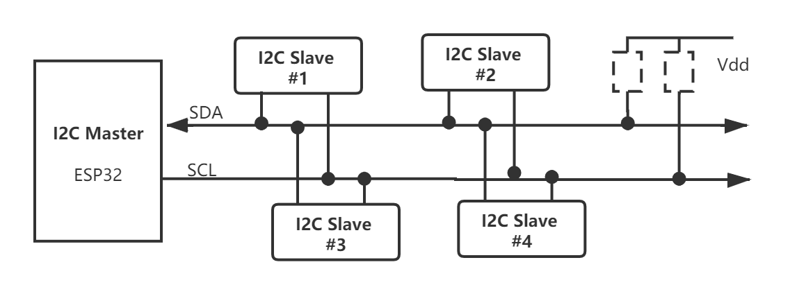
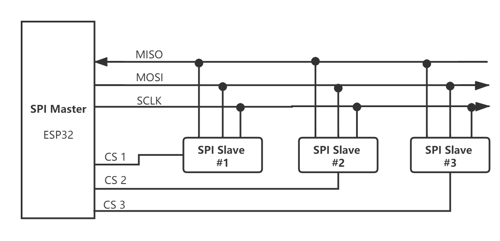

通信总线组件 (Bus)
===================

:link_to_translation:`en:[English]`

通信总线组件 (Bus) 是建立在 ESP-IDF 外设驱动代码之上的一套应用层代码，包括 ``i2c_bus``、``spi_bus`` 等，主要用于 ESP 芯片与外置设备之间的总线通信。该组件从应用开发的角度出发，实现了以下功能：

1. 简化外设初始化步骤
2. 线程安全的设备操作
3. 简单灵活的读写操作

该组件对以下概念进行了抽象：

1. 总线 (Bus)：通信时设备之间共同拥有的资源和配置项
2. 设备 (Device)：通信时设备特有的资源和配置项

每个物理外设总线 (Bus) 在电气条件允许的情况下，均可挂载一到多个设备（Device），其中 SPI 总线根据 CS 引脚对设备进行寻址，I2C 总线则根据设备地址进行寻址，进而实现相同总线不同设备之间软件上的独立。

    i2c_bus 连接框图

    spi_bus 连接框图

i2c\_bus 使用方法
-----------------

1. 创建总线：使用 :cpp:func:`i2c_bus_create` 创建一个总线实例。创建时需要指定 I2C 端口号，以及总线配置项 ``i2c_config_t``。配置项包括 SDA 和 SCL 引脚号、上下拉模式，因为这些配置项在系统设计时已经确定，一般不在运行时切换。总线配置项还包括总线默认的时钟频率，在设备不指定频率时使用。
2. 创建设备：使用 :cpp:func:`i2c_bus_device_create` 在已创建的总线实例之上创建设备，创建时需要指定总线句柄、设备的 I2C 地址、设备运行的时钟频率，I2C 传输时将根据设备的配置项动态切换频率。设备时钟速率可配置为 0，表示默认使用当前的总线频率。
3. 数据读取：使用 :cpp:func:`i2c_bus_read_byte`、:cpp:func:`i2c_bus_read_bytes` 可直接进行 ``Byte`` 的读取操作；使用 :cpp:func:`i2c_bus_read_bit`、:cpp:func:`i2c_bus_read_bits` 可直接进行 ``bit`` 的读取操作。只需要传入设备句柄、设备寄存器地址、用于存放读取数据的 buf 和读取长度的等。寄存器地址可设为 ``NULL_I2C_MEM_ADDR``，用于操作没有内部寄存器的设备。
4. 数据写入：使用 :cpp:func:`i2c_bus_write_byte`、:cpp:func:`i2c_bus_write_bytes` 可直接进行 ``Byte`` 的写入操作；使用 :cpp:func:`i2c_bus_write_bit`、:cpp:func:`i2c_bus_write_bits` 可直接进行 ``bit`` 的写入操作。只需要传入设备句柄、设备寄存器地址、将要写入的数据位置和写入长度等。寄存器地址可设为 ``NULL_I2C_MEM_ADDR``，用于操作没有内部寄存器的设备。
5. 删除设备和总线：如果所有的 i2c_bus 通信已经完成，可以通过删除设备和总线实例释放系统资源。可使用 :cpp:func:`i2c_bus_device_delete` 分别将已创建的设备删除，然后使用 :cpp:func:`i2c_bus_delete` 将总线资源删除。如果在设备未删除时删除总线，操作将不会被执行。

示例：

.. code:: c

    i2c_config_t conf = {
        .mode = I2C_MODE_MASTER,
        .sda_io_num = I2C_MASTER_SDA_IO,
        .sda_pullup_en = GPIO_PULLUP_ENABLE,
        .scl_io_num = I2C_MASTER_SCL_IO,
        .scl_pullup_en = GPIO_PULLUP_ENABLE,
        .master.clk_speed = 100000,
    }; // i2c_bus configurations

    uint8_t data_rd[2] = {0};
    uint8_t data_wr[2] = {0x01, 0x21};

    i2c_bus_handle_t i2c0_bus = i2c_bus_create(I2C_NUM_0, &conf); // create i2c_bus
    i2c_bus_device_handle_t i2c_device1 = i2c_bus_device_create(i2c0_bus, 0x28, 400000); // create device1, address: 0x28 , clk_speed: 400000
    i2c_bus_device_handle_t i2c_device2 = i2c_bus_device_create(i2c0_bus, 0x32, 0); // create device2, address: 0x32 , clk_speed: no-specified

    i2c_bus_read_bytes(i2c_device1, NULL_I2C_MEM_ADDR, 2, data_rd); // read bytes from device1 with no register address
    i2c_bus_write_bytes(i2c_device2, 0x10, 2, data_wr); // write bytes to device2 register 0x10

    i2c_bus_device_delete(&i2c_device1); //delete device1
    i2c_bus_device_delete(&i2c_device2); //delete device2
    i2c_bus_delete(&i2c0_bus);  //delete i2c_bus

.. note::

    对于某些特殊应用场景，例如:

    1. 当寄存器地址为 16 位时，可以使用 :cpp:func:`i2c_bus_read_reg16` 或 :cpp:func:`i2c_bus_write_reg16` 进行读写操作；
    2. 对于需要跳过地址阶段或者需要增加命令阶段的设备，可以使用 :cpp:func:`i2c_bus_cmd_begin` 结合 `I2C command link <https://docs.espressif.com/projects/esp-idf/zh_CN/latest/esp32/api-reference/peripherals/i2c.html?highlight=i2c#communication-as-master>`_ 进行操作。

spi\_bus 使用方法
-----------------

1. 创建总线：使用 :cpp:func:`spi_bus_create` 创建一个总线实例，创建时需要指定 SPI 端口号（可选 ``SPI2_HOST``、``SPI3_HOST``）以及总线配置项 ``spi_config_t``。配置项包括 ``MOSI``、``MISO``、``SCLK`` 引脚号，因为这些引脚在系统设计时已经确定，一般不在运行时切换。总线配置项还包括 ``max_transfer_sz``，用于配置一次传输时的最大数据量，设置为 0 将使用默认值 4096。
2. 创建设备：使用 :cpp:func:`spi_bus_device_create` 在已创建的总线实例之上创建设备，创建时需要指定总线句柄、设备的 ``CS`` 引脚号、设备运行模式、设备运行的时钟频率，SPI 传输时将根据设备的配置项动态切换模式和频率。
3. 数据传输：使用 :cpp:func:`spi_bus_transfer_byte`、:cpp:func:`spi_bus_transfer_bytes`、:cpp:func:`spi_bus_transfer_reg16` 以及 :cpp:func:`spi_bus_transfer_reg32` 可直接进行数据的传输操作。由于 SPI 是全双工通信，因此每次传输发送和接收可以同时进行，只需要传入设备句柄、待发送数据、存放读取数据的 buf 和传输长度。
4. 删除设备和总线：如果所有的 spi_bus 通信已经完成，可以通过删除设备和总线实例释放系统资源。可使用 :cpp:func:`spi_bus_device_delete` 分别将已创建的设备删除，然后使用 :cpp:func:`spi_bus_delete` 将总线资源删除。如果在设备未删除时删除总线，操作将不会被执行。

示例：

.. code:: c

    spi_bus_handle_t bus_handle = NULL;
    spi_bus_device_handle_t device_handle = NULL;
    uint8_t data8_in = 0;
    uint8_t data8_out = 0xff;
    uint16_t data16_in = 0;
    uint32_t data32_in = 0;

    spi_config_t bus_conf = {
        .miso_io_num = 19,
        .mosi_io_num = 23,
        .sclk_io_num = 18,
    }; // spi_bus configurations

    spi_device_config_t device_conf = {
        .cs_io_num = 19,
        .mode = 0,
        .clock_speed_hz = 20 * 1000 * 1000,
    }; // spi_device configurations

    bus_handle = spi_bus_create(SPI2_HOST, &bus_conf); // create spi bus
    device_handle = spi_bus_device_create(bus_handle, &device_conf); // create spi device

    spi_bus_transfer_bytes(device_handle, &data8_out, &data8_in, 1); // transfer 1 byte with spi device
    spi_bus_transfer_bytes(device_handle, NULL, &data8_in, 1); // only read 1 byte with spi device
    spi_bus_transfer_bytes(device_handle, &data8_out, NULL, 1); // only write 1 byte with spi device
    spi_bus_transfer_reg16(device_handle, 0x1020, &data16_in); // transfer 16-bit value with the device
    spi_bus_transfer_reg32(device_handle, 0x10203040, &data32_in); // transfer 32-bit value with the device

    spi_bus_device_delete(&device_handle);
    spi_bus_delete(&bus_handle);

.. note::

    对于某些特殊应用场景，可以直接使用 :cpp:func:`spi_bus_transmit_begin` 结合 `spi_transaction_t <https://docs.espressif.com/projects/esp-idf/zh_CN/latest/esp32s2/api-reference/peripherals/spi_master.html?highlight=spi_transaction_t#_CPPv417spi_transaction_t>`_ 进行操作。

已适配 IDF 版本
---------------

- ESP-IDF v4.0 及以上版本。

已适配芯片
----------

-  ESP32
-  ESP32-S2

API 参考
--------

i2c_bus API 参考
++++++++++++++++++++

.. include:: /_build/inc/i2c_bus.inc

spi_bus API 参考
++++++++++++++++++++

.. include:: /_build/inc/spi_bus.inc
