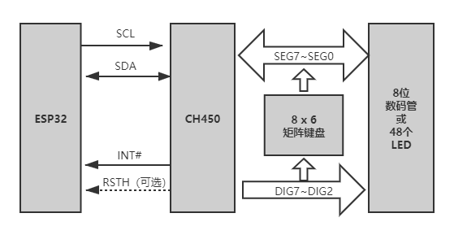

数码管驱动
============

ESP-IoT-Solution 中使用了以下的 LED 数码管驱动：

 - CH450
 - HT16C21
 - IS31FL3XXX

驱动同时支持 ESP32 和 ESP32-S2 芯片

CH450
---------

CH450 是一款数码管显示驱动和键盘扫描控制用芯片，通过 ``I2C`` 接口与 ESP32 进行通信。可以用于 6 位数码管或者 48 个LED的驱动，同时还可以进行 48 键的键盘扫描。
在 ESP-IoT-Solution 中，主要使用 CH450 对数码管和LED进行驱动。

   CH450 结构图

ESP-IoT-Solution 已经对 CH450 的驱动进行了封装，可以直接调用函数 :c:func:`iot_ch450_write` 和 :c:func:`iot_ch450_write_num` 在数码管上进行显示。

应用示例
^^^^^^^^^^^^

.. code:: c

    i2c_bus_handle_t i2c_bus = NULL;
    ch450_handle_t seg = NULL;
    i2c_config_t conf;
    conf.mode = I2C_MODE_MASTER;
    conf.sda_io_num = I2C_MASTER_SDA_IO;
    conf.sda_pullup_en = GPIO_PULLUP_ENABLE;
    conf.scl_io_num = I2C_MASTER_SCL_IO;
    conf.scl_pullup_en = GPIO_PULLUP_ENABLE;
    conf.master.clk_speed = I2C_MASTER_FREQ_HZ;
    i2c_bus = i2c_bus_create(I2C_MASTER_NUM, &conf);
    TEST_ASSERT_NOT_NULL(i2c_bus);
    seg = iot_ch450_create(i2c_bus);
    TEST_ASSERT_NOT_NULL(seg);

    for (size_t i = 0; i < 10; i++) {
        for (size_t index = 0; index < 6; index++) {
            iot_ch450_write_num(seg, index, i);
        }
        vTaskDelay(1000 / portTICK_PERIOD_MS);
    }
    iot_ch450_delete(seg);
    i2c_bus_delete(&i2c_bus);

HT16C21
----------

HT16C21 是一款 LCD 控制/驱动芯片，可用于 *20x4* 和 *16x8* 段码式液晶LCD的驱动控制。
HT16C21 利用 ``I2C`` 接口与 ESP32 进行通信。在使用 HT16C21 前需要对结构体 :c:func:`ht16c21_config_t` 进行配置，然后调用封装好的函数 :c:func:`iot_ht16c21_write_cmd`， :c:func:`iot_ht16c21_read_cmd` 进行读写的操作。

应用示例
^^^^^^^^^^^^

.. code:: c

    i2c_bus_handle_t i2c_bus = NULL;
    ht16c21_handle_t seg = NULL;
    uint8_t lcd_data[8] = { 0x10, 0x20, 0x30, 0x50, 0x60, 0x70, 0x80 };
    i2c_config_t conf;
    ht16c21_config_t ht16c21_conf;

    conf.mode = I2C_MODE_MASTER;
    conf.sda_io_num = I2C_MASTER_SDA_IO;
    conf.sda_pullup_en = GPIO_PULLUP_ENABLE;
    conf.scl_io_num = I2C_MASTER_SCL_IO;
    conf.scl_pullup_en = GPIO_PULLUP_ENABLE;
    conf.master.clk_speed = I2C_MASTER_FREQ_HZ;
    i2c_bus = i2c_bus_create(I2C_MASTER_NUM, &conf);
    TEST_ASSERT_NOT_NULL(i2c_bus);
    seg = iot_ht16c21_create(i2c_bus, HT16C21_I2C_ADDRESS_DEFAULT);
    TEST_ASSERT_NOT_NULL(seg);
    
    ht16c21_conf.duty_bias = HT16C21_4DUTY_3BIAS;
    ht16c21_conf.oscillator_display = HT16C21_OSCILLATOR_ON_DISPLAY_ON;
    ht16c21_conf.frame_frequency = HT16C21_FRAME_160HZ;
    ht16c21_conf.blinking_frequency = HT16C21_BLINKING_OFF;
    ht16c21_conf.pin_and_voltage = HT16C21_VLCD_PIN_VOL_ADJ_ON;
    ht16c21_conf.adjustment_voltage = 0;
    TEST_ASSERT(ESP_OK == iot_ht16c21_init(seg, &ht16c21_conf));
    iot_ht16c21_ram_write(seg, 0x00, lcd_data, 8);

    iot_ht16c21_delete(seg);
    i2c_bus_delete(&i2c_bus);

IS31FL3XXX
------------

IS31FL3XXX 系列芯片是 LED 驱动芯片。在 ESP-IoT-Solution 中主要介绍和使用了其中的 IS31FL3218 与 IS31FL3736。两者均通过 ``I2C`` 接口与 ESP32 进行通信。

IS31FL3218
^^^^^^^^^^^^

IS31FL3218 是一款有 18 个恒定电流通道的 LED 驱动芯片，每个通道均由独立的 PWM 控制。调用 :c:func:`iot_is31fl3218_channel_set` 进行通道的配置，然后调用 :c:func:`iot_is31fl3218_write_pwm_regs` 进行数据的相关操作。

IS31FL3218 应用示例
^^^^^^^^^^^^^^^^^^^^^^^^

.. code:: c

    fxled_is31fl3218_init();

    uint8_t i=0,j=255/10;
    ESP_ERROR_CHECK( iot_is31fl3218_channel_set(fxled, IS31FL3218_CH_NUM_MAX_MASK, 0) );
    int cnt = 0;
    printf("enter loop\n");
    uint8_t duty_data[18] = {0};
    while(1){
        iot_is31fl3218_write_pwm_regs(fxled, duty_data, sizeof(duty_data));
        vTaskDelay(20 / portTICK_RATE_MS);
        if (++i > IS31FL3218_CH_NUM_MAX - 1) {
            i = 0;
            if (j == 0) {
                j = 255 / 10;
                if (cnt++ > 1) {
                    break;
                }
            } else {
                j = 0;
            }
        }
        duty_data[i] = j;
    }

IS31FL3736
^^^^^^^^^^^^

IS31FL3736 是一款通用的 *12x8* LED 矩阵驱动芯片，可以用来进行更精细的 LED 相关控制操作。
利用 :c:func:`iot_is31fl3218_write_pwm_regs`, :c:func:`iot_is31fl3736_set_pwm_duty_matrix` 对 LED 矩阵进行控制，用 :c:func:`iot_is31fl3736_write` 进行显示内容的操作。

IS31FL3736 应用示例
^^^^^^^^^^^^^^^^^^^^^^^^

.. code:: c

    int i = 11;
    char c = 'e';
    static uint8_t dir = 0;
    iot_is31fl3736_write_page(led3736, IS31FL3736_PAGE(1));
    extern void initGame(void*);
    initGame(&fill_pixel);
    //xTaskCreate(is32f13xxx_bar_task, "is32f13xxx_bar_task", 2048, NULL, 10, NULL);
    //xTaskCreate(touch_task, "touch_task", 1024*2, NULL, 11, NULL);
    int cnt = 1;
    while (cnt) {
        if (dir == 0) {
            vTaskDelay(150 / portTICK_RATE_MS);
            uint8_t buf[12] = { 0 };
            c = 'e';
            is31fl3736_display_buf(I2C_MASTER_NUM, 0, i, &c, 50, buf);
            c = 's';
            is31fl3736_display_buf(I2C_MASTER_NUM, 0, i + 4, &c, 50, buf);
            c = 'p';
            is31fl3736_display_buf(I2C_MASTER_NUM, 0, i + 8, &c, 50, buf);
            is31fl3736_send_buf(I2C_MASTER_NUM, 0, i + 8, &c, 50, buf);
            if (--i < 0 - 4) {
                dir = 1;
            }
        } else {
            vTaskDelay(50 / portTICK_RATE_MS);
            uint8_t buf[12] = { 0 };
            c = 'e';
            is31fl3736_display_buf(I2C_MASTER_NUM, 0, i, &c, 50, buf);
            c = 's';
            is31fl3736_display_buf(I2C_MASTER_NUM, 0, i + 4, &c, 50, buf);
            c = 'p';
            is31fl3736_display_buf(I2C_MASTER_NUM, 0, i + 8, &c, 50, buf);
            is31fl3736_send_buf(I2C_MASTER_NUM, 0, i + 8, &c, 50, buf);
            if (++i > 12) {
                dir = 0;
                cnt--;
            }
        }
    }

API 参考
----------------

.. include:: /_build/inc/iot_ch450.inc

.. include:: /_build/inc/iot_ht16c21.inc

.. include:: /_build/inc/iot_is31fl3218.inc

.. include:: /_build/inc/iot_is31fl3736.inc
