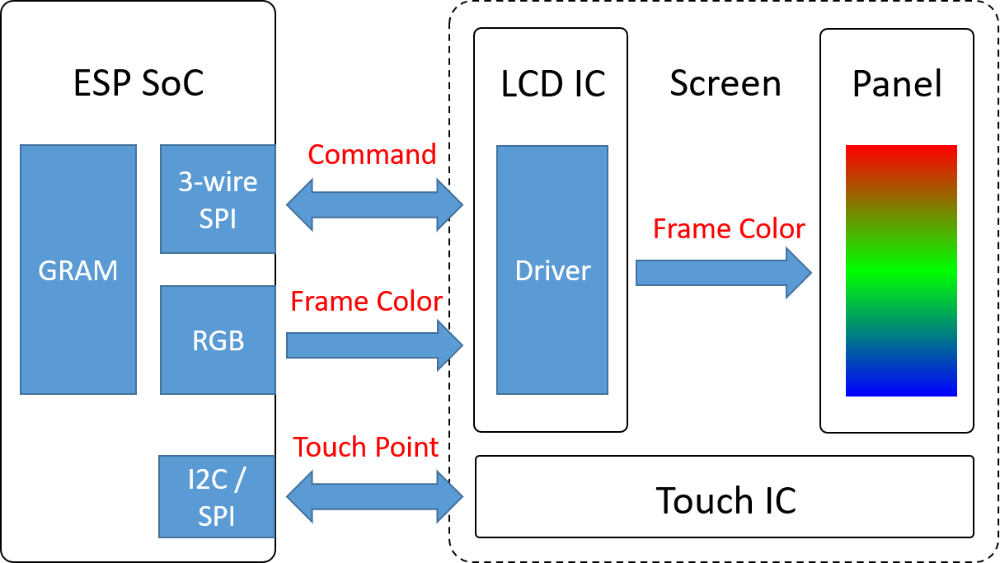
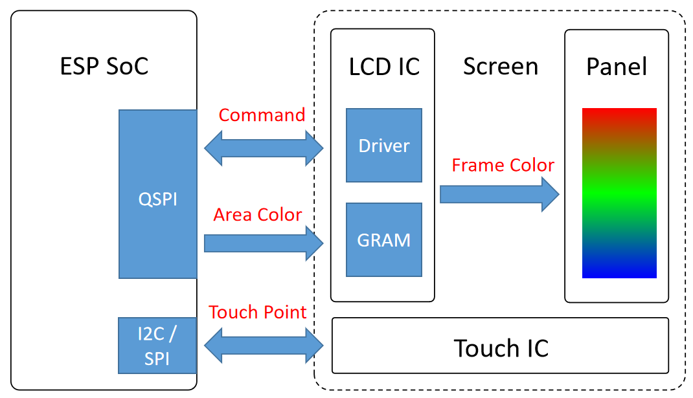
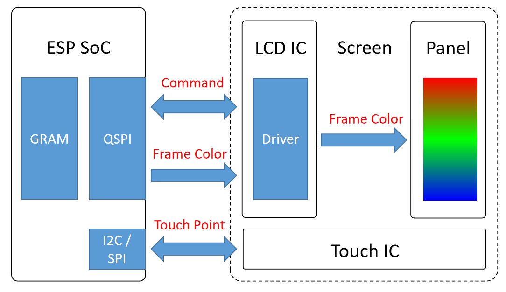
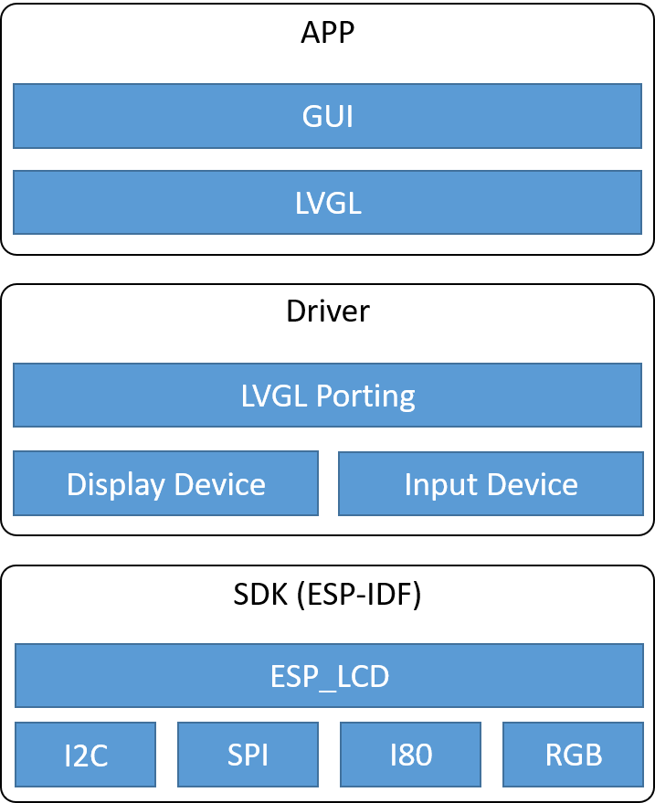

LCD 开发指南
=========================

:link_to_translation:`en:[English]`

本指南主要包含如下内容：

.. list::

  - `支持的接口类型`_：乐鑫各系列芯片对不同 LCD 接口的支持情况。
  - `驱动及示例`_：乐鑫提供的 LCD 驱动及示例。
  - `开发框架`_：开发 LCD 的软硬件框架。
  - `开发步骤`_：开发 LCD 应用的详细步骤。
  - `常见问题`_：列出了开发 LCD 应用过程中常见的问题。
  - `相关文档`_：列出了相关文档的链接。

术语表
-----------

请参阅 :ref:`LCD 术语表 <LCD_术语表>` 。

支持的接口类型
----------------------------

乐鑫芯⽚已经⽀持了 :ref:`LCD 概述 - 驱动接口 <LCD_概述_驱动接口>` 一节介绍的全部接⼝类型，各系列 ESP 芯⽚的具体⽀持情况如下：

.. list-table::
    :widths: 20 20 20 20 20
    :header-rows: 1

    * - Soc
      - SPI (QSPI)
      - I80
      - RGB
      - MIPI-DSI
    * - ESP32
      - |supported|
      - |supported|
      -
      -
    * - ESP32-C3
      - |supported|
      -
      -
      -
    * - ESP32-C6
      - |supported|
      -
      -
      -
    * - ESP32-S2
      - |supported|
      - |supported|
      -
      -
    * - ESP32-S3
      - |supported|
      - |supported|
      - |supported|
      -
    * - ESP32-P4
      - |supported|
      - |supported|
      - |supported|
      - |supported|

.. |supported| image:: https://img.shields.io/badge/-Supported-green

.. _LCD_开发指南_驱动及示例:

驱动及示例
---------------------

**LCD 外设驱动** 位于 **ESP-IDF** 下的 `components/esp_lcd <https://github.com/espressif/esp-idf/tree/master/components/esp_lcd>`_ 目录，目前支持 ``I2C``、 ``SPI (QSPI)``、 ``I80`` 以及 ``RGB`` 接口，详细介绍请参考 `文档 <https://docs.espressif.com/projects/esp-idf/en/latest/esp32s3/api-reference/peripherals/lcd.html>`_。下表是目前乐鑫官方基于 ``esp_lcd`` 移植的 **LCD 驱动组件** , 并且 **LCD 驱动组件** 会持续更新：

.. list-table::
    :widths: 10 15
    :header-rows: 1

    * - 接口
      - LCD 控制器
    * - I2C
      - `ssd1306 <https://github.com/espressif/esp-idf/blob/master/components/esp_lcd/src/esp_lcd_panel_ssd1306.c>`_, `sh1107 <https://components.espressif.com/components/espressif/esp_lcd_sh1107>`_
    * - SPI
      - `axs15231b <https://components.espressif.com/components/espressif/esp_lcd_axs15231b>`_, `st7789 <https://github.com/espressif/esp-idf/blob/master/components/esp_lcd/src/esp_lcd_panel_st7789.c>`_, `nt35510 <https://github.com/espressif/esp-idf/blob/master/components/esp_lcd/src/esp_lcd_panel_nt35510.c>`_, `gc9b71 <https://components.espressif.com/components/espressif/esp_lcd_gc9b71>`_, `nv3022b <https://components.espressif.com/components/espressif/esp_lcd_nv3022b>`_, `sh8601 <https://components.espressif.com/components/espressif/esp_lcd_sh8601>`_, `spd2010 <https://components.espressif.com/components/espressif/esp_lcd_spd2010>`_, `st77916 <https://components.espressif.com/components/espressif/esp_lcd_st77916>`_, `st77922 <https://components.espressif.com/components/espressif/esp_lcd_st77922>`_, `gc9a01 <https://components.espressif.com/components/espressif/esp_lcd_gc9a01>`_, `gc9d01 <https://components.espressif.com/components/espressif/esp_lcd_gc9d01>`_, `ili9341 <https://components.espressif.com/components/espressif/esp_lcd_ili9341>`_, `ssd1681 <https://components.espressif.com/components/espressif/esp_lcd_ssd1681>`_, `st7796 <https://components.espressif.com/components/espressif/esp_lcd_st7796>`_,  `gc9107 <https://components.espressif.com/components/espressif/esp_lcd_gc9107>`_
    * - QSPI
      - `axs15231b <https://components.espressif.com/components/espressif/esp_lcd_axs15231b>`_, `gc9b71 <https://components.espressif.com/components/espressif/esp_lcd_gc9b71>`_, `sh8601 <https://components.espressif.com/components/espressif/esp_lcd_sh8601>`_, `spd2010 <https://components.espressif.com/components/espressif/esp_lcd_spd2010>`_, `st77903 <https://components.espressif.com/components/espressif/esp_lcd_st77903_qspi>`_, `st77916 <https://components.espressif.com/components/espressif/esp_lcd_st77916>`_, `st77922 <https://components.espressif.com/components/espressif/esp_lcd_st77922>`_, `co5300 <https://components.espressif.com/components/espressif/esp_lcd_co5300>`_
    * - I80
      - `axs15231b <https://components.espressif.com/components/espressif/esp_lcd_axs15231b>`_, `st7789 <https://github.com/espressif/esp-idf/blob/master/components/esp_lcd/src/esp_lcd_panel_st7789.c>`_, `nt35510 <https://github.com/espressif/esp-idf/blob/master/components/esp_lcd/src/esp_lcd_panel_nt35510.c>`_, `ra8875 <https://components.espressif.com/components/espressif/esp_lcd_ra8875>`_, `st7796 <https://components.espressif.com/components/espressif/esp_lcd_st7796>`_
    * - MIPI-DSI
      - `co5300 <https://components.espressif.com/components/espressif/esp_lcd_co5300>`_, `ek79007 <https://components.espressif.com/components/espressif/esp_lcd_ek79007>`_, `er88577 <https://components.espressif.com/components/espressif/esp_lcd_er88577>`_, `hx8399 <https://components.espressif.com/components/espressif/esp_lcd_hx8399>`_, `ili9881c <https://components.espressif.com/components/espressif/esp_lcd_ili9881c>`_, `jd9165 <https://components.espressif.com/components/espressif/esp_lcd_jd9165>`_, `jd9365 <https://components.espressif.com/components/espressif/esp_lcd_jd9365>`_, `st7123 <https://components.espressif.com/components/espressif/esp_lcd_st7123>`_, `st7701 <https://components.espressif.com/components/espressif/esp_lcd_st7701>`_, `st7703 <https://components.espressif.com/components/espressif/esp_lcd_st7703>`_, `st77916 <https://components.espressif.com/components/espressif/esp_lcd_st77916>`_, `st77922 <https://components.espressif.com/components/espressif/esp_lcd_st77922>`_
    * - 3-wire SPI + RGB
      - `st7701 <https://components.espressif.com/components/espressif/esp_lcd_st7701>`_, `st77903_rgb <https://components.espressif.com/components/espressif/esp_lcd_st77903_rgb>`_, `st77922 <https://components.espressif.com/components/espressif/esp_lcd_st77922>`_, `gc9503 <https://components.espressif.com/components/espressif/esp_lcd_gc9503>`_, `nv3052 <https://components.espressif.com/components/espressif/esp_lcd_nv3052>`_

**请注意：**

.. _lcd_驱动组件:

  - **st7789**、**nt35510**、**ssd1306** 组件保存在 `ESP-IDF <https://github.com/espressif/esp-idf/tree/master/components/esp_lcd/src>`_ 中。其余组件可以在 `ESP 组件管理器 <https://components.espressif.com/components?q=espressif%2Fesp_lcd>`_ 中搜索使用。
  - 即使 **LCD 驱动 IC** 的型号相同，不同的屏幕往往需要使用各自厂商提供的初始化命令配置，大部分驱动组件支持在初始化 LCD 设备时传入自定义的初始化命令，若不支持，请参考 `方法 <https://docs.espressif.com/projects/esp-idf/en/latest/esp32/api-reference/peripherals/lcd.html#steps-to-add-manufacture-specific-initialization>`_ 。

**LCD 示例** 位于 **ESP-IDF** 下的 `examples/peripherals/lcd <https://github.com/espressif/esp-idf/tree/master/examples/peripherals/lcd>`_ 目录和 **esp-iot-solution** 下的 :project:`examples/display/lcd <examples/display/lcd>` 目录，可参考 LCD 驱动组件使用。

.. note::

    - 推荐基于 ESP-IDF `release/v5.1 <https://github.com/espressif/esp-idf/tree/release/v5.1>`_ 及以上版本分支进行开发，因为低版本不支持部分重要的新特性，尤其是对于 ``RGB`` 接口。
    - 对于使用 ``3-wire SPI + RGB`` 接口的 LCD，请参考示例 `esp_lcd_st7701 - Example use <https://components.espressif.com/components/espressif/esp_lcd_st7701>`_。

开发框架
-------------------------

.. _LCD_开发指南_硬件框架:

硬件框架
^^^^^^^^^^^^^^^^^^^^^^^^^

对于 SPI/I80 LCD，ESP 可以通过单一的外设接口发送 **命令** 来配置 LCD 以及传输 **局部的色彩数据** 来刷新屏幕。LCD 的驱动 IC 会将接收到的色彩数据存储在 **全屏大小的 GRAM** 内，并按照固定的刷新速率把 **全屏的色彩数据** 显示到面板上，这两个过程是异步进行的。下面是 SPI/I80 LCD 的硬件驱动框架示意图：

.. figure:: ../../../_static/display/screen/lcd_hw_framework_spi_i80.png
    :align: center
    :scale: 40%
    :alt: 硬件驱动框架示意图 - SPI/I80 LCD

    硬件驱动框架示意图 - SPI/I80 LCD

对于大多数 RGB LCD，ESP 需要使用两种不同的接口，一方面通过 ``3-wire SPI`` 接口发送 **命令** 来配置 LCD ，另一方面通过 ``RGB`` 接口传输 **全屏的色彩数据** 来刷新屏幕。由于 LCD 的驱动 IC 没有内置的 GRAM，它会将接收到的色彩数据直接显示到面板上，因此这两个过程是同步进行的。下面是 RGB LCD 的硬件驱动框架示意图：

    硬件驱动框架示意图 - RGB LCD

通过对比这两种框架可以看出，RGB LCD 相较于 SPI/I80 LCD，不仅需要 ESP 使用两种接口来分别实现传输命令和色彩数据，还要求 ESP 提供全屏大小的 GRAM 来实现屏幕刷新（由于芯片内的 SRAM 的空间比较有限，通常将 GRAM 放在 PSRAM 上）。

对于 QSPI LCD，不同型号的驱动 IC 可能需要不同的驱动方式，比如 *SPD2010* 这款 IC 内置 GRAM，其驱动方式与 SPI/I80 LCD 类似，而 *ST77903* 这款 IC 内部没有 GRAM，其驱动方式与 RGB LCD 类似，但是它们都是通过用单一的外设接口传输命令和色彩数据，下面是这两种 QSPI LCD 的硬件驱动框架示意图：

    硬件驱动框架示意图 - QSPI LCD (有 GRAM)

    硬件驱动框架示意图 - QSPI LCD (无 GRAM)

软件框架
^^^^^^^^^^^^^^^^^^^^^^^^^

软件开发框架主要由 SDK、Driver 和 APP 三个层次组成:

  #. **SDK 层**：ESP-IDF 作为框架的基础部分，不仅包含了驱动 LCD 所需的 ``I2C``、 ``SPI(QSPI)``、 ``I80`` 和 ``RGB`` 等多种外设，还通过 ``esp_lcd`` 组件提供了统一的 APIs 来操作接口和 LCD，如命令及参数的传输，LCD 的图像刷新、反转、镜像等功能。
  #. **Driver 层**：基于 SDK 提供的 APIs 可以实现各种设备驱动，并通过初始化接口设备和 LCD 设备实现 LVGL (GUI 框架)的移植。
  #. **APP 层**：使用 LVGL 提供的 APIs 实现各种 GUI 功能，如显示图片、动画、文字等。

    软件开发框架示意图

开发步骤
-------------------------

初始化接口设备
^^^^^^^^^^^^^^^^^^^^^^^^^

首先，初始化与 LCD 接口对应的外设。然后，创建接口设备并获取其句柄，该句柄的数据类型应为 ``esp_lcd_panel_io_handle_t``。这样即可使用统一的 `接口通用 APIs <https://github.com/espressif/esp-idf/blob/release/v5.1/components/esp_lcd/include/esp_lcd_panel_io.h>`_ 进行数据传输。

.. note::

  对于仅采用 ``RGB`` 接口的 LCD，不需要创建其接口设备，请直接参考 :ref:`LCD 初始化  <lcd_初始化>`。

不同类型的 LCD 接口需要使用不同的外设，下面对几种常用接口的设备初始化过程进行说明：

  - :ref:`SPI LCD 详解 - 初始化接口设备 <spi_初始化接口设备>`
  - :ref:`RGB LCD 详解 - 初始化接口设备 <rgb_初始化接口设备>`
  - I80 LCD 详解 - 初始化接口设备（待更新）
  - QSPI LCD 详解 - 初始化接口设备（待更新）

关于这部分更加详细的说明，请参考 `ESP-IDF 编程指南 <https://docs.espressif.com/projects/esp-idf/en/latest/esp32s3/api-reference/peripherals/lcd.html>`_。

初始化 LCD 设备
^^^^^^^^^^^^^^^^^^^^^^^^^

由于不同型号的 LCD 驱动 IC 可能具有不同的命令（寄存器）和参数，并且不同的接口类型也可能采用不同的数据格式和驱动方式，首先需要针对特定的接口利用 `接口通用 APIs <https://github.com/espressif/esp-idf/blob/release/v5.1/components/esp_lcd/include/esp_lcd_panel_io.h>`_ 来移植目标 LCD 驱动，然后创建 LCD 设备并获取数据类型为 ``esp_lcd_panel_handle_t`` 的句柄，最终使得应用程序能够通过统一的 `LCD 通用 APIs <https://github.com/espressif/esp-idf/blob/release/v5.1/components/esp_lcd/include/esp_lcd_panel_ops.h>`_ 来操作 LCD 设备。

.. note::

  对于仅采用 ``RGB`` 接口的 LCD，不需要移植其驱动组件，请直接参考 :ref:`LCD 初始化 <lcd_初始化>` 。

在移植驱动组件前，请先尝试直接从 :ref:`LCD 驱动组件 <lcd_驱动组件>` 中获取目标 LCD 驱动 IC 的组件。若该组件不存在，那么也可以基于已有的并且接口类型相同的组件进行移植。不同接口类型的 LCD 驱动可能具有不同的移植原理，下面对几种常用接口的 LCD 驱动组件的移植方法进行说明：

  - :ref:`SPI LCD 详解 - 移植驱动组件 <spi_移植驱动组件>`
  - :ref:`RGB LCD 详解 - 移植驱动组件 <rgb_移植驱动组件>`
  - I80 LCD 详解 - 移植驱动组件（待更新）
  - QSPI LCD 详解 - 移植驱动组件（待更新）

.. _lcd_初始化:

然后，利用驱动组件就可以实现 LCD 的初始化，下面对几种常用接口的 LCD 初始化进行说明：

  - :ref:`SPI LCD 详解 - 初始化 LCD 设备  <spi_初始化_lcd>`
  - :ref:`RGB LCD 详解 - 初始化 LCD 设备  <rgb_初始化_lcd>`
  - I80 LCD 详解 - 初始化 LCD 设备 （待更新）
  - QSPI LCD 详解 - 初始化 LCD 设备 （待更新）

关于这部分更加详细的说明，请参考 `ESP-IDF 编程指南 <https://docs.espressif.com/projects/esp-idf/en/latest/esp32s3/api-reference/peripherals/lcd.html>`_。

移植 LVGL
^^^^^^^^^^^^^^^^^^^^^^^^^

（待更新）

设计 GUI
^^^^^^^^^^^^^^^^^^^^^^^^^

（待更新）

常见问题
-------------------------

下面列举了一些开发 LCD 应用过程中常见的问题，请点击问题跳转查看解决方法。

* `ESP 系列芯片如何使用 Arduino IDE 开发 GUI <https://docs.espressif.com/projects/esp-faq/zh_CN/latest/software-framework/peripherals/lcd.html#esp-arduino-ide-gui>`_
* `ESP 系列芯片支持 LCD 的最大分辨率及帧率 <https://docs.espressif.com/projects/esp-faq/zh_CN/latest/software-framework/peripherals/lcd.html#id3>`_
* `ESP 系列芯片如何提高 LCD 的渲染帧率 <https://docs.espressif.com/projects/esp-faq/zh_CN/latest/software-framework/peripherals/lcd.html#id2>`_
* `ESP32-S3 如何提高 RGB LCD 的 PCLK（刷新帧率） <https://docs.espressif.com/projects/esp-faq/zh_CN/latest/software-framework/peripherals/lcd.html#esp32-s3-rgb-pclk>`_
* `ESP32-S3 如何解决驱动 RGB LCD 出现屏幕偏移或闪烁的问题 <https://docs.espressif.com/projects/esp-faq/zh_CN/latest/software-framework/peripherals/lcd.html#esp32-s3-rgb-lcd>`_
* `ESP32-S3R8 如何配置 PSRAM 120M Octal(DDR) <https://docs.espressif.com/projects/esp-faq/zh_CN/latest/software-framework/peripherals/lcd.html>`_

相关文档
-------------------------

* `ESP-IDF 编程指南 - LCD <https://docs.espressif.com/projects/esp-idf/en/latest/esp32s3/api-reference/peripherals/lcd.html>`_
* `ESP-FAQ - LCD <https://docs.espressif.com/projects/esp-faq/zh_CN/latest/software-framework/peripherals/lcd.html>`_
* `LVGL 文档 <https://docs.lvgl.io/8.3/>`_
