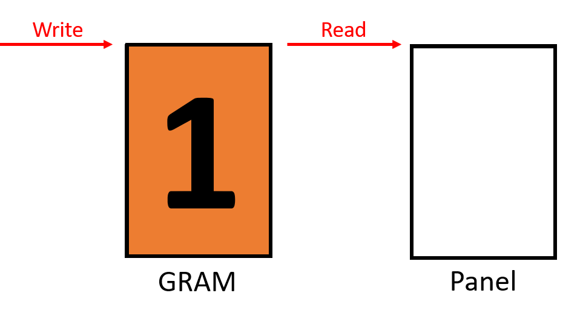

LCD 屏幕撕裂详解
===========================

:link_to_translation:`en:[English]`

.. contents:: 目录
    :local:
    :depth: 2

该部分旨在介绍 LCD 出现屏幕撕裂的原理以及相应的处理方法。

术语表
-----------

请参阅 :ref:`LCD 术语表 <LCD_术语表>` 。

屏幕撕裂的原理
--------------------------------------

现象
^^^^^^^^^^^^^^

屏幕撕裂，通常也称为撕裂效应，是 LCD 应用中常见的问题，通常在 GUI 发生全屏或者较大面积的区域变化时出现，现象是在 LCD 上同时显示了几帧图像中的不同部分，使得人眼能够观察到图像出现明显的断层，大大降低了 GUI 的视觉体验。下面为运行 LVGL Musci 示例时出现和没有出现屏幕撕裂的效果图。

.. only:: latex

  点击链接可参考 `出现屏幕撕裂的效果图 <https://dl.espressif.com/AE/esp-iot-solution/screen_tear_with_tear.gif>`_。

.. only:: html

    .. figure:: https://dl.espressif.com/AE/esp-iot-solution/screen_tear_with_tear.gif
        :align: center
        :alt: 出现屏幕撕裂的效果图

        出现屏幕撕裂的效果图

.. only:: latex

  点击链接可参考 `没有出现屏幕撕裂的效果图 <https://dl.espressif.com/AE/esp-iot-solution/screen_tear_without_tear.gif>`_。

.. only:: html

    .. figure:: https://dl.espressif.com/AE/esp-iot-solution/screen_tear_without_tear.gif
        :align: center
        :alt: 没有出现屏幕撕裂的效果图

        没有出现屏幕撕裂的效果图

原因
^^^^^^^^^^^^^^

接下来会通过设置一系列假设条件并结合示意图来详细说明产生屏幕撕裂的原因。为了方便起见，这里将屏幕的刷新过程简化为 **写入** 和 **读取** 两个步骤，写入是指主控将渲染得到的色彩数据写入 GRAM 的过程，读取是指屏幕持续从 GRAM 中读取色彩数据并显示到面板上的过程。下面为简化的屏幕刷新示意图。

    简化的屏幕刷新示意图

.. Note::

    一些 LCD 可以通过命令控制主控写入和屏幕读取的方向，如 **ST7789** 的 ``36h`` 命令，当方向不一致时，也有可能出现屏幕撕裂，后续仅针对读取和写入方向一致的情况进行说明。

当主控在写入时没有进行任何同步操作，即写入的初始位置以及初始时刻都是未知的，如果写入和读取的速度不相等，那么就有可能会出现屏幕撕裂。

1. 假设写入的速度比读取慢（以速度比值为 1：2 举例），在主控写入第二帧图像的过程中，读取的位置会超过写入位置，使得屏幕仅读取到第二帧图像的前半部分，从而导致显示图像出现撕裂，下面为演示过程的示意图。

.. only:: latex

  点击链接可参考 `写入与读取不同步且速度比值为 1：2 时的示意图 <https://dl.espressif.com/AE/esp-iot-solution/screen_tear_no_sync_1.gif>`_。

.. only:: html

    .. figure:: https://dl.espressif.com/AE/esp-iot-solution/screen_tear_no_sync_1.gif
        :align: center
        :alt:  写入与读取不同步且速度比值为 1：2 时的示意图

        写入与读取不同步且速度比值为 1：2 时的示意图

2. 假设写入的速度比读取快（以速度比值为 2：1 举例），在屏幕读取第一帧图像的过程中，写入的位置会超过读取的位置，使得屏幕读取到第二帧图像的后半部分，从而导致显示图像出现撕裂，下面为演示过程的示意图。

.. only:: latex

  点击链接可参考 `写入与读取不同步且速度比值为 2：1 时的示意图 <https://dl.espressif.com/AE/esp-iot-solution/screen_tear_no_sync_2.gif>`_。

.. only:: html

    .. figure:: https://dl.espressif.com/AE/esp-iot-solution/screen_tear_no_sync_2.gif
        :align: center
        :alt:  写入与读取不同步且速度比值为 2：1 时的示意图

        写入与读取不同步且速度比值为 2：1 时的示意图

当主控在写入时采取了同步操作，即写入的初始位置以及初始时刻和读取是同步的，如果写入和读取的速度不匹配，那么也有可能会出现屏幕撕裂。

1. 假设写入的速度小于读取的二分之一（以速度比值为 1：3 举例），在主控写入第二帧图像的过程中，读取的位置会超过写入的位置，使得屏幕仅读取到第二帧图像的前半部分，从而导致显示图像出现撕裂，下面为演示过程的示意图。

.. only:: latex

  点击链接可参考 `写入与读取同步且速度比值为 1：3 时的示意图 <https://dl.espressif.com/AE/esp-iot-solution/screen_tear_sync_1.gif>`_。

.. only:: html

    .. figure:: https://dl.espressif.com/AE/esp-iot-solution/screen_tear_sync_1.gif
        :align: center
        :alt:  写入与读取同步且速度比值为 1：3 时的示意图

        写入与读取同步且速度比值为 1：3 时的示意图

2. 假设写入的速度大于或等于读取的二分之一（以速度比值为 1：2 举例），在主控写入第二帧图像的过程中，读取的位置不会与写入的位置重叠，使得屏幕能够读取完整的第二帧图像，于是显示图像没有出现撕裂，下面为演示过程的示意图。

.. only:: latex

  点击链接可参考 `写入与读取同步且速度比值为 1：2 时的示意图 <https://dl.espressif.com/AE/esp-iot-solution/screen_tear_sync_2.gif>`_。

.. only:: html

    .. figure:: https://dl.espressif.com/AE/esp-iot-solution/screen_tear_sync_2.gif
        :align: center
        :alt:  写入与读取同步且速度比值为 1：2 时的示意图

        写入与读取同步且速度比值为 1：2 时的示意图

基于上述假设进行总结，出现屏幕撕裂的主要原因包含以下两点：

    #. 写入和读取同时操作同一个 GRAM
    #. 写入和读取的初始状态不同步或者速度不匹配

防止屏幕撕裂的方法
----------------------------------

在了解屏幕撕裂出现的原因之后，可以分别从 **GRAM** 和 **读写的状态与速度** 两个角度来实现屏幕的防撕裂方法。由于不同接口类型的 LCD 可能具有不同的 :ref:`刷新机制 <LCD_开发指南_硬件框架>` 和 :ref:`GRAM 位置 <LCD_概述_驱动接口>`，需要根据具体的接口类型来选择推荐的防撕裂方法，下表为不同接口类型下 GRAM 的位置以及相应的防撕裂方法。

.. list-table::
    :widths: 70 10 20
    :header-rows: 1

    * - 接口类型
      - GRAM 位置
      - 防撕裂方法
    * - RGB, MIPI-DSI (video mode), QSPI (without internal GRAM)
      - 主控
      - :ref:`基于多 GRAM 的方法 <LCD_屏幕撕裂详解_防止屏幕撕裂的方法_基于多_GRAM_的方法>`
    * - SPI, I80, QSPI (with internal GRAM)
      - LCD
      - :ref:`基于 TE 信号的方法 <LCD_屏幕撕裂详解_防止屏幕撕裂的方法_基于_TE_信号的方法>`

.. _LCD_屏幕撕裂详解_防止屏幕撕裂的方法_基于多_GRAM_的方法:

基于多 GRAM 的方法
^^^^^^^^^^^^^^^^^^^^^^^^^^

这种方法适用于 GRAM 在主控内的情况，并且要求主控可以自由调整屏幕读取的目标 GRAM，工作原理是：通过增加额外的 GRAM 来避免写入和读取同时操作同一个 GRAM。下面介绍了基于双 GRAM 的防撕裂方法，演示过程的示意图如下。

.. only:: latex

  点击链接可参考 `基于双 GRAM 实现防撕裂的示意图 <https://dl.espressif.com/AE/esp-iot-solution/screen_tear_multi_gram.gif>`_。

.. only:: html

    .. figure:: https://dl.espressif.com/AE/esp-iot-solution/screen_tear_multi_gram.gif
        :align: center
        :alt:  基于双 GRAM 实现防撕裂的示意图

        基于双 GRAM 实现防撕裂的示意图

从图中可以看出，初始时主控准备将第二帧图像写入 GRAM2，而屏幕准备读取 GRAM1 中的第一帧图像。当主控写入完成后，首先需要设置屏幕的下一帧从 GRAM2 读取，然后等待屏幕读取完当前帧图像。当屏幕读取完成后，接着就开始读取 GRAM2 中的第二帧图像，同时主控也开始将第三帧图像写入 GRAM1。因此，写入和读取不会同时操作同一个 GRAM，从而避免了屏幕出现撕裂。

.. _LCD_屏幕撕裂详解_防止屏幕撕裂的方法_基于多_GRAM_的方法_示例:

下面是基于 LVGL 实现的相关示例代码:

#. :project:`rgb_avoid_tearing <examples/display/lcd/rgb_avoid_tearing>`
#. :project:`qspi_without_ram <examples/display/lcd/qspi_without_ram>`

.. Note::

    为了优化显示性能，还可以在使用两个 GRAM 的基础上再新增一个 GRAM，此时，主控在完成一帧的写入后无需等待屏幕读取完一帧，而是直接开始写入下一帧。关于如何实现三个 GRAM 的防撕裂方法，请参阅 :ref:`示例代码 <LCD_屏幕撕裂详解_防止屏幕撕裂的方法_基于多_GRAM_的方法_示例>`。

.. _LCD_屏幕撕裂详解_防止屏幕撕裂的方法_基于_TE_信号的方法:

基于 TE 信号的方法
^^^^^^^^^^^^^^^^^^^^^^^^^^

这种方法适用于 GRAM 在 LCD 内的情况，并且要求 LCD 提供对外的 TE 信号引脚，工作原理是：通过 TE 信号控制写入的初始状态，使其与读取保持同步，同时控制写入的速度不小于读取的二分之一，从而避免写入和读取在 GRAM 的中间位置发生重合。下面介绍了基于 TE 信号的防撕裂方法，演示过程的示意图如下。

.. only:: latex

  点击链接可参考 `基于 TE 信号实现防撕裂的示意图 <https://dl.espressif.com/AE/esp-iot-solution/screen_tear_te.gif>`_。

.. only:: html

    .. figure:: https://dl.espressif.com/AE/esp-iot-solution/screen_tear_te.gif
        :align: center
        :alt:  基于 TE 信号实现防撕裂的示意图

        基于 TE 信号实现防撕裂的示意图

从图中可以看出，初始时主控正在等待 TE 信号，而屏幕准备进入消影区域（Porch）。当屏幕开始读取 GRAM 中的第一帧图像时，会向主控发送 TE 信号。当主控接收到 TE 信号后，就开始向 GRAM 写入第二帧图像，并且保证写入和读取的速度比值为 2：3。因此，写入和读取不会在 GRAM 的中间位置发生重合，从而避免了屏幕出现撕裂。

下面是基于 LVGL 实现的相关示例代码:

#. :project:`lcd_with_te <examples/display/lcd/lcd_with_te>`

.. Note::

    #. 一些 LCD 可以通过命令控制 TE 信号的开关以及触发时机等参数，如 **ST7789**  的 ``35h`` 和 ``44h`` 命令，为了保证上述方法的有效性，用户需要根据具体 LCD 驱动 IC 的数据手册来设置相应的参数，使得 TE 信号开启并在合适的位置触发。
    #. 一些 LCD 可以通过命令控制主控写入和屏幕读取的方向，如 **ST7789** 的 ``36h`` 命令，当方向不一致时，上述防止屏幕撕裂的方法会失效，用户需要根据具体 LCD 驱动 IC 的数据手册来设置相应的参数，使得写入和读取的方向一致。
