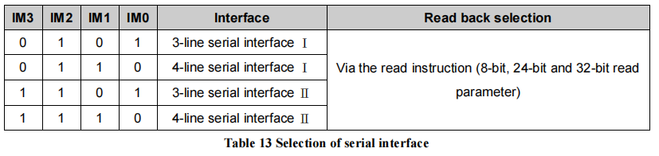
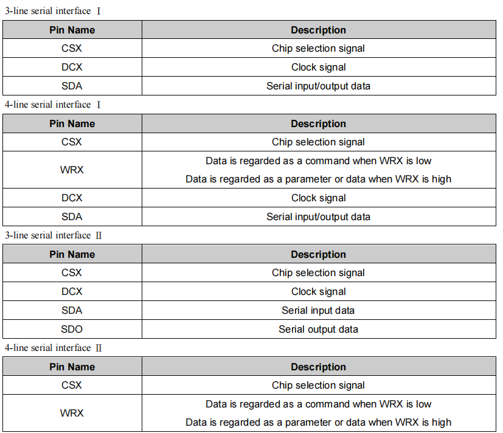
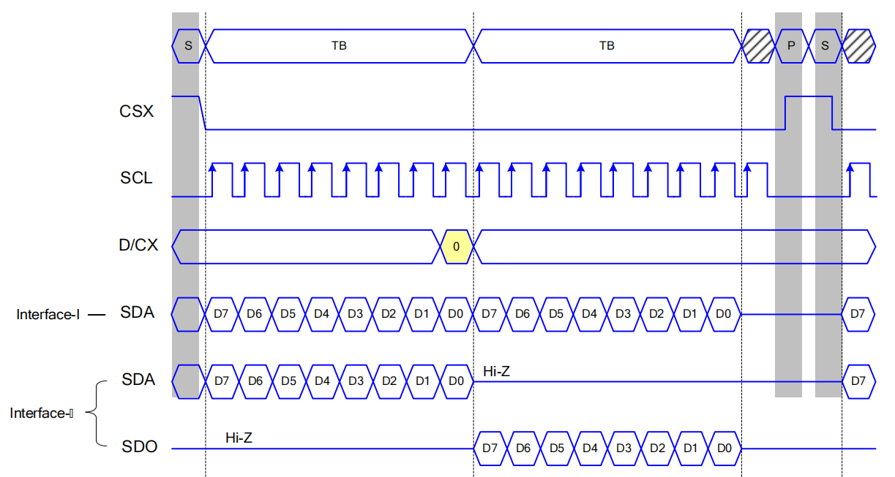
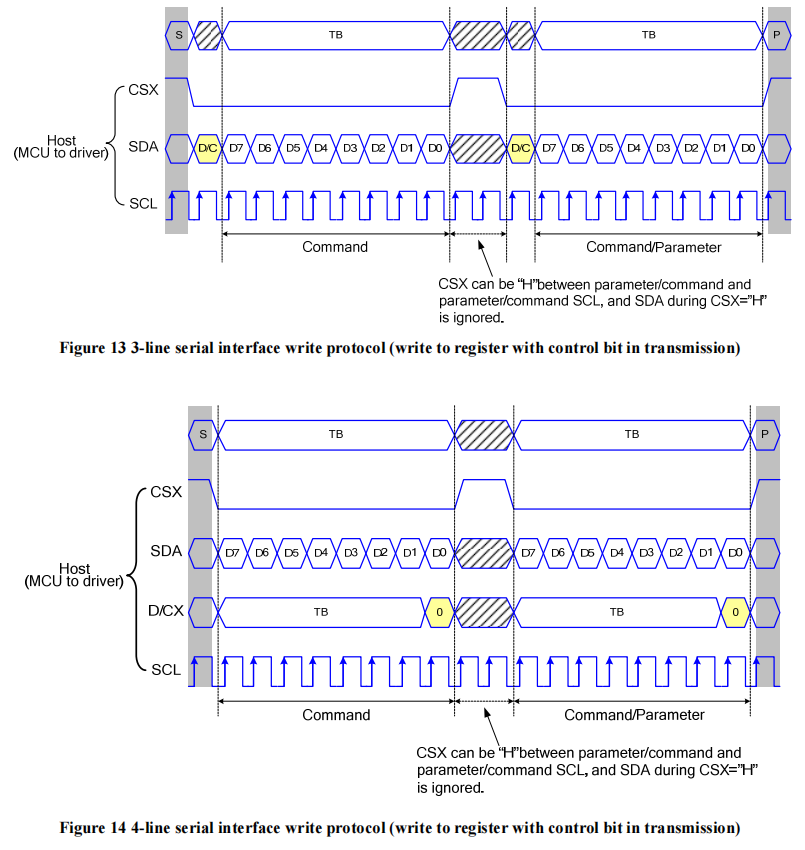

SPI LCD 详解
===========================

:link_to_translation:`en:[English]`

.. contents:: 目录
    :local:
    :depth: 2

术语表
-----------

请参阅 :ref:`LCD 术语表 <LCD_术语表>` 。

接口模式
---------------------

不同的接口模式需要主控采用不同的 **接线** 和 **驱动** 方式，下面以 *ST7789* 为例，介绍几种比较常见的接口模式。

    SPI 接口的模式选择

从上图中可以看出， *ST7789* 是通过 ``IM[3:0]`` 引脚来选择 ``Interface I/II`` 和 ``3/4-line`` 的配置，可以实现 4 种不同的接口模式。下图为 *ST7789* 的 ``SPI`` 接口的引脚描述：

    SPI 接口的引脚描述

注：SPI 引脚名称：CS、SCK(SCL)、SDA (MOSI)、SDO (MISO)、DC (RS)

.. _spi_interface_I/II_模式:

Interface I/II 模式
^^^^^^^^^^^^^^^^^^^^^^^^^^^^^^^^^^^^^^

    Interface I/II 模式的时序图对比（4-line）

从图中可以看出， ``Interface I`` 和 ``Interface II`` 的主要区别在于是否仅用一根数据线实现数据的读取和写入（如仅用 ``MOSI``）。

.. list-table::
    :widths: 20 50 10
    :header-rows: 1

    * - 模式
      - 是否仅用一根数据线实现数据的读取和写入
      - ESP 是否支持
    * - Interface I
      - 是
      - 是
    * - Interface II
      - 否
      - 是

.. _spi_3/4-line_模式:

3/4-line 模式
^^^^^^^^^^^^^^^^^^^^^^^^^^

    3/4-line 模式的时序图对比（Interface I）

从图中可以看出， ``3-line`` 和 ``4-line`` 的主要区别在于是否使用 D/C 信号线。

.. list-table::
    :widths: 20 50 10
    :header-rows: 1

    * - 模式
      - 是否使用 D/C 信号线
      - ESP 是否支持
    * - 3-line
      - 否
      - 否
    * - 4-line
      - 是
      - 是

.. note::

  - ``3-line`` 模式有时也称为 ``3-wire`` 或 ``9-bit`` 模式。
  - 虽然 ESP 的 SPI 外设不支持 LCD 的 ``3-line`` 模式，但是可以通过软件模拟实现，具体请参考组件 `esp_lcd_panel_io_additions <https://components.espressif.com/components/espressif/esp_lcd_panel_io_additions>`_，它通常用于实现 RGB LCD 的初始化。

SPI LCD 驱动流程
------------------------------

SPI LCD 驱动流程可大致分为三个部分：初始化接口设备、移植驱动组件和初始化 LCD 设备。

.. _spi_初始化接口设备:

初始化接口设备
------------------------------

初始化接口设备需要先初始化总线，再创建接口设备。下面基于 ESP-IDF release/v5.1 中的 `spi_lcd_touch <https://github.com/espressif/esp-idf/tree/v5.1/examples/peripherals/lcd/spi_lcd_touch>`_ 示例，具体介绍如何初始化 SPI 接口设备。

初始化总线
^^^^^^^^^^^^^^^^^^^^^^^^^^

示例代码:

.. code-block:: c

    #include "driver/spi_master.h"            // 依赖的头文件
    #include "esp_check.h"

    spi_bus_config_t buscfg = {
        .sclk_io_num = EXAMPLE_PIN_NUM_SCLK,  // 连接 LCD SCK（SCL） 信号的 IO 编号
        .mosi_io_num = EXAMPLE_PIN_NUM_MOSI,  // 连接 LCD MOSI（SDO、SDA） 信号的 IO 编号
        .miso_io_num = EXAMPLE_PIN_NUM_MISO,  // 连接 LCD MISO（SDI） 信号的 IO 编号，如果不需要从 LCD 读取数据，可以设为 `-1`
        .quadwp_io_num = -1,                  // 必须设置且为 `-1`
        .quadhd_io_num = -1,                  // 必须设置且为 `-1`
        .max_transfer_sz = EXAMPLE_LCD_H_RES * 80 * sizeof(uint16_t), // 表示 SPI 单次传输允许的最大字节数上限，通常设为全屏大小即可
    };
    ESP_ERROR_CHECK(spi_bus_initialize(LCD_HOST, &buscfg, SPI_DMA_CH_AUTO));
                                              // 第 1 个参数表示使用的 SPI 主机 ID，和后续创建接口设备时保持一致
                                              // 第 3 个参数表示使用的 DMA 通道号，默认设置为 `SPI_DMA_CH_AUTO` 即可

如果有多个设备同时使用同一 SPI 总线，那么只需要对总线初始化一次。

下面是部分配置参数的说明：

  - 若 LCD 驱动 IC 配置为 :ref:`Interface-I 接口模式 <spi_interface_I/II_模式>`，软件仅需设置 ``mosi_io_num`` 为其数据线 IO，而设置 ``miso_io_num`` 为 -1。
  - `SPI 驱动 <https://github.com/espressif/esp-idf/blob/cbce221e88d52665523093b2b6dd0ebe3f1243f1/components/driver/spi/gpspi/spi_master.c#L775>`_ 在传输数据前会对输入数据量的大小进行判断，若单次传输的字节数超过 ``max_transfer_sz`` 则会报错。但是， **SPI 单次 DMA 传输允许的最大字节数** 不仅取决于 ``max_transfer_sz``，而且受限于 ESP-IDF 中的 `SPI_LL_DATA_MAX_BIT_LEN <https://github.com/espressif/esp-idf/blob/cbce221e88d52665523093b2b6dd0ebe3f1243f1/components/hal/esp32s3/include/hal/spi_ll.h#L43>`_ （不同系列 ESP 的值不同），即满足 ``最大字节数 <= MIN(max_transfer_sz, (SPI_LL_DATA_MAX_BIT_LEN / 8))`` 。由于 `esp_lcd 驱动 <https://github.com/espressif/esp-idf/blob/cbce221e88d52665523093b2b6dd0ebe3f1243f1/components/esp_lcd/src/esp_lcd_panel_io_spi.c#L358>`_ 会提前判断输入的数据量是否超过限制，如果超过则进行 **分包处理** 后才控制 SPI 进行多次传输， **因此 max_transfer_sz 通常设为全屏大小即可** 。

创建接口设备
^^^^^^^^^^^^^^^^^^^^^^^^^^

示例代码:

.. code-block:: c

    #include "esp_lcd_panel_io.h"       // 依赖的头文件

    static bool example_on_color_trans_dome(esp_lcd_panel_io_handle_t panel_io, esp_lcd_panel_io_event_data_t *edata, void *user_ctx)
    {
        /* 色彩数据传输完成时的回调函数，可以在此处进行一些操作 */

        return false;
    }

    esp_lcd_panel_io_handle_t io_handle = NULL;
    esp_lcd_panel_io_spi_config_t io_config = {
        .dc_gpio_num = EXAMPLE_PIN_NUM_LCD_DC,    // 连接 LCD DC（RS） 信号的 IO 编号，可以设为 `-1` 表示不使用
        .cs_gpio_num = EXAMPLE_PIN_NUM_LCD_CS,    // 连接 LCD CS 信号的 IO 编号，可以设为 `-1` 表示不使用
        .pclk_hz = EXAMPLE_LCD_PIXEL_CLOCK_HZ,    // SPI 的时钟频率（Hz），ESP 最高支持 80M（SPI_MASTER_FREQ_80M）
                                                  // 需根据 LCD 驱动 IC 的数据手册确定其最大值
        .lcd_cmd_bits = EXAMPLE_LCD_CMD_BITS,     // 单位 LCD 命令的比特数，应为 8 的整数倍
        .lcd_param_bits = EXAMPLE_LCD_PARAM_BITS, // 单位 LCD 参数的比特数，应为 8 的整数倍
        .spi_mode = 0,                            // SPI 模式（0-3），需根据 LCD 驱动 IC 的数据手册以及硬件的配置确定（如 IM[3:0]）
        .trans_queue_depth = 10,                  // SPI 设备传输数据的队列深度，一般设为 10 即可
        .on_color_trans_done = example_on_color_trans_dome,   // 单次调用 `esp_lcd_panel_draw_bitmap()` 传输完成后的回调函数
        .user_ctx = &example_user_ctx,            // 传给回调函数的用户参数
        .flags = {    // 以下为 SPI 时序的相关参数，需根据 LCD 驱动 IC 的数据手册以及硬件的配置确定
            .sio_mode = 0,    // 通过一根数据线（MOSI）读写数据，0: Interface I 型，1: Interface II 型
        },
    };
    ESP_ERROR_CHECK(esp_lcd_new_panel_io_spi((esp_lcd_spi_bus_handle_t)LCD_HOST, &io_config, &io_handle));

    /* 以下函数也可用于注册色彩数据传输完成事件的回调函数 */
    // const esp_lcd_panel_io_callbacks_t cbs = {
    //     .on_color_trans_done = example_on_color_trans_dome,
    // };
    // esp_lcd_panel_io_register_event_callbacks(io_handle, &cbs, &example_user_ctx);

基于初始化好的 SPI 总线可以创建相应的接口设备，每个接口设备对应一个 SPI master 设备。

**注意：关于 SPI 接口配置参数更加详细的说明**，请参考 `ESP-IDF 编程指南 <https://docs.espressif.com/projects/esp-idf/en/latest/esp32s3/api-reference/peripherals/lcd.html#spi-interfaced-lcd>`_。

通过创建接口设备可以获取数据类型为 ``esp_lcd_panel_io_handle_t`` 的句柄，然后能够使用以下 `接口通用 APIs <https://github.com/espressif/esp-idf/blob/release/v5.1/components/esp_lcd/include/esp_lcd_panel_io.h>`_ 给 LCD 的驱动 IC 发送 **命令** 和 **图像数据**：

  #. ``esp_lcd_panel_io_tx_param()``：用于发送单个 LCD 的命令及配套参数，其内部通过函数 ``spi_device_polling_transmit()`` 实现数据传输，使用该函数会等待数据传输完毕后才会返回。
  #. ``esp_lcd_panel_io_tx_color()``：用于发送单次 LCD 刷屏命令和图像数据。在函数内部，它通过函数 ``spi_device_polling_transmit()`` 发送命令和一些少量的参数，然后通过函数 ``spi_device_queue_trans()`` 来分包发送大量的图像数据，每个包的大小由 **SPI 单次 DMA 传输允许的最大字节数** 来限制。这个函数将图像缓存地址等相关数据压入队列，队列的深度由 ``trans_queue_depth`` 参数指定。一旦数据成功压入队列，函数就会立刻返回。因此，如果计划在后续操作中修改相同的图像缓存，则需要注册一个回调函数来判断上一次的传输是否已经完成。如果不这样做，可能会在未完成的传输上进行修改，这会导致由于数据混乱而显示出现错误。

.. _spi_移植驱动组件:

移植驱动组件
------------------------

移植 SPI LCD 驱动组件的基本原理包含以下三点：

  #. 基于数据类型为 ``esp_lcd_panel_io_handle_t`` 的接口设备句柄发送指定格式的命令及参数。
  #. 实现并创建一个 LCD 设备，然后通过注册回调函数的方式实现结构体 `esp_lcd_panel_t <https://github.com/espressif/esp-idf/blob/release/v5.1/components/esp_lcd/interface/esp_lcd_panel_interface.h>`_ 中的各项功能。
  #. 实现一个函数用于提供数据类型为 ``esp_lcd_panel_handle_t`` 的 LCD 设备句柄，使得应用程序能够利用 `LCD 通用 APIs <https://github.com/espressif/esp-idf/blob/release/v5.1/components/esp_lcd/include/esp_lcd_panel_ops.h>`_ 来操作 LCD 设备。

下面是 ``esp_lcd_panel_handle_t`` 各项功能的实现说明以及和 `LCD 通用 APIs <https://github.com/espressif/esp-idf/blob/release/v5.1/components/esp_lcd/include/esp_lcd_panel_ops.h>`_ 的对应关系：

.. list-table::
    :widths: 10 20 70
    :header-rows: 1

    * - 功能
      - LCD 通用 APIs
      - 实现说明
    * - reset()
      - esp_lcd_panel_reset()
      - 若设备连接了复位引脚，则通过该引脚进行硬件复位，否则通过命令 ``LCD_CMD_SWRESET(01h)`` 进行软件复位。
    * - init()
      - esp_lcd_panel_init()
      - 通过发送一系列的命令及参数来初始化 LCD 设备。
    * - del()
      - esp_lcd_panel_del()
      - 释放驱动占用的资源，包括申请的存储空间和使用的 IO。
    * - draw_bitmap()
      - esp_lcd_panel_draw_bitmap()
      - 首先通过命令 ``LCD_CMD_CASET(2Ah)`` 和 ``LCD_CMD_RASET(2Bh)`` 发送图像的起始和终止坐标，然后通过命令 ``LCD_CMD_RAMWR(2Ch)`` 发送图像数据。
    * - mirror()
      - esp_lcd_panel_mirror()
      - 通过命令 ``LCD_CMD_MADCTL(36h)`` 设置是否镜像屏幕的 X 轴和 Y 轴。
    * - swap_xy()
      - esp_lcd_panel_swap_xy()
      - 通过命令 ``LCD_CMD_MADCTL(36h)`` 设置是否交换屏幕的 X 轴和 Y 轴。
    * - set_gap()
      - esp_lcd_panel_set_gap()
      - 通过软件修改画图时的起始和终止坐标，从而实现画图的偏移。
    * - invert_color()
      - esp_lcd_panel_invert_color()
      - 通过命令 ``LCD_CMD_INVON(21h)`` 和 ``LCD_CMD_INVOFF(20h)`` 实现像素的颜色数据按位取反（0xF0F0 -> 0x0F0F）。
    * - disp_on_off()
      - esp_lcd_panel_disp_on_off()
      - 通过命令 ``LCD_CMD_DISON(29h)`` 和 ``LCD_CMD_DISOFF(28h)`` 实现屏幕显示的开关。

对于大多数 SPI LCD，其驱动 IC 的命令及参数与上述实现说明中的兼容，因此可以通过以下步骤完成移植：

#. 在 :ref:`LCD 驱动组件 <lcd_驱动组件>`  中选择一个型号相似的 SPI LCD 驱动组件。
#. 通过查阅目标 LCD 驱动 IC 的数据手册，确认其与所选组件中各功能使用到的命令及参数是否一致，若不一致则需要修改相关代码。
#. 即使 LCD 驱动 IC 的型号相同，不同制造商的屏幕也通常需要使用各自提供的初始化命令配置。因此，需要修改初始化函数 ``init()`` 中发送的命令和参数。这些初始化命令通常以特定的格式存储在一个静态数组中。此外，需要注意不要在初始化命令中包含一些特殊的命令，例如 ``LCD_CMD_COLMOD(3Ah)`` 和 ``LCD_CMD_MADCTL(36h)``，这些命令是由驱动组件进行管理和使用的。
#. 可使用编辑器的字符搜索和替换功能，将组件中的 LCD 驱动 IC 名称替换为目标名称，如将 ``gc9a01`` 替换为 ``st77916``。

.. _spi_初始化_lcd:

初始化 LCD 设备
------------------------------

下面以 `GC9A01 <https://components.espressif.com/components/espressif/esp_lcd_gc9a01>`_ 为例的代码说明：

.. code-block:: c

    #include "esp_lcd_panel_vendor.h"   // 依赖的头文件
    #include "esp_lcd_panel_ops.h"
    #include "esp_lcd_gc9a01.h"         // 目标驱动组件的头文件

    /**
    * 用于存放 LCD 驱动 IC 的初始化命令及参数
    */
    // static const gc9a01_lcd_init_cmd_t lcd_init_cmds[] = {
    // //  {cmd, { data }, data_size, delay_ms}
    //     {0xfe, (uint8_t []){0x00}, 0, 0},
    //     {0xef, (uint8_t []){0x00}, 0, 0},
    //     {0xeb, (uint8_t []){0x14}, 1, 0},
    //     ...
    // };

    /* 创建 LCD 设备 */
    esp_lcd_panel_handle_t panel_handle = NULL;
    // const gc9a01_vendor_config_t vendor_config = {  // 用于替换驱动组件中的初始化命令及参数
    //     .init_cmds = lcd_init_cmds,
    //     .init_cmds_size = sizeof(lcd_init_cmds) / sizeof(gc9a01_lcd_init_cmd_t),
    // };
    esp_lcd_panel_dev_config_t panel_config = {
        .reset_gpio_num = EXAMPLE_PIN_NUM_LCD_RST,    // 连接 LCD 复位信号的 IO 编号，可以设为 `-1` 表示不使用
        .rgb_ele_order = LCD_RGB_ELEMENT_ORDER_RGB,   // 像素色彩的元素顺序（RGB/BGR），
                                                      //  一般通过命令 `LCD_CMD_MADCTL（36h）` 控制
        .bits_per_pixel = EXAMPLE_LCD_BIT_PER_PIXEL,  // 色彩格式的位数（RGB565：16，RGB666：18），
                                                      // 一般通过命令 `LCD_CMD_COLMOD（3Ah）` 控制
        // .vendor_config = &vendor_config,           // 用于替换驱动组件中的初始化命令及参数
    };
    ESP_ERROR_CHECK(esp_lcd_new_panel_gc9a01(io_handle, &panel_config, &panel_handle));

    /* 初始化 LCD 设备 */
    ESP_ERROR_CHECK(esp_lcd_panel_reset(panel_handle));
    ESP_ERROR_CHECK(esp_lcd_panel_init(panel_handle));
    // ESP_ERROR_CHECK(esp_lcd_panel_invert_color(panel_handle, true));   // 这些函数可以根据需要使用
    // ESP_ERROR_CHECK(esp_lcd_panel_mirror(panel_handle, true, true));
    // ESP_ERROR_CHECK(esp_lcd_panel_swap_xy(panel_handle, true));
    // ESP_ERROR_CHECK(esp_lcd_panel_set_gap(panel_handle, 0, 0));
    ESP_ERROR_CHECK(esp_lcd_panel_disp_on_off(panel_handle, true));

首先通过移植好的驱动组件创建 LCD 设备并获取数据类型为 ``esp_lcd_panel_handle_t`` 的句柄，然后使用 `LCD 通用 APIs <https://github.com/espressif/esp-idf/blob/release/v5.1/components/esp_lcd/include/esp_lcd_panel_ops.h>`_ 来初始化 LCD 设备。

下面是一些关于使用函数 ``esp_lcd_panel_draw_bitmap()`` 刷新 SPI LCD 图像的说明：

  - 传入该函数的图像缓存的字节数可以大于 ``max_transfer_sz``，此时 ``esp_lcd`` 驱动内部会根据 SPI 单次 DMA 传输允许的最大字节数进行分包处理。
  - 由于该函数是采用 DMA 的方式来传输图像数据，也就是说该函数调用完成后数据仍在通过 DMA 进行传输，此时不能修改正在使用的缓存区域（如进行 LVGL 的渲染）。因此，需要通过总线初始化或者调用 ``esp_lcd_panel_io_register_event_callbacks()`` 注册的回调函数来判断上一次传输是否完成。
  - 由于 SPI 驱动目前不支持直接通过 DMA 传输 PSRAM 上的数据，其内部会判断数据是否存放在 PSRAM 上，若是则会将其拷贝到 SRAM 中再进行传输。因此，推荐使用 SRAM 作为图像的缓存进行传输（如用于 LVGL 渲染的缓存），否则直接传输 PSRAM 上较大的图像数据，很可能会出现 SRAM 不足的情况。

相关文档
---------------------

- `ST7789 数据手册 <https://docs.espressif.com/projects/esp-dev-kits/zh_CN/latest/_static/esp32-s3-lcd-ev-board/datasheets/2.4_320x240/ST7789V_SPEC_V1.0.pdf>`_
