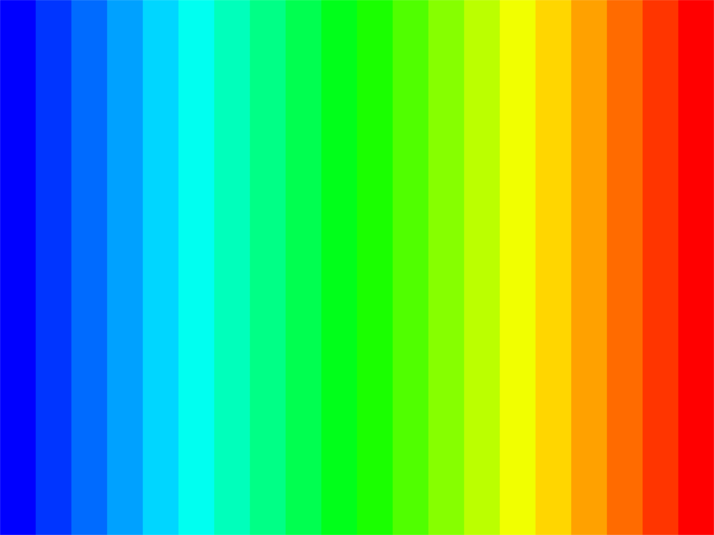

LED 指示灯
==============
:link_to_translation:`en:[English]`

本指南包含以下内容：

.. contents:: 目录
    :local:
    :depth: 2

LED 指示灯是最简单的输出外设之一，可以通过不同形式的闪烁指示系统当前的工作状态。ESP-IoT-Solution 提供的 LED 指示灯组件具有以下功能：

- 支持定义多组闪烁类型
- 支持定义闪烁类型优先级
- 支持创建多个指示灯
- LEDC 等驱动支持调节亮度，渐变，颜色等

支持的指示灯类型
------------------

+------------+------------------------------------+------+------+------+------+----------+------+
|  驱动类型  |                说明                | 亮灭 | 亮度 | 呼吸 | 颜色 | 颜色渐变 | 索引 |
+============+====================================+======+======+======+======+==========+======+
| GPIO       | 通过 GPIO 控制指示灯               | √    | ×    | ×    | ×    | ×        | ×    |
+------------+------------------------------------+------+------+------+------+----------+------+
| LEDC       | 通过一路 PWM 方式控制指示灯        | √    | √    | √    | ×    | ×        | ×    |
+------------+------------------------------------+------+------+------+------+----------+------+
| RGB LED    | 通过三路 PWM 方式控制指示灯        | √    | √    | √    | √    | √        | ×    |
+------------+------------------------------------+------+------+------+------+----------+------+
| LED Strips | 通过 RMT/SPI 控制的灯条，如 WS2812 | √    | √    | √    | √    | √        | √    |
+------------+------------------------------------+------+------+------+------+----------+------+

定义闪烁类型
--------------

控制亮灭
^^^^^^^^^^^^^

闪烁步骤结构体 :cpp:type:`blink_step_t` 定义了该步骤的类型、指示灯状态和状态持续时间。多个步骤组合成一个闪烁类型，不同的闪烁类型可用于标识不同的系统状态。闪烁类型的定义方法如下：

例 1. 定义一个循环闪烁：亮 0.05 s，灭 0.1 s，开始之后一直循环。

.. code:: c

    const blink_step_t test_blink_loop[] = {
        {LED_BLINK_HOLD, LED_STATE_ON, 50},               // step1: turn on LED 50 ms
        {LED_BLINK_HOLD, LED_STATE_OFF, 100},             // step2: turn off LED 100 ms
        {LED_BLINK_LOOP, 0, 0},                           // step3: loop from step1
    };

例 2. 定义一个循环闪烁：亮 0.05 s，灭 0.1 s，亮 0.15 s，灭 0.1 s，执行完毕灯熄灭。

.. code:: c

    const blink_step_t test_blink_one_time[] = {
        {LED_BLINK_HOLD, LED_STATE_ON, 50},               // step1: turn on LED 50 ms
        {LED_BLINK_HOLD, LED_STATE_OFF, 100},             // step2: turn off LED 100 ms
        {LED_BLINK_HOLD, LED_STATE_ON, 150},              // step3: turn on LED 150 ms
        {LED_BLINK_HOLD, LED_STATE_OFF, 100},             // step4: turn off LED 100 ms
        {LED_BLINK_STOP, 0, 0},                           // step5: stop blink (off)
    };

定义闪烁类型之后，需要在 ``led_indicator_blink_type_t`` 添加该类型对应的枚举成员，然后将其添加到闪烁类型列表 ``led_indicator_blink_lists``，示例如下：

.. code:: c

    typedef enum {
        BLINK_TEST_BLINK_ONE_TIME, /**< test_blink_one_time */
        BLINK_TEST_BLINK_LOOP,     /**< test_blink_loop */
        BLINK_MAX,                 /**< INVALID type */
    } led_indicator_blink_type_t;

    blink_step_t const * led_indicator_blink_lists[] = {
        [BLINK_TEST_BLINK_ONE_TIME] = test_blink_one_time,
        [BLINK_TEST_BLINK_LOOP] = test_blink_loop,
        [BLINK_MAX] = NULL,
    };

控制亮度
^^^^^^^^^^^

对于支持控制亮度的驱动，可以通过以下方式控制指示灯的亮度：

例 1. 定义一个亮度设置：设置指示灯亮度为 50%，持续 0.5 s。

.. code:: c

    const blink_step_t test_blink_50_brightness[] = {
        {LED_BLINK_BRIGHTNESS, LED_STATE_50_PERCENT, 500},   // step1: set to half brightness 500 ms
        {LED_BLINK_STOP, 0, 0},                              // step4: stop blink (50% brightness)
    };

例 2. 定义一个循环闪烁：渐亮 0.5s， 逐灭 0.5s， 重复执行。

.. code:: c

    const blink_step_t test_blink_breathe[] = {
        {LED_BLINK_HOLD, LED_STATE_OFF, 0},                  // step1: set LED off
        {LED_BLINK_BREATHE, LED_STATE_ON, 500},              // step2: fade from off to on 500ms
        {LED_BLINK_BREATHE, LED_STATE_OFF, 500},             // step3: fade from on to off 500ms
        {LED_BLINK_LOOP, 0, 0},                              // step4: loop from step1
    };

例 3. 定义一个闪烁：从 50% 亮度渐亮到 100% 亮度，持续 0.5s。

.. code:: c

    const blink_step_t test_blink_breathe_2[] = {
        {LED_BLINK_BRIGHTNESS, LED_STATE_50_PERCENT, 0},     // step1: set to half brightness 0 ms
        {LED_BLINK_BREATHE, LED_STATE_ON, 500},              // step2: fade from off to on 500ms
        {LED_BLINK_STOP, 0, 0},                              // step3: stop blink (100% brightness)
    };

控制颜色
^^^^^^^^^^^^

对于支持控制颜色的驱动，我们可以通过 `LED_BLINK_RGB`, `LED_BLINK_RGB_RING`, `LED_BLINK_HSV`, `LED_BLINK_HSV_RING` 来控制颜色。

    - `LED_BLINK_RGB`: 通过 RGB 控制颜色，其中 R 占 8 bites（0-255），G 占 8 bites（0-255），B 占 8 bites（0-255）。
    - `LED_BLINK_RGB_RING`: 通过 RGB 控制颜色渐变，会从上一次的颜色按照色环渐变到当前的设置颜色。采用 RGB 值插值法。
    - `LED_BLINK_HSV`: 通过 HSV 控制颜色，其中 H 占 9 bites（0-360），S 占 8 bites（0-255），V 占 8 bites（0-255）。
    - `LED_BLINK_HSV_RING`: 通过 HSV 控制颜色渐变，会从上一次的颜色按照色环渐变到当前的设置颜色。采用 HSV 值插值法。

例 1. 定义一个颜色设置，让指示灯显示红色。

.. code:: c

    const blink_step_t test_blink_rgb_red[] = {
        {LED_BLINK_RGB, SET_RGB(255,0,0), 0},                // step1: set to half brightness 500 ms
        {LED_BLINK_STOP, 0, 0},                              // step2: stop blink (red color)
    };

例 2. 定义一个颜色渐变，让指示灯从红色渐变到蓝色，并循环执行。

.. code:: c

    const blink_step_t test_blink_rgb_red_blue[] = {
        {LED_BLINK_RGB, SET_RGB(0xFF, 0, 0), 0},             // step1: set to red color 0 ms
        {LED_BLINK_RGB_RING, SET_RGB(0, 0, 0xFF), 4000},     // step2: fade from red to blue 4000ms
        {LED_BLINK_RGB_RING, SET_RGB(0xFF, 0, 0), 4000},     // step3: fade from blue to red 4000ms
        {LED_BLINK_LOOP, 0, 0},                              // step4: loop from step1
    };

采用 RGB 插值法显示颜色渐变，效果如下。

同时，驱动还支持通过 HSV 颜色来设置，使用方法与 RGB 类似。

例 3. 定义一个颜色设置，让指示灯显示红色 0.5s，绿色 0.5s, 蓝色 0.5s,最后停止

.. code:: c

    const blink_step_t test_blink_rgb_red[] = {
        {LED_BLINK_HSV, SET_HSV(0,255,255), 500},                // step1: set color to red 500 ms
        {LED_BLINK_HSV, SET_HSV(120,255,255), 500},              // step2: set color to green 500 ms
        {LED_BLINK_HSV, SET_HSV(240,255,255), 500},              // step3: set color to blue 500 ms
        {LED_BLINK_STOP, 0, 0},                                  // step4: stop blink (blue color)
    };

例 4. 定义一个颜色渐变，让指示灯从红色渐变到蓝色，并循环执行。

.. code:: c

    const blink_step_t test_blink_hsv_red_blue[] = {
        {LED_BLINK_HSV, SET_HSV(0,255,255), 0},              // step1: set to red color 0 ms
        {LED_BLINK_HSV_RING, SET_HSV(240,255,255), 4000},     // step2: fade from red to blue 4000ms
        {LED_BLINK_HSV_RING, SET_HSV(0,255,255), 4000},     // step3: fade from blue to red 4000ms
        {LED_BLINK_LOOP, 0, 0},                              // step4: loop from step1
    };

采用 HSV 插值法显示颜色渐变，效果如下。这种方式渐变色彩更加丰富。

控制索引
^^^^^^^^^^

对于支持索引的驱动，我们还可以通过索引来控制灯条上的每个灯的状态。索引的值是通过宏 `INSERT_INDEX`, `SET_IHSV`, `SET_IRGB` 来设置。当设置为 `MAX_INDEX`:127 时，表示设置所有的灯。

例 1. 定义一个颜色类型，让位于 0 号位的灯显示红色，位于 1 号位的灯显示绿色，位于 2 号位的灯显示蓝色，最后退出。

    .. code:: c

        const blink_step_t test_blink_index_setting1[] = {
            {LED_BLINK_RGB, SET_IRGB(0,255,0,0), 0},              // step1: set index 0 to red color 0 ms
            {LED_BLINK_RGB, SET_IRGB(1,0,255,0), 0},              // step2: set index 1 to green color 0 ms
            {LED_BLINK_RGB, SET_IRGB(2,0,0,255), 0},              // step3: set index 2 to blue color 0 ms
            {LED_BLINK_LOOP, 0, 0},                               // step4: loop from step1
        };

例 2. 定义一个颜色类型，让所有的灯呼吸，并一直循环。

    .. code:: c

        const blink_step_t test_blink_all_breath[] = {
            {LED_BLINK_BRIGHTNESS, INSERT_INDEX(MAX_INDEX,LED_STATE_OFF), 0},        // step1: set all leds to off 0 ms
            {LED_BLINK_BREATHE, INSERT_INDEX(MAX_INDEX,LED_STATE_ON), 1000},         // step2: set all leds fade to on 1000 ms
            {LED_BLINK_BREATHE, INSERT_INDEX(MAX_INDEX,LED_STATE_OFF), 1000},        // step3: set all leds fade to off 1000 ms
            {LED_BLINK_LOOP, 0, 0},                                                  // step4: loop from step1
        };

预定义闪烁优先级
------------------

对于同一个指示灯，高优先级闪烁可以打断正在进行的低优先级闪烁，当高优先级闪烁结束，低优先级闪烁恢复执行。可以通过调整闪烁类型 ``led_indicator_blink_type_t`` 枚举成员的顺序调整闪烁的优先级，数值越小的成员执行优先级越高。

例如，在以下示例中闪烁 ``test_blink_one_time`` 比 ``test_blink_loop`` 优先级高，可优先闪烁：

.. code:: c

    typedef enum {
        BLINK_TEST_BLINK_ONE_TIME, /**< test_blink_one_time */
        BLINK_TEST_BLINK_LOOP,     /**< test_blink_loop */
        BLINK_MAX,                 /**< INVALID type */
    } led_indicator_blink_type_t;

控制指示灯闪烁
-----------------

创建一个指示灯：指定一个 IO 和一组配置信息创建一个指示灯

.. code:: c

    led_indicator_config_t config = {
        .mode = LED_GPIO_MODE,
        .led_gpio_config = {
            .active_level = 1,
            .gpio_num = 1,
        },
        .blink_lists = led_indicator_get_sample_lists(),
        .blink_list_num = led_indicator_get_sample_lists_num(),
    };
    led_indicator_handle_t led_handle = led_indicator_create(8, &config); // attach to gpio 8

开始/停止闪烁：控制指示灯开启/停止指定闪烁类型，函数调用后立刻返回，内部由定时器控制闪烁流程。同一个指示灯可以开启多种闪烁类型，将根据闪烁类型优先级依次执行。

.. code:: c

    led_indicator_start(led_handle, BLINK_TEST_BLINK_LOOP); // call to start, the function not block

    /*
    *......
    */

    led_indicator_stop(led_handle, BLINK_TEST_BLINK_LOOP); // call stop

删除指示灯：您也可以在不需要进一步操作时，删除指示灯以释放资源

.. code:: c

    led_indicator_delete(&led_handle);

抢占操作： 您可以在任何时候直接闪烁指定的类型。

.. code:: c

    led_indicator_preempt_start(led_handle, BLINK_TEST_BLINK_LOOP);

停止抢占：您可以使用停止抢占函数，来取消正在抢占的闪烁模式。

.. code:: c

    led_indicator_preempt_stop(led_handle, BLINK_TEST_BLINK_LOOP);

.. Note::

    该组件支持线程安全操作，您可使用全局变量共享 LED 指示灯的操作句柄 ``led_indicator_handle_t``，也可以使用 :cpp:type:`led_indicator_get_handle` 在其它线程通过 LED 的 IO 号获取句柄以进行操作。

自定义指示灯闪烁
-----------------

.. code:: c

    static blink_step_t const *led_blink_lst[] = {
        [BLINK_DOUBLE] = double_blink,
        [BLINK_TRIPLE] = triple_blink,
        [BLINK_NUM] = NULL,
    };

    led_indicator_config_t config = {
        .mode = LED_GPIO_MODE,
        .led_gpio_config = {
            .active_level = 1,
            .gpio_num = 1,
        },
        .blink_lists = led_blink_lst,
        .blink_list_num = BLINK_MAX,
    };

通过定义 ``led_blink_lst[]`` 实现自定义指示灯。

gamma 曲线调光
----------------

人眼感知亮度的方式并非线性，而是具有一定的非线性特征。在标准情况下，人眼对较暗的区域更敏感，对较亮的区域不太敏感。然而，在数字显示设备（如显示器）上，图像的亮度值通常以线性方式编码。这就导致在将线性编码的亮度值转换为人眼感知的亮度时，图像会出现明暗失真或细节丢失的情况。为了解决这个问题，需要对图像进行Gamma校正。Gamma校正是通过对亮度值进行非线性调整来纠正图像的显示。通过施加一个Gamma值（通常介于2.2至2.4之间），可以将线性编码的亮度值映射到更符合人眼感知的非线性亮度曲线上。这样可以提高暗部细节的可见性，并使图像在视觉上更加准确和平衡。

.. figure:: ../../_static/display/led_indicator_gamma_correction.png
   :align: center
   :width: 60%

   Gamma 曲线

.. code:: c

    float gamma = 2.3
    led_indicator_new_gamma_table(gamma);

默认的 gamma 表是 2.3，可以通过 ``led_indicator_new_gamma_table()`` 生成新的 gamma 表。

驱动电平设置
-------------

对于不同的硬件，可能分为共阳接法和共阴接法。可以将设置中的 `is_active_level_high` 设置为 `true` 或 `false` 来设置驱动电平。

API 参考
-----------

.. include-build-file:: inc/led_indicator.inc

