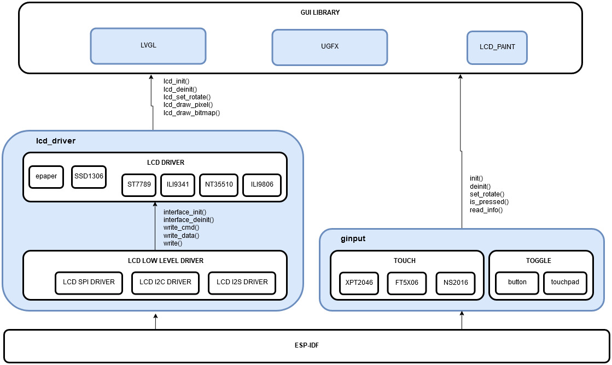

屏幕驱动
===============

esp-iot-solution 中的屏幕驱动支持如下屏幕：

+--------------+------------+------------+-----------+
| Color type   |   8080     |      SPI   |    I2C    |
+==============+============+============+===========+
|              |  NT35510   |   ILI9341  |           |
|   COLOR      +------------+------------+-----------+
|              |  ILI9806   |    ST7789  |           |
|              +------------+------------+-----------+
|              |  ILI9486   |   SSD1351  |           |
+--------------+------------+------------+-----------+
|              |            |            |  SSD1306  |
|    MONO      +------------+------------+-----------+
|              |            |            |  SSD1307  |
|              +------------+------------+-----------+
|              |            |  IL91874   |           |
+--------------+------------+------------+-----------+

驱动同时支持 ESP32 和 ESP32-S2 芯片

驱动结构
----------

为了更加符合一个屏幕控制芯片拥有多个接口的实际情况，将屏幕驱动程序划分为 ``接口驱动`` 和 ``屏幕控制器驱动`` 两部分。
接口负责与屏幕完成基本的命令和数据的读写，屏幕控制器驱动负责通过接口驱动来完成屏幕的显示，一个屏幕控制器驱动可以灵活地调用不同的接口驱动以实现硬件上不同的接口。
下面是驱动结构框图：

   屏幕驱动结构框图

按照屏幕可显示的色彩来区分屏幕有助于屏幕接口的抽象，因为屏幕的色彩决定了屏幕内部的 GRAM 对应屏幕像素的排布方式。下面分三种色彩类型进行讨论。

- 彩色，大部分支持彩色的屏幕同时支持 RGB888, RGB666, RGB565 等颜色格式，为了方便简单，这里仅对 RGB565 进行了支持。这种颜色的屏幕特点在于以下两点：

    * 可按照像素点寻址
    * 一个半字仅控制一个像素

- 单色，这种屏幕通常尺寸不大，并且通常需要一个缓存来实现像素点寻址

    * 不可按照像素点寻址
    * 一个字节控制着 8 个像素点

- 灰度，与单色屏幕大部分相同，不同的是灰度需要多个位来控制，但是依旧是一个字节控制着多个像素点（应该也存在灰度超过或等于8位的屏幕，目前没有碰到）

由于不同屏幕的 GRAM 排布方式的不尽相同，尤其对于不可像素寻址的屏幕来说，一个字节控制了多个像素点时，有多种排布的方式。
下面列举几种排布方式

.. figure:: ../../_static/display/screen_driver_RGB565.png
   :align: center

   RGB565 GRAM 结构

.. figure:: ../../_static/display/screen_driver_mono.png
   :align: center

   MONO GRAM 结构

.. figure:: ../../_static/display/screen_driver_gray.png
   :align: center

   GRAY GRAM 结构

在驱动中只是原封不动的将数据写入屏幕，并没有将数据按照不同的屏幕重新组织，所以选用不同的屏幕时，某些驱动函数的参数含义不一致，应该按照实际使用的屏幕的 GRAM 排布方式来组织参数数据。

接口驱动
-----------

一个屏幕控制器通常拥有多种的接口，在 ESP32 上通常使用的是 ``8080(8bit/16bit)``、``SPI`` 和 ``I2C`` 这三种接口，其中 8080 接口使用的是 ESP32 的 I2S 实现，故下文中也称之为 ``I2S 接口``。

为了实现灵活地切换不同的接口，对接口驱动向上的接口统一抽象为如下一些函数：

.. code:: c

    typedef struct {
        esp_err_t (*init)(const lcd_config_t *lcd);
        esp_err_t (*deinit)(bool free_bus);
        esp_err_t (*write_cmd)(uint16_t cmd);
        esp_err_t (*write_data)(uint16_t data);
        esp_err_t (*write)(const uint8_t *data, uint32_t length);
        esp_err_t (*read)(uint8_t *data, uint32_t length);
        esp_err_t (*bus_acquire)(void);
        esp_err_t (*bus_release)(void);
    }lcd_iface_driver_fun_t;

每种接口的驱动分别对上面的函数进行了对应实现，例如 SPI 接口：

.. code:: c

    lcd_iface_driver_fun_t g_lcd_spi_iface_default_driver = {
        .init = spi_lcd_driver_init,
        .deinit = spi_lcd_driver_deinit,
        .write_cmd = spi_lcd_driver_write_cmd,
        .write_data = spi_lcd_driver_write_data,
        .write = spi_lcd_driver_write,
        .read = spi_lcd_driver_read,
        .bus_acquire = spi_lcd_driver_acquire,
        .bus_release = spi_lcd_driver_release,
    };

每个接口驱动都定义了一个接口驱动结构体将其进行抽象，便于上层切换不同的接口驱动。需要注意的是 :c:func:`write_cmd` 和 :c:func:`write_data` 在不同接口下参数含义不完全相同。

- 当使用 I2S 接口时，该参数 16 位全有效
- 当使用 SPI 或者 I2C 接口时，该参数仅低 8 位有效

另外，为了统一使用这些接口，在 ``lcd_low_driver.h`` 中通过宏，定义了所拥有的接口：

.. code:: c

    /**< Define the function of interface instance */
    #define LCD_IFACE_INIT(v) g_iface_driver->init((v))
    #define LCD_IFACE_DEINIT(v) g_iface_driver->deinit((v))
    #define LCD_WRITE_CMD(v) g_iface_driver->write_cmd((v))
    #define LCD_WRITE_DATA(v) g_iface_driver->write_data((v))
    #define LCD_WRITE(v, l) g_iface_driver->write((v), (l))
    #define LCD_READ(v, l) g_iface_driver->read((v), (l))
    #define LCD_IFACE_ACQUIRE() g_iface_driver->bus_acquire()
    #define LCD_IFACE_RELEASE() g_iface_driver->bus_release()

不同的屏幕控制器驱动都是通过这些宏调用接口驱动，通过在 menuconfig 中的配置可快速切换不同的接口。

屏幕控制器驱动
----------------

这部分根据不同的屏幕控制器分别实现显示等功能，为了方便地移植到不同 GUI 库，将不同屏幕的一部分通用函数进行了抽象。对于一些屏幕的特殊功能，需要自行调用其特定的函数完成。

下面是抽象的通用接口函数：

.. code:: c

    typedef struct {
        esp_err_t (*init)(const lcd_config_t *lcd_conf);                                            /*!< initialize LCD screen */
        esp_err_t (*deinit)(void);                                                            /*!< deinitialize LCD screen */
        esp_err_t (*set_direction)(lcd_dir_t dir);                                            /*!< control lcd scan direction */
        esp_err_t (*set_window)(uint16_t x0, uint16_t y0, uint16_t x1, uint16_t y1);          /*!<  */
        esp_err_t (*write_ram_data)(uint16_t color);                                                         /*!<  */
        esp_err_t (*draw_pixel)(uint16_t x, uint16_t y, uint16_t color);                                     /*!<  */
        esp_err_t (*draw_bitmap)(uint16_t x, uint16_t y, uint16_t w, uint16_t h, uint16_t *bitmap);
        esp_err_t (*get_info)(lcd_info_t *info);
        xSemaphoreHandle lcd_driver_lock;                                                                         /*!<  */
    }lcd_driver_fun_t;

对于上面的这些函数，并不是所有的屏幕都实现了，例如单色屏幕无法在无缓存区的情况下完成 :c:func:`draw_pixel` 函数。当某个屏幕不支持某函数时，该函数会返回 ``ESP_ERR_NOT_SUPPORTED``。

另外值得注意的是，在调用 :c:func:`init` 时，会自动调用接口驱动初始化，而无需用户额外调用。

应用示例
------------

初始化一个屏幕
*****************

.. code:: c

    extern lcd_driver_fun_t lcd_st7789_default_driver;
    static lcd_driver_fun_t *lcd_driver = &lcd_st7789_default_driver;

    lcd_config_t lcd_conf = {
    #ifdef CONFIG_LCD_DRIVER_INTERFACE_I2C
            .iface_i2c = {
                .pin_num_sda = CONFIG_LCD_I2C_SDA_PIN,
                .pin_num_scl = CONFIG_LCD_I2C_SCL_PIN,
                .clk_freq = CONFIG_LCD_I2C_CLOCK_FREQ,
                .i2c_port = CONFIG_LCD_I2C_PORT_NUM,
                .i2c_addr = CONFIG_LCD_I2C_ADDRESS,
            },
    #endif
    #ifdef CONFIG_LCD_DRIVER_INTERFACE_SPI
            .iface_spi = {
                .pin_num_miso = CONFIG_LCD_SPI_MISO_PIN,
                .pin_num_mosi = CONFIG_LCD_SPI_MOSI_PIN,
                .pin_num_clk = CONFIG_LCD_SPI_CLK_PIN,
                .pin_num_cs = CONFIG_LCD_SPI_CS_PIN,
                .pin_num_dc = CONFIG_LCD_SPI_DC_PIN,
                .clk_freq = CONFIG_LCD_SPI_CLOCK_FREQ,
                .spi_host = CONFIG_LCD_SPI_HOST,
                .dma_chan = 2,
                .init_spi_bus = true,
            },
    #endif
    #ifdef CONFIG_LCD_DRIVER_INTERFACE_I2S
            .iface_8080 = {
                .data_width = CONFIG_I2S_LCD_BITWIDTH,
                .pin_data_num = {
                    CONFIG_LCD_I2S_D0_PIN,
                    CONFIG_LCD_I2S_D1_PIN,
                    CONFIG_LCD_I2S_D2_PIN,
                    CONFIG_LCD_I2S_D3_PIN,
                    CONFIG_LCD_I2S_D4_PIN,
                    CONFIG_LCD_I2S_D5_PIN,
                    CONFIG_LCD_I2S_D6_PIN,
                    CONFIG_LCD_I2S_D7_PIN,
    #if CONFIG_I2S_LCD_BITWIDTH > 8
                    CONFIG_LCD_I2S_D8_PIN,
                    CONFIG_LCD_I2S_D9_PIN,
                    CONFIG_LCD_I2S_D10_PIN,
                    CONFIG_LCD_I2S_D11_PIN,
                    CONFIG_LCD_I2S_D12_PIN,
                    CONFIG_LCD_I2S_D13_PIN,
                    CONFIG_LCD_I2S_D14_PIN,
                    CONFIG_LCD_I2S_D15_PIN,
    #endif
                },
                .pin_num_wr = CONFIG_LCD_I2S_WR_PIN,
                .pin_num_rd = -1,
                .pin_num_rs = CONFIG_LCD_I2S_RS_PIN,
                .i2s_port = CONFIG_LCD_I2S_PORT_NUM,
            },
    #endif
            .pin_num_rst = CONFIG_IOT_LCD_PIN_RST,
            .pin_num_bckl = CONFIG_IOT_LCD_PIN_BCKL,
            .rst_active_level = 0,
            .bckl_active_level = CONFIG_LCD_BCKL_ACTIVE_LEVEL,
            .width = LCD_WIDTH,
            .height = LCD_HEIGHT,
            .rotate = LCD_DIRECTION,
        };
        lcd_driver->init(&lcd_conf);

设置屏幕的旋转
*****************

屏幕旋转函数在使用不同的屏幕时不完全一样。对于彩色屏幕都是一样的，支持 8 个方向的旋转；对于单色屏幕 SSD1306 等屏幕来说，只支持 lcd_dir_t 中定义的前 4 个方向；对于一些电子墨水屏则完全不支持屏幕的旋转。

另外这里设置的屏幕旋转是完全由屏幕硬件控制的，与 GUI 库中软件实现的屏幕旋转并不是一个概念。

设置屏幕旋转非常简单，示例如下：

.. code:: c

    lcd_driver->set_direction(LCD_DIR_LRTB);

设置屏幕显示窗口
*******************

写入屏幕 GRAM 数据
*********************

绘制像素点
**************

绘制位图
**************

获取屏幕信息
****************

API Reference
-----------------
