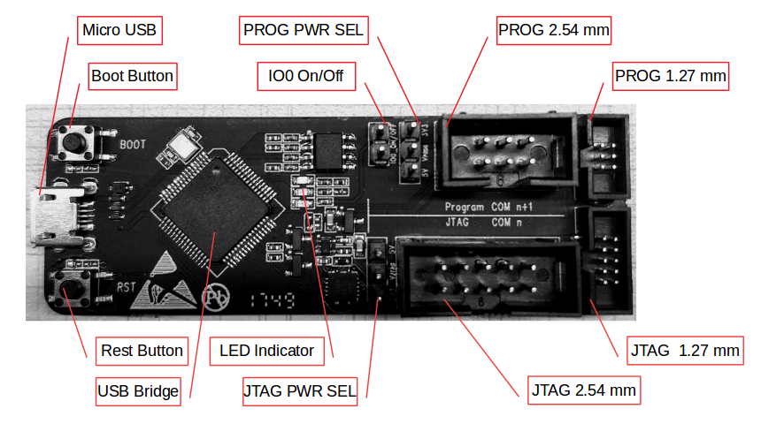
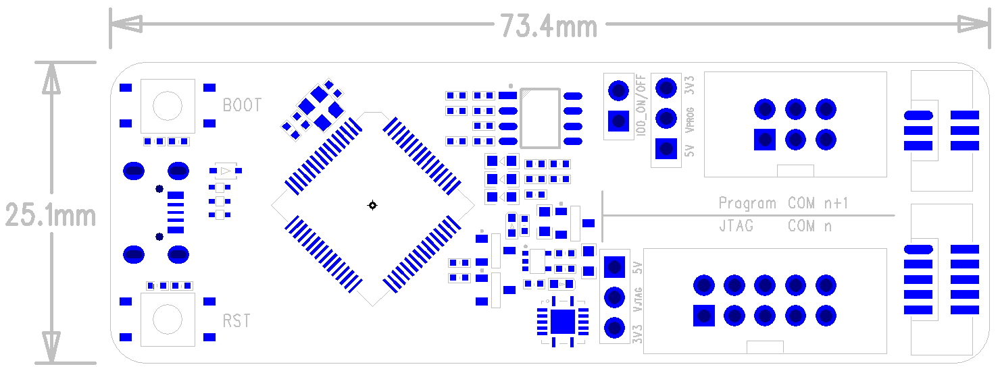
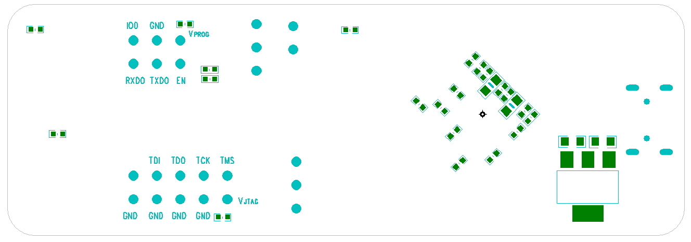
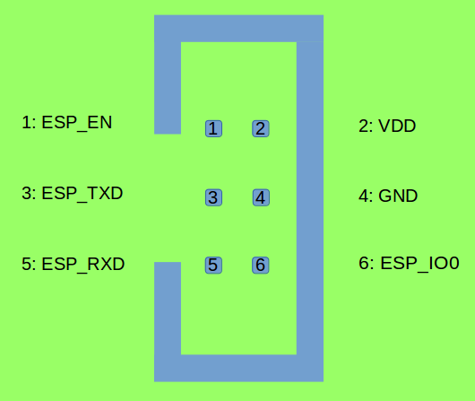
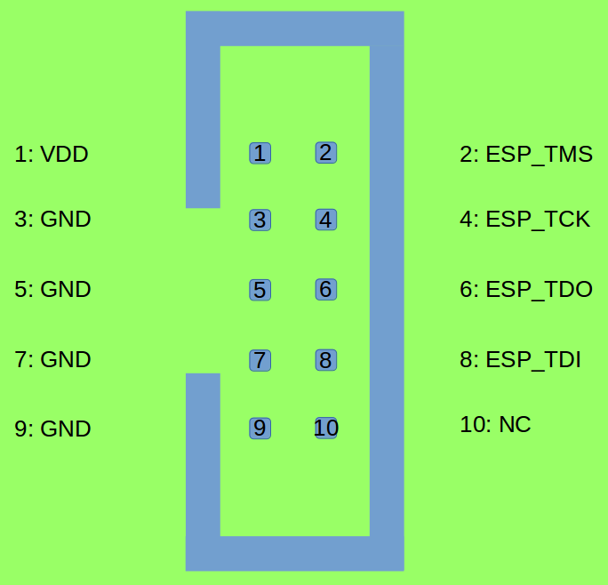
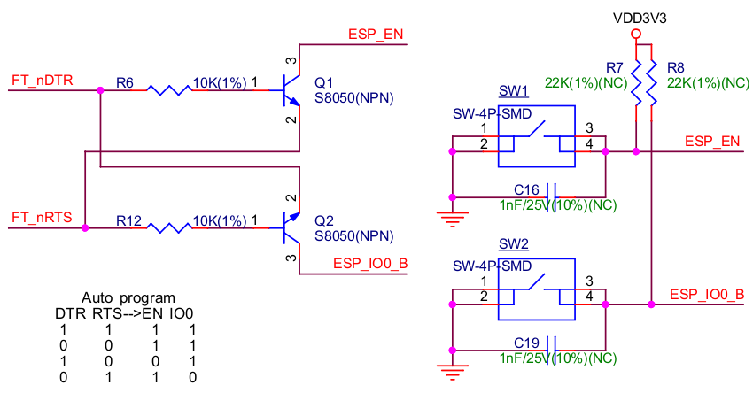
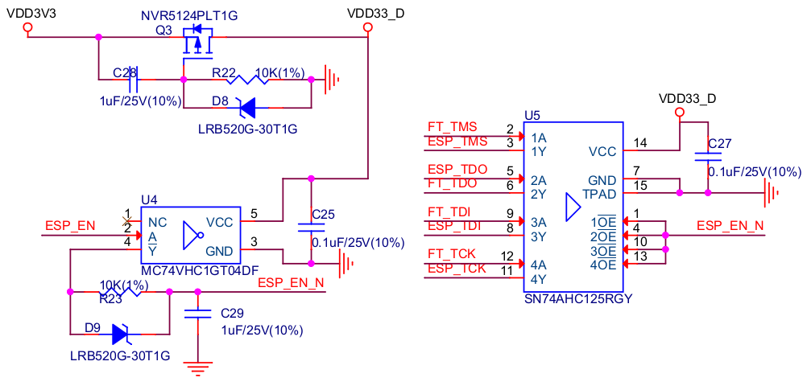
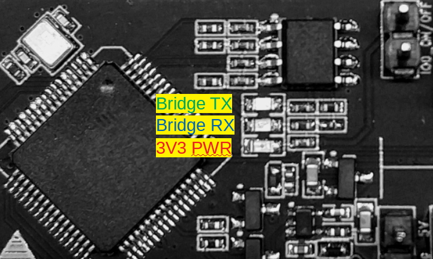
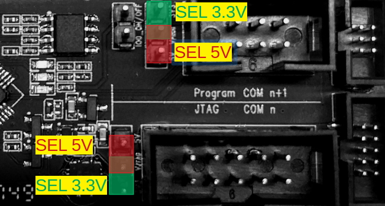

:orphan:

ESP-Prog 下载与调试板介绍
=========================

:link_to_translation:`en:[English]`

1. 概述
-------

ESP-Prog 是一款乐鑫推出的开发调试工具，具有自动下载固件、串口通信、JTAG
在线调试等功能。自动下载固件和串口通信功能适用于 ESP8266 和 ESP32
平台，JTAG 在线调试功能适用于 ESP32 平台。

ESP-Prog 使用简单方便，仅用一根 USB
线即可实现与电脑的连接，电脑端可识别出下载功能和 JTAG
功能对应的两个端口。

ESP-Prog 可使用排线与用户板连接，连接器可选 2.54 mm 和 1.27 mm
两种间距的封装，具有防呆设计。用户板上需按对应顺序放置 Program (6-Pin)
和 JTAG (10-Pin) 的连接器。

考虑到不同用户板的电源电压可能不同，ESP-Prog 的两个接口均可通过 Pin
Header 选择 5V 或者 3.3V 供电，具备较强的电源兼容性。

2. 系统框图
-----------

ESP-Prog 的整体功能框图：

.. figure:: ../../_static/hw-reference/esp-prog/block.png
   :align: center

3. 硬件介绍
-----------

下图总体介绍 ESP-Prog 板子上各功能的位置。

3.1. PCB 布局和尺寸
~~~~~~~~~~~~~~~~~~~

下面是 ESP-Prog 的 PCB 设计图，介绍了板子尺寸和接口的丝印标注。ESP-Prog
硬件原理图，PCB 文件，BOM 等文件参考
`乐鑫官网硬件参考设计 <http://espressif.com/zh-hans/support/download/documents?keys=参考设计>`_。

-  Top side

-  Bottom side

3.2. 功能介绍
~~~~~~~~~~~~~

3.2.1. USB Bridge 的工作模式
^^^^^^^^^^^^^^^^^^^^^^^^^^^^

ESP-Prog 采用 FTDI 公司的 FT2232HL 为 USB Bridge Controller芯片，可通过配置将 USB 2.0接口转换为支持多种工业标准的串行和并行接口。ESP-Prog 使用 FT2232HL默认的双异步串行接口模式，用户只需在电脑上安装相应的 `FT2232HL驱动程序 <http://www.ftdichip.com/Drivers/VCP.htm>`__ 即可使用。

.. Note:: 电脑端识别出两个端口，端口序号大的是 Program 接口，序号小的是JTAG 接口。

3.2.2. 通讯接口
^^^^^^^^^^^^^^^

ESP-Prog 上与 ESP32 产品板连接的部分，既有 Program 接口，又有 JTAG
接口。用户板上的接口顺序需要按照 ESP-Prog 上的规定设计。

-  **Program 接口**
   Program 接口有 6 个管脚，包括了 UART 接口 (TXD,
   RXD)、启动模式选择管脚 (ESP\_IO0) 和复位管脚 (ESP\_EN)。用户板上
   Program 接口管脚设计应如下图。

-  **JTAG 接口**
   用户板上的 JTAG 接口顺序应如下图设计。

-  **防呆设计**
   ESP-Prog
   接口使用牛角座连接器（DC3-6P/DC3-10P），具有防反接功能。建议用户板上使用此类型的连接器。如
   ``FTSH-105-01-S-DV-*`` 或 ``DC3-*P``\ 。

.. Note:: 排线具有方向性，请使用官方提供的排线。

3.2.3. 自动下载功能
^^^^^^^^^^^^^^^^^^^

ESP-Prog 具有自动下载功能。连接 Program
接口到用户板之后，下载程序会控制复位管脚和启动模式选择管脚的状态，执行下载命令后可实现设备自动下载和运行，无需用户手动重启和选择下载模式。
ESP-Prog 上的两个按键能实现手动复位设备和控制设备的启动模式。
自动下载电路的原理图如下。

3.2.4. 延时电路
^^^^^^^^^^^^^^^

延时电路包括了 Bus Buffer、反相器、MOS 管、一阶 RC
电路等器件。延时电路的作用实现 ESP32
芯片在上电或复位过程中，先完成自身的上电启动或复位，再与 JTAG
的信号接通，确保其上电或复位过程不被 JTAG 影响。

3.2.5. LED 状态指示
^^^^^^^^^^^^^^^^^^^

-  当系统的 3.3 V 电源通电时，红色 LED 灯亮起；
-  当下载板向 ESP32 发送数据时，绿色 LED 灯亮起；
-  当下载板接收来自 ESP32 的数据时，蓝色 LED 灯亮起。

3.2.6. 跳针功能描述
^^^^^^^^^^^^^^^^^^^

Program 和 JTAG 接口中的参考电源可以通过跳线帽来选择，如下图所示。

-  **接口电源选择跳针**
   中间的 Pin header 是每个接口的电源输入管脚。其与 5V连接，接口的电源输出为 5V。其与 3.3V 连接，接口电源输出为 3.3V。

-  **IO0 On/Off 跳针**
   IO0 是 ESP8266 和 ESP32 的 Boot 模式选择管脚，芯片上电后 IO0 做正常GPIO 使用。为了使 ESP-Prog 自动下载电路不影响客户板上 IO0 的正常使用，用户可手动控制 IO0 的通断。

4. 使用步骤
-----------

1. 通过 USB 线连接 ESP-Prog 调试板和电脑端的 USB 口。
2. 在电脑端安装 `FT2232HL
   芯片驱动 <http://www.ftdichip.com/Drivers/VCP.htm>`__。电脑端识别到两个端口，表明驱动已安装成功。
3. 用 Pin header 选择 Program/JTAG 接口上的电源输出电压。
4. 用灰排线连接调试板和 ESP 产品板。
5. 使用官方软件工具或脚本，即可实现 ESP32 产品板的自动下载和 JTAG
   调试功能。

5. 资料链接
-----------

-  `乐鑫官网 <http://www.espressif.com>`__

-  **购买方式** ：espressif\_systems(微信公众号)，`商务咨询 <http://www.espressif.com/en/company/contact/pre-sale-questions-crm>`__

-  `ESP-Prog PCB
   文件 <http://espressif.com/zh-hans/support/download/documents?keys=参考设计>`__

-  `ESP32 JTAG
   调试使用介绍 <https://docs.espressif.com/projects/esp-idf/en/stable/api-guides/jtag-debugging/index.html#>`__

-  `Flash 下载工具 (ESP8266 &
   ESP32) <http://www.espressif.com/zh-hans/support/download/other-tools#>`__

-  `FT2232HL 芯片驱动 <http://www.ftdichip.com/Drivers/VCP.htm>`__

