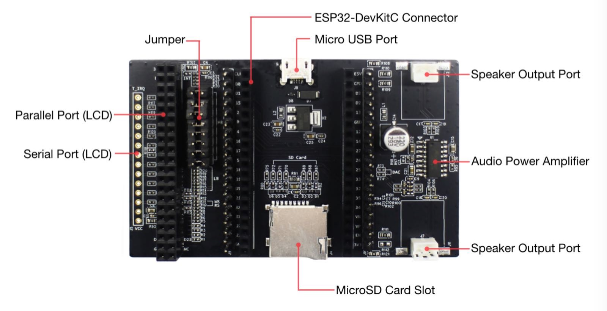
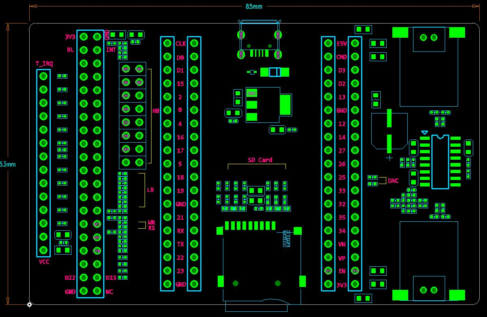
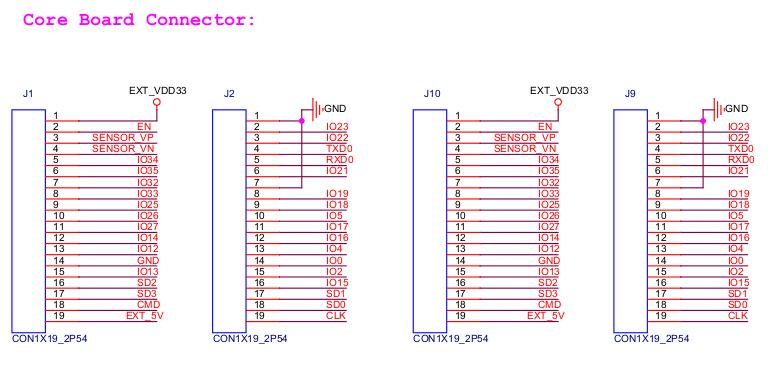
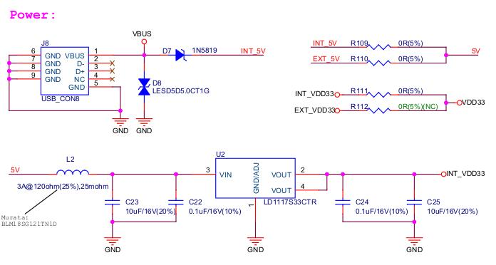
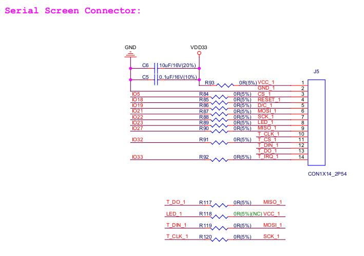

:orphan:

ESP32-LCDKit 开发板介绍
=======================

:link_to_translation:`en:[English]`

1. 概述
-------------------------

ESP32-LCDKit 是一款以乐鑫 ESP32-DevKitC（需另采购） 为核心的
HMI（人机交互）开发板，可外接屏幕，并且集成了 SD-Card、DAC-Audio
等外设，主要用于 HMI 相关开发与评估。开发板预留屏幕接口类型：SPI
串行接口、8 位并行接口、16 位并行接口。

:doc:`HMI Solution <../hmi_solution/index>` 这里提供的一些 HMI 示例可在ESP32-LCDKit 开发板上运行。

关于 ESP32 详细信息，请参考文档 `《ESP32 技术手册》 <https://www.espressif.com/sites/default/files/documentation/esp32_datasheet_cn.pdf>`__.

2. 电路设计说明
-------------------------

2.1 系统框图
~~~~~~~~~~~~~~~~~~~~~

ESP32-LCDKit 开发板的系统框图如下所示：

.. figure:: ../../_static/hw-reference/lcdkit/esp32_lcdkit_block.jpg
   :align: center

2.2 PCB 布局
~~~~~~~~~~~~~~~~~~~~~

ESP32-LCDKit 开发板的 PCB 布局如下所示：

+--------------------------------+----------------------------------------------+
| PCB 部件                       | 说明                                         |
+================================+==============================================+
| 屏幕连接模块                   | 连接串行或者并行（8/16 bit）屏幕             |
+--------------------------------+----------------------------------------------+
| ESP32 DevKitC 开发板连接模块   | 与 ESP32 DevKitC 开发板连接                  |
+--------------------------------+----------------------------------------------+
| SD-Card 模块                   | 连接 SD-Card，扩展存储                       |
+--------------------------------+----------------------------------------------+
| DAC-Audio 模块                 | 连接喇叭播放音频，包含音频功率放大器         |
+--------------------------------+----------------------------------------------+
| 数据位选择跳冒                 | 用于选择所用并行屏幕的数据位宽（8/16 bit）   |
+--------------------------------+----------------------------------------------+

3. 硬件模块
-------------------------

本章主要介绍各个功能模块（接口）的硬件实现，以及对这些模块的描述。

3.1 ESP32 DevKitC 开发板连接模块
~~~~~~~~~~~~~~~~~~~~~~~~~~~~~~~~~~~~~

使用 ESP32-LCDKit 开发板进行 HMI 相关开发时需要搭配使用 `ESP32 DevKitC <https://docs.espressif.com/projects/esp-idf/en/stable/hw-reference/modules-and-boards.html#esp32-devkitc-v4>`__

ESP32-LCDKit 开发板与 ESP32 DevKitC 开发板连接模块电路原理图如下所示：

3.2 电源管理
~~~~~~~~~~~~~~~~~~~~~

USB 供电管理模块电路图如下所示：

3.3 屏幕连接模块
~~~~~~~~~~~~~~~~~~~~~

开发板采用两种不同的连接插座，可以将不同屏幕接至 ESP32-LCDKit开发板上，以实现 ESP32 模组对屏幕的操作。以下接口可供选择使用：

- SPI串行接口
- 8 位并行接口
- 16 位并行接口

外接屏幕电路原理图如下所示：

.. figure:: ../../_static/hw-reference/lcdkit/parallel_screen_module.jpg
   :align: center

3.4 SD-Card、DAC-Audio 外设模块
~~~~~~~~~~~~~~~~~~~~~~~~~~~~~~~~~~~~~

开发板支持外接 SD-Card 以扩展存储，并且有 MIX3006功率放大器，可以外接喇叭播放音频。

SD-Card、DAC-Audio 外设模块电路原理图如下所示：

.. figure:: ../../_static/hw-reference/lcdkit/sd_card_dac_module.jpg
   :align: center

