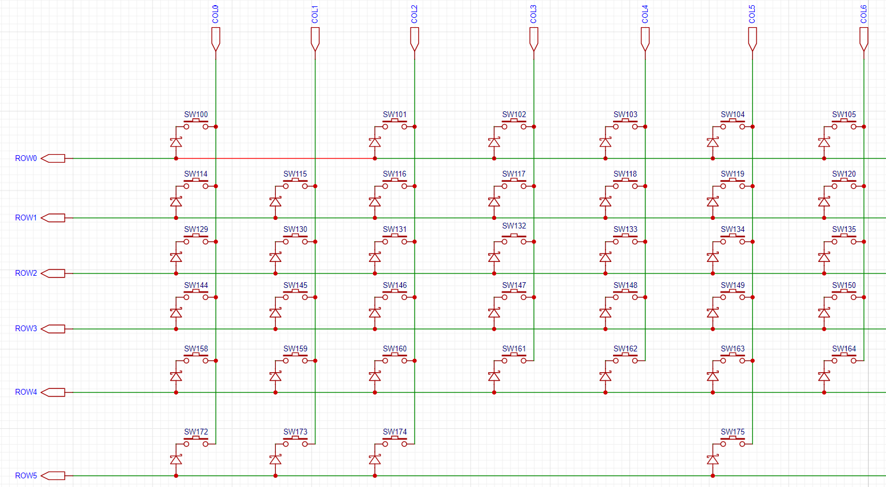

键盘扫描
==========

:link_to_translation:`en:[English]`

`键盘扫描组件 <https://components.espressif.com/components/espressif/keyboard_button>`_ 实现了快速高效的键盘扫描，支持按键消抖，按键松开按下事件上报，以及组合键。

该组件采用了矩阵按键的行列扫描，通过特殊的电路设计，实现了全键无冲的电路检测。

- 此电路中，行依次输出高电平，检测列是否有高电平，如果有，则表示该按键被按下。

.. note::

    -  由于该组件逻辑并不会交换行列扫描，所以不适用于传统的行列扫描电路，只适用于键盘的全键无冲电路。

组件事件
----------

- :cpp:enumerator:`KBD_EVENT_PRESSED`: 当有按键状态变化时，上报数据。

    * `key_pressed_num`: 按键按下的数量。
    * `key_release_num`: 按键松开的数量。
    * `key_change_num`: 和上一次状态相比，状态变化的按键数量。**>0** 按下按键增加，**<0** 按下按键减少。
    * `key_data`: 当前按下的按键信息，按下按键的位置（x, y）,  索引从小到大为按下的顺序，索引越小越早按下
    * `key_release_data`: 和上一次相比松开的按键信息，松开按键的位置（x, y）。

- :cpp:enumerator:`KBD_EVENT_COMBINATION`: 组合按键事件，当组合键被按下时，触发回调。

    * `key_num`: 组合按键的数量
    * `key_data`: 组合按键的位置信息，如设置组合键 （1，1） （2，2），那么必须先按下（1，1）再按下（2，2）才会触发组合按键事件。组合按键只触发正向增长的组合键。

应用示例
------------

初始化键盘扫描
^^^^^^^^^^^^^^^^

.. code:: c

    keyboard_btn_config_t cfg = {
        .output_gpios = (int[])
        {
            40, 39, 38, 45, 48, 47
        },
        .output_gpio_num = 6,
        .input_gpios = (int[])
        {
            21, 14, 13, 12, 11, 10, 9, 4, 5, 6, 7, 15, 16, 17, 18
        },
        .input_gpio_num = 15,
        .active_level = 1,
        .debounce_ticks = 2,
        .ticks_interval = 500,      // us
        .enable_power_save = false, // enable power save
    };
    keyboard_btn_handle_t kbd_handle = NULL;
    keyboard_button_create(&cfg, &kbd_handle);

注册回调函数
^^^^^^^^^^^^^^

- `KBD_EVENT_PRESSED` 事件的注册如下

.. code:: C

    keyboard_btn_cb_config_t cb_cfg = {
        .event = KBD_EVENT_PRESSED,
        .callback = keyboard_cb,
    };
    keyboard_button_register_cb(kbd_handle, cb_cfg, NULL);

- `KBD_EVENT_COMBINATION` 事件的注册如下，需要传递组合键的信息通过 `combination` 成员

.. code:: C

    keyboard_btn_cb_config_t cb_cfg = {
        .event = KBD_EVENT_COMBINATION,
        .callback = keyboard_combination_cb1,
        .event_data.combination.key_num = 2,
        .event_data.combination.key_data = (keyboard_btn_data_t[]) {
            {5, 1},
            {1, 1},
        },
    };

    keyboard_button_register_cb(kbd_handle, cb_cfg, NULL);

.. note:: 此外事件都支持注册多个回调，在注册多个回调时，最好保存 **keyboard_btn_cb_handle_t *rtn_cb_hdl** 以方便后续解绑指定回调。

按键扫描效率
^^^^^^^^^^^^^^

- 测试使用 `ESP32S3` 芯片扫描 `5*16` 的矩阵键盘，最大扫描速率可达 20K。

低功耗支持
^^^^^^^^^^^

- 在初始化时将 `enable_power_save` 设置为 `true`, 即可开启低功耗模式，此模式将在没有按键改变的时候不进行按键扫描，CPU 同时进入休眠状态，在有按键按下时唤醒 CPU。

.. Note:: 该功能只保证不占用 CPU, 不保证 CPU 一定会进入低功耗模式。且目前只支持 Light Sleep 模式。

API Reference
-----------------

.. include-build-file:: inc/keyboard_button.inc
