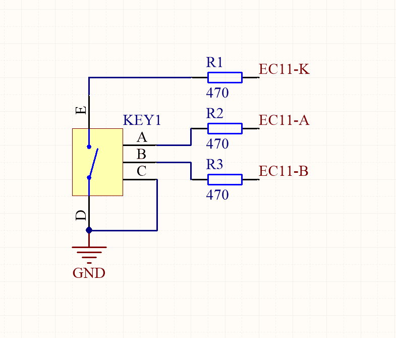

旋钮
========

:link_to_translation:`en:[English]`

**Knob** 是提供软件 PCNT 的组件，可以用在没有 PCNT 硬件功能的芯片（esp32c2, esp32c3）上。使用 Knob 可以快速适配物理编码器，如 EC11 编码器。

适用的场景
-----------

适用于每秒脉冲数小于 30 个的低速旋钮计数场景。例如 EC11 编码器。
适用于对脉冲数不要求 100% 准确的场景。

.. Note:: 如需精确或快速的脉冲计数，请使用 `硬件 PCNT 功能 <https://docs.espressif.com/projects/esp-idf/zh_CN/latest/esp32/api-reference/peripherals/pcnt.html?highlight=pcnt>`_ 。硬件 PCNT 支持的芯片 ESP32, ESP32-C6, ESP32-H2, ESP32-S2, ESP32-S3。

硬件设计
---------

旋转编码器的参考设计如下：

旋钮事件
---------

每个旋钮拥有下表的 5 个事件：

+------------+------------------+
|    事件    |     触发条件     |
+============+==================+
| KNOB_LEFT  | 左旋             |
+------------+------------------+
| KNOB_RIGHT | 右旋             |
+------------+------------------+
| KNOB_H_LIM | 计数达到最高限制 |
+------------+------------------+
| KNOB_L_LIM | 计数达到最低限制 |
+------------+------------------+
| KNOB_ZERO  | 计数变成零       |
+------------+------------------+

每个旋钮都可以有 **回调** 的使用方式：

- 回调：一个旋钮的每个事件都可以为其注册一个回调函数，产生事件时回调函数将会被调用。这种方式的效率和实时性高，不会丢失事件。

.. attention:: 回调函数中不能有 TaskDelay 等阻塞的操作

配置项
-----------

- KNOB_PERIOD_TIME_MS : 扫描周期

- KNOB_DEBOUNCE_TICKS : 消抖次数

- KNOB_HIGH_LIMIT : 旋钮所能计数的最高数字

- KNOB_LOW_LIMIT : 旋钮所能计数的最低数字

应用示例
-----------

创建旋钮
^^^^^^^^^^
.. code:: c

    // create knob
    knob_config_t cfg = {
        .default_direction =0,
        .gpio_encoder_a = GPIO_KNOB_A,
        .gpio_encoder_b = GPIO_KNOB_B,
    };
    s_knob = iot_knob_create(&cfg);
    if(NULL == s_knob) {
        ESP_LOGE(TAG, "knob create failed");
    }

注册回调函数
^^^^^^^^^^^^^^

.. code:: c

    static void _knob_left_cb(void *arg, void *data)
    {
        ESP_LOGI(TAG, "KNOB: KNOB_LEFT,count_value:%"PRId32"",iot_knob_get_count_value((button_handle_t)arg));
    }
    iot_knob_register_cb(s_knob, KNOB_LEFT, _knob_left_cb, NULL);

低功耗支持
^^^^^^^^^^^^^^^

在 light_sleep 模式下，esp_timer 定时器会唤醒 CPU，导致功耗居高不下，Knob 组件提供了通过 GPIO 电平唤醒的低功耗方案。

所需配置：

- 在 ``knob_config_t`` 中打开 ``enable_power_save`` 选项

功耗对比：

- 未开启低功耗模式，在 250ms 内旋转一次

    .. figure:: ../../_static/input_device/knob/knob_one_cycle.png
        :align: center
        :width: 70%
        :alt: 未开启低功耗模式，一次旋转

- 开启低功耗模式，在 250ms 内旋转一次

    .. figure:: ../../_static/input_device/knob/knob_power_save_one_cycle.png
        :align: center
        :width: 70%
        :alt: 开启低功耗模式，旋转一次

- 开启低功耗模式，在 4.5s 内旋转十次

    .. figure:: ../../_static/input_device/knob/knob_power_save_ten_cycle.png
        :align: center
        :width: 70%
        :alt: 开启低功耗模式，旋转十次

低功耗模式下的旋钮响应迅速，且功耗更低

开启和关闭
^^^^^^^^^^^^^

组件支持在任意时刻开启和关闭。

.. code:: c

    // stop knob
    iot_knob_stop();
    // resume knob
    iot_knob_resume();

API Reference
-----------------

.. include-build-file:: inc/iot_knob.inc
