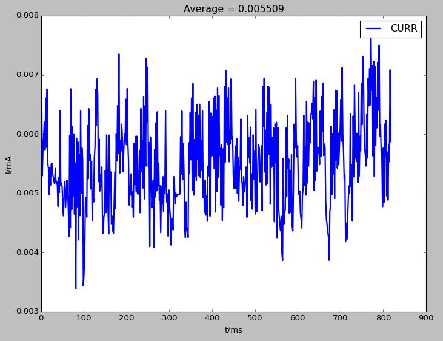
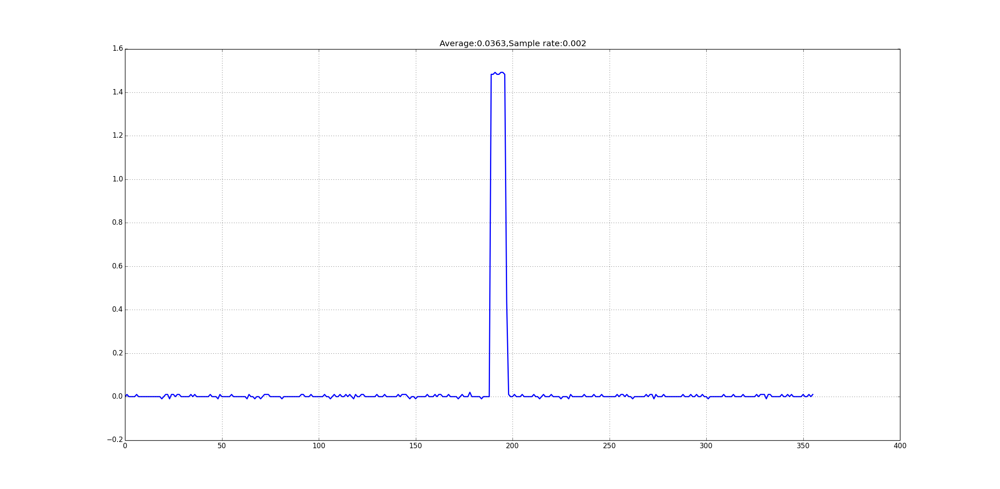

:orphan:

ESP32 低功耗方案概述
=========================

:link_to_translation:`en:[English]`

* ESP32 在内置 Deep-sleep 低功耗模式、RTC 外设和 ULP 协处理器的支持下，可以满足多种应用场景下的低功耗需求。当 ESP32 进入 Deep-sleep 模式时，所有由 APB_CLK 驱动的外设、CPU 和 RAM 将掉电；RTC_CLK 继续工作；RTC 控制器、RTC 外设、ULP 协处理器、RTC 快速内存和 RTC 慢速内存可以不掉电，具体取决于 App 中的唤醒源设置。
* 资源包括：
    * RTC 外设 – 包括片上温度传感器、ADC、RTC GPIO 和 touchpad；
    * ULP 协处理器 – 可在 Deep-sleep 模式下，进行简单的数据采集或作为一种唤醒源。协处理器可以访问 RTC 慢速内存和 RTC 寄存器；
    * RTC 快速内存 – 	芯片从 Deep-sleep 模式下唤醒后不会马上执行 bootloader，而是会先执行存放在 RTC 快速内存中的 esp_wake_deep_sleep() 函数；
    * RTC 慢速内存 – 存放 ULP 协处理器和 wake stub 代码访问的数据。
* Deep-sleep 模式下支持的唤醒源包括：
    * 定时器
    * touchpad
    * Ext(0)：RTC IO 中某个指定 GPIO 满足指定电平即唤醒
    * Ext(1)：RTC IO 中某些指定 GPIO 同时满足指定电平即唤醒
    * ULP 协处理器

定时数据采集与上报（例如器械状态监控器）
-----------------------------------------------

* 此场景使用 ESP32 定时采集传感器的数据并上传数据，可使用 Deep-sleep 定时器作为唤醒源。ESP32 采集数据并上传后，设置唤醒源为定时器并进入 Deep-sleep 模式，而后唤醒后再采集数据并上传，如此循环。
* 逻辑流程图：

.. figure:: ../../_static/low_power/low_power_flow_chart1.png
   :align: center

* 程序流程：
    1. 芯片 boot 后读取传感器数据，并将数据上传；
    2. 调用 ``esp_deep_sleep_enable_timer_wakeup(sleep_time_us)`` 函数，设置 Deep-sleep 时间；
    3. 调用 ``esp_deep_sleep_start()`` 函数，进入 Deep-sleep 模式。
* 此场景需要周期性唤醒 ESP32，不能充分利用 ESP32 的低功耗性能，但优势在于可以进行复杂的传感器数据采集。

支持 GPIO 触发的异常数据采集（例如烟雾报警器）
--------------------------------------------------

* 此场景无需周期性采集传感器数据。当传感器采集到异常数据时，会主动向 ESP32 输出 GPIO 触发电平。此场景支持使用 RTC IO 为 ESP32 的 Deep-sleep 模式唤醒源：
  * 当传感器没有采集到异常数据，ESP32 将持续睡眠；
  * 当且仅当传感器采集到异常数据，并将指定 GPIO 置为指定电平时，ESP32 才会从 Deep-sleep 模式中唤醒，然后发出警报或者上传数据。
* 逻辑流程图：

.. figure:: ../../_static/low_power/low_power_flow_chart2.png
   :align: center

* 程序流程：
    1. 芯片 boot 后读取传感器数据，发出警报或者上传数据；
    2. 调用 ``rtc_gpio_pulldown_en(MY_RTC_WAKEUP_IO)`` 函数或 ``rtc_gpio_pullup_en(MY_RTC_WAKEUP_IO)`` 函数，设置内部下拉或上拉类型；
    3. 调用 ``esp_deep_sleep_enable_ext0_wakeup(MY_RTC_WAKEUP_IO, WAKEUP_IO_LEVEL)`` 函数或 ``esp_deep_sleep_enable_ext1_wakeup(WAKEUP_PIN_MASK, WAKEUP_TYPE)`` 函数，设置从 Deep-sleep 模式下唤醒的 RTC GPIO 电压条件；
    4. 调用 ``esp_deep_sleep_start()`` 函数进入 Deep-sleep 模式。
* 此场景充分利用了 ESP32 的低功耗，但是对传感器要求较高，需要具有 GPIO 触发功能。

数据采集或异常检测（不支持 GPIO 触发、不需要频繁上传数据）
---------------------------------------------------------------

* 此场景下的传感器不具有 GPIO 触发功能，需要 CPU 和片上外设进行轮询式数据采集或者异常检测。在此场景下，ESP32 的 ULP 协处理器可以进行简单的数据采集，并在指定条件下唤醒 ESP32 进行进一步的处理。此过程中采集的数据可存放在 RTC 慢速内存中，供 ESP32 唤醒时读取。
* 逻辑流程图：

.. figure:: ../../_static/low_power/low_power_flow_chart3.png
   :align: center

* 用户可根据 ULP 指令集，自行编写需要 ULP 协处理器在 Deep-sleep 模式下执行的汇编代码，完整流程如下：
    1. 芯片 boot 后，从 RTC_SLOW_MEMORY 读取芯片在 Deep-sleep 模式期间，ULP 协处理器采集的数据，并上传数据；
    2. 调用 ``ulp_process_macros_and_load()`` 函数，将汇编程序代码拷贝至 ``RTC_SLOW_MEMORY``；
    3. 调用 ``ulp_run(ADDRESS)`` 函数启动 ULP 协处理器，执行 ``RTC_SLOW_MEMORY`` 中的代码；
    4. 调用 ``esp_deep_sleep_start()`` 函数，进入 Deep-sleep 模式。
* 为了使用户更方便地使用 ULP 协处理器进行数据采集与存储，我们专门在 IoT Solution 中增加了 ulp_monitor 模块，用户可直接调用 C 函数运行协处理器。ulp_monitor 模块的使用流程如下:[1]_
    1. 芯片 boot 后，从 RTC_SLOW_MEMORY 读取 ULP 协处理器在芯片 Deep-sleep 模式期间采集的数据，并上传数据；
    2. 调用 ``ulp_monitor_init(ULP_PROGRAM_ADDR, ULP_DATA_ADDR)`` 函数，设置 ULP 协处理器的程序运行地址与数据保存地址；
    3. 调用 ``ulp_add_adc_monitor`` 函数或 ``ulp_add_temprature_monitor`` 函数，添加 ULP 协处理器采集的数据类型和唤醒条件（可同时添加）；
    4. 调用 ``ulp_monitor_start`` 函数设置测量频率，并启动 ULP 协处理器；
    5. 调用 ``esp_deep_sleep_start()`` 函数，进入 Deep-sleep 模式。目前，ULP 协处理只支持片上温度传感器和 ADC 数据的采集。
* 此场景的优势在于可以在低功耗情况下频繁地采集数据，从而降低对传感器的要求。

使用 Touchpad 触摸/GPIO 按键唤醒的用户交互场景（如控制面板）
---------------------------------------------------------------

* 此场景多用于一些用户交互设备，如控制面板等。当用户长时间没有操作面板（例如 Touchpad 触摸／GPIO 按键）时，ESP32 将进入 Deep-sleep 模式，并设置为 Touchpad 触摸／GPIO 按键唤醒。在 Deep-sleep 模式下，当设置唤醒源为 touchpad 唤醒时，芯片的平均电流大约为 50 uA。
* 逻辑流程图：

.. figure:: ../../_static/low_power/touchpad_deepsleep_process.png
   :align: center

* 程序流程：
	1. 芯片 boot 后运行用户交互与控制程序；
	2. 设置作为唤醒源的 touchpad；[2]_
	3. 调用 ``esp_deep_sleep_enable_touchpad_wakeup()`` 函数使能 touchpad 唤醒 ，然后调用 ``esp_deep_sleep_start()`` 函数进入 Deep-sleep 模式。

Deep-sleep 支持不同唤醒源时的功耗情况
-----------------------------------------

* 	正常工作下，ESP32 作为 Station 时，平均电流约为 115 mA：

.. figure:: ../../_static/low_power/esp32_station_current.png
   :align: center

*  支持定时器唤醒时，Deep-sleep 模式下的平均电流约为 6 uA：

.. figure:: ../../_static/low_power/esp32_deepsleep_timer_current.png
   :align: center

* 	支持 RTC IO 唤醒时，Deep-sleep 模式下的平均电流约为 6 uA；[3]_

* 	Deep-sleep 期间，协处理器周期性运行数据采集程序（本例中的采集频率为每秒 10 次，所以图中的尖峰是协处理器工作时的瞬时电流）：

.. figure:: ../../_static/low_power/esp32_deepsleep_ulp_current.png
   :align: center

* 	支持 touchpad 唤醒时，Deep-sleep 期间的平均电流约为 36 uA 左右：

.. [1] 具体可查看 ulp_monitor 模块的 README.md 和 ulp_monitor_test.c 文件。

.. [2] 包括初始化与设置阈值，具体可查看 IoT Solution 中的 Touchpad 方案。

.. [3] 这里采用了 esp_deep_sleep_enable_ext1_wakeup() 函数。
