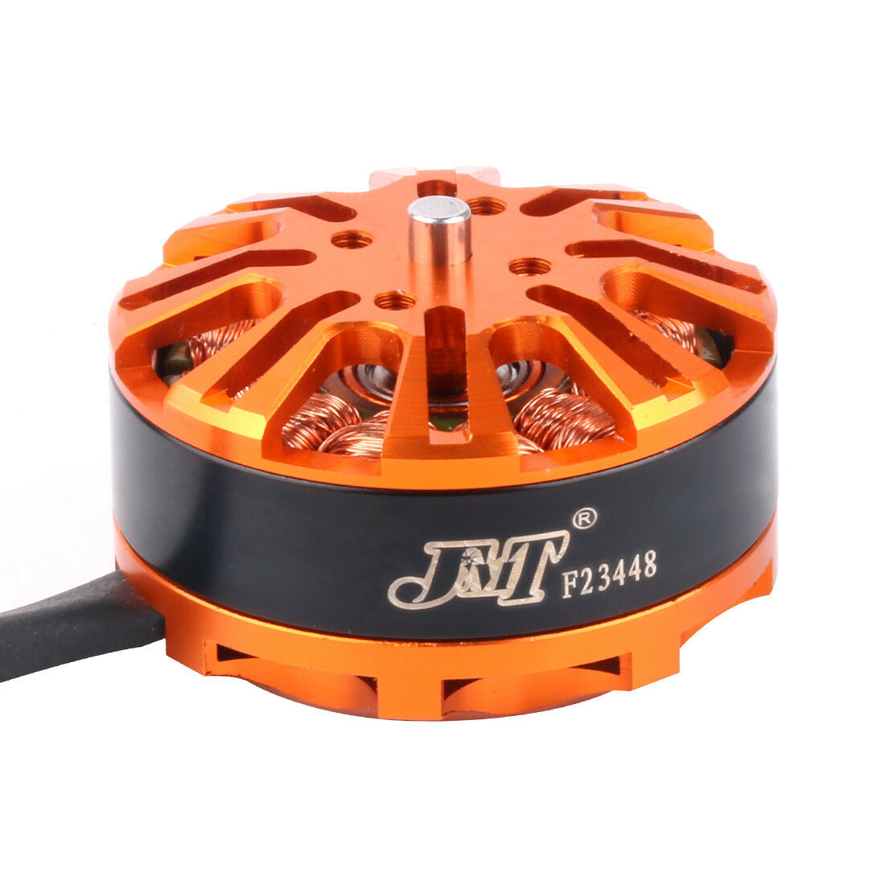
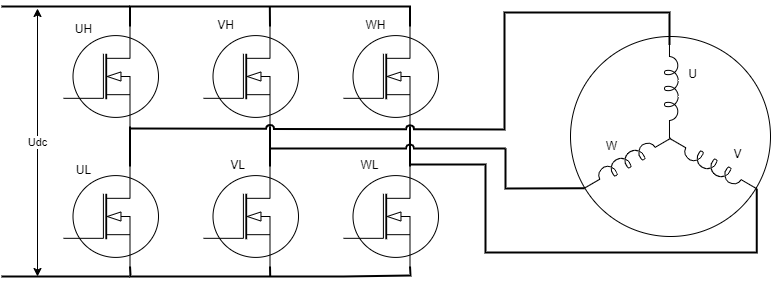
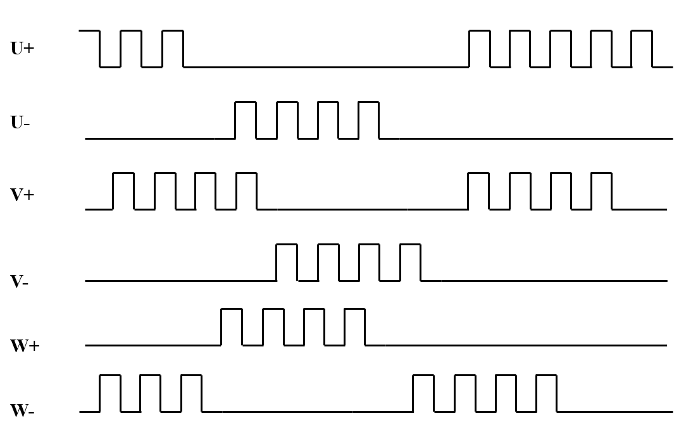
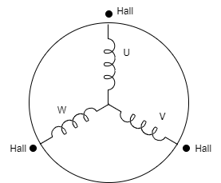

无刷电机控制概述
=================

:link_to_translation:`en:[English]`

本指南包含以下内容：

.. list::

    - `无刷电机概述`_：无刷电机优势
    - `驱动方式`_： 无刷电机的驱动硬件方式
    - `控制方式`_：控制无刷电机的几种方式

无刷电机概述
--------------

无刷直流（Brushless Direct Current, BLDC）电机属于同步电机的一种，可配置为单相，两相，三相。此文讨论的都是三相无刷电机。

无刷电机不使用电刷进行换向，而是使用电子换向，具有以下优点：

    - 更好的转速-转矩特性
    - 快速的动态响应
    - 高效率
    - 使用寿命长
    - 运转无噪音
    - 较高的转速范围

    BLDC 无刷电机

无刷电机的组成分为定子和转子两部分：

    - 定子是线圈绕组电枢，具有三个星型连接的定子绕组，沿着定子圆周分布这些绕组，以构成均匀分布的磁极。

    - 转子用永磁体制成，永磁体的磁极数目大多为 2 到 8 磁极。南磁极和北磁极交替。

.. only:: html

    .. figure:: ../../../_static/motor/bldc/bldc_run.gif
        :align: center
        :width: 50%
        :alt: BLDC 无刷电机运转方式

        BLDC 无刷电机运转方式

如果只给电机通固定的直流电流，电机只会产生不变的磁场。无法转动起来。只有通过适当的顺序来为定子相位供电，在定子上产生一个旋转磁场。转子的固有磁极跟随定子的旋转磁场有序旋转，才能达到转动的目的。

.. note:: 理想状态下，转矩峰值出现在两个磁场正交时候，而在两磁场平行时最弱。

重要参数：
^^^^^^^^^^

- `KV 值 (rpm/V)`：可以直观表示无刷电机在具体工作电压下的具体转速。

.. math::
    最大空转转速 (rpm) = KV * 工作电压

- `转矩 (Nm)`：电机中转子产生的可以用来带动机械负载的驱动力矩。

- `转速 (rpm)`：电机每分钟的转速。

- `最大电流 (A)`：可以承受并安全工作的最大电流。

- `极对数 Pp`：转子上磁钢的数量除以 2，可以通过给任意两相通过小电压，手动旋转电机一周，感受阻力的次数就是极对数。如感到 6 次阻力，极对数就是 6。

- `相电感 LS (H)`：电机静止时的定子绕组两端的电感为 LL, 相电感为其一半：

.. math::
    LS = LL / 2

- `相电阻 RS (Ω)`：万用表测电机两项电阻 RL，相电阻为其一半：

.. math::
    RS = RL / 2

驱动方式
---------

无刷电机一般通过 6 MOS 管组成的逆变电路进行驱动，通过上臂和下臂开关器件的组合，可以在定子上产生一个旋转磁场。

    BLDC 三相逆变电路

通过图上的逆变电路，按照顺序依次导通，转子磁铁就能循环转动，每经过 6 次切换电流，转子转动一圈。这里展示的是导通两个桥臂的方式。

.. note:: 上下桥臂不能同时导通，否则会短路，因此需要引入死区控制，来规避掉同一相的上下桥臂同时导通的情况。

.. list-table:: 桥臂导通与电流流向
    :widths: 15 15 15 15 15
    :header-rows: 1
    :align: center

    * - **导通上臂**
      - **导通下臂**
      - **相电流 A**
      - **相电流 B**
      - **相电流 C**
    * - UH
      - WL
      - DC+
      - 悬空
      - DC-
    * - UH
      - VL
      - DC+
      - DC-
      - 悬空
    * - WH
      - VL
      - 悬空
      - DC-
      - DC+
    * - WH
      - UL
      - DC-
      - 悬空
      - DC+
    * - VH
      - UL
      - DC-
      - DC+
      - 悬空
    * - VH
      - WL
      - 悬空
      - DC+
      - DC-

为了让电机旋转的速度可控，可以将施加在上臂的控制信号设置为 PWM 信号，并通过控制 PWM 的占空比来达到控制转速的作用。

    BLDC PWM 速度控制

控制方式
---------

在实际的电机控制中，需要获取转子位置，并计算出下一步导通的桥臂，这样才能让电机旋转起来。获取转子位置一般有两种方式，有感检测和无感检测。

有感霍尔
^^^^^^^^^

在无刷电机中，一般用 3 个开关型霍尔器件检测转子位置，安装位置一般相隔 120°。如下图所示

    BLDC 霍尔传感器安装位置

当 N 极靠近霍尔 a 时，a 输出高电平 1，当 N 极远离 a 时，a 输出低电平。其他同理。那么当转子转动一圈，会产生下面的波形。

.. figure:: ../../../_static/motor/bldc/bldc_hall_status.png
    :align: center
    :width: 70%
    :alt: BLDC 霍尔传感器波形

    BLDC 霍尔传感器波形

通过解析霍尔传感器的输出，确定转子的当前位置。并使用 “二二导通” 法让电机旋转起来，但其存在如下缺点：

- 传感器价格昂贵，并且需要再制造期间将传感器安装在电机上，增加了安装与接线费用。
- 若传感器发生故障，则电机无法继续增长工作。

因此，基于无感检测的无刷电机控制方案成为了主流。

无感检测
^^^^^^^^^

在一些微小电机系统中，安装位置传感器对电机的体积和成本有不利影响。因此无传感器的位置检测也非常重要。无感控制策略主要包括反电势法、电感法、续流二极管法等。其中，反电动势法是应用最广、最成熟的方案之一。

反电动势
""""""""""

反电动势根据楞次定律，方向与提供绕组的主电压相反。反电动势的极性与励磁电压相反。反电动势主要取决于三个方向。

    - 转子角速度
    - 转子磁铁产生的磁场
    - 定子绕组的匝数

.. math::
    BEMF = NlrB\omega

对于电机来说，转子磁场和定子绕组的匝数都是固定的，那么在实际运转中，唯一决定反电动势的因素就是角速度，或者说转子转速。在每次换向时，都有一个绕组得正电，第二个得负电，第三个保持开路状态。

通过检测各相绕组的反电动势过零点，就能在一个电周期内得到转子的六个位置。非导通相的反电动势过零点延迟 30° 电角度就是换相点。

.. note:: 在电机转速极慢的时候，反电动势的幅值很低，很难检测到过零点。

基于反电动势检测过零点有两种方式

.. list::

    - :doc:`./bldc_snls_adc` ADC 采样检测过零点
    - :doc:`./bldc_snls_comparer` 比较器检测过零点

此外还有基于相电流采集的无感 FOC 方案

.. list::

    - 双电阻无感 FOC 方案（待更新）
