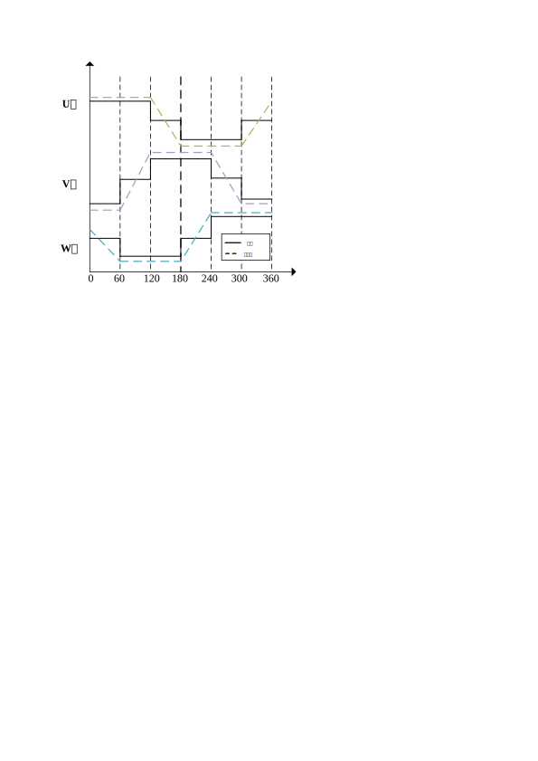

基于比较器检测的无感方波电机控制
================================

:link_to_translation:`en:[English]`

本指南包含以下内容：

.. contents:: 目录
    :local:
    :depth: 2

基于比较器方案的BLDC无感控制
-----------------------------

反电势定义
^^^^^^^^^^^^
当无刷电机转动时，每个绕组都会产生反电动势电压，根据楞次定律，反电势极性与主电压相反。反电势计算公式：

.. math::
    BEMF = NlrB\omega

其中，N为绕组匝数，l为转子长度，r为转子内半径，B为转子磁场，:math:`\omega` 为角速度。

当电机做定后，电机绕组与转子参数固定。电机反电势只与角速度成正比。

下图为电机旋转一个电周期中电流与反电势波形。

比较器方案的过零点采样原理
^^^^^^^^^^^^^^^^^^^^^^^^^^
当BLDC电机转动时，反电势过零点发生在浮空项。通过检测各相对地电压，并与中性点电压比较。当端电压从大于中性点电压变成小于中性点电压，或端电压从小于中性点电压变成大于中性点电压时，即为过零点。但一般BLDC电机并未引出中性点，导致无法直接测量中性点电压。在基于比较器的过零点检测方案中，将三相绕组通过等阻值电阻连接到公共点，以此重构中性点，并将中性点与端电压通过比较器获得过零信号。

比较器方案的过零点采样硬件
^^^^^^^^^^^^^^^^^^^^^^^^^^

.. figure:: ../../../_static/motor/bldc/bldc_comparator_hardware.png
    :align: center
    :width: 100%
    :alt: 比较器过零点硬件

使用相同阻值的电阻连接各相构建虚拟中性点。以U相为例，U相反电势与中性点经过比较器输出过零信号。