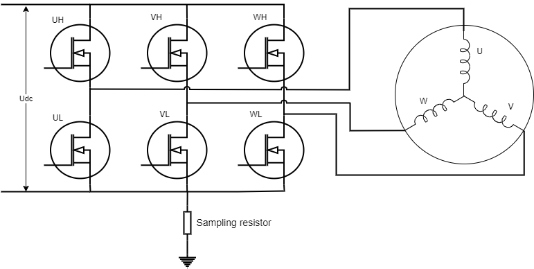
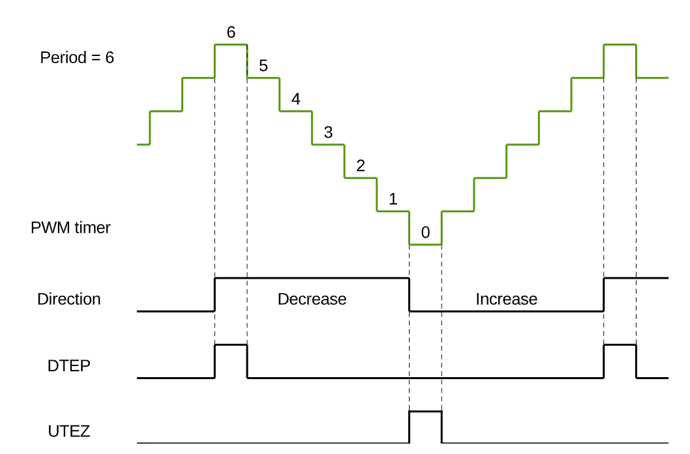

ESP Sensorless BLDC Control Components
=======================================

:link_to_translation:`en:[English]`

本指南包含以下内容：

.. contents:: 目录
    :local:
    :depth: 2

`esp_sensorless_bldc_control` 组件是基于 ESP32 系列芯片的 BLDC 无感方波控制库。目前以及支持以下功能：

    - 基于ADC 采样检测过零点
    - 基于支持比较器检测过零点
    - 基于脉冲法实现转子初始相位检测
    - 堵转保护

本文主要讲解如何使用 `esp_sensorless_bldc_control` 组件进行无刷电机开发，不涉及原理讲解，如需了解更多原理请参考

    - :doc:`./bldc_overview` 无刷电机控制概述
    - :doc:`./bldc_snls_adc` ADC 采样检测过零点
    - :doc:`./bldc_snls_comparer` 比较器检测过零点

无感方波控制流程主要可以分为以下部分

    - INJECT：注入阶段，通过脉振高频电压注入得到初始相位 :cpp:enumerator:`INJECT`
    - ALIGNMENT：对齐阶段，将转子固定到初始相位 :cpp:enumerator:`ALIGNMENT`
    - DRAG：强托阶段，通过六步换向将转子转动起来 :cpp:enumerator:`DRAG`
    - CLOSED_LOOP：无感闭环控制，通过检测反电动势过零点进行换向 :cpp:enumerator:`CLOSED_LOOP`
    - BLOCKED：电机堵转 :cpp:enumerator:`BLOCKED`
    - STOP: 电机停止 :cpp:enumerator:`STOP`
    - FAULT: 电机故障 :cpp:enumerator:`FAULT`

接下来会分别介绍各个部分的具体流程以及需要注意的参数

INJECT
--------

通过脉振注入法获取电机初始相位，需要在逆变电路的低端采集母线电流。如下图所示：

    BLDC 母线电流采集

.. note::
    由于电流不能直接被采集到，因此通过一个采样电阻，可以将电流转化为电压。注意，电压需要转化到 ESP32 ADC 能够采集的范围。请参考：`ESP32 ADC <https://docs.espressif.com/projects/esp-idf/zh_CN/latest/esp32/api-reference/peripherals/adc_oneshot.html#adc-oneshot-unit-configuration>`__

由于电流只存在于上下管均导通的情况，因此需要在上管导通的时候进行 ADC 采样。将 MCPWM 配置为上升下降模式，并在计数器达到顶峰的时候进行采样，可以采集到准确的母线电压。

    MCPWM 上升下降模式

.. note::
    LEDC 驱动不支持在高电平时候触发回调，因此使用 LEDC 方式驱动的方案`无法使用` INJECT 模式。

:c:macro:`INJECT_ENABLE` 为 1 时，开启 INJECT 模式，否则关闭。默认为 0。PWM 的生成模式必须为 MCPWM

:c:macro:`INJECT_DUTY` 注入的电压大小，一般都是采用高占空比注入

:c:macro:`CHARGE_TIME` 电感充电时间和脉冲注入时间，该值影响到初始相位检测的精准性。这个值太小会导致采集到的 ADC 值为 0，太大会导致 ADC 值过大。以手动旋转电机，在一圈中可以获得稳定的相位 1-6，不出现错误相位 0 和 7 为佳。

ALIGNMENT
-----------

为保障无刷电机能够正常启动，需要确定转子在静止时的位置。在实际的应用中，通过在任意一组绕组上通电一定时间，将转子固定到固定相位，为后面的强拖做准备。

:c:macro:`ALIGNMENTNMS` 对齐时间，时间太长会过流。时间太短可能会导致转子没有对齐到正确的相位。

:c:macro:`ALIGNMENTDUTY` 对齐的力度。

DRAG
------

通过六步换向将转子拖动起来，转子拖动采用升压升频的方式。逐渐的加大电压和换向频率，使电机具有初始速度，有明显的反电动势。以电机拖动过程中无异响，丝滑，无卡顿为佳。拖动时间无需太长。

:c:macro:`RAMP_TIM_STA` 拖动的初始延迟时间

:c:macro:`RAMP_TIM_END` 拖动的最小延迟时间

:c:macro:`RAMP_TIM_STEP` 拖动时间的步进

:c:macro:`RAMP_DUTY_STA` 拖动的初始占空比

:c:macro:`RAMP_DUTY_END` 拖动的最大占空比

:c:macro:`RAMP_DUTY_INC` 拖动占空比的步进

.. note::
    强拖需要在电机工作环境下进行调参，电机空载参数不一定适用于带载情况

CLOSED_LOOP
------------

ADC 采样检测过零点
^^^^^^^^^^^^^^^^^^^

ADC 采样检测过零点需要采集悬空相电压和电机电源电压，且需要在上管导通的时候进行采集。

.. note::
    采用 ADC 检测过零点，必须使用 MCPWM 作为驱动

:c:macro:`ENTER_CLOSE_TIME` 设置进入闭环的时间，默认强拖一段时间后即可进行闭环控制。

:c:macro:`ZERO_REPEAT_TIME` 连续 N 次检测到过零点才认为是过零点。

:c:macro:`AVOID_CONTINUE_CURRENT_TIME` 在换向后，会存在续电流影响，通过延迟检测规避掉续电流

比较器检测过零点
^^^^^^^^^^^^^^^^^

比较器检测过零点是通过硬件比较器比较悬空相反电动势和母线电压，通过 GPIO 检测比较器信号翻转来判断过零点。由于在实际过程中会有很多噪点，需要多次检测来确认过零点。

:c:macro:`ZERO_STABLE_FLAG_CNT` 多次检测到稳定过零点信号后，进入无感控制

:c:macro:`ZERO_CROSS_DETECTION_ACCURACY` 连续 N 次检测到相同信号视为稳定信号 0xFF 为 8次，0XFFFF 为 16 次。当前支持的最大滤波次数为 0xFFFFFFFF，若依旧无法进入闭环状态，需要排查硬件问题。

.. note::
    硬件排查方向主要包括采集三相端电压与比较器输出的滤波电容是否设置合理。

提前换向
^^^^^^^^^

过零点信号一般在换向前 30° 到来，当检测到过零点信号后，只需要延迟 30° 的时间即可。但在电机旋转过程中，电气周期不固定以及存在软件滤波和时延等原因，需要稍微补偿一下换向时间。

:c:macro:`ZERO_CROSS_ADVANCE` 提前换向时间，提前角度为 180 / ZERO_CROSS_ADVANCE, 默认为 6

.. note::
    换向角度并不是越提前约好，可以搭配示波器观测计算的换向角度与实际的换向角度是否一致。

堵转保护
----------

电机长时间不换相即可视为堵转，此时会停止电机运行，进入堵转保护状态。

速度控制
---------

通过 PID 控制速度，使电机达到设定的速度。

:c:macro:`SPEED_KP` 速度控制的 P 值

:c:macro:`SPEED_KI` 速度控制的 I 值

:c:macro:`SPEED_KD` 速度控制的 D 值

:c:macro:`SPEED_MIN_INTEGRAL` 速度控制的积分最小值

:c:macro:`SPEED_MAX_INTEGRAL` 速度控制的积分最大值

:c:macro:`SPEED_MIN_OUTPUT` 速度控制的输出最小值

:c:macro:`SPEED_MAX_OUTPUT` 速度控制的输出最大值，不超过最大占空比

:c:macro:`SPEED_CAL_TYPE` 位置式 PID 还是增量式 PID

:c:macro:`SPEED_MAX_RPM` 最大转速 RPM

:c:macro:`SPEED_MIN_RPM` 最小转速 RPM

:c:macro:`MAX_SPEED_MEASUREMENT_FACTOR` 为了避免错误的速度检测，如果检测到的速度大于此设定系数，则视为错误速度检测。

API 参考
------------

.. include-build-file:: inc/bldc_control.inc

.. include-build-file:: inc/bldc_user_cfg.inc
