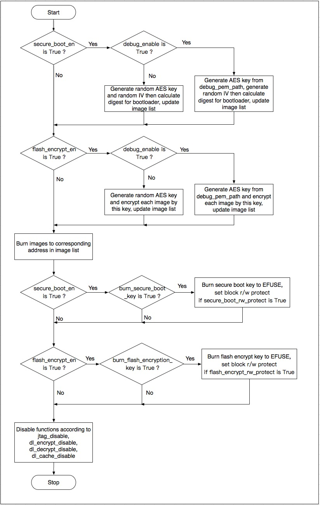

启用安全加密的生产方案
===========================

Windows 平台的下载工具
************************

-  乐鑫提供windows平台的下载工具，能够在工厂生产环境中批量烧写固件
-  生产下载工具的配置文件在 configure 文件夹内，涉及安全特性的配置在 security.conf 中，目前涉及的配置内容如下表：

+--------------------------------+----------------------------------------------------------------------------------------------------------+-----------+
| ITEM                           | Function                                                                                                 | default   |
+================================+==========================================================================================================+===========+
| debug\_enable                  | 是否开启debug模式，在debug模式下，工具会根据pem文件产生相同密钥，否则随机生成密钥                        | True      |
+--------------------------------+----------------------------------------------------------------------------------------------------------+-----------+
| debug\_pem\_path               | 设置证书地址，用于生成可重复烧写的密钥，尽在debug模式下有效                                              |           |
+--------------------------------+----------------------------------------------------------------------------------------------------------+-----------+
|   SECURE BOOT                  |                                                                                                          |           |
+--------------------------------+----------------------------------------------------------------------------------------------------------+-----------+
| secure\_boot\_en               | 开启secure boot功能                                                                                      |  False    |
+--------------------------------+----------------------------------------------------------------------------------------------------------+-----------+
| burn\_secure\_boot\_key        | 使能secure boot key烧写                                                                                  |  False    |
+--------------------------------+----------------------------------------------------------------------------------------------------------+-----------+
| secure\_boot\_force\_write     | 是否不检查secure boot key block，强制烧写key                                                             | False     |
+--------------------------------+----------------------------------------------------------------------------------------------------------+-----------+
| secure\_boot\_rw\_protect      | 开启secure boot key区域的读写保护                                                                        | False     |
+--------------------------------+----------------------------------------------------------------------------------------------------------+-----------+
|   FLASH ENCRYPTION             |                                                                                                          |           |
+--------------------------------+----------------------------------------------------------------------------------------------------------+-----------+
| flash\_encryption\_en          | 开启flash加密功能                                                                                        | False     |
+--------------------------------+----------------------------------------------------------------------------------------------------------+-----------+
| burn\_flash\_encryption\_key   | 使能flash encrypt key烧写                                                                                | False     |
+--------------------------------+----------------------------------------------------------------------------------------------------------+-----------+
| flash\_encrypt\_force\_write   | 是否不检查flash encrypt key block，强制烧写key                                                           | False     |
+--------------------------------+----------------------------------------------------------------------------------------------------------+-----------+
| flash\_encrypt\_rw\_protect    | 开启flash encrypt key区域的读写保护                                                                      | False     |
+--------------------------------+----------------------------------------------------------------------------------------------------------+-----------+
|     AES KEY                    | Not used yet                                                                                             |           |
+--------------------------------+----------------------------------------------------------------------------------------------------------+-----------+
|   DISABLE FUNC                 |                                                                                                          |           |
+--------------------------------+----------------------------------------------------------------------------------------------------------+-----------+
| jtag\_disable                  | 是否关闭JTAG调试功能                                                                                     | False     |
+--------------------------------+----------------------------------------------------------------------------------------------------------+-----------+
| dl\_encrypt\_disable           | 是否关闭下载模式下flash加密功能                                                                          | False     |
+--------------------------------+----------------------------------------------------------------------------------------------------------+-----------+
| dl\_decrypt\_disable           | 是否关闭下载模式下flash解密功能                                                                          | False     |
+--------------------------------+----------------------------------------------------------------------------------------------------------+-----------+
| dl\_cache\_disable             | 是否关闭下载模式下的flash cache功能                                                                      | False     |
+--------------------------------+----------------------------------------------------------------------------------------------------------+-----------+

-  下载工具的内部逻辑和流程如下：

操作步骤
**********

准备工作
~~~~~~~~

-  安装eptool

   -  esptool默认路径在$IDF\_PATH/components/esptool\_py/esptool/
   -  也可以通过python安装：

      ::

          pip install esptool
          或者
          pip3 install esptool

方案1: 通过 bootloader 完成 security 特性初始化
~~~~~~~~~~~~~~~~~~~~~~~~~~~~~~~~~~~~~~~~~~~~~~~~~~~

-  ``优势``:可以批量进行 flash 烧录，初始化的固件相同，密钥在第一次上电有在设备内随机生成。
-  ``缺陷``:设备在首次初始化过程所用时间较长，如果在首次初始化过程发生掉电等意外情况，设备可能无法正常启动。
-  由芯片端自动随机生成 secure boot 与 flash encrypton 密钥，并写入芯片 efuse 中, 密钥写入后，对应的 efuse block 会被设置为读写保护状态，软件与工具都无法读取出密钥。
-  所有编译出的 images 都按正常情况烧写，芯片会在第一次 boot 时进行配置。
-  通过 make menuconfig 配置 secure boot 和 flash encryption，按照第一、二节介绍的步骤执行即可，具体操作步骤如下，如果了解第一、二节的内容，可以跳过：

   1. 随机生成RSA密钥文件：

   ::

      espsecure.py generate_signing_key secure_boot_signing_key.pem
      or
      openssl ecparam -name prime256v1 -genkey -noout -out secure_boot_signing_key.pem

   2. 在 menuconfig 中，选择 Sign binaries during build,并指定刚才生成的密钥路径, 如下图。

   .. figure:: ../../_static/secure_encrypt/menuconfig_02.png
      :align: center

   3. 分别编译bootloader与应用代码

      ::

          make bootloader 
          make

   4. 使用 esptool 将编译生成的bin文件写入flash对应地址,以example中hellow-world工程为例：

      ::

          bootloader.bin -->   0x1000
          partition.bin  -->   0x8000
          app.bin        -->  0x10000
          python $IDF_PATH/components/esptool_py/esptool/esptool.py --chip esp32 --port /dev/cu.SLAB_USBtoUART --baud 1152000 --before default_reset --after no_reset write_flash -z --flash_mode dio --flash_freq 40m --flash_size detect 0x1000 $IDS_PATH/esp-idf/examples/get-started/hello_world/build/bootloader/bootloader.bin 0xf000 $IDF_PATH/esp-idf/examples/get-started/hello_world/build/phy_init_data.bin 0x10000 $IDF_PATH/examples/get-started/hello_world/build/hello-world.bin 0x8000 $IDF_PATH/examples/get-started/hello_world/build/partitions_singleapp.bin

   .. note:: 
      以上命令仅是示例代码，请在使用时，替换其中的文件路径以及所选参数，包括串口、波特率、SPI 模式和频率等。

   5. 我们也可以使用 window 平台的下载工具来完成工厂下载。需要在配置文件中，关闭工具的 security 功能，这样工具端就不会操作 security 相关特性，完全由硬件和 bootloader 来完成初始化：

      ::

          [SECURE BOOT]
          secure_boot_en * False
          [FLASH ENCRYPTION]
          flash_encryption_en * False

   .. note:: 
      修改并保存参数前，请先关闭下载工具，配置文件修改完成并保存后，再开启运行下载工具。

      .. figure:: ../../_static/secure_encrypt/download_frame_02.png
         :align: center

   6. 或者我们可以通过下载工具的 combine 功能，将多个 bin 文件打包为一个文件，再由工厂 flash 烧录器烧录进 flash 进行批量生产。

      -  选择bin文件并制定 flash 中的地址
      -  选中 ‘DoNotChgBin’ 选项，这样工具不会对bin文件的配置(SPI模式速率等)进行任何修改。
      -  点击 ‘CombineBin' 按键，生产合并后的bin文件。
      -  在 ‘combine’ 文件夹下，生成 target.bin，将其烧写到 Flash 的 0x0 地址即可。
      -  工具只会对填写的最大地址范围内的空白区域填充 0xff。并将文件按地址组合。

   .. figure:: ../../_static/secure_encrypt/combine_01.png
      :align: center

   7. 下载完成后，需要运行一次程序，使 bootloader 完成 security 相关特性的初始化，包括AES密钥的随机生成并写入EFUSE，以及对明文的flash进行首次加密。
      
   .. note:: 
      请误在首次启动完成前，将芯片断电，以免造成芯片无法启动的情况。

-  ``注意事项``\ ：

   -  用于签名的私钥需要保密，如果泄漏，app.bin有被伪造的可能性。
   -  使用者不能遗失私钥，必须使用私钥用于对 OTA app 签名(如果有OTA功能)。
   -  芯片通过软件 bootloader 对 flash 加密是一个比较缓慢的过程，对于较大的 partition 可能需要花费一分钟左右
   -  若第一次执行 bootloader， flash 加密进行到一半芯片掉电

      -  没有使能 secure boot 时，可重新将 images 明文烧写到 flash
         中，让芯片下次 boot 时重新加密 flash
      -  使能了 secure boot 时，由于无法重新烧写 flash，芯片将永久无法 boot

方案2: 通过下载工具初始化 security 特性
~~~~~~~~~~~~~~~~~~~~~~~~~~~~~~~~~~~~~~~~~~~~~

-  ``优势``: 工具进行密钥的随机生成，直接将 image 密文烧写进 flash，然后配置 efuse. 避免过程中掉电造成无法启动的情况。
-  ``缺陷``: 每个设备必须通过下载工具进行烧写，因为密钥不同，无法预先烧写相同的固件到 flash 中。
-  使用下载工具应用 secure boot 和 flash encryption，这时用户只需要的在 make menuconfig 中选择“enable secure boot in bootloader”并设置公钥/秘钥路径即可
-  下载工具在运行时，会随机产生 secure boot 与 flash encryption 密钥,并烧写到对应的 EFUSE 位置中。
-  操作步骤：

   1. 随机生成RSA密钥文件，用于签名固件：

      ::

          espsecure.py generate_signing_key secure_boot_signing_key.pem
          or
          openssl ecparam -name prime256v1 -genkey -noout -out secure_boot_signing_key.pem

   2. 在 menuconfig 中，选择Sign binaries during build,并指定刚才生成的密钥路径, 如下图。

   .. figure:: ../../_static/secure_encrypt/menuconfig_02.png
      :align: center

   3. 分别编译 bootloader 与应用代码

      ::

          make bootloader
          make

   4. 设置下载工具的安全配置文件

      ::

          [DEBUG MODE]
          debug_enable * False                #关闭debug模式，工具随机生成密钥。否则根据pem文件产生相同密钥
          debug_pem_path *                    #debug模式下，设置证书地址，用于生成可重复烧写的密钥
          [SECURE BOOT]
          secure_boot_en * True               #开启secure boot功能
          burn_secure_boot_key * True         #使能secure boot key烧写
          secure_boot_force_write * False     #是否不检查secure boot key block，强制烧写key
          secure_boot_rw_protect * True       #开启secure boot key区域的读写保护
          [FLASH ENCRYPTION]
          flash_encryption_en * True          #开启flash加密功能
          burn_flash_encryption_key * True    #使能flash encrypt key烧写
          flash_encrypt_force_write * False   #是否不检查flash encrypt key block，强制烧写key
          flash_encrypt_rw_protect * True     #开启flash encrypt key区域的读写保护
          [AES KEY]
          aes_key_en * False                  #目前未实现，仅保留该选项
          burn_aes_key * False                #目前未实现，仅保留该选项
          [DISABLE FUNC]
          jtag_disable * True                 #是否关闭JTAG调试功能
          dl_encrypt_disable * True           #是否关闭下载模式下flash加密功能
          dl_decrypt_disable * True           #是否关闭下载模式下flash解密功能
          dl_cache_disable * True             #是否关闭下载模式下的flash cache功能

          注意：
          修改并保存参数前，请先关闭下载工具，配置文件修改完成并保存后，再开启运行下载工具。

   5. 使用下载工具进行下载，若不希望工具修改任何配置参数(比如 flash 频率和模式)，请勾选 ‘DoNotChgBin’ 选项。下载工具会更具配置文件的设置，在下载过程中完成固件加密下载和密钥随机生成与烧写。

-  ``注意事项``:

   -  用于签名的私钥需要保密，如果泄漏，app.bin 有被伪造的可能性。
   -  使用者不能遗失私钥，必须使用私钥用于对 OTA app 签名(如果有 OTA 功能)。
   -  用户可以选择不启用 app image 的签名校验，只需要关闭 menuconfig 中的 secure boot 功能即可。下载工具会更具配置文件，通过 efuse 启用 secure boot。禁用 app image 的签名校验会存在安全隐患。
