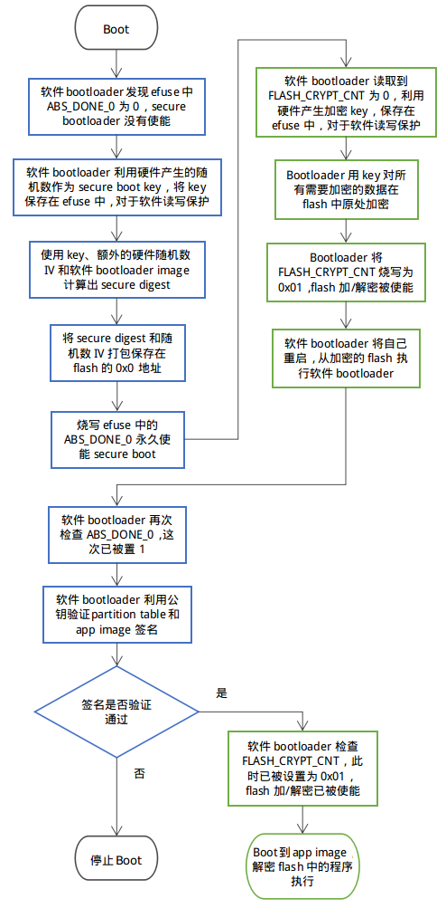

安全启动
****************

概述
~~~~~~~~

-  Secure Boot
   的目的是保证芯片只运行用户指定的程序，芯片每次启动时都会验证从 flash
   中加载的 partition table 和 app images 是否是用户指定的
-  Secure Boot 中采用 ECDSA 签名算法对 partition table 和 app images
   进行签名和验证，ECDSA
   签名算法使用公钥/私钥对，秘钥用于对指定的二进制文件签名，公钥用于验证签名
-  由于 partition table 和 app images 是在软件 bootloader
   中被验证的，所以为了防止攻击者篡改软件 bootloader
   从而跳过签名验证，Secure Boot 过程中会在 ROM bootloader 时检查软件
   bootloader image 是否被篡改，检查用到的 secure boot key
   由硬件随机数生成器产生，保存的 efuse 中，对于软件是读写保护的

所用资源
~~~~~~~~

-  ECDSA 算法公钥/私钥对

   -  烧写 flash 前在 PC 端生成
   -  公钥会被编译到 bootloader image 中，软件 bootloader
      在执行时会读取公钥，使用公钥验证 flash 中partition table 和 app
      images 是否是经过相应的私钥签名的
   -  私钥在编译时被用于对 partition table 和 app images
      签名，私钥必须被保密好，一旦泄露任何使用此私钥签名的 image
      都能通过 boot 时的签名验证

-  secure bootloader key

   -  这是一个 256-bit AES key，在第一次 Secure Boot
      时由硬件随机数生成，保存在 efuse 中，软件无法读取
   -  使用此 key 验证软件 bootloader image 是否被修改

执行过程
~~~~~~~~

1. 编译 bootloader image 时发现 menuconfig 中使能了 secure
   boot，于是根据 menuconfig 中指定的公钥/秘钥文件路径将公钥编译到
   bootloader image 中，bootloader 被编译成支持 secure boot
2. 编译 partition table 和 app images
   时使用秘钥计算出签名，将签名编译到相应的二进制文件中
3. 芯片第一次 boot 时，软件 bootloader 根据一下步骤使能 secure boot：

   -  硬件产生一个 secure boot key，将这个 key 保存在 efuse 中，利用这个
      key、一个随机数 IV 和 bootloader image 计算出 secure digest
   -  secure digest 与随机数 IV 保存在 flash 的 0x0 地址，用于在后续
      boot 时验证 bootloader image 是否被篡改
   -  若 menuconfig 中选择了禁止 JTAG 中断和 ROM BASIC 中断，bootloader
      会将 efuse
      中的一些标志位设置为禁止这些中断（强烈建议禁止这些中断）
   -  bootloader 通过烧写 efuse 中的 ABS\_DONE\_0 永久使能 secure boot

4. 芯片在后面的 boot 中，ROM bootloader 发现 efuse 中的 ABS\_DONE\_0
   被烧写，于是从 flash 的地址 0x0 读取第一次 boot 时保存的 secure
   digest 和随机数 IV，硬件使用 efuse 中的 secure boot key 、随机数 IV
   与当前的 bootloader image 计算当前的 secure digest，若与 flash 中的
   secure digest 不同，则 boot 不会继续，否则就执行软件 bootloader。
5. 软件 bootloader 使用 bootloader image 中保存的公钥对 flash 中的
   partition table 和 app images 签字进行验证，验证成功之后才会 boot 到
   app 代码中

使用步骤
~~~~~~~~

1. make menuconfig 选择 "enable secure boot in bootloader"
2. make menuconfig 设置保存公钥/秘钥对的文件
3. 生成公钥和秘钥，先执行 "make"
   命令，此时由于还没有公钥/秘钥对，所以命令行中会提示生成公钥/秘钥对的命令，按提示执行命令即可。但在产品级使用中，建议使用
   openssl 或者其他工业级加密程序生成公钥/秘钥对。例如使用
   openssl：“openssl ecparam -name prime256v1 -genkey -noout -out
   my\_secure\_boot\_signing\_key.pem”（若使用现有的公钥/秘钥对文件，可以跳过此步）
4. 运行命令 "make bootloader" 产生一个使能 secure boot 的 bootloader
   image
5. 执行完4后命令行会提示下一步烧写 bootloader image
   的命令，按提示烧写即可
6. 运行命令 "make flash" 编译并烧写 partition table 和 app images
7. 重启芯片，软件 bootloader 会使能 secure boot ，查看串口打印确保
   secure boot 成功启用。

注意事项
~~~~~~~~

-  正常使用情况下， bootloader image 只能烧写一次，partition table 和
   app images 可以重复烧写
-  秘钥必须保密，一旦泄露 secure boot 将失去作用
-  用于 OTA 的 image 必须进行秘钥签名，OTA 时会使用公钥进行验证
-  **在默认设置下， bootloader的从0x1000地址开始，最大长度为 28KB（bootloader)。如果发现 Secure Boot 发送错误, 请先检查是否因为 Bootloader 地址过大。 通过在menuconfig中调整Bootloader的log等级，可以有效降低编译后的Bootloader大小。**

可重复烧写 bootloader
~~~~~~~~~~~~~~~~~~~~~

-  默认情况下 bootloader image
   只能烧写一次，在产品中强烈建议这样做，因为 bootloader image
   可以重新烧写的情况下可以通过修改 bootloader 跳过后续 image
   的验证过程，这样 secure boot 就失去作用
-  可重复烧写 bootloader 模式下，secure bootloader key 是在 PC
   端产生的，此 key 必须保密，一旦 key 被泄露，其它使用此 key 生成digest
   的 bootloader image 也能通过硬件检查
-  使用步骤：

   1. make menuconfig 中选择 "secure bootloader mode"->"Reflashable"
   2. 按“使用步骤”一节步骤2和3生成公钥与秘钥
   3. 运行指令 "make bootloader" ，一个 256-bit secure boot key
      会根据用于签名的私钥计算出，命令行会打印两个后续步骤，按循序执行：

      -  将 PC 端生成的 secure boot key 烧入 efuse 中的命令
      -  将编译好的带有预计算出的 secure digest 的 bootloader image
         烧写到 flash 中

   4. 从“使用步骤”一节的步骤6继续执行

Secure Boot 与 Flash Encryption 流程图
~~~~~~~~~~~~~~~~~~~~~~~~~~~~~~~~~~~~~~~~~~~

-  第一次 boot 时 secure boot 与 flash encrypt
   的生效过程如下图所示，图中蓝色框是 secure boot 的步骤，绿色框是 flash
   encrypt 的步骤

-  后续 boot
   时流程图如下，图中绿色框中的步骤会执行解密，解密是由硬件自动完成的

.. figure:: ../../_static/secure_encrypt/secure_encrypt_subsequent_boot.png
   :align: center

开发阶段使用可重复烧写 flash 的 Secure Boot 与 Flash encryption
~~~~~~~~~~~~~~~~~~~~~~~~~~~~~~~~~~~~~~~~~~~~~~~~~~~~~~~~~~~~~~~~~~~

1. make menuconfig 中使能 secure boot 和 flash encrypt，“Secure
   bootloader mode”选择“Reflashable”，并设置你的公钥/私钥.pem文件路径
2. 编译 bootloader 并生成 secure boot key：

   ::

       make bootloader

3. 使用 key 和 bootloader 计算带 digest 的 bootloader

   ::

       python $IDF_PATH/components/esptool_py/esptool/espsecure.py digest_secure_bootloader --keyfile ./build/bootloader/secure_boot_key.bin -o ./build/bootloader/bootloader_with_digest.bin ./build/bootloader/bootloader.bin

4. 编译 partition\_table 与 app

   ::

       make partition_table
       make app

5. 加密三个 bin 文件

   ::

       python $IDF_PATH/components/esptool_py/esptool/espsecure.py encrypt_flash_data --keyfile flash_encrypt_key.bin --address 0x0 -o build/bootloader/bootloader_digest_encrypt.bin build/bootloader/bootloader_with_digest.bi
       python $IDF_PATH/components/esptool_py/esptool/espsecure.py encrypt_flash_data --keyfile flash_encrypt_key.bin --address 0x8000 -o build/partitions_singleapp_encrypt.bin build/partitions_singleapp.bin
       python $IDF_PATH/components/esptool_py/esptool/espsecure.py encrypt_flash_data --keyfile flash_encrypt_key.bin --address 0x10000 -o build/iot_encrypt.bin build/iot.bin

6. 烧写三个加密后的 bin 文件

   ::

       python $IDF_PATH/components/esptool_py/esptool/esptool.py --baud 1152000 write_flash 0x0 build/bootloader/bootloader_digest_encrypt.bin
       python $IDF_PATH/components/esptool_py/esptool/esptool.py --baud 1152000 write_flash 0x8000 build/partitions_singleapp_encrypt.bin
       python $IDF_PATH/components/esptool_py/esptool/esptool.py --baud 1152000 write_flash 0x10000 build/iot_encrypt.bin

7. 将 flash\_encryption\_key 烧入 efuse (仅在第一次boot前烧写):

   ::

       python $IDF_PATH/components/esptool_py/esptool/espefuse.py burn_key flash_encryption flash_encrypt_key.bin

8. 将 secure boot key 烧入efuse（仅在第一次boot前烧写）:

   ::

       python $IDF_PATH/components/esptool_py/esptool/espefuse.py burn_key secure_boot ./build/bootloader/secure_boot_key.bin

9. 烧写 efuse 中的控制标志（仅在第一次boot前烧写）

   ::

       python $IDF_PATH/components/esptool_py/esptool/espefuse.py burn_efuse ABS_DONE_0
       python $IDF_PATH/components/esptool_py/esptool/espefuse.py burn_efuse FLASH_CRYPT_CNT
       python $IDF_PATH/components/esptool_py/esptool/espefuse.py burn_efuse FLASH_CRYPT_CONFIG 0xf
       python $IDF_PATH/components/esptool_py/esptool/espefuse.py burn_efuse DISABLE_DL_ENCRYPT
       python $IDF_PATH/components/esptool_py/esptool/espefuse.py burn_efuse DISABLE_DL_DECRYPT
       python $IDF_PATH/components/esptool_py/esptool/espefuse.py burn_efuse DISABLE_DL_CACHE

