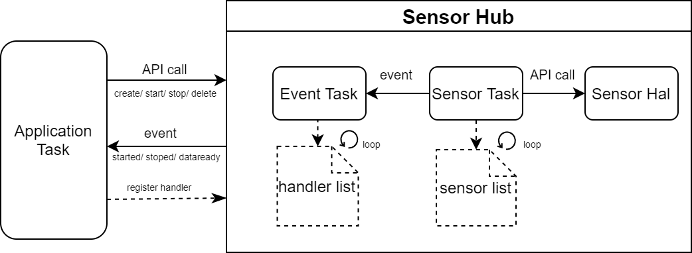
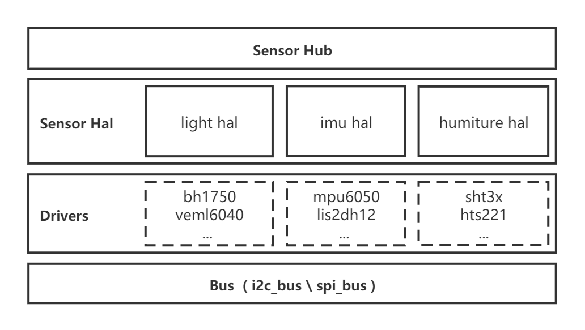

Sensor Hub 简介
===============
:link_to_translation:`en:[English]`

Sensor Hub 是一个传感器管理组件，可以实现对传感器设备的硬件抽象、设备管理和数据分发。基于 Sensor Hub 开发应用程序时，用户无需处理复杂的传感器实现，只需要对传感器的工作方式、采集间隔、量程等进行简单的选择，然后向关心的事件消息注册回调函数，即可在传感器状态切换或者数据采集好时收到通知。

    Sensor Hub 编程模型

Sensor Hub 对常见的传感器类别进行了硬件抽象，用户在切换传感器型号时，无需修改上层应用程序，
也可以通过实现硬件抽象层的传感器接口添加新的传感器到 Sensor Hub 中。该组件由于实现了对传感器的集中管理，在简化操作的同时也提高了运行效率，可作为传感器应用的基础组件，应用在环境感知、运动感知、健康管理等更多智能化场景中。

    Sensor Hub 驱动

Sensor Hub 使用方法
------------------------

1. 创建一个传感器实例：使用 :cpp:func:`iot_sensor_create` 创建一个传感器实例，参数包括 ``sensor_id_t`` 中定义的传感器 ID、传感器配置项和传感器句柄指针。传感器 ID 用于查找和加载对应的驱动，一个 ID 只能对应创建一个实例。配置项中 `bus` 用于指定传感器挂载到的总线位置；`mode` 用于指定传感器的工作模式；`min_delay` 用于指定传感器的采集间隔，其它均为非必须项。创建成功之后，获得该传感器句柄；

2. 注册传感器事件回调函数：在传感器事件发生时，回调函数将会被依次调用，注册回调函数的方法有以下两种，注册成功之后将返回事件回调函数实例句柄：

    - 使用 :cpp:func:`iot_sensor_handler_register` 通过传感器句柄注册回调函数
    - 使用 :cpp:func:`iot_sensor_handler_register_with_type` 通过传感器类型注册回调函数

3. 启动传感器：使用 :cpp:func:`iot_sensor_start` 启动指定的传感器，传感器启动之后将发出 ``SENSOR_STARTED`` 事件，之后将以设定的周期持续采集传感器数据，并发送 ``SENSOR_XXXX_DATA_READY`` 事件。事件回调函数可通过 ``event_data`` 参数获取每一个事件的具体数据；

4. 停止传感器：使用 :cpp:func:`iot_sensor_stop` 可临时关闭指定的传感器，传感器关闭之后将发出 ``SENSOR_STOPED`` 事件，之后采集工作将停止。如果该传感器驱动支持电源管理，传感器将被设置为睡眠模式;

5. 取消注册传感器事件回调函数：用户程序可在任意时刻使用事件回调函数实例句柄取消对事件的注册，之后该事件发生时，该回调函数将不再被调用。取消注册的方法对应也有两种：

    - 使用 :cpp:func:`iot_sensor_handler_unregister` 通过传感器句柄取消已注册的回调函数
    - 使用 :cpp:func:`iot_sensor_handler_unregister_with_type` 通过传感器类型取消已经注册的回调函数

6. 删除传感器：使用 :cpp:func:`iot_sensor_delete` 可删除对应的传感器，释放已分配的内存等资源。

示例程序
--------

1. 光照传感器控制 LED 开关示例：:example:`sensors/sensor_control_led`。
2. 传感器监测示例：:example:`sensors/sensor_hub_monitor`。

API 参考
--------

.. include:: /_build/inc/sensor_type.inc

.. include:: /_build/inc/iot_sensor_hub.inc
