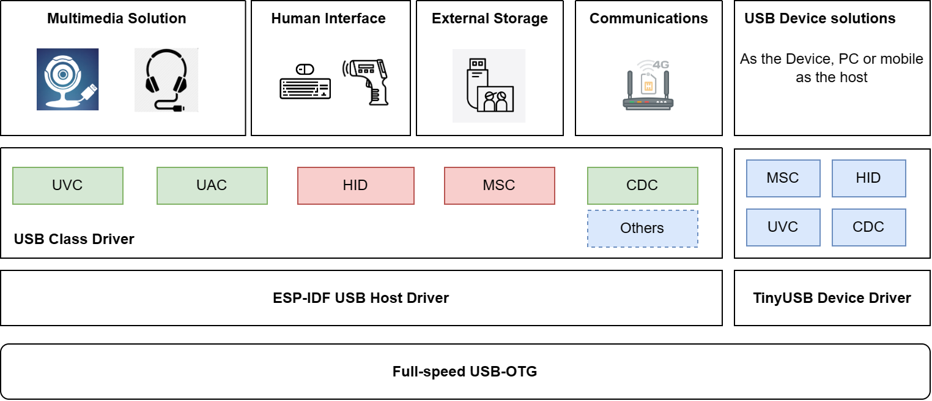
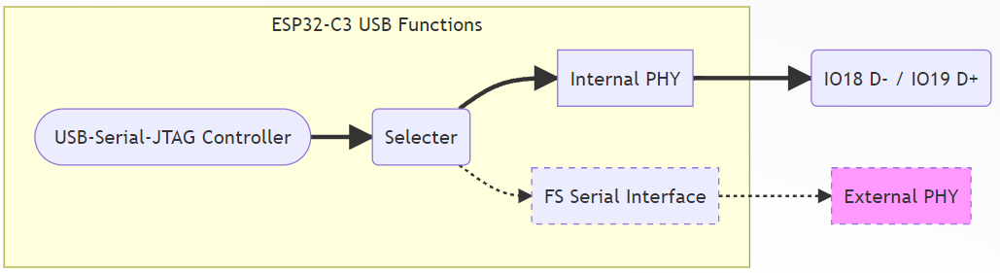
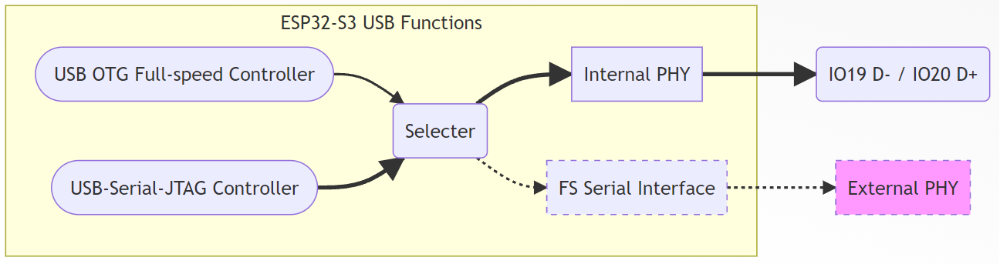
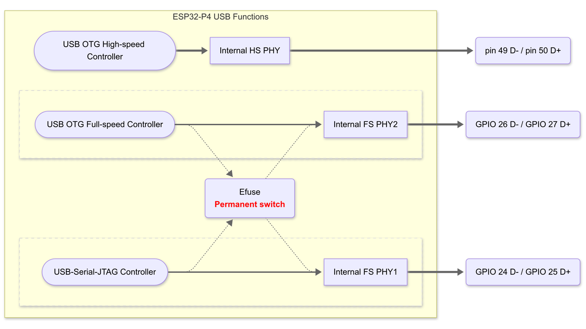

**ESP USB 外设介绍**
========================

:link_to_translation:`en:[English]`

USB 简介
--------

USB（Universal Serial Bus）是一种通用的总线标准，用于连接主机和外设设备。USB 主机可以通过 USB 接口与 USB 设备连接，实现数据传输、电源供给等功能。

USB IF（USB Implementers Forum）是 USB 标准的制定者，它制定了 USB 标准，包括 USB 1.1、USB 2.0、USB 3.0 等，定义了 USB 接口的物理层、数据链路层、传输层、会话层、表示层等协议，以及 USB 设备类（Device Class）标准，常见的设备类包括 HID（Human Interface Device，人机接口设备）、MSC（Mass Storage Class，大容量存储设备）、CDC（Communication Device Class，通信设备）、Audio、Video 等。

乐鑫 ESP32-S2/S3/C3/P4 等芯片均已内置 USB-OTG 或 USB-Serial-JTAG 外设，支持各种各样的 USB 应用，包括 USB 多媒体类应用，USB 通信类应用，USB 存储类应用，USB 人机交互类应用等。

USB 电气属性
^^^^^^^^^^^^^^^^^^^^

Type-A 接口的 USB 电气属性如下：

.. list-table::
   :header-rows: 1

   * - **Pin**
     - **Name**
     - **Cable color**
     - **Description**
   * - 1
     - VBUS
     - **Red**
     - +5V
   * - 2
     - D-
     - **White**
     - Data-（0或3.3V）
   * - 3
     - D+
     - **Green**
     - Data+（0或3.3V）
   * - 4
     - GND
     - **Black**
     - Ground

* 对于\ :doc:`自供电设备，需要使用 1 个额外 IO 检测 VBUS 电压 <./usb_device_self_power>` ，用于检测设备是否拔出
* D- D+ 接反不会损坏硬件，但是主机将无法识别

USB-OTG Full-speed 控制器简介
^^^^^^^^^^^^^^^^^^^^^^^^^^^^^

**USB OTG Full-speed 控制器**\ 是指同时具有 USB-OTG，USB Host 和 USB Device 模式的控制器，支持模式的协商和切换。支持 Full-speed (12Mbps) 和 Low-speed (1.5Mbps) 两种速率，支持 USB 1.1 和 USB 2.0 协议。

ESP-IDF 从 v4.4 开始已经包含 USB Host 和 USB Device 协议栈和各种设备类驱动，支持用户二次开发。

更多介绍，请参考\ :doc:`USB-OTG 控制器介绍 <./usb_otg>` 。

USB-OTG High-speed 控制器简介
^^^^^^^^^^^^^^^^^^^^^^^^^^^^^

**USB OTG High-speed 控制器**\ 是指同时具有 USB-OTG，USB Host 和 USB Device 模式的控制器，支持模式的协商和切换。支持 High-speed (480Mbps)，Full-speed (12Mbps) 和 Low-speed (1.5Mbps) 三种速率，支持 USB 2.0 协议。

ESP-IDF 从 v5.5 开始，ESP32-P4 原本独立的 USB PHY 实现已合并至与 S2/S3 共用的 PHY 模块，统一驱动结构，简化维护。

更多介绍，请参考\ :doc:`USB-OTG 控制器介绍 <./usb_otg>` 。

USB-Serial-JTAG 控制器简介
^^^^^^^^^^^^^^^^^^^^^^^^^^^^^

**USB-Serial-JTAG Controller**\ ：同时具有 USB Serial 和 USB JTAG 功能的专用 USB 控制器，支持通过 USB 接口下载固件、打印 log、CDC 传输和 JTAG 调试，不支持修改 USB 功能、修改描述符等二次开发。

更多介绍，请参考\ :doc:`USB-Serial-JTAG 控制器介绍 <./usb_otg>` 。

USB Full-speed PHY 简介
^^^^^^^^^^^^^^^^^^^^^^^^^^^^^

**USB Full-speed PHY**\ ：也称 USB Full-speed Transceiver，用于 USB Controller 数字信号到 USB 总线信号电平转换，提供总线驱动能力等。内部 USB Full-speed PHY 连接到外部固定 IO 引脚。

更多介绍，请参考\ :doc:`USB-PHY 介绍 <./usb_phy>` 。

ESP32-S/P/C 系列 USB 外设支持情况
^^^^^^^^^^^^^^^^^^^^^^^^^^^^^^^^^

.. list-table::
   :header-rows: 1

   * -
     - USB OTG High-speed
     - USB OTG Full-speed
     - USB-Serial-JTAG
     - Full-speed PHY
     - High-speed PHY
   * - **ESP32-P4**
     - √
     - √
     - √
     - √
     - √
   * - **ESP32-S3**
     - X
     - √
     - √
     - √
     - X
   * - **ESP32-S2**
     - X
     - √
     - X
     - √
     - X
   * - **ESP32-C6**
     - X
     - X
     - √
     - √
     - X
   * - **ESP32-C3**
     - X
     - X
     - √
     - √
     - X
   * - **ESP32-C2**
     - X
     - X
     - X
     - X
     - X
   * - **ESP32**
     - X
     - X
     - X
     - X
     - X
   * - **ESP8266**
     - X
     - X
     - X
     - X
     - X

* √ : Supported
* X : Not Supported

ESP32-S2 USB 功能简介
^^^^^^^^^^^^^^^^^^^^^^^^^^^^^

ESP32-S2 内置 **USB OTG Full-speed Controller** 和 **USB Full-speed PHY**\ ，内部结构如下：

.. image:: ../../../_static/usb/esp32s2_usb.png
   :target: ../../../_static/usb/esp32s2_usb.png
   :alt: esp32s2_usb

ESP32-C3 USB 功能简介
^^^^^^^^^^^^^^^^^^^^^^^^^^^^^

ESP32-C3 内置 **USB-Serial-JTAG Controller** 和 **USB Full-speed PHY**\ ，内部结构如下:

ESP32-S3 USB 功能简介
^^^^^^^^^^^^^^^^^^^^^^^^^^^^^

ESP32-S3 内置两个 USB 控制器，分别是  **USB OTG Full-speed Controller** 和 **USB-Serial-JTAG Controller**\ ，内置一个 **USB Full-speed PHY**\ 。内部 USB PHY 默认连接到 **USB-Serial-JTAG** 控制器，可通过烧写 eFuse 修改默认，或配置寄存器动态切换，也可通过增加外部 PHY，同时启用两个控制器。内部 USB PHY 的切换详情，参考 :doc:`USB PHY 切换 <./usb_phy>`\ 。

ESP32-P4 USB 功能介绍
^^^^^^^^^^^^^^^^^^^^^^^^^^^^^^

ESP32-P4 内置了三个 USB 控制器，分别是 **USB OTG High-speed Controller** 、 **USB OTG Full-speed Controller** 和 **USB-Serial-JTAG Controller** ，内置一个 **USB High-speed PHY** 与两个 **USB Full-speed PHY** 。默认情况下，FS_PHY1 连接到 USB 串行/JTAG 控制器，FS_PHY2 连接到 OTG_FS。用户可以通过 EFUSE_USB_PHY_SEL 更改连接关系。

- 0：FS_PHY1 连接 USB 串行/JTAG 控制器，FS_PHY2 连接 OTG_FS。
- 1：FS_PHY2 连接 USB 串行/JTAG 控制器，FS_PHY1 连接 OTG_FS。

