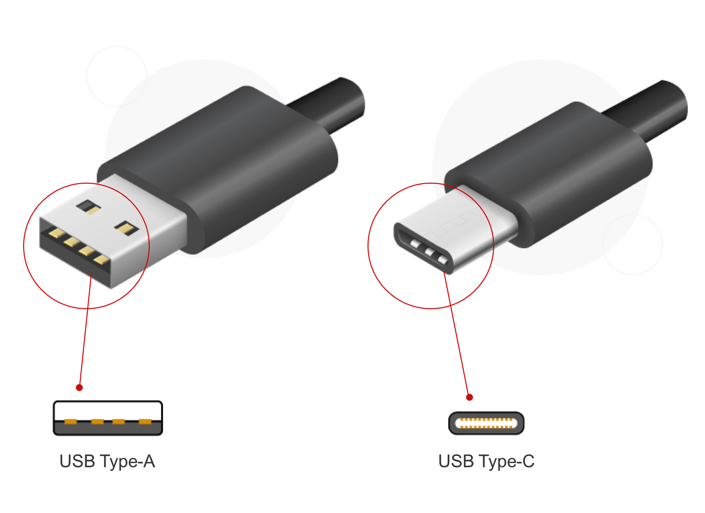
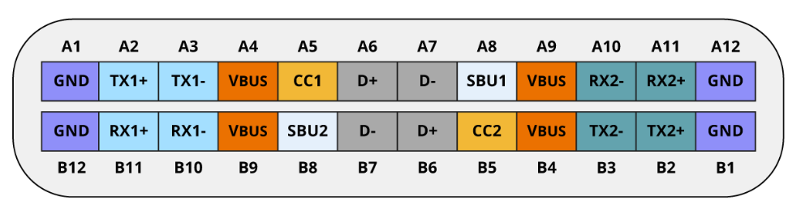
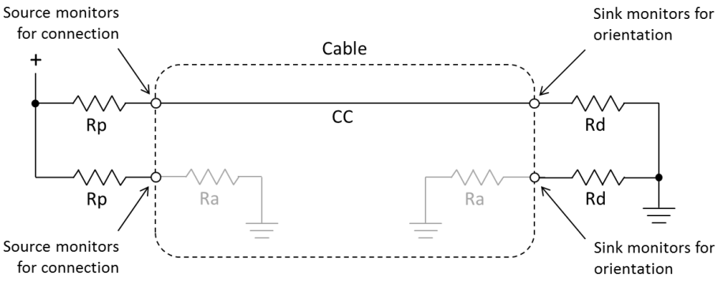
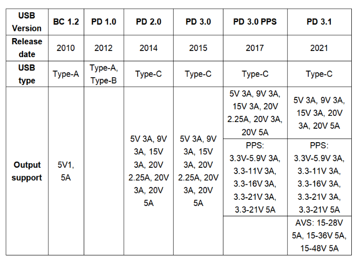
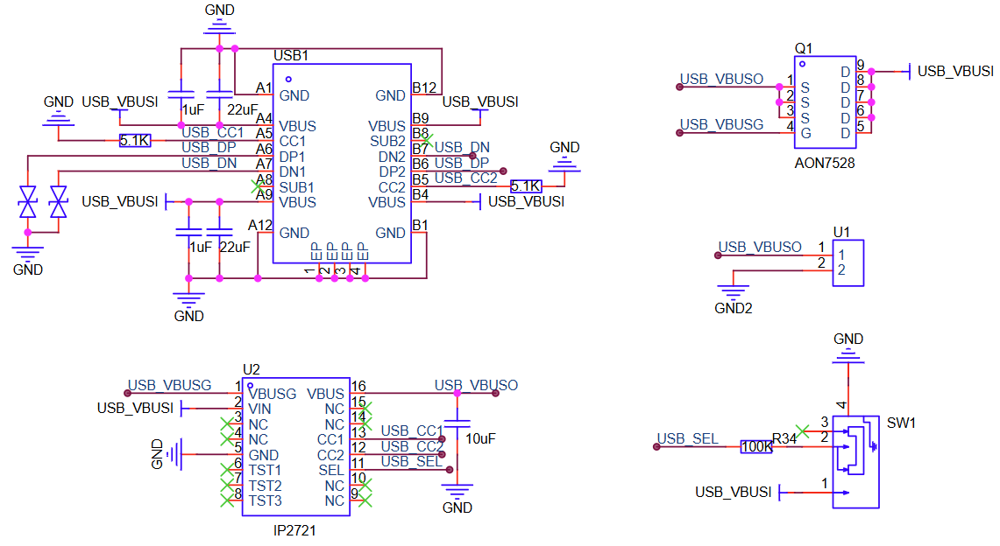
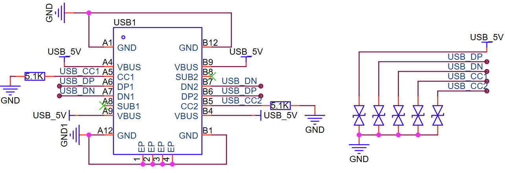
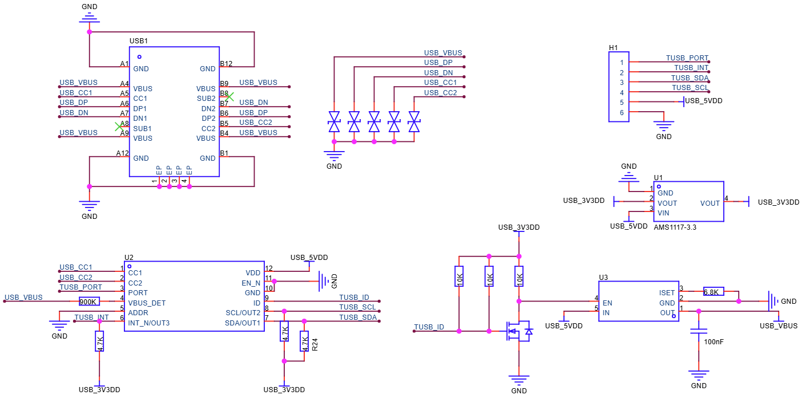

**USB Type-C 硬件设计指南**
==============================

:link_to_translation:`en:[English]`

USB Type-C 概述
--------------------

USB Type-C 自 2014 年正式发布后，凭借其体积小巧、接口可正反插以及支持高功率传输等优点，迅速在各类电子设备中得到广泛应用。相比传统的 USB Type-A 接口，USB-C 不仅使用更为方便，也更适合现代便携设备的设计需求，使其在移动设备、笔记本电脑乃至某些高功率应用中都表现出强大的兼容性与实用性。

    USB Type-A 与 USB Type-C 连接器

    USB Type-C 接口引脚

.. table:: USB Type-C 接口引脚功能
    :align: center

    +----------+------------------------------------+------------------------------------------------------+
    | 功能     | 引脚                               | 描述                                                 |
    +==========+====================================+======================================================+
    | USB 3.x  | A2, A3, B2, B3, A10, A11, B10, B11 | USB 3.x 数据传输                                     |
    +----------+------------------------------------+------------------------------------------------------+
    | USB 2.0  | A6/B6 (D+), A7/B7 (D−)             | USB 2.0 数据传输                                     |
    +----------+------------------------------------+------------------------------------------------------+
    | 配置     | CC1, CC2                           | 配置功能接口，插拔检测，供电协议信息传输，Vconn 功能 |
    +----------+------------------------------------+------------------------------------------------------+
    | 辅助信号 | SBU1, SBU2                         | 低速信号线，仅分配给备用模式使用                     |
    +----------+------------------------------------+------------------------------------------------------+
    | 供电     | VBUS, GND                          | 供电                                                 |
    +----------+------------------------------------+------------------------------------------------------+

此外，针对不同的应用场景，USB Type-C 连接器存在多种引脚数量配置，例如 24Pin、16Pin、12Pin、6Pin。其中，6Pin 仅包含电源引脚，无数据传输功能；12Pin/16Pin 在电源支持的基础上，增加了对 USB 2.0 的支持；24Pin 为全功能 Type-C。用户可根据实际应用需求，选择合适的引脚配置以实现性能与成本的平衡。

USB Type-C 角色识别与功率检测
----------------------------------

USB Type-C 相较于 USB 规范定义了更多的角色类型：

- 供电角度：Type-C 接口可以是供电方（Source）、耗电方（Sink）、双重角色（DRP）
- 通讯角度：Type-C 接口可以为下行端口（Downstream-Facing Port, DFP）、上行端口（Upstream-Facing Port, UFP）、双重角色（Dual-Role Data, DRD）

Type-C 接口的供电角色的识别由 Type-C 接口中的 CC 线进行检测与设置。

    Type-C CC 上拉与下拉模型

- 当作为供电方时，Type-C 接口的 CC 会加上拉电阻（Rp）
- 当作为耗电方时，Type-C 接口的 CC 会加下拉电阻（Rd）
- 当 Type-C 接口（供电方） 与 Type-C 接口（耗电方） 连接时，若供电方识别到耗电方的下拉电阻时，则认为连接成功并确认对方是耗电方。若双方都是供电方或耗电方，则双方均无法正常工作。

.. note:: 对于双重角色接口，CC 线将在上拉状态与下拉状态中不断切换。

其中，下拉电阻 Rd 通常为 5.1 KΩ，上拉电阻 Rp 决定载流能力。在不使用 USB PD 的情况下，USB Type-C 最高支持 5V 电压，最大电流为 3A：

.. table:: USB Type-C 供电能力
    :align: center

    +-----------+-------------+---------------+
    | 供电能力  | Rp (5V驱动) | Rp (3.3V驱动) |
    +===========+=============+===============+
    | 默认功率  | 56 KΩ ±20%  | 36 KΩ ±20%    |
    +-----------+-------------+---------------+
    | 1.5A @ 5V | 22 KΩ ±20%  | 12 KΩ ±20%    |
    +-----------+-------------+---------------+
    | 3A @ 5V   | 10 KΩ ±20%  | 4.7 KΩ ±20%   |
    +-----------+-------------+---------------+

.. note:: 若您的场景中涉及到协商功率大于 15W、支持 DisplayPort 等替代功能、电源角色与数据角色不匹配时，则需要使用 USB PD 控制器。

USB PD 简介
---------------

USB Type-C 接口在默认配置下支持最高 5V 电压和 3A 电流（即 15W 功率），适用于常见的低功率设备供电需求。为了满足更高功率设备的需求，USB Power Delivery (PD) 规范应运而生。最新的 USB PD 3.2 版本显著提升了供电能力，允许通过单根 USB Type-C 线缆传输高达 240W 的功率，极大地扩展了 USB-C 接口的应用范围。需要注意的是，在电压为 20V 且功率高于 60W 的情况下，电流受到线缆规格限制。

    USB PD 版本演进

PD 功率协商过程
~~~~~~~~~~~~~~~~~~~~

USB PD 的工作原理是利用 USB Type-C 接口 CC 线作为数据线来协商电压、电流以及供电方向。当供电设备与耗电设备一旦通过 USB Type-C 连接后，USB PD 消息通过 300kbps±10% 双向标记码（BMC）信号在 CC 线上进行传输。协商过程包括以下几个步骤：

- 供电方向耗电方发送一条包含当前电源能力的 Source_Capabilities 消息，其中数据部分描述了所有供电能力，如 5V/3A、9V/3A 等。
- 耗电方收到 Source_Capabilities 消息后，请求所需的电源能力，并发送 Request 消息。
- 供电方收到 Request 消息后，确认是否满足请求的电源能力，若满足，则发送 Accept 消息。然后，供电方会发送一个 PS_Rdy 消息，表示已提供请求的供电，若不满足，则发送 Reject 消息。

.. figure:: ../../../_static/usb/usb_typec_pd_comm.png
    :align: center
    :width: 80%

    USB PD 通讯

由于当前 ESP32 系列芯片无法解析 USB PD 协议，因此需要采用外置 PD 控制器实现特定电压请求。

USB Type-C 传输 USB 信号
-------------------------------

USB Type-C 兼容多种 USB 规范，包括 1.0、1.1、2.0、3.2 Gen 1、3.2 Gen 2、3.2 Gen 2x2、USB 4 20 Gbps、USB 4 40 Gbps 等。考虑到当前 ESP32 系列芯片最高仅支持 USB 2.0 High-speed，因此，本文仅讨论 USB 2.0 及以下规范。

USB Type-C 具有两组 D+/D- 接口，分别为 A6/A7 和 B6/B7。为了确保在任意插入方向下都能正常传输差分信号，通常需要将 A6 与 B6 连接在一起作为 D+，A7 与 B7 连接在一起作为 D-。这对差分信号线用于传输 USB 数据，确保在任意方向插入时通信功能正常。

.. figure:: ../../../_static/usb/usb_typec_dpdm.png
    :align: center
    :width: 70%

    USB Type-C 的 D+/D- 接口

对于 SuperSpeed 差分信号线（TX/RX 对），由于当前 ESP32 系列芯片不支持 USB 3.x 及以上速率，建议保持这些引脚悬空，无需连接。

USB Type-C 硬件参考设计
---------------------------

根据请求电压的不同，USB Type-C 硬件设计可分为是否外置 PD 控制器两种方案。对于外置 PD 控制器的硬件方案而言，本小节仅讨论 Device 硬件设计。

PD 控制器下的 Device 硬件设计
~~~~~~~~~~~~~~~~~~~~~~~~~~~~~~~~~~~~~~~~~~~~

由于 USB-PD 协议较为复杂，Device 侧采用 PD 芯片来简化设计，快速完成电压协商并输出所需电压：

    IP2721 PD 控制器

IP2721 能够通过 CC 引脚自动检测设备连接状态，并利用硬件 PD 协议解析供电端能力信息，从而自动请求匹配的电压输出。用户也可以根据实际需求选择其他型号的 PD 控制器来实现电压请求功能。

无 PD 控制器的 Device、Host、DRP 硬件设计
~~~~~~~~~~~~~~~~~~~~~~~~~~~~~~~~~~~~~~~~~~~~

USB Type-C Device 设计
############################

    
    USB Type-C Device 设计

Device 设计方案中需要将 CC1 与 CC2 以 5.1 KΩ 下拉。

.. important:: 当设备需要超过 USB 默认电流（USB 2.0 为 500 mA，USB 3.x 为 900 mA）时，有必要通过 Type-C 的 CC 线（使用 CC 逻辑与端口控制器）读取源端宣告的电流档位，并将设备的输入限流设置为不超过该档位，否则可能导致源端过载。

USB Type-C Host 与 DRP 设计
############################

    
    USB Type-C Host 与 DRP 设计

Host 与 DRP 设计方案中选用的为 TI TUSB320LA Type-C CC 逻辑与端口控制器，通过 I2C 接口配置 TUSB320 在 DFP、UFP 与 DRP 角色之间切换。用户也可根据实际需求选择其他型号的 CC 逻辑与端口控制器。

.. important:: 在量产产品中，USB 端口必须考虑到 **过流和过温** 等异常情况，以确保在异常情况下电流输出能够被限制，从而保护电源供应系统。您可以选择具有可调电流限制阈值的 USB 端口电源开关芯片，例如 `CH217 <https://www.wch-ic.com/downloads/CH217DS1_PDF.html>`_，以简化 Host VBUS 设计。

USB Type-C 参考文档
----------------------

- `Universal Serial Bus Type-C Cable and Connector Specification <https://www.usb.org/sites/default/files/USB%20Type-C%20Spec%20R2.0%20-%20August%202019.pdf>`_
- `USB 供电：技术2 - USB Type-C 和角色交换 <https://www.renesas.cn/zh/support/engineer-school/usb-power-delivery-03>`__
- `USB Type-C 充电连接器：设计、优化和互操作性 <https://www.monolithicpower.cn/cn/learning/resources/usb-type-c-charging-connectors-design-optimization-and-interoperability>`__
- `TUSB320 数据手册 <https://www.ti.com/lit/gpn/tusb320lai>`__
