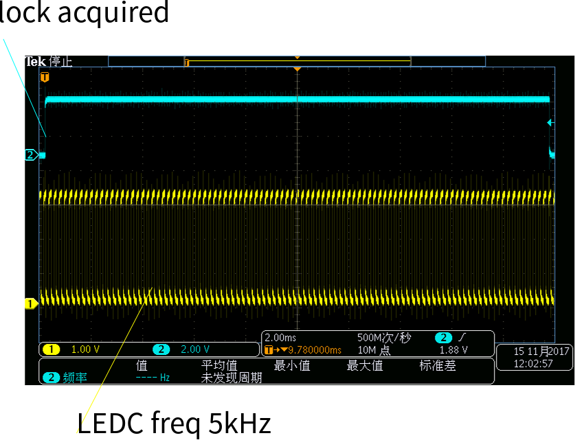
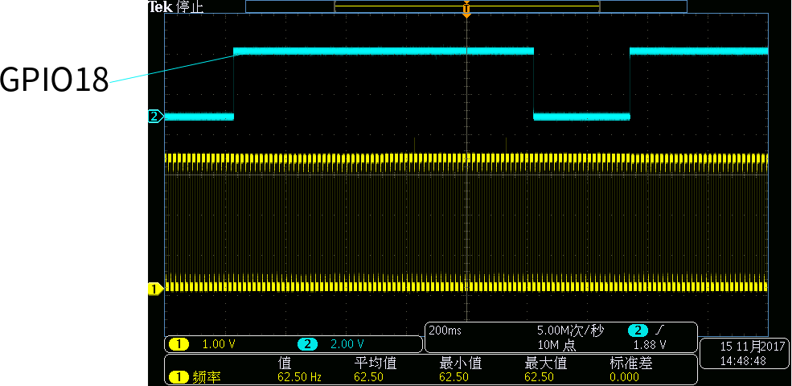

## DFS test manual
Dynamic frequency scaling(DSF) is another low-power approach that ESP32 provides. in applications, we can adjust APB and CPU frequency.

This article shows how to set and use the DFS feature and how it performs. At the beginning of this article is how to configure DFS, and in the end is the test data.


### Configuration

1 Enable Power management
-

First of all, we should enable power management function by enalbing `PM_ENABLE` option in menuconfig.

`make menuconfig -->Componment config -->Power Management`

2 Enable DFS
-

In application codes, wen can call `esp_pm_configure()` to enable DFS.

For example:

```
    esp_pm_config_esp32_t pm_config = {
       .max_cpu_freq =RTC_CPU_FREQ_240M,
       .min_cpu_freq = RTC_CPU_FREQ_XTAL,
    };
  
    esp_err_t ret;
    if((ret = esp_pm_configure(&pm_config)) != ESP_OK) {
        printf("pm config error %s\n", \
                ret == ESP_ERR_INVALID_ARG ? \
                "ESP_ERR_INVALID_ARG":"ESP_ERR_NOT_SUPPORTED");
    }

```

3 Initialize a lock handle
-

When DFS feature is enabled, call `esp_pm_lock_create` to initialize a lock handle with a certain power management parameter.

```
    esp_err_t ret;
    if((ret = esp_pm_lock_create(ESP_PM_APB_FREQ_MAX, 1, "CPU_FREQ_MAX", &pm_lock)) != ESP_OK) {
        printf("pm config error %s\n", \
                ret == ESP_ERR_INVALID_ARG ? "ESP_ERR_INVALID_ARG" : \
                (ret == ESP_ERR_NOT_SUPPORTED ? "ESP_ERR_NOT_SUPPORTED" :\
                 "ESP_ERR_NO_MEM"));
    }
```

4 Switch CPU's frequency
-

If a lock handle was acquire by `esp_pm_lock_acquire`, CPU's frequency switched(ESP_PM_APB_FREQ_MAX and ESP_PM_CPU_FREQ_MAX type of lock have the same effect). Locks are recursive, so if `esp_pm_lock_acquire` is called a number of times, `esp_pm_lock_release` has to be called the same number of times in order to actually release the lock.

```
    if(esp_pm_lock_acquire(pm_lock) == ESP_OK) {
        printf("lock acquire successed\n");
        vTaskDelay(2000 / portTICK_PERIOD_MS);
        esp_pm_lock_release(pm_lock);
        vTaskDelay(2000 / portTICK_PERIOD_MS);
    }
```
---
### Attentions

If `esp_pm_lock_acquire` returns ESP_OK, the CPU's frequency will switch to the `max_cpu_freq`. Before `esp_pm_lock_release` is called, the frequency will not change. If `esp_pm_lock_release` returned ESP_OK, however, the CPU's freq will not immediately switched to `min_cpu_freq`, the CPU's frequency will switch to `min_cpu_freq` only after all task are suspended. Some examples bellow.

`For the sake of simplicity, we assume that there is only one task`

```
   /*
      max_cpu_freq = RTC_CPU_FREQ_240M
      min_cpu_freq = RTC_CPU_FREQ_XTAL
   */

1.  void pm_test_task(void *param)
2.  {
3.      if(esp_pm_lock_acquire(pm_lock) == ESP_OK) { // acquire a lock
4.          vTaskDelay(20 / portTICK_PERIOD_MS);     // block task
5.          for(int i = 0; i <100000; i++);          // do a loop
6.          vTaskDelay(20 / portTICK_PERIOD_MS);     // block task
7.          esp_pm_lock_release(pm_lock);            // release the lock
8.          for(int i = 0; i <100000; i++);          // do a loop
9.          vTaskDelay(20 / portTICK_PERIOD_MS);     // block task
10.         for(int i = 0; i <100000; i++);          // do a loop
11.         vTaskDelay(20 / portTICK_PERIOD_MS);     // block task
12.      }
13.  }
```

- during the delay time in line 4, the CPU's frequency will be 240MHz
- the code in line 8 and line 10 will be executed at 240MHz
- during the delay time in line 9 and line 11, the CPU's frequency will switch to 40MHz(RTC_CPU_FREQ_XTAL)


Here is a test to prove this. First, configure LEDC to output 5KHz PWM signal and chosse APB clock as timer clock. So, if chip enter power save mode, the APB clock will switch to 40MHz, and the LEDC's frequency will reduce to half of the original one(2.5kHz). The first picture shows the LEDC waveform when executing code line 3 to line 4, meanwhile, the second one shows the waveform when executing code from line 5 to line 6.

---

### Lock acquired

When pm_lock are acquired, LEDC's frequency keeps 5kHz, this indicates that APB frequency is 80MHz, the CPU frequency is 240MHz and has not been changed during the hold of this pm_lock.

&nbsp;&nbsp;&nbsp;&nbsp;&nbsp;&nbsp;&nbsp;&nbsp;&nbsp;&nbsp;&nbsp;&nbsp;&nbsp;&nbsp;&nbsp;&nbsp;&nbsp;&nbsp;&nbsp;&nbsp;&nbsp;&nbsp;&nbsp;&nbsp;&nbsp;

---

### Release lock

After pm_lock are released, when task is suspended, LEDC's frequency becomes to 2.5kHz. otherwise, LEDC's frequency is 5kHz.


---


## 5 REF_TICK
-
Normally, APB frequency is 80MHz, when system goes into lower power mode, APB frequency will switch to 40MHz(RTC_CPU_FREQ_XTAL). This will affect the peripheral who's clock source is APB clock. But some peripherals can use REF_TICK as clock source. these peripherals can work even when APB frequency is changing. These peripherals are listed below:

- UART
- LEDC
- RMT

Here's a case of LEDC.

```
1.  if(esp_pm_lock_acquire(pm_lock) == ESP_OK)
2.  {
3.       gpio_set_level(18,1);
4.       vTaskDelay(500 / portTICK_PERIOD_MS);
5.       esp_pm_lock_release(pm_lock);
6.       vTaskDelay(500 / portTICK_PERIOD_MS);
7.       gpio_set_level(18,0);
8.       vTaskDelay(20 / portTICK_PERIOD_MS);
9.  }
```

### Frequency switching

Configure REF_TICK as LEDC's clock source. during the high level of GPIO18 output, When the sixth line of `vTaskDelay` is executedthe, CPU clock will be cut to 40M, but LEDC frequency will not change.

 


---


### Current Test

We created a task to test DFS, and result are as follows:

| CPU freq  | current consumption |
|  :---:    |         :---:       |
|XTAL(40MHz)|         13.32mA     |
|   80MHz   |         22.85mA     |
|   160MHz  |         28.46mA     |
|   240MHz  |         39.95mA     |

More informations about DFS, please Visit [Power Management](http://docs.espressif.com/projects/esp-idf/en/stable/api-reference/system/power_management.html)
