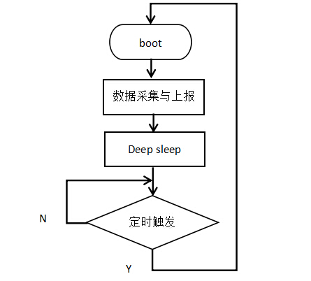
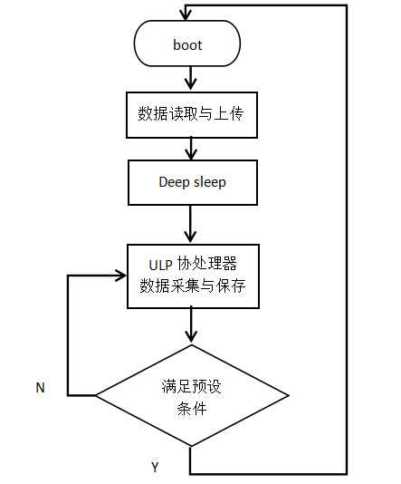
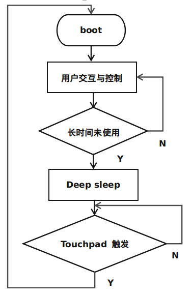
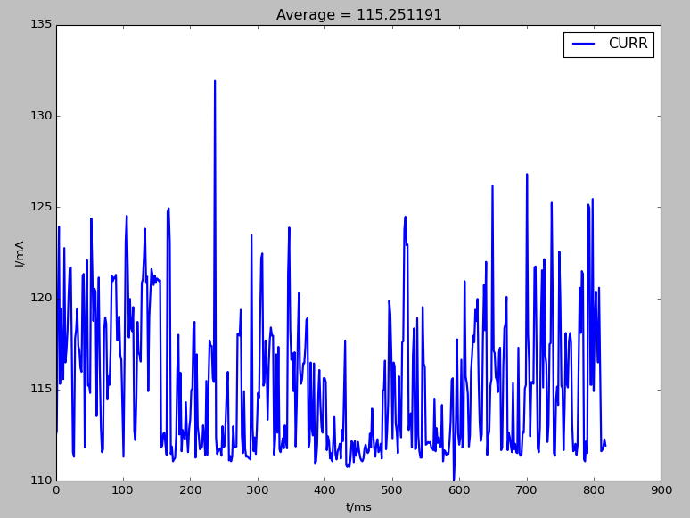
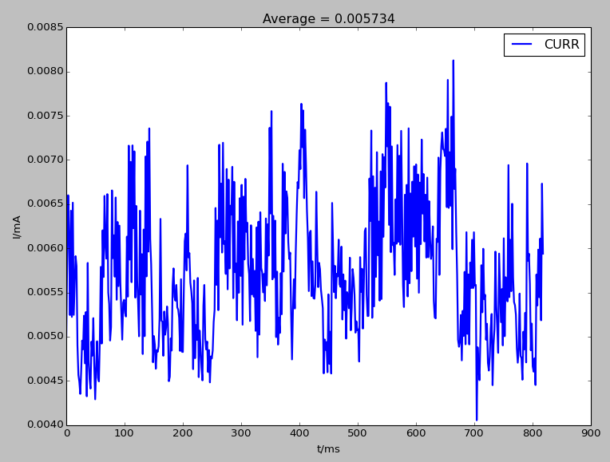
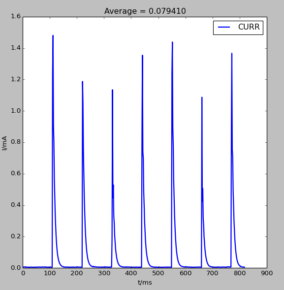
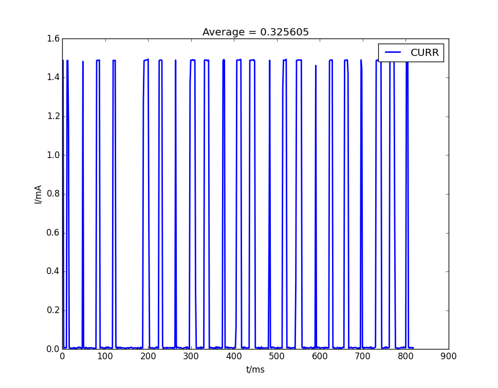

# ESP32低功耗方案概述

* 使用ESP32的deep sleep功能、RTC资源和ULP协处理器可以实现各种应用场合的低功耗需求。当ESP32进入deep sleep模式时，所有由APB_CLK驱动的外设、CPUs和RAM将掉电。Deep sleep模式中，RTC_CLK仍然工作，RTC controller、RTC外设、ULP协处理器、RTC fast memory和RTC slow memory可以不掉电，取决于app中所设置的唤醒源。以上提到的资源具体如下：
    * RTC外设： 包括片上温度传感器、ADC、RTC GPIO和touch pad
    * ULP协处理器： 可用于deep sleep时的简单数据采集和deep sleep唤醒，只能访问RTC slow memory和RTC寄存器
    * RTC fast memory： deep sleep唤醒后不会马上执行bootloader，而是先执行deep sleep wake stubs对应的函数esp_wake_deep_sleep，此函数存放在RTC fast memory中
    * RTC slow memory： 存放供ULP协处理器和deep sleep wake stubs访问的数据

* Deep sleep唤醒源：
    * Timer
    * Touchpad
    * Ext(0)： RTC IO中的指定的某个gpio满足指定电平
    * Ext(1)： RTC IO中的某些gpios同时满足指定电平
    * ULP协处理器

# 低功耗场景

## 定时数据采集与上报（例如器械状态监控器）
* 此场景使用ESP32定时地采集传感器的数据并上传数据，此时可使用deep sleep的timer唤醒源。ESP32采集数据上传后进入deep sleep，设置timer唤醒，唤醒后再采集数据上传，如此循环。此场景ESP32需要周期性的唤醒，不能充分利用ESP32的低功耗，但是优势在于此场景可以进行复杂传感器数据采集。
* 逻辑流程图：

    
* 程序流程：
    * 芯片boot后读取传感器数据，将数据上传
    * 调用esp_deep_sleep_enable_timer_wakeup(sleep_time_us)设置deep sleep时间
    * 调用esp_deep_sleep_start()开始deep sleep

## 支持gpio触发的异常数据采集（例如烟雾报警器）
* 此场景中不需要周期性的采集传感器数据，当传感器采集到异常数据时会主动向ESP32输出gpio触发电平。此时，ESP32可以进入支持RTC IO唤醒的deep sleep模式，如果传感器没有采集到异常数据，ESP32将持续睡眠，只有在传感器采集到异常数据并将提示GPIO置为指定电平时ESP32才会从deep sleep唤醒，然后发出警报或者上传数据。此场景充分利用了ESP32的低功耗，但是对传感器要求较高，需要具有gpio触发功能。
* 逻辑流程图：

    
* 程序流程：
    * 芯片boot后读取传感器数据，发出警报或者上报异常
    * 调用rtc_gpio_pulldown_en(MY_RTC_WAKEUP_IO)或者rtc_gpio_pullup_en(MY_RTC_WAKEUP_IO)设置想要的内部下拉或上拉类型
    * 调用esp_deep_sleep_enable_ext0_wakeup(MY_RTC_WAKEUP_IO, WAKEUP_IO_LEVEL)或者 esp_deep_sleep_enable_ext1_wakeup(WAKEUP_PIN_MASK, WAKEUP_TYPE)设置唤醒deep sleep的rtc gpio电压条件。注：由于esp_deep_sleep_enable_ext0_wakeup()在deep sleep时需要打开RTC外设，这会多出100微安左右电流，而esp_deep_sleep_enable_ext1_wakeup()不    需要打开RTC外设，所以建议都使用esp_deep_sleep_enable_ext1_wakeup()。
    * 调用esp_deep_sleep_start()开始deep sleep

## 数据采集或异常检测（不支持gpio触发、不需要频繁上传数据）
* 此场景中传感器不具有gpio触发功能，需要cpu和片上外设进行轮询式数据采集或者异常检测。ESP32的ULP协处理器可以进行简单的数据采集，并在指定条件下唤醒ESP32进行进一步的处理，此过程中采集的数据可存放在RTC slow memory中，供ESP32唤醒时读取。目前ULP协处理只支持片上温度传感器和ADC数据的采集。此场景的优势在于可以在低功耗情况下频繁地采集数据，降低了对传感器的要求。
* 逻辑流程图：

    
* 用户可以自己根据ULP指令集写汇编程序用于deep sleep时，ULP协处理器执行，流程如下:
    * 芯片boot后从RTC_SLOW_MEMORY读取deep sleep时ULP协处理采集的数据，上传数据
    * 调用ulp_process_macros_and_load()将汇编代码拷贝到RTC_SLOW_MEMORY
    * 调用ulp_run(ADDRESS)启动协处理器，执行RTC_SLOW_MEMORY中的代码
    * 调用esp_deep_sleep_start()开始deep sleep
* 为了使用户更方便地使用协处理器进行数据采集与存储，我们在Iot Solution中增加了ulp_monitor模块，用户可直接调用c函数运行协处理器。ulp_monitor模块使用按如下流程（具体可查看ulp_monitor模块的readme.md和ulp_monitor_test.c文件）：
    * 芯片boot后从RTC_SLOW_MEMORY读取deep sleep时ULP协处理采集的数据，上传数据
    * 调用ulp_monitor_init(ULP_PROGRAM_ADDR, ULP_DATA_ADDR)设置协处理器程序运行地址与数据保存地址
    * 调用ulp_add_adc_monitor或ulp_add_temprature_monitor添加协处理器采集的数据类型和唤醒条件（可同时添加）
    * 调用ulp_monitor_start设置测量频率并启动协处理器
    * 调用esp_deep_sleep_start()开始deep sleep

## 用户交互场景，使用 touchpad 触摸（gpio 按键）唤醒（例如控制面板）
* 此场景一般用于一些用户交互设备如控制面板等。当用户长时间没有操作面板（例如触摸 touchpad，按 gpio 按键）时，可使 ESP32 进入 deep sleep 模式，并设置 touchpad（gpio）唤醒。支持 touchpad 唤醒的 deep sleep 模式下，芯片的电流大约为 30uA 。
* 逻辑流程图：

    

* 程序流程：
	* 芯片 boot 后运行用户交互与控制程序
	* 配置需要用于唤醒的 touchpad （包括初始化与设置阈值，可查看 iot-solution 中的 touchpad 方案）
	* 调用 esp_deep_sleep_enable_touchpad_wakeup() 使能 touchpad 唤醒 ，然后调用esp_deep_sleep_start() 开始 deep sleep 

# deep sleep支持不同唤醒源时电流情况
* 正常工作，ESP32作为station时，平均电流约为115mA：

    
* 支持定时唤醒时，deep sleep期间的平均电流约为6uA：

    
* 支持rtc io唤醒时，deep sleep期间的平均电流约为6uA（注：这里采用了esp_deep_sleep_enable_ext1_wakeup()，所以deep sleep时工作电流只有5微安左右，若使用esp_deep_sleep_enable_ext0_wakeup()，工作电流会有100微安左右RTC外设的额外消耗，所以建议使用esp_deep_sleep_enable_ext1_wakeup()取代esp_deep_sleep_enable_ext0_wakeup()）：

    
* deep sleep期间，协处理器周期性运行数据采集程序（每秒采集10次，所以图中的尖峰是协处理器工作时的电流）：

    
* 支持 touchpad 唤醒时， deep sleep期间的平均电流约为30uA左右：

    
